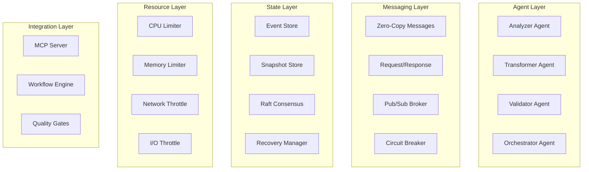

# PMAT Agent System Documentation

## Overview

The PMAT Agent System is an enterprise-grade, distributed agent orchestration platform built with extreme Test-Driven Development (TDD) principles and zero-tolerance quality gates. It provides a comprehensive framework for building, deploying, and managing intelligent agents at scale.

## Architecture

### Core Components



## Features

### 1. Actor System (Actix)
- **Zero-copy message passing** using Bytes
- **Supervision trees** for fault tolerance
- **Location transparency** for distributed deployment
- **Backpressure control** with token bucket algorithm

### 2. Quality Gates
- **Complexity Analysis**: Cyclomatic and cognitive complexity metrics
- **SATD Detection**: Zero-tolerance for technical debt
- **Entropy Calculation**: Shannon entropy for code quality
- **Efficiency Analysis**: Big-O complexity detection

### 3. State Management
- **Event Sourcing**: Append-only log with strong ordering
- **Snapshot Store**: Compressed snapshots with integrity checks
- **Adaptive Scheduling**: Learning-based snapshot intervals
- **Raft Consensus**: Distributed consensus for critical state

### 4. Resource Control
- **CPU Limits**: cgroups v2 and CPU affinity
- **Memory Limits**: Custom allocator with tracking
- **Network Throttling**: Bandwidth and connection limits
- **I/O Control**: Read/write bandwidth and IOPS limits

### 5. MCP Integration
- **Full Protocol Support**: MCP version 2024-11-05
- **Multiple Transports**: TCP, Unix socket, stdio
- **Tool Registry**: Dynamic tool registration
- **Resource Providers**: Live resource subscriptions

### 6. Workflow Orchestration
- **Multiple DSLs**: YAML, JSON, Fluent API, Macros
- **Complex Flows**: Parallel, sequence, conditional, loops
- **Error Recovery**: Retry policies, compensation, rollback
- **Monitoring**: Real-time metrics and event tracking

## Quick Start

### Installation

```bash
# Clone the repository
git clone https://github.com/paiml/pmat-agent-toolkit
cd pmat-agent-toolkit/server

# Build the system
cargo build --release

# Run tests
cargo test

# Install the CLI
cargo install --path .
```

### Starting the MCP Server

```bash
# TCP server
pmat-agent serve --bind 127.0.0.1:3000

# Unix socket
pmat-agent serve --socket /tmp/pmat.sock

# Stdio (for integration)
pmat-agent serve --stdio
```

### Running Workflows

```bash
# Execute a workflow
pmat-agent execute -f workflow.yaml --params '{"input": "data"}'

# Validate a workflow
pmat-agent validate -f workflow.yaml
```

### Code Analysis

```bash
# Analyze code quality
pmat-agent analyze -p src/main.rs -l rust

# Run quality gates
pmat-agent quality-gate -p src/ -l rust --max-complexity 10 --fail-on-violation
```

## Workflow DSL Examples

### YAML Workflow

```yaml
name: code_quality_workflow
version: 1.0.0
error_strategy: fail_fast
timeout: 5m

steps:
  - id: analyze
    name: Analyze Code
    type: action
    agent: analyzer
    operation: analyze
    params:
      language: rust
      metrics: [complexity, satd]
    retry:
      max_attempts: 3
      backoff:
        type: exponential
        initial: 1s
        multiplier: 2

  - id: quality_check
    name: Quality Gate
    type: conditional
    condition: "steps.analyze.output.complexity < 10"
    if_true:
      id: pass
      type: action
      agent: validator
      operation: validate
    if_false:
      id: refactor
      type: action
      agent: transformer
      operation: refactor
```

### Fluent API

```rust
let workflow = FluentWorkflow::define("my_workflow")
    .then(step!(action: "analyzer", "analyze", {
        language: "rust",
        file: "main.rs"
    }))
    .when("result.complexity > 10")
        .do_this(step!(action: "transformer", "refactor", {}))
        .otherwise(step!(action: "validator", "validate", {}))
    .on_error(ErrorStrategy::Continue)
    .with_timeout(Duration::from_secs(300))
    .build();
```

### Workflow Macro

```rust
let workflow = workflow!("quick_check" => {
    step!(action: "analyzer", "analyze", { language: "rust" }),
    step!(wait: Duration::from_secs(1)),
    step!(action: "validator", "validate", {}),
});
```

## Agent Development

### Creating a Custom Agent

```rust
use pmat::agents::*;
use actix::prelude::*;

pub struct MyAgent {
    // Agent state
}

impl Actor for MyAgent {
    type Context = Context<Self>;
}

impl Handler<AgentMessage> for MyAgent {
    type Result = Result<AgentResponse, AgentError>;
    
    fn handle(&mut self, msg: AgentMessage, _: &mut Context<Self>) -> Self::Result {
        // Process message
        Ok(AgentResponse::Success(json!({})))
    }
}
```

### Registering the Agent

```rust
let registry = Arc::new(AgentRegistry::new());
registry.register("my_agent", Arc::new(MyAgent::new())).await;
```

## MCP Protocol

### Tool Implementation

```rust
use pmat::mcp_integration::*;

pub struct MyTool;

#[async_trait]
impl McpTool for MyTool {
    fn metadata(&self) -> ToolMetadata {
        ToolMetadata {
            name: "my_tool".to_string(),
            description: "My custom tool".to_string(),
            input_schema: json!({
                "type": "object",
                "properties": {
                    "input": {"type": "string"}
                }
            }),
        }
    }
    
    async fn execute(&self, params: Value) -> Result<Value, McpError> {
        // Tool logic
        Ok(json!({"result": "success"}))
    }
}
```

### Resource Provider

```rust
pub struct MyResource;

#[async_trait]
impl McpResource for MyResource {
    fn template(&self) -> ResourceTemplate {
        ResourceTemplate {
            uri_template: "my://resource/{id}".to_string(),
            name: "My Resource".to_string(),
            description: Some("Custom resource".to_string()),
            mime_type: Some("application/json".to_string()),
        }
    }
    
    async fn read(&self, uri: &str) -> Result<ResourceContent, McpError> {
        Ok(ResourceContent {
            uri: uri.to_string(),
            mime_type: Some("application/json".to_string()),
            content: ResourceContentType::Text {
                text: "{}".to_string(),
            },
        })
    }
    
    fn subscribe(&self, uri: &str) -> Option<watch::Receiver<ResourceContent>> {
        // Return subscription channel
        None
    }
}
```

## Configuration

### Resource Limits

```rust
let limits = ResourceLimits {
    cpu: CpuLimits {
        cores: 2.0,
        max_percent: 80.0,
        scheduling_priority: 0,
    },
    memory: MemoryLimits {
        max_bytes: 2 * 1024 * 1024 * 1024, // 2GB
        max_heap_bytes: Some(1024 * 1024 * 1024),
        max_stack_bytes: Some(8 * 1024 * 1024),
        swap_limit_bytes: None,
    },
    gpu: Some(GpuLimits {
        device_id: 0,
        memory_bytes: 4 * 1024 * 1024 * 1024,
        compute_percent: 50.0,
        exclusive: false,
    }),
    network: NetworkLimits {
        ingress_bytes_per_sec: 100 * 1024 * 1024,
        egress_bytes_per_sec: 100 * 1024 * 1024,
        max_connections: 1000,
        burst_size: Some(10 * 1024 * 1024),
    },
    disk_io: DiskIoLimits {
        read_bytes_per_sec: 500 * 1024 * 1024,
        write_bytes_per_sec: 500 * 1024 * 1024,
        read_iops: 10000,
        write_iops: 10000,
    },
};
```

### Quality Thresholds

```rust
let thresholds = QualityThresholds {
    max_complexity: 10,
    max_satd_items: 0,  // Zero tolerance
    min_test_coverage: 0.8,
    max_duplication: 0.05,
};
```

## Monitoring and Metrics

### Workflow Metrics

```rust
let monitor = DefaultWorkflowMonitor::new();
let metrics = monitor.get_metrics(execution_id).await;

println!("State: {:?}", metrics.state);
println!("Progress: {}/{}", metrics.completed_steps, metrics.total_steps);
println!("Elapsed: {:?}", metrics.elapsed_time);
```

### Resource Usage

```rust
let manager = ResourceManager::new(limits)?;
let usage = manager.get_current_usage()?;

println!("CPU: {:.1}%", usage.cpu_percent);
println!("Memory: {} MB", usage.memory_bytes / 1024 / 1024);
println!("Network In: {} MB/s", usage.network_ingress_bytes / 1024 / 1024);
```

## Testing

### Unit Tests

```bash
cargo test --lib
```

### Integration Tests

```bash
cargo test --test integration_test
```

### Property Tests

```bash
cargo test --features proptest
```

### Performance Tests

```bash
cargo bench
```

## Deployment

### Docker

```dockerfile
FROM rust:1.80 as builder
WORKDIR /app
COPY . .
RUN cargo build --release

FROM ubuntu:22.04
RUN apt-get update && apt-get install -y ca-certificates
COPY --from=builder /app/target/release/pmat-agent /usr/local/bin/
EXPOSE 3000
CMD ["pmat-agent", "serve"]
```

### Kubernetes

```yaml
apiVersion: apps/v1
kind: Deployment
metadata:
  name: pmat-agent
spec:
  replicas: 3
  selector:
    matchLabels:
      app: pmat-agent
  template:
    metadata:
      labels:
        app: pmat-agent
    spec:
      containers:
      - name: pmat-agent
        image: pmat/agent:latest
        ports:
        - containerPort: 3000
        resources:
          limits:
            cpu: "2"
            memory: "2Gi"
          requests:
            cpu: "1"
            memory: "1Gi"
```

## Troubleshooting

### Common Issues

1. **Permission Denied for cgroups**
   - Run with elevated privileges or configure cgroups permissions
   - Use `--no-resource-limits` flag to disable resource control

2. **Port Already in Use**
   - Change the bind address: `--bind 127.0.0.1:3001`
   - Use Unix socket instead: `--socket /tmp/pmat.sock`

3. **Workflow Timeout**
   - Increase timeout: `--timeout 600`
   - Check agent logs for bottlenecks

4. **Quality Gate Failures**
   - Review complexity metrics
   - Check for SATD comments
   - Run with `--max-complexity 20` to increase threshold

## Contributing

See [CONTRIBUTING.md](CONTRIBUTING.md) for development guidelines.

## License

MIT OR Apache-2.0

## Support

- GitHub Issues: https://github.com/paiml/pmat-agent-toolkit/issues
- Documentation: https://docs.paiml.com
- Discord: https://discord.gg/paiml