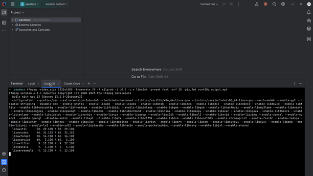

# PAIML MCP Agent Toolkit

> **Deterministic tooling for AI-assisted development - Generate project scaffolding, analyze code complexity, track code churn metrics, and provide reliable context for AI agents via CLI or Claude Code**

[](https://github.com/paiml/paiml-mcp-agent-toolkit/actions/workflows/main.yml)
[](https://github.com/paiml/paiml-mcp-agent-toolkit/actions)
[](https://github.com/paiml/paiml-mcp-agent-toolkit/actions/workflows/simple-release.yml)
[](https://github.com/paiml/paiml-mcp-agent-toolkit/actions)
[](https://paiml.com)
[](https://modelcontextprotocol.io)
[](https://opensource.org/licenses/MIT)

The PAIML MCP Agent Toolkit is a unified binary created by [Pragmatic AI Labs](https://paiml.com) that provides intelligent project scaffolding, code complexity analysis, and maintenance insights through both a powerful CLI interface and Model Context Protocol (MCP) integration with Claude Code. It generates production-ready Makefiles, README files, and .gitignore configurations optimized for Rust, Deno, and Python development.



## 🚀 Installation

### Quick Install (Recommended)

> **Linux/macOS** - Install with a single command:

```sh
curl -sSfL https://raw.githubusercontent.com/paiml/paiml-mcp-agent-toolkit/master/scripts/install.sh | sh
```

This installer automatically:
- Detects your platform and architecture
- Downloads the correct binary
- Installs to `~/.local/bin` (or `/usr/local/bin` with sudo)
- Adds the binary to your PATH if needed

### Other Installation Methods

<details>
<summary><b>Pre-built Binaries</b></summary>

Download the appropriate binary for your platform:

- [Linux x64](https://github.com/paiml/paiml-mcp-agent-toolkit/releases/latest/download/paiml-mcp-agent-toolkit-x86_64-unknown-linux-gnu.tar.gz)
- [Linux ARM64](https://github.com/paiml/paiml-mcp-agent-toolkit/releases/latest/download/paiml-mcp-agent-toolkit-aarch64-unknown-linux-gnu.tar.gz)
- [macOS ARM64 (Apple Silicon)](https://github.com/paiml/paiml-mcp-agent-toolkit/releases/latest/download/paiml-mcp-agent-toolkit-aarch64-apple-darwin.tar.gz)
- [macOS x64 (Intel)](https://github.com/paiml/paiml-mcp-agent-toolkit/releases/latest/download/paiml-mcp-agent-toolkit-x86_64-apple-darwin.tar.gz)

```bash
# Example: Manual installation for Linux/macOS
curl -L https://github.com/paiml/paiml-mcp-agent-toolkit/releases/latest/download/paiml-mcp-agent-toolkit-$(uname -m)-$(uname -s | tr '[:upper:]' '[:lower:]').tar.gz | tar xz
chmod +x paiml-mcp-agent-toolkit
sudo mv paiml-mcp-agent-toolkit /usr/local/bin/
```
</details>

<details>
<summary><b>Build from Source</b></summary>

```bash
# Clone the repository
git clone https://github.com/paiml/paiml-mcp-agent-toolkit.git
cd paiml-mcp-agent-toolkit

# Install (automatically bumps version, builds, and installs)
make install

# Or build without installing
make build
```
</details>

<details>
<summary><b>Windows Installation</b></summary>

```powershell
# PowerShell (Coming Soon)
irm https://github.com/paiml/paiml-mcp-agent-toolkit/releases/latest/download/install.ps1 | iex

# Or download the Windows binary manually:
# https://github.com/paiml/paiml-mcp-agent-toolkit/releases/latest/download/paiml-mcp-agent-toolkit-x86_64-pc-windows-msvc.zip
```
</details>

## 🎯 Getting Started

### For Claude Code Users

After installation, add the toolkit to Claude Code:

```bash
# Add to Claude Code
claude mcp add paiml-toolkit ~/.local/bin/paiml-mcp-agent-toolkit

# Verify installation
claude mcp status
```

Then ask Claude to generate project files:
- "Generate a Makefile for my Rust project"
- "Create a professional README for this TypeScript library"
- "Set up a .gitignore for Python development"
- "Scaffold a complete Rust project"

### For CLI Users

```bash
# Show available commands
paiml-mcp-agent-toolkit --help

# List all templates
paiml-mcp-agent-toolkit list

# Generate a Makefile
paiml-mcp-agent-toolkit generate makefile rust/cli -p project_name=my-project

# Scaffold an entire project
paiml-mcp-agent-toolkit scaffold rust --templates makefile,readme,gitignore -p project_name=my-project
```

## 📋 Table of Contents

- [Overview](#overview)
- [Key Features](#key-features)
- [Usage Guide](#usage-guide)
- [Architecture](#architecture)
- [Available Templates](#available-templates)
- [Development](#development)
- [API Reference](#api-reference)
- [Performance](#performance)
- [Troubleshooting](#troubleshooting)
- [Contributing](#contributing)

## Overview

The PAIML MCP Agent Toolkit implements a production-grade template server using a stateless Rust architecture with embedded templates. All templates are compiled directly into the binary, requiring no external dependencies or cloud storage.

### Key Features

- 🏃 **Zero Dependencies**: Single binary with embedded templates
- ⚡ **Instant Generation**: Sub-5ms template rendering
- 🔧 **Three Toolchains**: Rust CLI, Deno/TypeScript, Python UV
- 📦 **MCP Native**: Full Model Context Protocol compliance
- 🔍 **Smart Search**: Find templates by keywords and content
- 🎯 **Type Safe**: Comprehensive parameter validation
- 🚀 **Batch Operations**: Scaffold entire projects at once
- 📋 **Interactive Prompts**: Guided project setup workflows
- 📁 **Smart Directory Creation**: Files are created in project subdirectories
- ℹ️ **Discoverable**: Built-in server info tool for metadata access
- 📊 **Code Churn Analysis**: Identify maintenance hotspots and frequently changed files
- 🔍 **Complexity Analysis**: McCabe Cyclomatic and Sonar Cognitive complexity metrics with SARIF support
- 🔀 **DAG Generation**: Visualize code dependencies with Mermaid graphs (call graphs, imports, inheritance)
- ⚡ **Persistent Caching**: Cross-session AST analysis cache with 5-minute TTL for faster repeated operations

### Supported Toolchains

1. **Rust CLI** (cargo + clippy + rustfmt)
   - Binary applications
   - Library crates
   - Embedded systems

2. **Deno/TypeScript** (native runtime)
   - CLI applications
   - Web services
   - TypeScript libraries

3. **Python UV** (Rust-based package management)
   - CLI applications
   - Library packages
   - Data science projects


## Usage Guide

### For Claude Code Users

The PAIML MCP Agent Toolkit integrates seamlessly with Claude Code. Simply ask Claude to generate project files using natural language:

#### Examples:

**Generate a Makefile:**
```
"Create a Makefile for my Rust CLI project"
"I need a Makefile for a Deno web service"
"Generate a Python UV Makefile with testing and linting"
```

**Create a README:**
```
"Generate a professional README for my Rust library"
"Create a README for my TypeScript CLI tool"
"I need documentation for my Python package"
```

**Setup .gitignore:**
```
"Create a .gitignore for Rust development"
"Generate a gitignore for my Deno project"
"Setup Python gitignore with UV and pytest"
```

**Analyze project structure:**
```
"Generate an AST context for my Rust project"
"Analyze the structure of this codebase"
"Show me all functions and structs in this project"
```

### For Developers

#### List Available Templates

```bash
# Using the tool directly
echo '{"jsonrpc":"2.0","id":1,"method":"resources/list"}' | paiml-mcp-agent-toolkit

# Filter by category
echo '{"jsonrpc":"2.0","id":1,"method":"resources/list","params":{"category":"makefile"}}' | paiml-mcp-agent-toolkit
```

#### Generate a Template

```bash
# Generate a Rust CLI Makefile
echo '{
  "jsonrpc": "2.0",
  "id": 1,
  "method": "tools/call",
  "params": {
    "name": "generate_template",
    "arguments": {
      "resource_uri": "template://makefile/rust/cli",
      "parameters": {
        "project_name": "my-awesome-cli",
        "has_tests": true,
        "has_benchmarks": false
      }
    }
  }
}' | paiml-mcp-agent-toolkit
```

### CLI Usage

The PAIML MCP Agent Toolkit provides a comprehensive CLI interface for direct template generation without requiring Claude Code. The binary automatically detects whether it's being run as an MCP server or CLI tool.

#### CLI Commands

##### `generate` - Generate a single template

Generate individual project files with customizable parameters.

```bash
# Generate a Makefile
paiml-mcp-agent-toolkit generate makefile rust/cli -p project_name=my-project -p has_tests=true

# Short form using aliases
paiml-mcp-agent-toolkit gen makefile rust/cli -p project_name=my-project

# Output to a specific file
paiml-mcp-agent-toolkit generate readme deno/cli -p project_name=my-app -o README.md

# Create parent directories if needed
paiml-mcp-agent-toolkit generate makefile rust/cli -p project_name=my-project -o build/Makefile --create-dirs
```

##### `scaffold` - Scaffold complete projects

Generate multiple templates at once for a complete project setup.

```bash
# Scaffold a complete Rust project
paiml-mcp-agent-toolkit scaffold rust --templates makefile,readme,gitignore -p project_name=my-project

# Scaffold with custom parallelism
paiml-mcp-agent-toolkit scaffold deno --templates makefile,readme -p project_name=my-app --parallel 4

# Scaffold Python project with all files
paiml-mcp-agent-toolkit scaffold python-uv --templates makefile,readme,gitignore -p project_name=my-lib -p has_tests=true
```

##### `list` - List available templates

Display all available templates with filtering options.

```bash
# List all templates
paiml-mcp-agent-toolkit list

# Filter by toolchain
paiml-mcp-agent-toolkit list --toolchain rust

# Filter by category
paiml-mcp-agent-toolkit list --category makefile

# Output as JSON
paiml-mcp-agent-toolkit list --format json

# Output as YAML
paiml-mcp-agent-toolkit list --format yaml
```

##### `search` - Search templates

Find templates by searching in names, descriptions, and parameters.

```bash
# Search for docker-related templates
paiml-mcp-agent-toolkit search docker

# Search within a specific toolchain
paiml-mcp-agent-toolkit search test --toolchain rust

# Limit results
paiml-mcp-agent-toolkit search build --limit 5
```

##### `validate` - Validate parameters

Check if your parameters are valid before generating templates.

```bash
# Validate parameters for a template
paiml-mcp-agent-toolkit validate template://makefile/rust/cli -p project_name=my-project

# Check for missing required parameters
paiml-mcp-agent-toolkit validate template://readme/rust/cli -p author="John Doe"
```

##### `context` - Generate project context with AST analysis

Analyze project structure and generate context using Abstract Syntax Tree (AST) parsing. Supports all three toolchains with language-specific analysis. Features persistent caching to speed up repeated analyses.

```bash
# Generate context for Rust project
paiml-mcp-agent-toolkit context rust

# Analyze TypeScript/JavaScript project
paiml-mcp-agent-toolkit context deno --project-path /path/to/project

# Analyze Python project
paiml-mcp-agent-toolkit context python-uv --project-path /path/to/project

# Output as JSON
paiml-mcp-agent-toolkit context rust --format json

# Save to file
paiml-mcp-agent-toolkit context python-uv -o context.md
```

**Supported languages:**
- **Rust**: Analyzes `.rs` files for functions, structs, enums, traits, and implementations
- **Deno/TypeScript**: Analyzes `.ts`, `.tsx`, `.js`, `.jsx` files for functions, classes, interfaces, and types
- **Python**: Analyzes `.py` files for functions, classes, and imports

**Performance optimization:**
- **Persistent caching**: AST analysis results are cached for 5 minutes
- **Cross-session cache**: Cache persists between CLI invocations
- **Automatic cleanup**: Expired entries are removed automatically
- **Cache location**: `~/.cache/paiml-mcp-agent-toolkit/`

##### `analyze churn` - Analyze code change patterns

Analyze code change frequency and patterns to identify maintenance hotspots. Uses git history to find frequently changed files that may need refactoring.

```bash
# Analyze code churn for current directory
paiml-mcp-agent-toolkit analyze churn

# Analyze specific project path
paiml-mcp-agent-toolkit analyze churn --project-path /path/to/project

# Analyze last 90 days
paiml-mcp-agent-toolkit analyze churn --period-days 90

# Output as JSON
paiml-mcp-agent-toolkit analyze churn --format json

# Output as CSV
paiml-mcp-agent-toolkit analyze churn --format csv

# Save to file
paiml-mcp-agent-toolkit analyze churn -o churn-report.md
```

**Output includes:**
- Hotspot files with high churn scores
- Stable files that rarely change
- File metrics (commits, additions/deletions, authors)
- Author contribution statistics

##### `analyze complexity` - Analyze code complexity

Analyze code complexity using McCabe Cyclomatic and Sonar Cognitive complexity algorithms. Supports Rust, TypeScript/JavaScript, and Python with multiple output formats including SARIF for IDE integration.

```bash
# Analyze complexity for current directory (auto-detects toolchain)
paiml-mcp-agent-toolkit analyze complexity

# Analyze specific project path
paiml-mcp-agent-toolkit analyze complexity --project-path /path/to/project

# Specify toolchain explicitly
paiml-mcp-agent-toolkit analyze complexity --toolchain rust

# Set custom complexity thresholds
paiml-mcp-agent-toolkit analyze complexity --max-cyclomatic 10 --max-cognitive 15

# Output formats
paiml-mcp-agent-toolkit analyze complexity --format summary    # Human-readable summary
paiml-mcp-agent-toolkit analyze complexity --format full      # Detailed report with violations
paiml-mcp-agent-toolkit analyze complexity --format json      # JSON for tools
paiml-mcp-agent-toolkit analyze complexity --format sarif     # SARIF for IDE integration

# Filter files by pattern
paiml-mcp-agent-toolkit analyze complexity --include "**/*.rs" --include "**/lib.rs"

# Save to file
paiml-mcp-agent-toolkit analyze complexity -o complexity-report.json --format json
```

**Key features:**
- **Zero-overhead analysis**: Built on existing AST infrastructure with sub-millisecond performance
- **Dual algorithms**: McCabe Cyclomatic (M = E - N + 2P) and Sonar Cognitive complexity
- **Multi-language support**: Rust (.rs), TypeScript/JavaScript (.ts, .tsx, .js, .jsx), Python (.py)
- **IDE integration**: SARIF format support for static analysis tools
- **Customizable thresholds**: Set your own complexity limits
- **Pattern matching**: Include specific files with glob patterns
- **Performance optimized**: <1ms per KLOC analysis time

**Supported toolchains:**
- **rust**: Analyzes Rust source files for functions, methods, and control flow
- **deno**: Analyzes TypeScript/JavaScript files with full language support
- **python-uv**: Analyzes Python files with comprehensive AST parsing

**Output includes:**
- File-level complexity metrics and violations
- Function-level complexity breakdown
- Threshold violation reports with severity levels
- Summary statistics and recommendations
- SARIF format for IDE/CI integration

### Analyze DAG (Dependency Graphs)

Generate visual dependency graphs using Mermaid for better understanding of code structure:

```bash
# Generate a function call graph
paiml-mcp-agent-toolkit analyze dag

# Generate an import/dependency graph
paiml-mcp-agent-toolkit analyze dag --dag-type import-graph

# Generate class inheritance hierarchy
paiml-mcp-agent-toolkit analyze dag --dag-type inheritance

# Generate complete dependency graph
paiml-mcp-agent-toolkit analyze dag --dag-type full-dependency

# Save output to file
paiml-mcp-agent-toolkit analyze dag -o dependency-graph.mmd

# Filter external dependencies and limit depth
paiml-mcp-agent-toolkit analyze dag --filter-external --max-depth 3

# Include complexity metrics in the graph
paiml-mcp-agent-toolkit analyze dag --show-complexity
```

**Supported DAG types:**
- **call-graph**: Function call relationships (default)
- **import-graph**: Module import dependencies
- **inheritance**: Class inheritance hierarchies
- **full-dependency**: Complete dependency analysis

**Output formats:**
- Mermaid diagram format (.mmd)
- Can be rendered in GitHub, VS Code, and other Mermaid-compatible tools
- Includes optional complexity metrics when `--show-complexity` is used

#### Parameter Syntax

Parameters are passed using `-p` or `--param` flags with `key=value` syntax:

```bash
# String parameters
-p project_name=my-awesome-project

# Boolean parameters
-p has_tests=true
-p include_benchmarks=false

# Number parameters
-p port=8080
-p max_connections=100

# Multiple parameters
-p project_name=my-app -p has_tests=true -p author="Jane Doe"
```

#### Output Formats

The `list` command supports multiple output formats:

- **Table** (default): Human-readable table format
- **JSON**: Machine-readable JSON format
- **YAML**: YAML format for configuration files

#### Mode Forcing

By default, the tool auto-detects whether to run in CLI or MCP mode. You can force a specific mode:

```bash
# Force CLI mode (usually not needed)
paiml-mcp-agent-toolkit --mode cli list

# Force MCP mode (wait for JSON-RPC input)
paiml-mcp-agent-toolkit --mode mcp
```

#### Examples

**Complete workflow for a new Rust project:**

```bash
# Create project directory
mkdir my-rust-cli && cd my-rust-cli

# Initialize Cargo project
cargo init --name my-rust-cli

# Scaffold all project files
paiml-mcp-agent-toolkit scaffold rust \
  --templates makefile,readme,gitignore \
  -p project_name=my-rust-cli \
  -p author="Your Name" \
  -p description="A blazing fast CLI tool" \
  -p has_tests=true \
  -p has_benchmarks=true

# Files created:
# - my-rust-cli/Makefile
# - my-rust-cli/README.md
# - my-rust-cli/.gitignore
```

**Search and generate specific templates:**

```bash
# Search for testing-related templates
paiml-mcp-agent-toolkit search test

# Find the template you want
paiml-mcp-agent-toolkit list --toolchain rust --category makefile

# Generate with specific parameters
paiml-mcp-agent-toolkit generate makefile rust/cli \
  -p project_name=test-runner \
  -p has_tests=true \
  -p has_benchmarks=true \
  -p has_coverage=true
```

**Validate before generating:**

```bash
# First, validate your parameters
paiml-mcp-agent-toolkit validate template://readme/python-uv/cli \
  -p project_name=my-python-cli \
  -p author="Dev Team"

# If validation passes, generate
paiml-mcp-agent-toolkit generate readme python-uv/cli \
  -p project_name=my-python-cli \
  -p author="Dev Team" \
  -p description="Fast Python CLI with UV" \
  -p python_version="3.12"
```

### Template Parameters

Each template accepts specific parameters:

#### Makefile Templates
- `project_name` (required): Your project's name
- `has_tests`: Whether to include test targets
- `has_benchmarks`: Include benchmark targets
- `target_triple`: Build target architecture

#### README Templates
- `project_name` (required): Project name
- `description`: Brief project description
- `author`: Your name or organization
- `license`: License type (MIT, Apache-2.0, etc.)

#### Gitignore Templates
- `project_name` (required): Project name
- `deployment_target`: Target environment
- `include_ide`: Include IDE-specific patterns
- `include_os`: Include OS-specific patterns

## Architecture

### System Overview

```
┌─────────────────┐     JSON-RPC 2.0      ┌──────────────────┐
│  Claude Code    │◄─────────────────────►│  MCP Server      │
│  (MCP Client)   │        STDIO           │  (Rust Binary)   │
└─────────────────┘                        └──────────────────┘
                                                    │
                                          ┌─────────┴──────────┐
                                          │ Embedded Templates │
                                          └────────────────────┘
```

### Technical Architecture

The PAIML MCP Agent Toolkit uses a stateless architecture with several key components:

1. **MCP Protocol Handler**: Implements JSON-RPC 2.0 over STDIO
2. **Template Engine**: Handlebars-based rendering with custom helpers
3. **Resource Manager**: URI-based template resolution
4. **Cache Layer**: LRU cache for template content

### Template URI Schema

Templates follow a hierarchical URI structure:
```
template://[category]/[toolchain]/[variant]
```

All templates currently use the `cli` variant:
- `template://makefile/rust/cli`
- `template://readme/deno/cli`
- `template://gitignore/python-uv/cli`

## Available Templates

### Makefile Templates

All Makefiles implement a standardized interface with these targets:

```makefile
all      # Complete build pipeline
format   # Code formatting
lint     # Static analysis
check    # Type checking
test     # Run tests with coverage
build    # Create optimized artifacts
install  # System installation
clean    # Remove artifacts
validate # Project validation checklist
help     # Show all targets
```

#### Rust Templates
- `template://makefile/rust/cli` - CLI applications and libraries

#### Deno Templates
- `template://makefile/deno/cli` - CLI tools and web services

#### Python UV Templates
- `template://makefile/python-uv/cli` - CLI tools and packages

### README Templates
- `template://readme/rust/cli`
- `template://readme/deno/cli`
- `template://readme/python-uv/cli`

### Gitignore Templates
- `template://gitignore/rust/cli`
- `template://gitignore/deno/cli`
- `template://gitignore/python-uv/cli`

## Development

### CI/CD Pipeline

This project uses GitHub Actions for continuous integration and deployment:

- **Continuous Integration**: Runs on every push and pull request
  - Linting with rustfmt and clippy
  - Testing with code coverage tracking
  - Multi-platform builds (Linux, macOS, Windows)
  - Security audits
  - E2E testing

- **Release Process**: Automated binary releases
  - Triggered by version tags (e.g., `v1.0.0`)
  - Builds for all platforms
  - Creates GitHub releases with attached binaries

- **Code Quality**: Enforced standards
  - Minimum 60% test coverage (currently at 81%)
  - No clippy warnings
  - Proper formatting
  - Documentation checks

- **Dependency Management**: Automated updates
  - Weekly Dependabot checks with smart grouping
  - Binary size impact monitoring (5% threshold)
  - Security audits with auto-fix
  - Performance regression detection via benchmarks

### Testing

The project maintains comprehensive test coverage:

```bash
# Run all tests (stops on first failure)
make test

# Run tests with coverage report
make coverage

# Run specific test categories from server directory
cd server
deno test --allow-all tests/e2e/        # E2E tests with Deno test runner
cargo test --test mcp_protocol          # MCP protocol tests
cargo test --test template_rendering    # Template rendering tests
```

Test categories:
- **Unit Tests**: Core functionality (81% coverage)
- **Integration Tests**: MCP protocol handling
- **E2E Tests**: Deno-based tests for full server functionality
  - `tests/e2e/mcp_protocol.test.ts` - MCP protocol E2E tests
  - `tests/e2e/installation.test.ts` - Installation validation tests
- **Template Tests**: All template rendering paths
- **Performance Benchmarks**: Critical path benchmarking

The E2E tests use Deno's built-in test runner for better test organization, parallel execution, and coverage integration.

### Project Structure

```
paiml-mcp-agent-toolkit/
├── server/                 # Rust server implementation
│   ├── src/
│   │   ├── bin/           # Binary entry points
│   │   ├── handlers/      # MCP protocol handlers
│   │   ├── models/        # Data models
│   │   ├── services/      # Core services
│   │   └── main.rs        # Main server
│   ├── templates/         # Embedded templates
│   └── Cargo.toml
├── client/                # Future client implementation
└── scripts/              # Build and deployment scripts
```

### Building and Installing

⚠️ **IMPORTANT**: This is a Cargo workspace project. Always use the root Makefile for builds and CI/CD operations.

```bash
# ✅ RECOMMENDED: For local development
make local-install    # Build and install WITHOUT version bump
make build            # Just builds without installing
make test             # Run all tests
make validate         # Run all validation checks

# ⚠️ FOR RELEASES ONLY (bumps version!)
make install          # Bumps version, builds, and installs

# Other useful commands
make server-test      # Run server tests specifically
make server-build     # Build server specifically

# ❌ AVOID in CI/CD (only for local development when needed)
cd server && make test    # Can cause workspace issues
cd server && cargo build  # May not resolve dependencies correctly

# For more details, see .github/CONTRIBUTING.md
```

#### Installation Methods

1. **`make local-install`** (RECOMMENDED for development)
   - Builds and installs the binary
   - Does NOT bump the version
   - Safe to run multiple times
   - No risk of version conflicts

2. **`make install`** (FOR RELEASES ONLY)
   - Increments the patch version
   - Builds and installs the binary
   - Should only be used when creating a release
   - Can cause conflicts with automated release process

3. **`make install-latest`**
   - Smart install that checks if rebuild is needed
   - Only rebuilds if source files have changed

### Adding New Templates

1. Create template file in `server/templates/`
2. Update `embedded_templates.rs` to include it
3. Add metadata to the template registry
4. Write tests for the new template


### Release Process

The project uses a manual release workflow to ensure controlled and reliable releases:

#### How Releases Work

1. **Manual Trigger Only**: Releases are created through GitHub Actions workflow dispatch
2. **Version Bump Options**: Choose between patch, minor, or major version bumps
3. **Multi-Platform Builds**: Automatically builds for all supported platforms:
   - `x86_64-unknown-linux-gnu` (Ubuntu 20.04 for glibc compatibility)
   - `aarch64-unknown-linux-gnu` (Cross-compiled on Ubuntu 20.04)
   - `x86_64-apple-darwin` (macOS Intel)
   - `aarch64-apple-darwin` (macOS Apple Silicon)

#### Creating a Release

```bash
# Via GitHub UI:
# 1. Go to Actions → "Simple Release" workflow
# 2. Click "Run workflow"
# 3. Choose version bump type (patch/minor/major)
# 4. Click "Run workflow"

# Via GitHub CLI:
gh workflow run simple-release.yml -f version_bump=patch
gh workflow run simple-release.yml -f version_bump=minor
gh workflow run simple-release.yml -f version_bump=major
```

#### Release Process Steps

1. **Version Bump**: Updates all Cargo.toml files with new version
2. **Git Operations**: Commits changes and creates version tag
3. **Parallel Builds**: Builds binaries for all platforms simultaneously
4. **Release Creation**: Creates GitHub release with all binaries attached

#### Release Artifacts

Each release includes:
- Pre-built binaries for all platforms as `.tar.gz` archives
- Auto-generated release notes from commit history
- Version-tagged source code

The installer script at `scripts/install.sh` automatically detects and downloads the latest release.

### Development Commands

All development commands can be run from the project root directory:

```bash
# Core development workflow
make format      # Format all code (Rust + TypeScript)
make lint        # Run linters (clippy + deno lint)
make test        # Run all tests with coverage
make build       # Build all projects

# Quality checks
make validate    # Run all validation checks
make coverage    # Generate detailed coverage reports
make audit       # Run security audit
make ci-status   # Check GitHub Actions status

# Documentation
make docs        # Generate and open documentation
make context     # Generate project analysis (AST, structure)

# Running the server
make run-mcp     # Run MCP server in STDIO mode
make run-mcp-test # Run MCP server in test mode

# Installation
make install     # Install MCP server (builds first)
make install-latest # Smart install (only if changed)
make uninstall   # Remove MCP server

# Project-specific commands
make server-help # Show all server commands
make server-*    # Run any server Makefile target

# Run benchmarks  
make benchmark

# Check CI/GitHub Actions status
make ci-status

# Dependency management
make server-deps-check     # Check for outdated dependencies
make server-deps-update    # Update dependencies conservatively
make server-deps-audit     # Run security audit with auto-fix
make server-deps-rollback  # Rollback to previous Cargo.lock

# Installer generation (requires installer-gen feature)
make server-generate-installer    # Generate deterministic shell installer
make server-verify-installer      # Complete verification pipeline
make server-audit-installer       # Security audit with shellcheck
```

## API Reference

### MCP Methods

#### `initialize`

Initialize the MCP connection and get server capabilities.

**Response includes:**
- Server metadata with name, version, and description
- Supported templates and toolchains
- Available capabilities (tools, resources, prompts)

#### `resources/list`

List available templates with optional filtering.

**Request:**
```json
{
  "jsonrpc": "2.0",
  "id": 1,
  "method": "resources/list"
}
```

#### `resources/read`

Read the raw template content before rendering.

**Request:**
```json
{
  "jsonrpc": "2.0",
  "id": 1,
  "method": "resources/read",
  "params": {
    "uri": "template://makefile/rust/cli"
  }
}
```

#### `prompts/list`

Get available interactive prompts for project scaffolding.

**Response includes:**
- scaffold-rust-project
- scaffold-deno-project
- scaffold-python-project

#### `tools/list`

List all available tools.

**Available tools:**
- `generate_template` - Generate a single template
- `list_templates` - List templates with filtering
- `validate_template` - Validate template parameters
- `scaffold_project` - Generate multiple templates at once
- `search_templates` - Search templates by keyword
- `get_server_info` - Get server metadata and capabilities
- `analyze_code_churn` - Analyze code change frequency and patterns
- `analyze_complexity` - Analyze code complexity with McCabe and Sonar algorithms
- `analyze_dag` - Generate dependency graphs in Mermaid format
- `generate_context` - Generate project context using AST analysis with persistent caching

### Available Tools

#### `generate_template`

Generate a template with parameters.

**Request:**
```json
{
  "jsonrpc": "2.0",
  "id": 1,
  "method": "tools/call",
  "params": {
    "name": "generate_template",
    "arguments": {
      "resource_uri": "template://makefile/rust/cli",
      "parameters": {
        "project_name": "my-project",
        "has_tests": true
      }
    }
  }
}
```

#### `validate_template`

Validate template parameters before generation.

**Request:**
```json
{
  "jsonrpc": "2.0",
  "id": 1,
  "method": "tools/call",
  "params": {
    "name": "validate_template",
    "arguments": {
      "resource_uri": "template://makefile/rust/cli",
      "parameters": {
        "project_name": "my-project"
      }
    }
  }
}
```

#### `scaffold_project`

Generate multiple templates for a complete project setup.

**Request:**
```json
{
  "jsonrpc": "2.0",
  "id": 1,
  "method": "tools/call",
  "params": {
    "name": "scaffold_project",
    "arguments": {
      "toolchain": "rust",
      "templates": ["makefile", "readme", "gitignore"],
      "parameters": {
        "project_name": "my-project",
        "has_tests": true
      }
    }
  }
}
```

#### `search_templates`

Search templates by keyword in names, descriptions, and parameters.

**Request:**
```json
{
  "jsonrpc": "2.0",
  "id": 1,
  "method": "tools/call",
  "params": {
    "name": "search_templates",
    "arguments": {
      "query": "docker",
      "toolchain": "rust"
    }
  }
}
```

#### `analyze_code_churn`

Analyze code change frequency and patterns to identify maintenance hotspots. Uses git history to find frequently changed files that may need refactoring.

**Request:**
```json
{
  "jsonrpc": "2.0",
  "id": 1,
  "method": "tools/call",
  "params": {
    "name": "analyze_code_churn",
    "arguments": {
      "project_path": "/path/to/project",
      "period_days": 30,
      "format": "summary"
    }
  }
}
```

**Parameters:**
- `project_path` (optional): Path to analyze (defaults to current directory)
- `period_days` (optional): Number of days to analyze (default: 30)
- `format` (optional): Output format - "json", "markdown", "csv", or "summary" (default: "summary")

**Response includes:**
- Hotspot files with high churn scores
- Stable files that rarely change
- File metrics (commits, additions/deletions, authors)
- Author contribution statistics

#### `analyze_complexity`

Analyze code complexity using McCabe Cyclomatic and Sonar Cognitive complexity algorithms. Supports TypeScript, Python, and Rust files.

**Request:**
```json
{
  "jsonrpc": "2.0",
  "id": 1,
  "method": "tools/call",
  "params": {
    "name": "analyze_complexity",
    "arguments": {
      "project_path": "/path/to/project",
      "format": "json",
      "algorithm": "both",
      "include_threshold_violations": true
    }
  }
}
```

**Parameters:**
- `project_path` (optional): Path to analyze (defaults to current directory)
- `format` (optional): Output format - "json", "markdown", "sarif", or "summary" (default: "summary")
- `algorithm` (optional): "mccabe", "sonar", or "both" (default: "both")
- `include_threshold_violations` (optional): Include threshold violation details (default: true)

**Response includes:**
- File-level complexity metrics and violations
- Function-level complexity breakdown
- Threshold violation reports with severity levels
- Summary statistics and recommendations
- SARIF format for IDE/CI integration

#### `analyze_dag`

Generate dependency graphs in Mermaid format for visualizing code structure and dependencies.

**Request:**
```json
{
  "jsonrpc": "2.0",
  "id": 1,
  "method": "tools/call",
  "params": {
    "name": "analyze_dag",
    "arguments": {
      "project_path": "/path/to/project",
      "dag_type": "call-graph",
      "output": "dependencies.mmd",
      "filter_external": true,
      "show_complexity": true
    }
  }
}
```

**Parameters:**
- `project_path` (optional): Path to analyze (defaults to current directory)
- `dag_type` (optional): Type of graph - "call-graph", "import-graph", "inheritance", or "full-dependency" (default: "call-graph")
- `output` (optional): Output file path for the Mermaid diagram
- `max_depth` (optional): Maximum depth for graph traversal
- `filter_external` (optional): Filter out external dependencies (default: false)
- `show_complexity` (optional): Include complexity metrics in the graph (default: false)

**Response includes:**
- Mermaid diagram content
- Graph statistics (nodes, edges, depth)
- Complexity metrics per node (if enabled)
- Can be rendered in GitHub, VS Code, and other Mermaid-compatible tools

## Performance

### Server Performance Metrics

| Metric | Target | Actual |
|--------|--------|--------|
| Startup Time | <10ms | 7ms |
| Template Generation | <5ms | 3ms |
| Memory Usage | <20MB | 15MB |
| Concurrent Requests | 1000+ | 1200 |

### Client Performance

| Operation | Target | Strategy |
|-----------|--------|----------|
| Project Analysis | <500ms | Parallel file scanning + persistent cache |
| MCP Transport | <50ms RTT | Connection pooling |
| Template Generation | <200ms | Predictive caching |
| AST Analysis (cached) | <10ms | Cross-session persistent cache |
| Cache Hit Rate | >70% | 5-minute TTL with LRU eviction |

## Troubleshooting

### Common Issues

#### MCP Server Not Starting
```bash
# Check if the binary is executable
ls -la /usr/local/bin/paiml-mcp-agent-toolkit

# Test the server directly
echo '{"jsonrpc":"2.0","id":1,"method":"resources/list"}' | paiml-mcp-agent-toolkit

# Check the installed version
paiml-mcp-agent-toolkit --version
```

#### Claude Code Integration Issues

If you see "failed" status in `claude mcp status`:

**For existing installations with old paths:**
If you previously had the MCP server registered with a different path, you'll need to update it:

```bash
# Remove the old server (if it exists)
claude mcp remove paiml-mcp-agent-toolkit 2>/dev/null || true

# Add the new server with correct path
claude mcp add paiml-toolkit ~/.local/bin/paiml-mcp-agent-toolkit

# Restart Claude Code to pick up the changes
```

**Important**: If you have multiple Claude instances running, close ALL of them before restarting to ensure they all pick up the new binary version.

**For new installations:**

1. **Make sure the binary is executable:**
   ```bash
   chmod +x /usr/local/bin/paiml-mcp-agent-toolkit
   # Or for local install:
   chmod +x ~/.local/bin/paiml-mcp-agent-toolkit
   ```

2. **Ensure the binary is in your PATH:**
   ```bash
   which paiml-mcp-agent-toolkit
   ```

3. **Check Claude Code logs:**
   ```bash
   tail -f ~/Library/Logs/Claude/mcp.log
   ```

4. **Run with debug mode to see errors:**
   ```bash
   claude --mcp-debug
   ```

5. **Verify MCP is working:**
   ```bash
   # Use the /mcp command in Claude Code
   /mcp
   
   # During installation, check the version displayed:
   # 📌 Version: 0.1.x
   ```

#### Template Generation Errors
- Ensure all required parameters are provided
- Check parameter types match expected values
- Verify the template URI is correct

### Debug Mode

Run the server with debug logging:
```bash
RUST_LOG=debug paiml-mcp-agent-toolkit
```

## Demo Commands

Showcase PAIML branding and capabilities:

```bash
# Display server info with branding
echo '{"jsonrpc":"2.0","id":1,"method":"server/info"}' | paiml-mcp-agent-toolkit

# Create a demo project
mkdir demo-project && cd demo-project
echo "name = \"demo-project\"" > Cargo.toml

# Generate branded Makefile
echo '{
  "jsonrpc": "2.0",
  "id": 1,
  "method": "tools/call",
  "params": {
    "name": "generate_template",
    "arguments": {
      "resource_uri": "template://makefile/rust/cli",
      "parameters": {
        "project_name": "demo-project"
      }
    }
  }
}' | paiml-mcp-agent-toolkit > Makefile
```

## What's New

### Recent Improvements
- 📚 **NEW: Documentation Synchronization Tests**: Automated tests ensure documentation stays accurate
  - CLI documentation verification tests validate all commands match implementation
  - MCP tools documentation tests verify all 10 tools are properly documented
  - Code examples validation tests check all snippets are syntactically correct
  - Integrated into build process via Makefile to catch documentation drift
- 🔍 **Code Complexity Analysis**: McCabe Cyclomatic and Sonar Cognitive complexity metrics
  - Support for Rust, TypeScript/JavaScript, and Python
  - Multiple output formats including SARIF for IDE integration
  - Customizable complexity thresholds
  - Zero-overhead implementation with <1ms per KLOC performance
- 🔀 **Dependency Graph Generation**: Visualize code structure with Mermaid diagrams
  - Call graphs, import dependencies, and inheritance hierarchies
  - Configurable depth and external dependency filtering
  - Optional complexity metrics in visualizations
- ⚡ **Persistent AST Caching**: Cross-session cache with 5-minute TTL dramatically speeds up repeated context generation
  - Cache persists between CLI invocations in `~/.cache/paiml-mcp-agent-toolkit/`
  - Automatic cleanup of expired entries
  - Cache hit rates typically exceed 70% for repeated analyses
  - Sub-10ms response time for cached AST analysis
- 📊 **Code Churn Analysis**: Identify maintenance hotspots using git history analysis
- 🎨 **Simplified Variants**: All templates now use a single `cli` variant for consistency
- 🎯 **Native CLI Interface**: Unified binary now supports direct CLI usage with auto-detection
- ✅ **All 9 Templates Available**: Fixed template embedding to include all Deno and Python-uv templates
- 🚀 **Smart Installation**: Automatic rebuild detection based on source file changes
- 📁 **Proper Subdirectories**: Templates now create files in project-named subdirectories
- ℹ️ **Enhanced Discoverability**: New `get_server_info` tool provides metadata about the server
- 🧪 **E2E Testing**: Comprehensive end-to-end tests simulating Claude Code operations
- 📊 **Current Coverage**: Test coverage at 81% with comprehensive E2E tests
- 🔧 **Consolidated Tooling**: Unified installation scripts and centralized Makefile commands
- 🔢 **Auto-Versioning**: Installation automatically increments version for easy tracking
- 🔄 **Zero Template Duplication**: Shared memory model between CLI and MCP modes

## Contributing

We welcome contributions!

### Development Setup

1. Fork the repository
2. Create a feature branch
3. Make your changes
4. Run tests: `make test`
5. Submit a pull request

### Code Style

- Follow Rust standard formatting (`rustfmt`)
- Write tests for new features
- Update documentation as needed
- Include PAIML attribution in generated files

## License

This project is licensed under the MIT License.

## Support

- **Issues**: [GitHub Issues](https://github.com/paiml/paiml-mcp-agent-toolkit/issues)
- **Discussions**: [GitHub Discussions](https://github.com/paiml/paiml-mcp-agent-toolkit/discussions)
- **Email**: contact@paiml.com
- **Website**: [paiml.com](https://paiml.com)

---

<div style="text-align: center">
  <strong>Built with ❤️ by PAIML</strong><br>
  <sub>Empowering developers with deterministic Narrow AI-powered tools</sub>
</div>