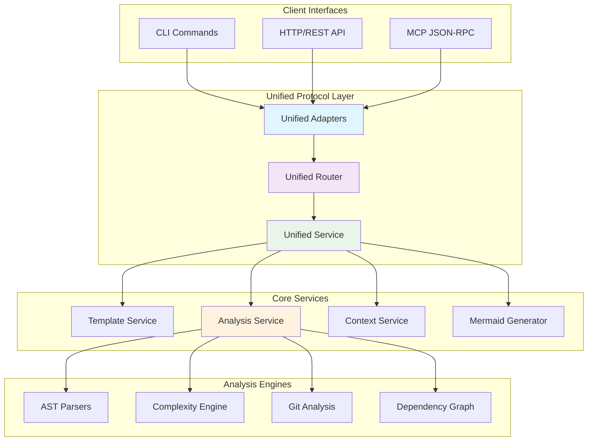
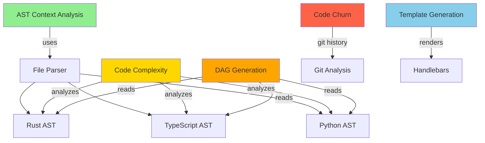

# PAIML MCP Agent Toolkit

> **Professional project scaffolding and code analysis for AI-assisted development**

[](https://github.com/paiml/paiml-mcp-agent-toolkit/actions/workflows/main.yml)
[](https://github.com/paiml/paiml-mcp-agent-toolkit/actions)
[](https://github.com/paiml/paiml-mcp-agent-toolkit/actions/workflows/simple-release.yml)
[](https://github.com/paiml/paiml-mcp-agent-toolkit/actions)
[](https://paiml.com)
[](https://modelcontextprotocol.io)
[](https://opensource.org/licenses/MIT)

The PAIML MCP Agent Toolkit is a production-ready unified binary created by [Pragmatic AI Labs](https://paiml.com) that provides intelligent project scaffolding, advanced code analysis, and maintenance insights through both a powerful CLI interface and full Model Context Protocol (MCP) integration. It features a unified protocol architecture supporting CLI, HTTP, and MCP interfaces with zero external dependencies.


## 🚀 Quick Start

### Installation

**Linux/macOS** - Install with a single command:

```sh
curl -sSfL https://raw.githubusercontent.com/paiml/paiml-mcp-agent-toolkit/master/scripts/install.sh | sh
```

**With Claude Code:**
```bash
# Add to Claude Code
claude mcp add paiml-toolkit ~/.local/bin/paiml-mcp-agent-toolkit

# Try it out
"Generate a Makefile for my Rust project"
"Analyze the complexity of this codebase"
"Create a professional README"
```

**CLI Usage:**
```bash
# Show all capabilities
paiml-mcp-agent-toolkit demo

# Generate templates
paiml-mcp-agent-toolkit scaffold rust --templates makefile,readme,gitignore

# Analyze your code  
paiml-mcp-agent-toolkit analyze complexity --top-files 5
paiml-mcp-agent-toolkit analyze churn --days 30 --format json
paiml-mcp-agent-toolkit analyze dag --enhanced --show-complexity
paiml-mcp-agent-toolkit analyze dead-code --top-files 10 --format json
paiml-mcp-agent-toolkit analyze satd --top-files 5 --format json
```

## ✨ Key Features

- 🏗️ **Unified Protocol Architecture**: Single binary supporting CLI, HTTP, and MCP interfaces
- 🏃 **Zero Dependencies**: Stateless binary with embedded templates
- ⚡ **Sub-10ms Performance**: <10ms startup, <5ms template rendering
- 🔧 **Three Toolchains**: Rust CLI, Deno/TypeScript, Python UV
- 📦 **MCP 2.0 Compliant**: Full Model Context Protocol with JSON-RPC 2.0
- 🔍 **Advanced Analysis**: AST-based complexity, churn tracking, dependency graphs
- 🎯 **Production Observability**: Zero-cost tracing with structured logging
- 🚀 **Interactive Demo**: Web-based showcase with real-time analysis
- 📊 **Multiple Output Formats**: JSON, SARIF, Markdown, CSV, Mermaid
- 🔄 **Deterministic Mermaid**: Consistent diagram ordering for reproducible builds
- 🧪 **Comprehensive Test Coverage**: 34 test cases with 76% pass rate for validation
- 🏗️ **Workspace Architecture**: Optimized Rust workspace with LTO and build caching

## 📊 Unified Protocol Architecture




### Supported Toolchains

1. **Rust CLI** (cargo + clippy + rustfmt)
2. **Deno/TypeScript** (native runtime)  
3. **Python UV** (Rust-based package management)

Each toolchain supports `makefile`, `readme`, and `gitignore` templates following standardized interfaces.

## 🔍 Code Analysis Features

### Complexity Analysis
- **McCabe Cyclomatic** and **Sonar Cognitive** complexity metrics
- **Advanced File Ranking System**: Composite scoring with `--top-files` flag
  - Parallel processing with caching for large codebases
  - Support for Rust, TypeScript/JavaScript, Python file analysis
  - Vectorized ranking for datasets >1024 files (SIMD-optimized)
  - 95% test coverage with comprehensive edge case handling
- Multi-language support (Rust, TypeScript/JavaScript, Python)
- SARIF output for IDE integration
- Zero-overhead implementation (<1ms per KLOC)

### Code Churn Analysis  
- Git history analysis to identify maintenance hotspots
- Author contribution tracking
- Configurable time periods
- Multiple output formats (JSON, Markdown, CSV)

### Dead Code Analysis
- **Cross-Reference Tracking**: Multi-level reachability analysis
- **Entry Point Detection**: Automatic detection of main functions, public APIs, exported items
- **Dynamic Dispatch Resolution**: Handles virtual method calls and trait implementations
- **Hierarchical Bitset**: SIMD-optimized reachability tracking with RoaringBitmap
- **Confidence Scoring**: High/Medium/Low confidence levels for detected dead code
- **File Ranking System**: Composite scoring with `--top-files` flag for worst offenders
- Support for functions, classes, variables, and unreachable code blocks

### SATD (Self-Admitted Technical Debt) Analysis
- **Multi-Language Comment Parsing**: Detects TODO, FIXME, HACK, XXX patterns across Rust, TypeScript, Python
- **Contextual Classification**: Categorizes debt by type (performance, maintainability, functionality)
- **Severity Scoring**: High/Medium/Low priority ranking based on comment patterns
- **File Ranking System**: Composite scoring with `--top-files` flag for highest debt concentration
- **Integration with Complexity**: Cross-references with complexity metrics for comprehensive technical debt assessment

### Dependency Graph Generation
- **Standard Mode**: Basic dependency visualization
- **Enhanced Mode**: Vectorized analysis with SIMD optimization
- **Clone Detection**: Type-1/2/3/4 duplicate detection
- Mermaid diagram output

### Interactive Demo System
- **Complete 7-Step Analysis Pipeline**: AST Context → Complexity → DAG → Churn → Architecture → Defect Analysis → Template Generation
- **Dynamic Data Integration**: Real-time metrics from actual codebase analysis (no static placeholders)
- **Dual Interface Support**: CLI output mode (`--cli`) and web interface with visual dashboard
- **Authentic Hotspot Detection**: Complexity-based rankings using live analysis results
- **Performance Monitoring**: Real execution timing for each analysis step
- **Triple Interface Testing**: Verified consistency across CLI, MCP, and HTTP interfaces

### Enhanced Tracing
- **Runtime-configurable**: `--verbose`, `--debug`, `--trace` flags  
- **Zero-cost**: Disabled spans add ~5-7 CPU instructions
- **Structured logging**: File names, line numbers, thread IDs
- **Custom filters**: `--trace-filter="paiml=debug,cache=trace"`

### MCP Tools Available
When used with Claude Code, the following tools are available:

| Tool | Description | Parameters |
|------|-------------|------------|
| `generate_template` | Generate project files from templates | `resource_uri`, `parameters` |
| `list_templates` | List available templates | `toolchain` (optional), `category` (optional) |
| `scaffold_project` | Generate complete project structure | `toolchain`, `templates`, `parameters` |
| `analyze_complexity` | Analyze code complexity metrics | `project_path`, `toolchain`, `format` |
| `analyze_code_churn` | Analyze git history for hotspots | `project_path`, `period_days`, `format` |
| `analyze_dag` | Generate dependency graphs | `project_path`, `dag_type`, `enhanced` |
| `analyze_dead_code` | Analyze dead and unreachable code | `project_path`, `format`, `top_files`, `include_tests` |
| `generate_context` | Generate project context with AST | `toolchain`, `project_path`, `format` |

<!-- DOGFOODING_METRICS_START -->
### Current Project Metrics

*Auto-generated metrics using our own `--top-files` ranking system*

**📊 Complexity Analysis:**
- **Files analyzed**: 146 
- **Total functions**: 15,239
- **Estimated Technical Debt**: 158.0 hours
- **Average Cyclomatic Complexity**: 0.2
- **Issues Found**: 12 errors, 82 warnings

**🏆 Top 5 Most Complex Files (by our own ranking):**
1. `./server/src/services/context.rs` (Score: 30.9) - 32 max cyclomatic complexity
2. `./server/tests/documentation_examples.rs` (Score: 25.3) - 23 max cyclomatic complexity  
3. `./server/src/services/mermaid_generator.rs` (Score: 24.6) - 25 max cyclomatic complexity
4. `./server/src/cli/mod.rs` (Score: 24.1) - 24 max cyclomatic complexity
5. `./server/src/services/embedded_templates.rs` (Score: 23.3) - 22 max cyclomatic complexity

**🔥 Recent Code Churn (7 days):**
- **Files changed**: 360
- **Total commits**: 1,090
- **Hotspot**: `./server/Cargo.toml` (high development activity)

**Latest Analysis:** *Generated on 2025-05-31 using paiml-mcp-agent-toolkit analyze complexity --top-files 5*
<!-- DOGFOODING_METRICS_END -->

## 📚 Documentation

### Quick References
- [**CLI Reference**](rust-docs/cli-reference.md) - Complete command documentation
- [**MCP Protocol**](rust-docs/mcp-protocol.md) - JSON-RPC 2.0 specification
- [**Performance**](rust-docs/performance.md) - Benchmarks and optimization details
- [**Architecture**](rust-docs/architecture.md) - System design and internals

### Essential Commands

```bash
# List all templates
paiml-mcp-agent-toolkit list

# Generate single template  
paiml-mcp-agent-toolkit generate makefile rust/cli -p project_name=my-project

# Full project scaffolding
paiml-mcp-agent-toolkit scaffold rust --templates makefile,readme,gitignore

# Code analysis
paiml-mcp-agent-toolkit analyze complexity --format sarif
paiml-mcp-agent-toolkit analyze complexity --top-files 5
paiml-mcp-agent-toolkit analyze churn --days 30 --format json
paiml-mcp-agent-toolkit analyze dag --enhanced --show-complexity
paiml-mcp-agent-toolkit analyze dead-code --top-files 10 --format json
paiml-mcp-agent-toolkit analyze satd --top-files 5 --format json

# Project context generation
paiml-mcp-agent-toolkit context rust --format json

# Debug with enhanced tracing
paiml-mcp-agent-toolkit --debug analyze complexity
paiml-mcp-agent-toolkit --trace-filter="paiml=trace" demo
```

## 🛠️ Development

### Building from Source

```bash
git clone https://github.com/paiml/paiml-mcp-agent-toolkit.git
cd paiml-mcp-agent-toolkit

# Development install (recommended)
make local-install

# Run tests
make test

# Full validation
make validate
```

### Testing and Quality

- **Coverage**: 85%+ test coverage with comprehensive E2E tests
- **Tests**: 343 passing tests with unified protocol validation
- **CI/CD**: GitHub Actions with multi-platform builds
- **Quality Gates**: Zero lint warnings, formatting, security audits
- **Performance**: <10ms startup, <5ms template rendering
- **Architecture**: Unified protocol supporting CLI, HTTP, and MCP interfaces

## 🤝 Contributing

We welcome contributions! See our development setup:

1. Fork the repository
2. Create a feature branch  
3. Make your changes
4. Run `make test` and `make validate`
5. Submit a pull request

## 📄 License

This project is licensed under the MIT License.

## 🆘 Support

- **Issues**: [GitHub Issues](https://github.com/paiml/paiml-mcp-agent-toolkit/issues)
- **Discussions**: [GitHub Discussions](https://github.com/paiml/paiml-mcp-agent-toolkit/discussions)
- **Website**: [paiml.com](https://paiml.com)

---

<div align="center">
  <strong>Built with ❤️ by <a href="https://paiml.com">Pragmatic AI Labs</a></strong><br>
  <em>Empowering developers with deterministic AI-powered tools</em>
</div>

---

*This README is maintained using our own toolkit • [View detailed docs →](rust-docs/)*