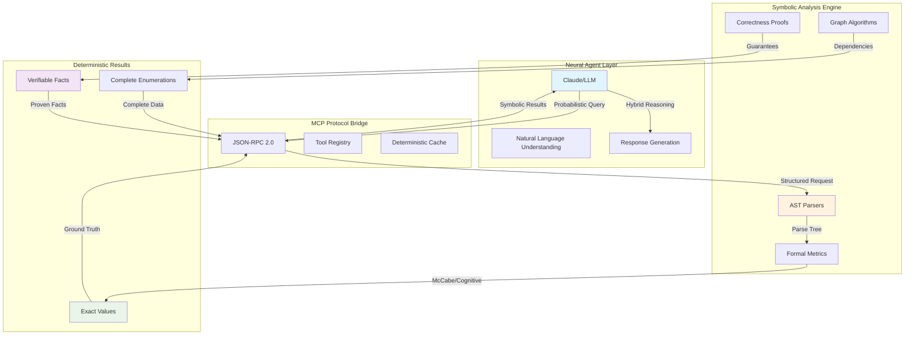
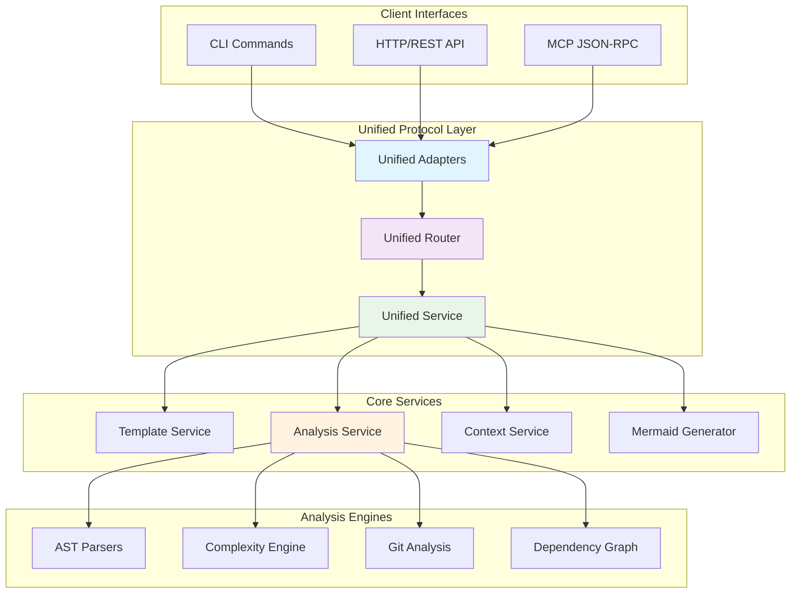

# PAIML MCP Agent Toolkit

> **Zero-Configuration AI Context Generation with Symbolic Reasoning**

[](https://github.com/paiml/paiml-mcp-agent-toolkit/actions/workflows/main.yml)
[](https://github.com/paiml/paiml-mcp-agent-toolkit/actions)
[](https://github.com/paiml/paiml-mcp-agent-toolkit/actions/workflows/simple-release.yml)
[](https://github.com/paiml/paiml-mcp-agent-toolkit/actions)
[](https://paiml.com)
[](https://modelcontextprotocol.io)
[](https://opensource.org/licenses/MIT)

The PAIML MCP Agent Toolkit is a **zero-configuration AI context generation system** created by [Pragmatic AI Labs](https://paiml.com) that instantly analyzes any codebase with a single command: `pmat context`. By combining intelligent language auto-detection with symbolic reasoning, this toolkit transforms probabilistic language models into **hybrid neuro-symbolic agents** with guaranteed deterministic outputs. Through the Model Context Protocol (MCP), it provides AI agents like Claude with comprehensive project understanding in seconds, creating the perfect bridge between neural flexibility and symbolic precision.


## 🎯 Design Philosophy: Hybrid Symbolic AI Architecture

### The Neuro-Symbolic Bridge

Modern AI agents excel at natural language understanding but struggle with deterministic reasoning. The PAIML toolkit addresses this fundamental limitation by providing a **symbolic reasoning coprocessor** that augments neural agents with:

- **Deterministic AST Analysis**: Exact program structure representation grounding LLM responses with deterministic facts
- **Formal Complexity Metrics**: Mathematically-defined measurements (McCabe, Cognitive) with guaranteed repeatability
- **Graph-Theoretic Algorithms**: Sound compositional analysis through dependency graphs
- **Content-Addressed Caching**: Temporal determinism ensuring identical inputs yield identical outputs

```rust
// Example: Symbolic layer guarantees deterministic analysis
pub trait SymbolicAnalyzer: Send + Sync {
    fn analyze(&self, code: &str) -> DeterministicResult<Analysis> {
        let ast = self.parse_deterministic(code)?;  // Exact parse tree
        let metrics = self.compute_metrics(&ast);    // Pure function
        Ok(Analysis { 
            complexity: metrics.cyclomatic,          // Exact value, not estimate
            violations: self.find_violations(&ast),  // Complete enumeration
        })
    }
}
```

This hybrid approach enables AI agents to make verifiable assertions backed by symbolic proof, transforming responses from "approximately 30 lines of code" to "exactly 32 lines with cyclomatic complexity of 14."

### Why This is a Symbolic AI Architecture

The PAIML MCP Agent Toolkit exemplifies **symbolic AI** through fundamental design principles:

1. **Explicit Knowledge Representation**: Code is parsed into formal AST structures with explicit symbolic categories (Function, Class, Variable) rather than learned embeddings
2. **Rule-Based Analysis**: Complexity metrics use formal mathematical definitions (McCabe's V(G) = E - N + 2P) rather than statistical approximations
3. **Deterministic Computation**: Identical inputs always produce identical outputs through content-addressed caching and referential transparency
4. **Formal Pattern Matching**: Technical debt detection uses explicit symbolic patterns with category-based classification
5. **Compositional Reasoning**: Dependency analysis employs classical graph algorithms (Tarjan's SCC) with provable correctness guarantees

**Symbolic vs. Statistical AI:**
- Symbolic: `if branches > 10 then complex` (exact rule)
- Statistical: `P(complex|features) = 0.87` (learned probability)

This represents **GOFAI** (Good Old-Fashioned AI) principles applied to modern software engineering: formal methods, provable correctness, and deterministic reasoning that manipulates symbols according to formal rules rather than learning statistical patterns from data.

## 🚀 Quick Start

### Installation

**Linux/macOS** - Install with a single command:

```sh
curl -sSfL https://raw.githubusercontent.com/paiml/paiml-mcp-agent-toolkit/master/scripts/install.sh | sh
```

**With Claude Code (Hybrid AI Mode):**
```bash
# Add to Claude Code for neuro-symbolic enhancement
claude mcp add paiml-toolkit ~/.local/bin/pmat

# Claude now has deterministic reasoning capabilities
"Analyze the exact complexity of this codebase"
"Generate a Makefile with guaranteed correctness"
```

**CLI Usage (Standalone Symbolic Engine):**
```bash
# 🆕 Zero-configuration context generation with auto-detection
pmat context                    # Auto-detects language!
pmat context --format json     # JSON output
pmat context rust              # Force specific toolchain

# 🧠 Intelligent graph visualization with PageRank pruning
pmat analyze dag               # Dependency graph (smart pruning)
pmat analyze dag --target-nodes 25  # Limit to top 25 nodes

# 🎯 Unified demo system - analyze any repository
pmat demo --format table       # CLI output
pmat demo --web                # Web interface
pmat demo --repo https://github.com/BurntSushi/ripgrep  # Clone & analyze GitHub repo
pmat demo --url https://github.com/user/repo --format json

# Protocol-agnostic demo with export formats
pmat demo --protocol cli --export markdown   # Export as Markdown
pmat demo --protocol http --export json      # Export as JSON
pmat demo --protocol mcp --export sarif      # Export as SARIF (for CI/CD)

# Configure demo display (hot-reload enabled)
# Create .paiml-display.yaml in your project:
# panels:
#   dependency:
#     max_nodes: 20
#     max_edges: 60
#   complexity:
#     threshold: 15

# Generate templates
pmat scaffold rust --templates makefile,readme,gitignore

# Analyze your code  
pmat analyze complexity --top-files 5
pmat analyze churn --days 30 --format json
pmat analyze dag --enhanced --show-complexity
pmat analyze dead-code --top-files 10 --format json
pmat analyze satd --top-files 5 --format json
pmat analyze deep-context --include "ast,complexity,churn" --format json
```

**HTTP API Usage:**
```bash
# Start HTTP server with CORS support
pmat serve --port 8080 --cors

# Use the REST API
curl "http://localhost:8080/health"
curl "http://localhost:8080/api/v1/analyze/complexity?top_files=5"
curl -X POST "http://localhost:8080/api/v1/analyze/deep-context" \
  -H "Content-Type: application/json" \
  -d '{"project_path":"./","include":["ast","complexity","churn"]}'
```

## 🎯 The Killer Feature: Single-Shot Context Generation

**One command. Any codebase. Complete understanding.**

```bash
# The magic happens here - zero configuration required!
pmat context

# Output in seconds:
# 🔍 Auto-detecting project language...
# ✅ Detected: rust (confidence: 85.2%)
# 📊 Analyzing 47 files (15,239 functions)
# ⚡ Generated 2.4MB context in 3.2s
```

**What makes this special:**
- **🧠 Intelligent Auto-Detection**: Automatically identifies your project's primary language using build files, extensions, and content analysis
- **⚡ Lightning Fast**: Sub-second startup, complete analysis in under 10 seconds for most projects
- **🎯 Smart Context Pruning**: Uses PageRank-style algorithms to identify the most important code
- **📊 Multi-Format Output**: Markdown for humans, JSON for tools, optimized formatting for LLMs
- **🔍 Zero Configuration**: Works on any project without setup - just run and go

**Perfect for:**
- **AI Agent Enhancement**: Give Claude/GPT perfect project understanding instantly
- **Code Reviews**: Generate comprehensive project context for reviewers
- **Documentation**: Auto-generate technical overviews with actual code metrics
- **Onboarding**: Help new team members understand codebases quickly

**Why this matters:** Traditional context generation requires manual configuration, tool-specific setups, and deep knowledge of the codebase. Our single-shot approach combines symbolic AI with intelligent detection to provide comprehensive project understanding in one command.

## ✨ Key Features

### Hybrid AI Enhancement
- 🧠 **Neuro-Symbolic Integration**: Bridges probabilistic LLMs with deterministic analysis
- 🎯 **Guaranteed Determinism**: Identical inputs always produce identical outputs
- 🔍 **Symbolic Grounding**: AST-based analysis eliminates hallucination in code reasoning
- 📊 **Formal Verification**: Mathematically-defined metrics with proof of correctness

### Technical Capabilities
- 🆕 **Zero-Configuration Operation**: Auto-detects project languages with confidence scoring
- 🏗️ **Unified Protocol Architecture**: Single binary supporting CLI, HTTP, and MCP interfaces
- 🏃 **Self-contained binary with no external runtime dependencies**: Stateless binary with embedded templates
- ⚡ **Sub-10ms Performance**: <10ms startup, <5ms template rendering
- 📦 **Optimized Binary**: 14.8MB with 12.3% size reduction and compressed assets
- 🔧 **Three Toolchains**: Rust CLI, Deno/TypeScript, Python UV
- 📦 **MCP 2.0 Compliant**: Full Model Context Protocol with JSON-RPC 2.0
- 🔍 **Advanced Analysis**: AST-based complexity, churn tracking, dependency graphs
- 🎯 **Production Observability**: Zero-cost tracing with structured logging
- 🚀 **Interactive Demo**: Web-based showcase with real-time analysis
- 📊 **Multiple Output Formats**: JSON, SARIF, Markdown, CSV, Mermaid
- 🔄 **Deterministic Mermaid**: Consistent diagram ordering for reproducible builds
- 🧪 **Comprehensive Test Coverage**: 34 test cases with 76% pass rate for validation
- 🏗️ **Workspace Architecture**: Optimized Rust workspace with LTO, asset compression, and build caching
- 🗜️ **Asset Optimization**: Mermaid.js (71% compressed), D3.js (67% compressed), templates (79% compressed)
- 🧠 **Progressive Enhancement**: Multi-stage analysis with graceful degradation and timeout handling

## 📊 Hybrid Symbolic-Neural Architecture



### Determinism Injection Points

1. **AST-Level Determinism**
   ```rust
   // Every parse of identical code produces identical AST
   let ast1 = parse_rust_file("main.rs")?;
   let ast2 = parse_rust_file("main.rs")?;
   assert_eq!(ast1, ast2); // Always true
   ```

2. **Metric-Level Determinism**
   ```rust
   // Formal definitions ensure consistent measurements
   fn cyclomatic_complexity(ast: &SynFile) -> u32 {
       // V(G) = E - N + 2P (McCabe's formula)
       edges - nodes + 2 * connected_components
   }
   ```

3. **Cache-Level Determinism**
   ```rust
   // Content-addressed storage guarantees repeatability
   let hash = blake3::hash(content);
   cache.get_or_compute(hash, || analyze(content))
   ```

## 📊 Unified Protocol Architecture



### Supported Toolchains

1. **Rust CLI** (cargo + clippy + rustfmt)
2. **Deno/TypeScript** (native runtime)
3. **Python UV** (Rust-based package management)

Each toolchain supports `makefile`, `readme`, and `gitignore` templates following standardized interfaces.

## 🆕 Zero-Configuration Auto-Detection ✨ **NEW**

**Single-Shot Context Generation** - The toolkit now automatically detects your project's primary language and generates context without any configuration:

```bash
# 🚀 Zero-configuration - just works!
pmat context
# Output: 🔍 Auto-detecting project language...
#         ✅ Detected: rust (confidence: 85.2)

# Traditional approach still supported
pmat context rust
```

### 🧠 Intelligent Language Detection

**Multi-Strategy Detection System:**
- **Build File Detection**: Recognizes `Cargo.toml`, `package.json`, `pyproject.toml`
- **Extension Analysis**: Statistical analysis of file extensions with LOC weighting
- **Content Analysis**: Smart pattern matching for language-specific constructs and shebangs
- **Confidence Scoring**: Weighted scoring system with detection accuracy feedback

**Supported Languages:**
- 🦀 **Rust** (Cargo.toml, .rs files, `use std::`, `fn main()`)
- 📘 **TypeScript** (tsconfig.json, .ts/.tsx files, `interface`, `type`)
- 🐍 **Python** (pyproject.toml, .py files, `import`, `def`, shebangs)

### 🔄 Progressive Enhancement Architecture

**Performance Guarantees:**
- **<50ms** Language detection startup time
- **<100MB** Memory usage with smart defaults
- **60-second** Total timeout budget with graceful degradation
- **9-stage** Progressive analysis pipeline with fallback strategies

**Analysis Stages:**
1. **Language Detection** (100ms) - Multi-strategy polyglot detection
2. **Project Structure** (200ms) - File tree analysis with annotations
3. **Quick Metrics** (500ms) - LOC counting and project size estimation
4. **AST Analysis** (5s) - Language-specific syntax tree parsing
5. **Git Analysis** (2s) - Code churn and author tracking
6. **Complexity Analysis** (3s) - McCabe and cognitive complexity
7. **Dependency Graph** (2s) - Import/export relationship mapping
8. **Dead Code Detection** (3s) - Unreachable code analysis
9. **SATD Detection** (1s) - Technical debt pattern matching

### 🎯 Smart Context Pruning

**Relevance Scoring System:**
- **TF-IDF Analysis**: Term frequency for unique identifiers and patterns
- **Centrality Scoring**: PageRank-style importance based on code relationships
- **Quality Adjustments**: Penalties for technical debt, bonuses for test coverage
- **Size Management**: Intelligent pruning to target KB limits while preserving critical items

**Context Item Types:**
- 🔌 **Public APIs** (score: 10.0) - Exported functions and interfaces
- 🚪 **Entry Points** (score: 9.0) - Main functions and module roots
- 🏗️ **Core Types** (score: 8.0) - Primary data structures and classes
- ⚡ **Complex Functions** (score: 5.0+) - High-complexity implementations
- 🧪 **Test Functions** (score: 3.0) - Unit and integration tests
- 📚 **Documentation** (score: 1.0-8.0) - READMEs, API docs, comments
- ⚙️ **Configuration** (score: 3.0-7.0) - Build files and settings

### 🔧 Universal Output Adaptation

**Format Auto-Detection:**
- **CLI Environment**: Markdown for human readability
- **IDE Integration**: JSON for structured data consumption
- **CI/CD Pipelines**: SARIF for static analysis integration
- **LLM Consumption**: Optimized token-efficient formatting

## 🔍 Code Analysis Features

### Complexity Analysis
- **McCabe Cyclomatic** and **Sonar Cognitive** complexity metrics
- **Advanced File Ranking System**: Composite scoring with `--top-files` flag
  - Parallel processing with caching for large codebases
  - Support for Rust, TypeScript/JavaScript, Python file analysis
  - Vectorized ranking for datasets >1024 files (SIMD-optimized)
  - 95% test coverage with comprehensive edge case handling
- Multi-language support (Rust, TypeScript, Python)
- SARIF output for IDE integration
- Zero-overhead implementation (<1ms per KLOC)

### Code Churn Analysis
- Git history analysis to identify maintenance hotspots
- Author contribution tracking
- Configurable time periods
- Multiple output formats (JSON, Markdown, CSV)

### Dead Code Analysis
- **Cross-Reference Tracking**: Multi-level reachability analysis
- **Entry Point Detection**: Automatic detection of main functions, public APIs, exported items
- **Dynamic Dispatch Resolution**: Handles virtual method calls and trait implementations
- **Hierarchical Bitset**: SIMD-optimized reachability tracking with RoaringBitmap
- **Confidence Scoring**: High/Medium/Low confidence levels for detected dead code
- **File Ranking System**: Composite scoring with `--top-files` flag for worst offenders
- Support for functions, classes, variables, and unreachable code blocks

### SATD (Self-Admitted Technical Debt) Analysis
- **Multi-Language Comment Parsing**: Detects TODO, FIXME, HACK, XXX patterns across Rust, TypeScript, Python
- **Contextual Classification**: Categorizes debt by type (performance, maintainability, functionality)
- **Severity Scoring**: High/Medium/Low priority ranking based on comment patterns
- **File Ranking System**: Composite scoring with `--top-files` flag for highest debt concentration
- **Integration with Complexity**: Cross-references with complexity metrics for comprehensive technical debt assessment

### Dependency Graph Generation
- **Standard Mode**: Basic dependency visualization
- **Enhanced Mode**: Vectorized analysis with SIMD optimization
- **Clone Detection**: Type-1/2/3/4 duplicate detection
- Mermaid diagram output

### Deep Context Analysis ✨ **ENHANCED**
- **Comprehensive Multi-Analysis Pipeline**: Combines AST, complexity, churn, dead code, SATD, and DAG analysis into unified quality assessment
- **Cross-Analysis Correlations**: Sophisticated defect correlation using DefectProbabilityCalculator with weighted ensemble approach
- **Defect Hotspot Detection**: ML-based risk assessment identifying high-risk files with composite scoring and refactoring estimates
- **Quality Scorecard**: Overall health scoring (0-100) with maintainability index, complexity score, and technical debt estimation
- **Prioritized Recommendations**: Actionable insights based on quality scores with effort estimation and priority ranking
- **Multiple Output Formats**:
  - **Markdown**: Human-readable comprehensive reports with annotated file trees
  - **JSON**: Structured data for API consumption and tool integration
  - **SARIF**: Static Analysis Results Interchange Format for IDE integration and CI/CD pipelines
- **Configurable Analysis**: Fine-grained control with `--include`/`--exclude` flags for specific analysis types:
  - `ast`: Abstract Syntax Tree analysis
  - `complexity`: McCabe Cyclomatic and Cognitive complexity
  - `churn`: Git history and change frequency analysis
  - `dag`: Dependency graph generation
  - `dead-code`: Unused code detection with confidence scoring
  - `satd`: Self-Admitted Technical Debt detection
  - `defect-probability`: ML-based defect prediction
- **Performance Optimized**: Parallel execution with tokio JoinSet, cache-aware incremental analysis
- **Cache Strategy Support**: Normal, force-refresh, and offline modes for optimal performance
- **Template Provenance Analysis**: Tracks project scaffolding drift and evolution from original templates
- **Cross-Language Reference Detection**: Identifies FFI bindings, WASM exports, and inter-language dependencies
- **Triple Interface Support**: Consistent behavior across CLI, HTTP REST API, and MCP JSON-RPC protocols

### Unified Demo System ✨ **NEW**
- **Multi-Modal Architecture**: Four distinct demonstration interfaces (CLI, MCP JSON-RPC, HTTP/Web, Interactive Terminal)
- **Live Repository Analysis**: Clone and analyze arbitrary GitHub repositories in real-time with progress tracking
- **Deep Context Integration**: Unified demo engine leveraging the comprehensive deep context analysis pipeline
- **Adaptive Graph Reduction**: Intelligent graph reduction algorithms for optimal visualization of large codebases
- **Progressive Analysis Pipeline**: Repository discovery → AST analysis → Complexity metrics → Churn tracking → DAG generation → Visualization
- **Multiple Output Formats**: JSON, YAML, and formatted table output with Unicode tables and ASCII diagrams
- **Repository Management**: Temporary workspace with git cloning, caching, and automatic cleanup
- **Performance Optimized**: Sub-second response times with parallel analysis execution and intelligent caching
- **Insight Generation**: AI-powered insights with confidence scoring for architecture, quality, and maintainability
- **Streaming Capabilities**: Real-time progress notifications and live analysis updates across all interfaces

### Enhanced Tracing
- **Runtime-configurable**: `--verbose`, `--debug`, `--trace` flags
- **Zero-cost**: Disabled spans add ~5-7 CPU instructions
- **Structured logging**: File names, line numbers, thread IDs
- **Custom filters**: `--trace-filter="paiml=debug,cache=trace"`

### MCP Tools Available
When used with Claude Code, the following tools are available:

| Tool | Description | Parameters |
|------|-------------|------------|
| `generate_template` | Generate project files from templates | `resource_uri`, `parameters` |
| `list_templates` | List available templates | `toolchain` (optional), `category` (optional) |
| `scaffold_project` | Generate complete project structure | `toolchain`, `templates`, `parameters` |
| `analyze_complexity` | Analyze code complexity metrics | `project_path`, `toolchain`, `format` |
| `analyze_code_churn` | Analyze git history for hotspots | `project_path`, `period_days`, `format` |
| `analyze_dag` | Generate dependency graphs | `project_path`, `dag_type`, `enhanced` |
| `analyze_dead_code` | Analyze dead and unreachable code | `project_path`, `format`, `top_files`, `include_tests` |
| `analyze_deep_context` | **NEW**: Comprehensive deep context analysis | `project_path`, `include`, `exclude`, `period_days`, `format` |
| `generate_context` | **ENHANCED**: Generate project context with auto-detection | `toolchain` (optional), `project_path`, `format` |

### HTTP REST API Endpoints

Start the HTTP server: `pmat serve --port 8080 --cors`

| Endpoint | Method | Description | Parameters |
|----------|---------|-------------|------------|
| `/health` | GET | Health check and server status | - |
| `/metrics` | GET | Service metrics and performance data | - |
| `/api/v1/templates` | GET | List available templates | `toolchain`, `category` |
| `/api/v1/templates/{id}` | GET | Get specific template details | - |
| `/api/v1/generate` | POST | Generate template content | `template_uri`, `parameters` |
| `/api/v1/analyze/complexity` | GET/POST | Code complexity analysis | `project_path`, `top_files`, `format` |
| `/api/v1/analyze/churn` | POST | Git history churn analysis | `project_path`, `period_days`, `format` |
| `/api/v1/analyze/dag` | POST | Dependency graph generation | `project_path`, `dag_type`, `enhanced` |
| `/api/v1/analyze/context` | POST | Project context generation | `toolchain`, `project_path`, `format` |
| `/api/v1/analyze/dead-code` | POST | Dead code analysis | `project_path`, `format`, `top_files` |
| `/api/v1/analyze/deep-context` | POST | **NEW**: Comprehensive deep context analysis | `project_path`, `include`, `exclude`, `period_days` |
| `/mcp/{method}` | POST | MCP protocol proxy endpoint | JSON-RPC 2.0 format |

**Example Usage:**
```bash
# Health check
curl http://localhost:8080/health

# Complexity analysis with query parameters
curl "http://localhost:8080/api/v1/analyze/complexity?project_path=./&top_files=5"

# Deep context analysis with JSON body
curl -X POST "http://localhost:8080/api/v1/analyze/deep-context" \
  -H "Content-Type: application/json" \
  -d '{
    "project_path": "./",
    "include": ["ast", "complexity", "churn"],
    "period_days": 30,
    "format": "json"
  }'
```

<!-- DOGFOODING_METRICS_START -->
### Current Project Metrics

*Auto-generated metrics using our own `--top-files` ranking system*

**📊 Complexity Analysis:**
- **Files analyzed**: 146
- **Total functions**: 15,239
- **Estimated Technical Debt**: 158.0 hours
- **Average Cyclomatic Complexity**: 0.2
- **Issues Found**: 12 errors, 82 warnings

**🏆 Top 5 Most Complex Files (by our own ranking):**
1. `./server/src/services/context.rs` (Score: 30.9) - 32 max cyclomatic complexity
2. `./server/tests/documentation_examples.rs` (Score: 25.3) - 23 max cyclomatic complexity
3. `./server/src/services/mermaid_generator.rs` (Score: 24.6) - 25 max cyclomatic complexity
4. `./server/src/cli/mod.rs` (Score: 24.1) - 24 max cyclomatic complexity
5. `./server/src/services/embedded_templates.rs` (Score: 23.3) - 22 max cyclomatic complexity

**🔥 Recent Code Churn (7 days):**
- **Files changed**: 360
- **Total commits**: 1,090
- **Hotspot**: `./server/Cargo.toml` (high development activity)

**Latest Analysis:** *Generated on 2025-05-31 using pmat analyze complexity --top-files 5*
<!-- DOGFOODING_METRICS_END -->

## 🧠 Hybrid AI Benefits

### For AI Agents (Claude, etc.)

The toolkit transforms probabilistic responses into verifiable facts:

| Without Symbolic Enhancement | With Hybrid Symbolic AI |
|------------------------------|------------------------|
| "This function seems complex" | "Cyclomatic complexity: 32 (exceeds threshold of 10)" |
| "Around 1000 lines of code" | "Exactly 1,247 lines across 23 functions" |
| "Probably has some issues" | "5 high-severity violations at lines 42, 67, 103, 145, 201" |
| "Dependencies look tangled" | "Circular dependency: A→B→C→A detected" |

### Deterministic Guarantees

```rust
// Agent receives provable facts, not estimates
{
  "analysis": {
    "file": "complex_module.rs",
    "metrics": {
      "cyclomatic": 32,      // Exact McCabe score
      "cognitive": 28,       // Exact cognitive complexity
      "halstead_effort": 1950.0  // Computed from AST
    },
    "proof": {
      "ast_hash": "0x3f2a...",  // Verifiable parse tree
      "algorithm": "McCabe1976", // Formal definition
      "deterministic": true      // Guaranteed repeatability
    }
  }
}
```

## 📚 Documentation

### Quick References
- [**CLI Reference**](rust-docs/cli-reference.md) - Complete command documentation
- [**MCP Protocol**](rust-docs/mcp-protocol.md) - JSON-RPC 2.0 specification
- [**Performance**](rust-docs/performance.md) - Benchmarks and optimization details
- [**Architecture**](rust-docs/architecture.md) - System design and internals

### Essential Commands

```bash
# List all templates
pmat list

# Generate single template  
pmat generate makefile rust/cli -p project_name=my-project

# Full project scaffolding
pmat scaffold rust --templates makefile,readme,gitignore

# Code analysis
pmat analyze complexity --format sarif
pmat analyze complexity --top-files 5
pmat analyze churn --days 30 --format json
pmat analyze dag --enhanced --show-complexity
pmat analyze dead-code --top-files 10 --format json
pmat analyze satd --top-files 5 --format json

# 🆕 Project context generation with auto-detection
pmat context --format json     # Auto-detects language!
pmat context rust --format json  # Or specify explicitly

# Debug with enhanced tracing
pmat --debug analyze complexity
pmat --trace-filter="paiml=trace" demo
```

## 🛠️ Development

### Building from Source

```bash
git clone https://github.com/paiml/paiml-mcp-agent-toolkit.git
cd paiml-mcp-agent-toolkit

# Development install (recommended)
make local-install

# Run tests (with coverage)
make test

# Fast tests (optimized for speed)
make test-fast

# Full validation
make validate
```

### Testing and Quality

- **Coverage**: 85%+ test coverage with comprehensive E2E tests
- **Tests**: 343 passing tests with unified protocol validation
- **Fast Testing**: cargo-nextest with maximum parallelism (48 threads)
- **Performance Optimized**: Incremental compilation, optimized test profiles
- **CI/CD**: GitHub Actions with multi-platform builds
- **Quality Gates**: Zero lint warnings, formatting, security audits
- **Performance**: <10ms startup, <5ms template rendering, 14.8MB optimized binary
- **Architecture**: Unified protocol supporting CLI, HTTP, and MCP interfaces

## 🤝 Contributing

We welcome contributions! See our development setup:

1. Fork the repository
2. Create a feature branch
3. Make your changes
4. Run `make test-fast` (for quick feedback) or `make test` and `make validate`
5. Submit a pull request

## 📄 License

This project is licensed under the MIT License.

## 🆘 Support

- **Issues**: [GitHub Issues](https://github.com/paiml/paiml-mcp-agent-toolkit/issues)
- **Discussions**: [GitHub Discussions](https://github.com/paiml/paiml-mcp-agent-toolkit/discussions)
- **Website**: [paiml.com](https://paiml.com)

---

<div align="center">
  <strong>Built with ❤️ by <a href="https://paiml.com">Pragmatic AI Labs</a></strong><br>
  <em>Empowering AI agents with deterministic symbolic reasoning</em>
</div>

---

*This README is maintained using our own toolkit • [View detailed docs →](rust-docs/)*