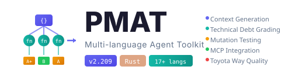

# PMAT

<div align="center">
  

  <p><strong>Zero-configuration AI context generation for any codebase</strong></p>

[](https://crates.io/crates/pmat)
[](https://docs.rs/pmat)
[](https://github.com/paiml/paiml-mcp-agent-toolkit)
[](https://github.com/paiml/paiml-mcp-agent-toolkit)
[](LICENSE)
[](https://www.rust-lang.org)

[Getting Started](#getting-started) | [Features](#features) | [Examples](#examples) | [Documentation](https://paiml.github.io/pmat-book/)

</div>

---

## What is PMAT?

**PMAT** (Pragmatic Multi-language Agent Toolkit) provides everything needed to analyze code quality and generate AI-ready context:

- **Context Generation** - Deep analysis for Claude, GPT, and other LLMs
- **Technical Debt Grading** - A+ through F scoring with 6 orthogonal metrics
- **Mutation Testing** - Test suite quality validation (85%+ kill rate)
- **Repository Scoring** - Quantitative health assessment (0-211 scale)
- **Semantic Search** - Natural language code discovery
- **MCP Integration** - 19 tools for Claude Code, Cline, and AI agents
- **Quality Gates** - Pre-commit hooks, CI/CD integration
- **17+ Languages** - Rust, TypeScript, Python, Go, Java, C/C++, and more

Part of the [PAIML Stack](https://github.com/paiml), following Toyota Way quality principles (Jidoka, Genchi Genbutsu, Kaizen).

## Getting Started

Add to your system:

```bash
# Install from crates.io
cargo install pmat

# Or from source (latest)
git clone https://github.com/paiml/paiml-mcp-agent-toolkit
cd paiml-mcp-agent-toolkit && cargo install --path server
```

### Basic Usage

```bash
# Generate AI-ready context
pmat context --output context.md --format llm-optimized

# Analyze code complexity
pmat analyze complexity

# Grade technical debt (A+ through F)
pmat analyze tdg

# Score repository health
pmat repo-score .

# Run mutation testing
pmat mutate --target src/
```

### MCP Server Mode

```bash
# Start MCP server for Claude Code, Cline, etc.
pmat mcp
```

## Features

### Context Generation

Generate comprehensive context for AI assistants:

```bash
pmat context                           # Basic analysis
pmat context --format llm-optimized    # AI-optimized output
pmat context --include-tests           # Include test files
```

### Technical Debt Grading (TDG)

Six orthogonal metrics for accurate quality assessment:

```bash
pmat analyze tdg                       # Project-wide grade
pmat analyze tdg --include-components  # Per-component breakdown
pmat tdg baseline create               # Create quality baseline
pmat tdg check-regression              # Detect quality degradation
```

**Grading Scale:**
- **A+/A**: Excellent quality, minimal debt
- **B+/B**: Good quality, manageable debt
- **C+/C**: Needs improvement
- **D/F**: Significant technical debt

### Mutation Testing

Validate test suite effectiveness:

```bash
pmat mutate --target src/lib.rs        # Single file
pmat mutate --target src/ --threshold 85  # Quality gate
pmat mutate --failures-only            # CI optimization
```

**Supported Languages:** Rust, Python, TypeScript, JavaScript, Go, C++

### Repository Health Scoring

Evidence-based quality metrics (0-211 scale):

```bash
pmat rust-project-score                # Fast mode (~3 min)
pmat rust-project-score --full         # Comprehensive (~10-15 min)
pmat repo-score . --deep               # Full git history
```

### Workflow Prompts

Pre-configured AI prompts enforcing EXTREME TDD:

```bash
pmat prompt --list                     # Available prompts
pmat prompt code-coverage              # 85%+ coverage enforcement
pmat prompt debug                      # Five Whys analysis
pmat prompt quality-enforcement        # All quality gates
```

### Git Hooks

Automatic quality enforcement:

```bash
pmat hooks install                     # Install pre-commit hooks
pmat hooks install --tdg-enforcement   # With TDG quality gates
pmat hooks status                      # Check hook status
```

## Examples

### Generate Context for AI

```bash
# For Claude Code
pmat context --output context.md --format llm-optimized

# With semantic search
pmat embed sync ./src
pmat semantic search "error handling patterns"
```

### CI/CD Integration

```yaml
# .github/workflows/quality.yml
name: Quality Gates
on: [push, pull_request]

jobs:
  quality:
    runs-on: ubuntu-latest
    steps:
      - uses: actions/checkout@v4
      - run: cargo install pmat
      - run: pmat analyze tdg --fail-on-violation --min-grade B
      - run: pmat mutate --target src/ --threshold 80
```

### Quality Baseline Workflow

```bash
# 1. Create baseline
pmat tdg baseline create --output .pmat/baseline.json

# 2. Check for regressions
pmat tdg check-regression \
  --baseline .pmat/baseline.json \
  --max-score-drop 5.0 \
  --fail-on-regression
```

## Architecture

```
pmat/
├── server/           CLI and MCP server
│   ├── src/
│   │   ├── cli/      Command handlers
│   │   ├── services/ Analysis engines
│   │   ├── mcp/      MCP protocol
│   │   └── tdg/      Technical Debt Grading
├── crates/
│   └── pmat-dashboard/  Pure WASM dashboard
└── docs/
    └── specifications/  Technical specs
```

## Quality

| Metric | Value |
|--------|-------|
| Tests | 2500+ passing |
| Coverage | >85% |
| Mutation Score | >80% |
| Languages | 17+ supported |
| MCP Tools | 19 available |

## PAIML Stack

| Library | Purpose | Version |
|---------|---------|---------|
| [trueno](https://crates.io/crates/trueno) | SIMD tensor operations | 0.7.3 |
| [entrenar](https://crates.io/crates/entrenar) | Training & optimization | 0.2.3 |
| [aprender](https://crates.io/crates/aprender) | ML algorithms | 0.14.0 |
| [realizar](https://crates.io/crates/realizar) | GGUF inference | 0.2.1 |
| **pmat** | Code analysis toolkit | 2.209.0 |

## Documentation

- [PMAT Book](https://paiml.github.io/pmat-book/) - Complete guide
- [API Reference](https://docs.rs/pmat) - Rust API docs
- [MCP Tools](docs/mcp/TOOLS.md) - MCP integration guide
- [Specifications](docs/specifications/) - Technical specs

## License

MIT License - see [LICENSE](LICENSE) for details.

---

<div align="center">
  <sub>Built with Extreme TDD | Part of <a href="https://github.com/paiml">PAIML</a></sub>
</div>
