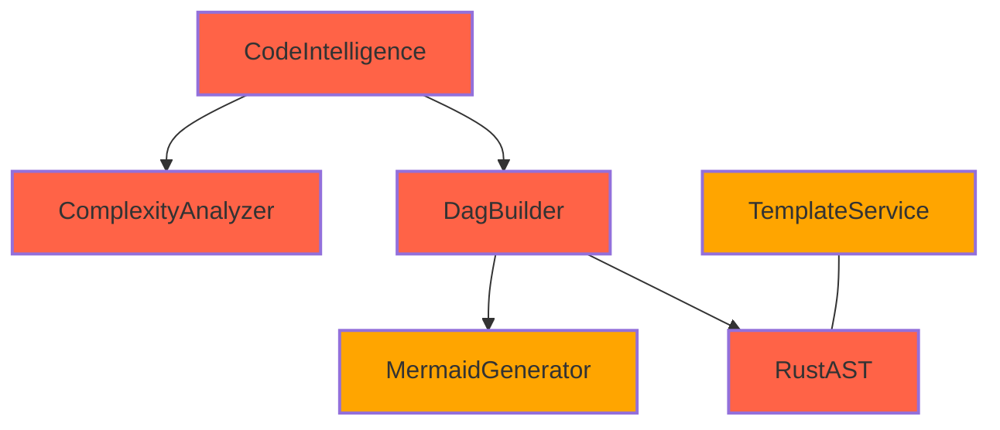

# Mermaid Diagram Artifacts

This directory contains test-maintained Mermaid diagram examples demonstrating the capabilities of the PAIML MCP Agent Toolkit.

## Directory Structure

```
mermaid/
├── non-code/          # Hand-crafted architectural diagrams
│   ├── simple/       # Without styling
│   └── styled/       # With complexity indicators
└── ast-generated/     # Generated from codebase analysis
    ├── simple/       # Basic structure
    └── styled/       # With metrics
```

## Non-Code Simple Diagrams

### architecture-overview.mmd

Simple 5-component system architecture


**Metrics:**
- Nodes: 5
- Edges: 4
- Max depth: 1

## Non-Code Styled Diagrams

### workflow-styled.mmd

Request processing workflow with complexity styling


**Metrics:**
- Nodes: 6
- Edges: 6
- Max depth: 1
- Styling: ✓ Complexity indicators

## AST-Generated Simple Diagrams

### codebase-modules.mmd

Top-level module structure from AST analysis


**Metrics:**
- Nodes: 6
- Edges: 5
- Max depth: 1

## AST-Generated Styled Diagrams

### service-interactions.mmd

Core service interactions with complexity indicators



**Metrics:**
- Nodes: 6
- Edges: 5
- Max depth: 1
- Styling: ✓ Complexity indicators

## Validation Status

All diagrams are automatically validated for:
- ✓ Correct Mermaid syntax
- ✓ Node count ≤ 15
- ✓ Proper labeling (no empty nodes)
- ✓ Category-appropriate styling

Last validated: 2025-06-09 03:55:31 UTC
