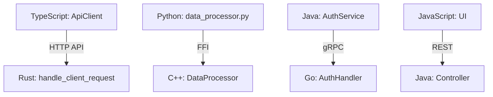

# Cross-Language Analysis

## Overview

PMAT's Cross-Language Analysis system enables code understanding across language boundaries. This powerful capability allows PMAT to analyze relationships between components written in different programming languages, detect cross-language dependencies, and provide a unified view of polyglot codebases.

## Key Capabilities

- **Unified AST Representation**: Common node structure across all supported languages
- **Cross-Language Dependency Detection**: Find relationships between components in different languages
- **Polyglot Codebase Analysis**: Analyze mixed-language repositories as a single coherent system
- **Language Boundary Detection**: Identify interface points between language ecosystems
- **Architecture Pattern Recognition**: Detect common patterns across language boundaries

## Architecture

The cross-language analysis system is built on several key components:

### 1. Polyglot AST Framework

The core of cross-language analysis is the Polyglot AST framework, which provides:

- **NodeKind Enum**: A unified type system for code elements across languages
- **UnifiedNode**: A language-agnostic representation of code elements
- **Language Mappers**: Translators that convert language-specific ASTs to unified nodes

### 2. Language Mappers

Each supported language has a dedicated mapper that:

- Converts language-specific syntax trees to unified nodes
- Preserves language-specific details while mapping to common concepts
- Maintains consistent naming conventions across languages

### 3. Cross-Language Graph

The system builds a unified dependency graph that:

- Connects nodes across language boundaries
- Preserves the semantics of cross-language relationships
- Supports traversal and analysis of the entire codebase

## Supported Cross-Language Scenarios

PMAT can analyze many common cross-language integration patterns:

1. **JavaScript/TypeScript + Backend Languages**
   - Frontend/Backend separation with API boundaries
   - Node.js modules with native extensions (C/C++/Rust)

2. **JVM Ecosystem Integration**
   - Java + Kotlin + Scala interoperability
   - Java Native Interface (JNI) connections to C/C++

3. **Polyglot Microservices**
   - Services in different languages communicating via protocols
   - API gateway patterns with multiple backend languages

4. **System Programming + Scripting**
   - C/C++/Rust core libraries with Python/Ruby bindings
   - Embedded scripting in compiled applications

## Usage

### Command Line

```bash
# Analyze cross-language dependencies in a project
pmat analyze cross-language --path /path/to/project

# Generate cross-language graph visualization
pmat analyze cross-language --path /path/to/project --output graph.svg

# Find cross-language interface points
pmat analyze cross-language --path /path/to/project --mode interfaces
```

### MCP Tools

PMAT provides several MCP tools for cross-language analysis:

- `analyze_cross_language_dependencies`: Find dependencies across language boundaries
- `analyze_cross_language_interfaces`: Identify interface points between languages
- `visualize_cross_language_graph`: Generate visualization of cross-language dependencies

## Example Outputs

### Cross-Language Dependency Report

```json
{
  "interfaces": [
    {
      "source": {
        "language": "TypeScript",
        "file": "frontend/api/client.ts",
        "node": "class ApiClient"
      },
      "target": {
        "language": "Rust",
        "file": "backend/src/api/routes.rs",
        "node": "fn handle_client_request"
      },
      "type": "HTTP_API",
      "confidence": 0.92
    }
  ],
  "dependencies": [
    {
      "source_language": "TypeScript",
      "target_language": "Rust",
      "count": 24,
      "interface_types": ["HTTP_API", "GraphQL", "WebSocket"]
    }
  ]
}
```

### Cross-Language Graph



## Feature Flags

PMAT uses Rust's feature flag system to customize language support. See [Polyglot AST Feature Flags](./polyglot-ast-feature-flags.md) for details on how to enable or disable specific language support.

## Related Documentation

- [Polyglot AST Feature Flags](./polyglot-ast-feature-flags.md)
- [Architecture Decisions](./architecture/decisions/ADR-001-uniform-contracts-system.md)
- [MCP Integration for Polyglot Analysis](./mcp/polyglot-tools.md)