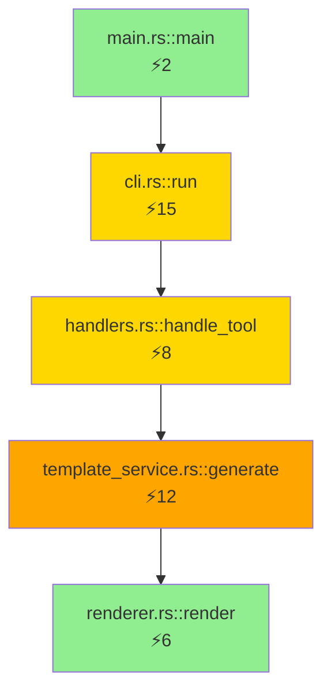

# DAG Generation Specification

## Overview

This specification describes how to extend the PAIML MCP Agent Toolkit's existing AST parsing capabilities to generate Mermaid dependency graphs.

## Architecture

```
┌─────────────┐     ┌──────────────┐     ┌─────────────┐     ┌──────────────┐
│ Source Code │ --> │ AST Parser   │ --> │ DAG Builder │ --> │ Mermaid Gen  │
└─────────────┘     └──────────────┘     └─────────────┘     └──────────────┘
                    (existing code)       (new layer)         (new formatter)
```

## Implementation Plan

### 1. Extend AST Models

Add relationship tracking to `services/context.rs`:

```rust
#[derive(Debug, Clone)]
pub struct DependencyGraph {
    pub nodes: HashMap<String, NodeInfo>,
    pub edges: Vec<Edge>,
}

#[derive(Debug, Clone)]
pub struct NodeInfo {
    pub id: String,
    pub label: String,
    pub node_type: NodeType,
    pub file_path: String,
    pub line_number: usize,
    pub complexity: u32,
}

#[derive(Debug, Clone)]
pub struct Edge {
    pub from: String,
    pub to: String,
    pub edge_type: EdgeType,
    pub weight: u32,
}

#[derive(Debug, Clone)]
pub enum NodeType {
    Function,
    Class,
    Module,
    Trait,
    Interface,
}

#[derive(Debug, Clone)]
pub enum EdgeType {
    Calls,
    Imports,
    Inherits,
    Implements,
    Uses,
}
```

### 2. Enhance AST Visitors

#### Rust Visitor Enhancement

Extend `RustVisitor` in `services/context.rs`:

```rust
impl RustVisitor {
    // Track function calls during AST traversal
    fn visit_expr_call(&mut self, expr: &ExprCall) {
        if let Expr::Path(path) = &*expr.func {
            let caller = self.current_function.clone();
            let callee = path.path.segments.last()
                .map(|s| s.ident.to_string());
            
            if let (Some(from), Some(to)) = (caller, callee) {
                self.edges.push(Edge {
                    from,
                    to,
                    edge_type: EdgeType::Calls,
                    weight: 1,
                });
            }
        }
        visit::visit_expr_call(self, expr);
    }
}
```

#### TypeScript Visitor Enhancement

Extend `TypeScriptVisitor` in `services/ast_typescript.rs`:

```rust
// Track import relationships
fn visit_import_decl(&mut self, import: &ImportDecl) {
    let from_module = self.current_module.clone();
    let to_module = import.src.value.to_string();
    
    self.edges.push(Edge {
        from: from_module,
        to: to_module,
        edge_type: EdgeType::Imports,
        weight: 1,
    });
}
```

#### Python Visitor Enhancement

Similar pattern for `services/ast_python.rs`:

```rust
// Track class inheritance
fn analyze_class_def(&mut self, class: &ast::StmtClassDef) {
    for base in &class.bases {
        if let ast::Expr::Name(name) = base {
            self.edges.push(Edge {
                from: class.name.to_string(),
                to: name.id.to_string(),
                edge_type: EdgeType::Inherits,
                weight: 1,
            });
        }
    }
}
```

### 3. DAG Builder Service

Create `services/dag_builder.rs`:

```rust
pub struct DagBuilder {
    graph: DependencyGraph,
}

impl DagBuilder {
    pub fn new() -> Self {
        Self {
            graph: DependencyGraph {
                nodes: HashMap::new(),
                edges: Vec::new(),
            }
        }
    }

    pub fn build_from_project(project: &ProjectContext) -> DependencyGraph {
        let mut builder = Self::new();
        
        for file in &project.files {
            builder.process_file_context(file);
        }
        
        builder.graph
    }

    fn process_file_context(&mut self, file: &FileContext) {
        for item in &file.ast_items {
            match item {
                AstItem::Function { name, line, .. } => {
                    self.add_node(NodeInfo {
                        id: format!("{}::{}", file.path, name),
                        label: name.clone(),
                        node_type: NodeType::Function,
                        file_path: file.path.clone(),
                        line_number: *line,
                        complexity: self.calculate_complexity(item),
                    });
                }
                // Handle other AST items...
            }
        }
    }
}
```

### 4. Mermaid Generator

Create `services/mermaid_generator.rs`:

```rust
pub struct MermaidGenerator {
    options: MermaidOptions,
}

#[derive(Default)]
pub struct MermaidOptions {
    pub max_depth: Option<usize>,
    pub filter_external: bool,
    pub group_by_module: bool,
    pub show_complexity: bool,
}

impl MermaidGenerator {
    pub fn generate(&self, graph: &DependencyGraph) -> String {
        let mut output = String::from("graph TD\n");
        
        // Generate nodes
        for (id, node) in &graph.nodes {
            let shape = match node.node_type {
                NodeType::Class => "[{}]",
                NodeType::Function => "({})",
                NodeType::Module => "{{{}}}",
                NodeType::Trait => "[/{}\\]",
                NodeType::Interface => "[\\{}/]",
            };
            
            let label = if self.options.show_complexity {
                format!("{}<br/>⚡{}", node.label, node.complexity)
            } else {
                node.label.clone()
            };
            
            writeln!(output, "    {} {}", 
                self.sanitize_id(id), 
                shape.replace("{}", &label)
            );
        }
        
        // Generate edges
        for edge in &graph.edges {
            let arrow = match edge.edge_type {
                EdgeType::Calls => "-->",
                EdgeType::Imports => "-.->",
                EdgeType::Inherits => "==>",
                EdgeType::Implements => "-.->>",
                EdgeType::Uses => "-->",
            };
            
            writeln!(output, "    {} {} {}", 
                self.sanitize_id(&edge.from),
                arrow,
                self.sanitize_id(&edge.to)
            );
        }
        
        output
    }
    
    fn sanitize_id(&self, id: &str) -> String {
        // Replace invalid Mermaid characters
        id.replace("::", "_")
          .replace("/", "_")
          .replace(".", "_")
          .replace("-", "_")
    }
}
```

### 5. CLI Integration

Add to `cli/mod.rs`:

```rust
#[derive(Subcommand)]
pub enum AnalyzeCommands {
    // Existing commands...
    
    Dag {
        #[clap(long, default_value = "call-graph")]
        dag_type: DagType,
        
        #[clap(short, long)]
        output: Option<PathBuf>,
        
        #[clap(long)]
        max_depth: Option<usize>,
        
        #[clap(long)]
        filter_external: bool,
        
        #[clap(long)]
        show_complexity: bool,
    }
}

#[derive(ValueEnum, Clone)]
pub enum DagType {
    CallGraph,
    ImportGraph,
    Inheritance,
    FullDependency,
}
```

### 6. Handler Implementation

In `handlers/tools.rs`, add:

```rust
async fn handle_analyze_dag(
    args: AnalyzeDagArgs,
    _server: Arc<impl TemplateServerTrait>,
) -> McpResponse {
    let project_path = args.project_path.unwrap_or_else(|| PathBuf::from("."));
    
    // Use existing AST analysis
    let project_context = analyze_project(&project_path).await?;
    
    // Build DAG
    let graph = DagBuilder::build_from_project(&project_context);
    
    // Apply filters
    let filtered_graph = match args.dag_type {
        DagType::CallGraph => filter_call_edges(graph),
        DagType::ImportGraph => filter_import_edges(graph),
        DagType::Inheritance => filter_inheritance_edges(graph),
        DagType::FullDependency => graph,
    };
    
    // Generate Mermaid
    let generator = MermaidGenerator {
        options: MermaidOptions {
            max_depth: args.max_depth,
            filter_external: args.filter_external,
            show_complexity: args.show_complexity,
            ..Default::default()
        },
    };
    
    let mermaid_output = generator.generate(&filtered_graph);
    
    McpResponse::success(json!({
        "mermaid": mermaid_output,
        "stats": {
            "nodes": filtered_graph.nodes.len(),
            "edges": filtered_graph.edges.len(),
        }
    }))
}
```

## Usage Examples

### Call Graph
```bash
# Generate function call graph
paiml-mcp-agent-toolkit analyze dag --dag-type call-graph --output call-graph.mmd

# Filter to internal calls only
paiml-mcp-agent-toolkit analyze dag --dag-type call-graph --filter-external

# Show complexity metrics
paiml-mcp-agent-toolkit analyze dag --dag-type call-graph --show-complexity
```

### Import Dependencies
```bash
# Generate import graph with max depth
paiml-mcp-agent-toolkit analyze dag --dag-type import-graph --max-depth 3

# Output for specific language
paiml-mcp-agent-toolkit context rust | paiml-mcp-agent-toolkit analyze dag --dag-type import-graph
```

### Class Hierarchies
```bash
# Generate inheritance diagram
paiml-mcp-agent-toolkit analyze dag --dag-type inheritance --output classes.mmd
```

## Example Output



## Filtering Strategies

### 1. Depth Limiting
- Start from entry points (main, exported functions)
- Traverse up to N levels deep
- Useful for focused analysis

### 2. Module Boundaries
- Filter edges that cross module boundaries
- Group nodes by parent module
- Show inter-module dependencies only

### 3. Complexity Thresholds
- Only show nodes above complexity threshold
- Highlight high-complexity paths
- Useful for refactoring targets

### 4. Dead Code Detection
- Identify nodes with no incoming edges
- Find unreachable functions
- Highlight for removal

## Performance Considerations

1. **Incremental Analysis**: Cache AST results per file
2. **Parallel Processing**: Analyze files concurrently
3. **Graph Pruning**: Remove trivial nodes early
4. **Memory Efficiency**: Use references where possible

## Future Extensions

1. **Interactive HTML**: Export to D3.js for interactive exploration
2. **Diff Visualization**: Show changes between versions
3. **Metrics Overlay**: Add performance/coverage data
4. **IDE Integration**: VS Code extension for live updates
5. **CI Integration**: Fail builds on circular dependencies