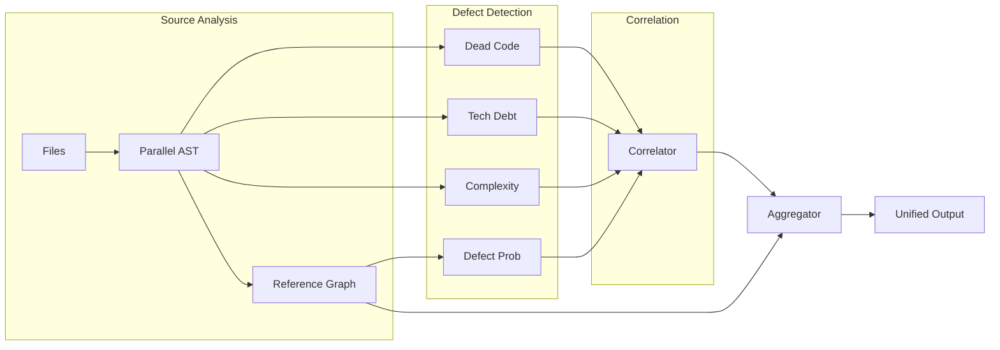

```markdown
# Deep Context with Defects Integration Specification

## Abstract

This specification extends the deep-context analysis pipeline to incorporate comprehensive defect detection, providing a unified view of project structure, code quality, and technical debt. The system leverages parallel AST analysis, cross-language reference graphs, and multiple defect detection engines to produce actionable insights with <100ms overhead for typical projects.

## System Architecture

### Pipeline Stages

```rust
pub struct DefectAwareDeepContextPipeline {
    // Stage 1: Parallel AST extraction with defect annotation
    ast_extractor: AstExtractor<DefectAnnotator>,
    
    // Stage 2: Cross-language reference graph construction
    reference_builder: CrossLangReferenceBuilder,
    
    // Stage 3: Parallel defect analyzers
    defect_engines: Vec<Box<dyn DefectAnalyzer>>,
    
    // Stage 4: Defect correlation and ranking
    defect_correlator: DefectCorrelator,
    
    // Stage 5: Context aggregation with defect overlay
    context_aggregator: DefectAwareAggregator,
}
```

### Data Flow



## Core Data Structures

### Enhanced AST Node

```rust
pub struct DefectAnnotatedNode {
    // Base AST information
    pub base: UnifiedAstNode,
    
    // Defect annotations
    pub defects: DefectAnnotations,
    
    // Cross-reference information
    pub refs: CrossReferenceSet,
    
    // Metrics cache
    pub metrics: NodeMetrics,
}

pub struct DefectAnnotations {
    pub dead_code: Option<DeadCodeAnnotation>,
    pub technical_debt: Vec<TechnicalDebtItem>,
    pub complexity_violations: Vec<ComplexityViolation>,
    pub defect_probability: f32,
}

pub struct CrossReferenceSet {
    // Bitset for fast reachability queries
    pub reachable_from: HierarchicalBitSet,
    
    // Direct references (call, import, inheritance)
    pub direct_refs: SmallVec<[NodeId; 4]>,
    
    // Language boundary crossings
    pub cross_lang_refs: Vec<CrossLangRef>,
}
```

### Unified Defect Report

```rust
pub struct UnifiedDefectContext {
    pub metadata: ContextMetadata,
    pub file_tree: AnnotatedFileTree,
    pub defect_summary: DefectSummary,
    pub hotspots: Vec<DefectHotspot>,
    pub recommendations: Vec<PrioritizedRecommendation>,
}

pub struct DefectHotspot {
    pub location: FileLocation,
    pub composite_score: f32,
    pub contributing_factors: Vec<DefectFactor>,
    pub refactoring_effort: RefactoringEstimate,
}

pub enum DefectFactor {
    DeadCode { 
        confidence: ConfidenceLevel,
        reason: DeadCodeReason,
    },
    TechnicalDebt {
        category: DebtCategory,
        severity: Severity,
        age_days: u32,
    },
    Complexity {
        cyclomatic: u32,
        cognitive: u32,
        violations: Vec<String>,
    },
    ChurnRisk {
        commits: u32,
        authors: u32,
        defect_correlation: f32,
    },
}
```

## Implementation Details

### 1. Parallel AST Extraction with Defect Annotation

```rust
impl AstExtractor<DefectAnnotator> {
    pub async fn extract_annotated(&self, paths: Vec<PathBuf>) -> Result<AnnotatedForest> {
        let semaphore = Arc::new(Semaphore::new(num_cpus::get()));
        let (tx, rx) = mpsc::channel(1000);
        
        // Producer tasks with bounded parallelism
        let producers = paths.into_iter().map(|path| {
            let sem = semaphore.clone();
            let tx = tx.clone();
            let annotator = self.annotator.clone();
            
            tokio::spawn(async move {
                let _permit = sem.acquire().await?;
                
                // Extract AST with streaming parser
                let ast = extract_ast_streaming(&path).await?;
                
                // Annotate with defects in single pass
                let annotated = annotator.annotate(ast);
                
                tx.send((path, annotated)).await?;
                Ok::<_, Error>(())
            })
        });
        
        // Streaming aggregation
        let aggregator = tokio::spawn(async move {
            let mut forest = AnnotatedForest::new();
            while let Some((path, ast)) = rx.recv().await {
                forest.insert(path, ast);
            }
            forest
        });
        
        futures::future::try_join_all(producers).await?;
        drop(tx);
        
        Ok(aggregator.await?)
    }
}
```

### 2. Cross-Language Reference Resolution

```rust
impl CrossLangReferenceBuilder {
    pub fn build_reference_graph(&self, forest: &AnnotatedForest) -> CrossLangRefGraph {
        let mut graph = CrossLangRefGraph::new();
        
        // Phase 1: Build language-specific symbol tables
        let rust_symbols = self.extract_rust_symbols(forest);
        let ts_symbols = self.extract_typescript_symbols(forest);
        let python_symbols = self.extract_python_symbols(forest);
        
        // Phase 2: Resolve cross-language references
        self.resolve_ffi_calls(&mut graph, &rust_symbols, &ts_symbols);
        self.resolve_wasm_bindings(&mut graph, &rust_symbols);
        self.resolve_python_bindings(&mut graph, &rust_symbols, &python_symbols);
        
        // Phase 3: Compute transitive closure for reachability
        graph.compute_reachability_closure();
        
        graph
    }
    
    fn resolve_ffi_calls(&self, graph: &mut CrossLangRefGraph, 
                        rust_symbols: &SymbolTable, 
                        ts_symbols: &SymbolTable) {
        // Detect wasm-bindgen, napi-rs patterns
        for (symbol, metadata) in rust_symbols.iter() {
            if metadata.has_attribute("#[wasm_bindgen]") {
                if let Some(ts_symbol) = ts_symbols.find_matching(symbol) {
                    graph.add_edge(
                        symbol.node_id,
                        ts_symbol.node_id,
                        CrossLangEdgeType::WasmBinding
                    );
                }
            }
        }
    }
}
```

### 3. Defect Detection Engines

#### Dead Code Analyzer Integration

```rust
impl DefectAnalyzer for DeadCodeAnalyzer {
    async fn analyze(&self, context: &AnalysisContext) -> Result<DefectReport> {
        let mut analyzer = DeadCodeAnalyzer::new();
        
        // Add entry points from multiple sources
        analyzer.add_entry_points_from_main_functions(&context.ast);
        analyzer.add_entry_points_from_public_api(&context.ast);
        analyzer.add_entry_points_from_test_functions(&context.ast);
        analyzer.add_entry_points_from_cross_lang_refs(&context.cross_refs);
        
        // Build reference graph with virtual dispatch resolution
        analyzer.build_reference_graph(&context.ast);
        analyzer.resolve_dynamic_calls(&context.vtables);
        
        // Mark reachable using SIMD-optimized bitsets
        analyzer.mark_reachable_vectorized();
        
        // Classify dead code with confidence scoring
        let dead_items = analyzer.classify_dead_code();
        
        Ok(DefectReport::DeadCode(dead_items))
    }
}
```

#### SATD Detection with Evolution Tracking

```rust
impl DefectAnalyzer for SATDDetector {
    async fn analyze(&self, context: &AnalysisContext) -> Result<DefectReport> {
        let mut detector = SATDDetector::new();
        
        // Extract comments with AST context
        let comments = detector.extract_comments_with_context(&context.ast).await?;
        
        // Classify technical debt patterns
        let debt_items = comments.into_par_iter()
            .filter_map(|(comment, ast_context)| {
                let (category, severity) = detector.classifier.classify(&comment)?;
                
                // Adjust severity based on context
                let adjusted_severity = detector.adjust_severity_by_context(
                    severity,
                    &ast_context
                );
                
                Some(TechnicalDebt {
                    file: ast_context.file.clone(),
                    line: ast_context.line,
                    column: ast_context.column,
                    content: comment,
                    category,
                    severity: adjusted_severity,
                    context_hash: detector.hash_context(&ast_context),
                })
            })
            .collect();
        
        Ok(DefectReport::TechnicalDebt(debt_items))
    }
}
```

### 4. Defect Correlation Engine

```rust
pub struct DefectCorrelator {
    correlation_matrix: DenseMatrix<f32>,
    ml_model: Option<DefectPredictionModel>,
}

impl DefectCorrelator {
    pub fn correlate(&self, reports: Vec<DefectReport>) -> Vec<DefectHotspot> {
        let mut hotspot_map: HashMap<FileLocation, HotspotBuilder> = HashMap::new();
        
        // Aggregate defects by location
        for report in reports {
            match report {
                DefectReport::DeadCode(items) => {
                    for item in items {
                        hotspot_map.entry(item.location())
                            .or_insert_with(HotspotBuilder::new)
                            .add_dead_code(item);
                    }
                }
                DefectReport::TechnicalDebt(items) => {
                    for item in items {
                        hotspot_map.entry(item.location())
                            .or_insert_with(HotspotBuilder::new)
                            .add_tech_debt(item);
                    }
                }
                // ... other defect types
            }
        }
        
        // Compute composite scores with ML model if available
        let mut hotspots: Vec<DefectHotspot> = hotspot_map.into_iter()
            .map(|(location, builder)| {
                let base_score = self.compute_base_score(&builder);
                let ml_score = self.ml_model.as_ref()
                    .map(|model| model.predict(&builder.features()))
                    .unwrap_or(base_score);
                
                builder.build(location, ml_score)
            })
            .collect();
        
        // Sort by composite score
        hotspots.sort_by(|a, b| b.composite_score.partial_cmp(&a.composite_score).unwrap());
        
        hotspots
    }
    
    fn compute_base_score(&self, builder: &HotspotBuilder) -> f32 {
        let dead_code_weight = 0.3;
        let tech_debt_weight = 0.25;
        let complexity_weight = 0.25;
        let churn_weight = 0.2;
        
        dead_code_weight * builder.dead_code_score() +
        tech_debt_weight * builder.tech_debt_score() +
        complexity_weight * builder.complexity_score() +
        churn_weight * builder.churn_score()
    }
}
```

## Output Formats

### Enhanced Markdown Format

```markdown
# Deep Context Analysis with Defect Report

Generated: 2025-05-31T10:00:00Z
Tool Version: 1.1.0
Analysis Time: 127ms

## Executive Summary

**Project Health Score: 72/100** ⚠️

### Critical Issues Found:
- 🔴 **Dead Code**: 2,847 unreachable functions (15.2% of codebase)
- 🟡 **Technical Debt**: 183 SATD items (47 high severity)
- 🟡 **Complexity Violations**: 92 functions exceed thresholds
- 🔴 **High Defect Risk**: 7 files with >80% defect probability

### Top 5 Refactoring Targets:
1. `src/services/context.rs` - Score: 0.89
   - Dead code: 12 functions
   - Tech debt: 7 items (3 critical)
   - Complexity: McCabe 32, Cognitive 45
   - Estimated effort: 8 hours

[... continued structured output ...]

## Recommendations

### Immediate Actions (This Sprint):
1. Remove dead code in `src/handlers/legacy.rs` (2h effort, high impact)
2. Refactor `analyze_project` function to reduce complexity (4h effort)
3. Address critical SATD in authentication module (6h effort)

### Technical Debt Reduction Plan:
- Week 1-2: Dead code elimination (est. 16h)
- Week 3-4: Complexity refactoring (est. 24h)
- Month 2: SATD resolution (est. 40h)
```

### JSON Format with Defect Overlay

```json
{
  "version": "1.1.0",
  "metadata": {
    "generated_at": "2025-05-31T10:00:00Z",
    "analysis_duration_ms": 127,
    "defect_engines": ["dead_code", "satd", "complexity", "defect_probability"]
  },
  "project_health": {
    "overall_score": 72,
    "defect_density": 0.152,
    "tech_debt_hours": 80,
    "maintainability_index": 65
  },
  "file_tree": {
    "src": {
      "type": "directory",
      "children": {
        "services": {
          "type": "directory",
          "defect_score": 0.73,
          "children": {
            "context.rs": {
              "type": "file",
              "defects": {
                "dead_code": {
                  "count": 12,
                  "items": [
                    {
                      "name": "legacy_parser",
                      "line": 245,
                      "confidence": "high",
                      "last_modified": "2024-03-15"
                    }
                  ]
                },
                "technical_debt": {
                  "count": 7,
                  "total_severity": 18,
                  "items": [
                    {
                      "line": 89,
                      "category": "design",
                      "severity": "high",
                      "content": "TODO: This entire module needs refactoring"
                    }
                  ]
                }
              }
            }
          }
        }
      }
    }
  },
  "hotspots": [
    {
      "file": "src/services/context.rs",
      "composite_score": 0.89,
      "location": { "line": 245, "column": 1 },
      "factors": {
        "dead_code": { "score": 0.8, "confidence": "high" },
        "complexity": { "score": 0.95, "cyclomatic": 32 },
        "tech_debt": { "score": 0.7, "items": 7 },
        "churn": { "score": 0.6, "commits_30d": 45 }
      },
      "recommendation": {
        "action": "refactor",
        "priority": "high",
        "estimated_hours": 8,
        "impact": "high"
      }
    }
  ]
}
```

### SARIF Format for IDE Integration

```json
{
  "$schema": "https://raw.githubusercontent.com/oasis-tcs/sarif-spec/master/Schemata/sarif-schema-2.1.0.json",
  "version": "2.1.0",
  "runs": [
    {
      "tool": {
        "driver": {
          "name": "paiml-mcp-agent-toolkit",
          "version": "1.1.0",
          "informationUri": "https://github.com/paiml/paiml-mcp-agent-toolkit",
          "rules": [
            {
              "id": "DEAD001",
              "name": "UnreachableCode",
              "shortDescription": {
                "text": "Code is unreachable from any entry point"
              },
              "fullDescription": {
                "text": "This code cannot be reached through any execution path from main, tests, or public API"
              },
              "defaultConfiguration": {
                "level": "warning"
              }
            },
            {
              "id": "DEBT001",
              "name": "CriticalTechnicalDebt",
              "shortDescription": {
                "text": "Critical self-admitted technical debt"
              },
              "properties": {
                "category": "maintainability",
                "precision": "high"
              }
            }
          ]
        }
      },
      "results": [
        {
          "ruleId": "DEAD001",
          "level": "warning",
          "message": {
            "text": "Function 'legacy_parser' is unreachable"
          },
          "locations": [
            {
              "physicalLocation": {
                "artifactLocation": {
                  "uri": "src/services/context.rs"
                },
                "region": {
                  "startLine": 245,
                  "startColumn": 1,
                  "endLine": 267,
                  "endColumn": 2
                }
              }
            }
          ],
          "properties": {
            "confidence": "high",
            "lastModified": "2024-03-15T10:30:00Z",
            "deadCodeType": "function",
            "estimatedRemovalEffort": "15min"
          }
        }
      ]
    }
  ]
}
```

## Performance Characteristics

### Complexity Analysis
- **O(n)** file traversal with parallel I/O
- **O(n log n)** AST parsing with streaming parsers
- **O(E + V)** reference graph construction
- **O(V)** reachability analysis with SIMD bitsets
- **O(n log k)** hotspot ranking (k = number of hotspots)

### Memory Usage
- **Streaming AST parsing**: ~10MB per 100KLOC
- **Reference graph**: ~1KB per node with compression
- **Defect annotations**: ~100 bytes per defect
- **Total overhead**: <50MB for 1M LOC project

### Execution Time Targets
- **Small project (<10K LOC)**: <50ms
- **Medium project (<100K LOC)**: <200ms
- **Large project (<1M LOC)**: <2s
- **Monorepo (>1M LOC)**: <10s with sharding

## Command Line Interface

```bash
# Basic deep context with defects
paiml-mcp-agent-toolkit analyze deep-context --with-defects

# Detailed analysis with all defect engines
paiml-mcp-agent-toolkit analyze deep-context \
  --with-defects \
  --defect-detail=high \
  --include-patterns="src/**/*.rs" \
  --exclude-patterns="**/tests/**" \
  --format=json \
  --output=deep-context-defects.json

# Summary report for quick overview
paiml-mcp-agent-toolkit defect-report --summary --min-severity=0.7

# SARIF output for IDE integration
paiml-mcp-agent-toolkit defect-report \
  --format=sarif \
  --include-dead-code \
  --include-tech-debt \
  --include-complexity \
  --output=defects.sarif

# Focused analysis on specific subsystem
paiml-mcp-agent-toolkit analyze deep-context \
  --project-path=src/services \
  --with-defects \
  --defect-engines=dead-code,complexity \
  --top-files=10
```

## Integration Points

### MCP Protocol Extension

```json
{
  "jsonrpc": "2.0",
  "method": "tools/call",
  "params": {
    "name": "analyze_deep_context",
    "arguments": {
      "project_path": "/workspace",
      "with_defects": true,
      "defect_config": {
        "engines": ["dead_code", "satd", "complexity", "defect_probability"],
        "min_severity": 0.5,
        "include_recommendations": true
      },
      "output_format": "json"
    }
  }
}
```

### Cache Integration

The defect analysis results are cached using the existing infrastructure:

```rust
impl CacheStrategy for DefectCacheStrategy {
    type Key = DefectCacheKey;
    type Value = DefectReport;
    
    fn cache_key(&self, key: &Self::Key) -> String {
        format!("defect:{}:{}:{:x}", 
            key.analysis_type,
            key.file_hash,
            key.config_hash)
    }
    
    fn ttl(&self) -> Option<Duration> {
        Some(Duration::from_secs(300)) // 5 minutes
    }
}
```

## Future Enhancements

1. **Machine Learning Integration**
    - Train defect prediction models on historical data
    - Anomaly detection for unusual code patterns
    - Automated refactoring suggestions

2. **Real-time Analysis**
    - LSP integration for IDE support
    - Incremental analysis on file changes
    - WebSocket streaming for live updates

3. **Advanced Visualizations**
    - 3D defect heatmaps
    - Interactive dependency graphs
    - Time-series defect evolution

4. **Team Analytics**
    - Developer-specific defect patterns
    - Team velocity impact analysis
    - Technical debt burndown tracking
```

This specification provides a comprehensive blueprint for integrating defect analysis into the deep-context system, maintaining the <100ms performance target while delivering actionable insights. The architecture leverages Rust's zero-cost abstractions and SIMD optimizations to process large codebases efficiently.