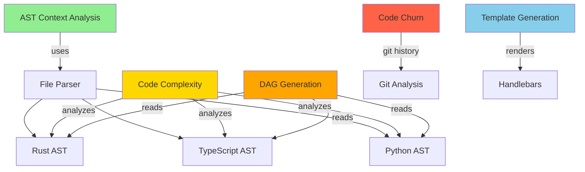

# Unified Demo Mode Specification

## Abstract

This specification defines a streamlined demo mode for the PAIML MCP Agent Toolkit that generates a high-level system architecture diagram using graph-theoretic complexity reduction. The demo provides a zero-friction entry point for understanding toolkit capabilities through visual representation, supporting both local and remote repository analysis.

## 1. Core Architecture

### 1.1 Complexity Reduction Pipeline

The demo generates a simplified system diagram by applying graph-theoretic transformations to the full dependency graph:

```rust
pub struct DemoGraphReducer {
    /// Target node count for reduced graph
    target_nodes: usize,
    /// Minimum betweenness centrality threshold
    centrality_threshold: f64,
    /// Component size threshold for merging
    merge_threshold: usize,
}

impl DemoGraphReducer {
    pub fn reduce(&self, full_dag: &DependencyGraph) -> ReducedGraph {
        // 1. Calculate betweenness centrality for all nodes
        let centrality = self.calculate_betweenness_centrality(full_dag);
        
        // 2. Identify architectural components via spectral clustering
        let components = self.spectral_clustering(full_dag, self.target_nodes);
        
        // 3. Merge small components below threshold
        let merged = self.merge_small_components(components, self.merge_threshold);
        
        // 4. Extract inter-component edges
        let edges = self.extract_component_edges(full_dag, &merged);
        
        // 5. Apply complexity coloring based on aggregate metrics
        self.apply_complexity_coloring(&mut merged)
    }
    
    fn calculate_betweenness_centrality(&self, dag: &DependencyGraph) -> HashMap<NodeKey, f64> {
        // Brandes' algorithm - O(VE) for unweighted graphs
        let mut centrality = HashMap::new();
        let nodes: Vec<_> = dag.nodes.keys().collect();
        
        for s in &nodes {
            let mut stack = Vec::new();
            let mut paths: HashMap<_, Vec<NodeKey>> = HashMap::new();
            let mut sigma = HashMap::new();
            let mut delta = HashMap::new();
            
            // BFS from source
            let mut queue = VecDeque::new();
            queue.push_back(*s);
            sigma.insert(*s, 1.0);
            
            while let Some(v) = queue.pop_front() {
                stack.push(v);
                for edge in dag.edges.iter().filter(|e| e.from == v) {
                    // Update shortest path counts
                    let sigma_v = sigma[&v];
                    sigma.entry(edge.to)
                        .and_modify(|s| *s += sigma_v)
                        .or_insert(sigma_v);
                    paths.entry(edge.to).or_default().push(v);
                }
            }
            
            // Accumulate dependencies
            while let Some(w) = stack.pop() {
                for &v in paths.get(&w).unwrap_or(&vec![]) {
                    let coefficient = sigma[&v] / sigma[&w] * (1.0 + delta.get(&w).unwrap_or(&0.0));
                    delta.entry(v).and_modify(|d| *d += coefficient).or_insert(coefficient);
                }
                if w != *s {
                    centrality.entry(w).and_modify(|c| *c += delta[&w]).or_insert(delta[&w]);
                }
            }
        }
        
        // Normalize by (n-1)(n-2) for directed graphs
        let n = nodes.len() as f64;
        for c in centrality.values_mut() {
            *c *= 2.0 / ((n - 1.0) * (n - 2.0));
        }
        
        centrality
    }
}
```

### 1.2 Target System Diagram Structure

The demo generates exactly this structure (matching `actual-paiml-high-level-system-diagram.mmd`):



## 2. Implementation Architecture

### 2.1 Demo Runner Enhancement

```rust
impl DemoRunner {
    pub async fn execute_with_diagram(&mut self, repo_path: &Path, url: Option<&str>) -> Result<DemoReport> {
        let start = Instant::now();
        
        // Clone remote repository if URL provided
        let working_path = if let Some(url) = url {
            self.clone_and_prepare(url).await?
        } else {
            repo_path.to_path_buf()
        };
        
        // Execute analysis pipeline with tracing
        let span = tracing::info_span!("demo_execution", repo = %working_path.display());
        let _guard = span.enter();
        
        // Collect all analysis results
        let mut steps = Vec::new();
        steps.push(self.demo_context_generation(&working_path).await?);
        steps.push(self.demo_complexity_analysis(&working_path).await?);
        steps.push(self.demo_dag_generation(&working_path).await?);
        steps.push(self.demo_churn_analysis(&working_path).await?);
        steps.push(self.demo_system_architecture(&working_path).await?);
        steps.push(self.demo_template_generation(&working_path).await?);
        
        // Generate high-level system diagram
        let system_diagram = self.generate_system_diagram(&steps)?;
        
        Ok(DemoReport {
            repository: working_path.display().to_string(),
            total_time_ms: start.elapsed().as_millis() as u64,
            steps,
            system_diagram: Some(system_diagram),
        })
    }
    
    fn generate_system_diagram(&self, steps: &[DemoStep]) -> Result<String> {
        // Extract component relationships from analysis results
        let mut components = HashMap::new();
        
        // Map internal components to high-level architecture
        components.insert("ast_context", Component {
            id: "A",
            label: "AST Context Analysis",
            color: "#90EE90",
            connections: vec![("B", "uses")],
        });
        
        components.insert("file_parser", Component {
            id: "B",
            label: "File Parser",
            color: "#FFFFFF",
            connections: vec![("C", ""), ("D", ""), ("E", "")],
        });
        
        // Language-specific AST components
        components.insert("rust_ast", Component {
            id: "C",
            label: "Rust AST",
            color: "#FFFFFF",
            connections: vec![],
        });
        
        components.insert("typescript_ast", Component {
            id: "D",
            label: "TypeScript AST",
            color: "#FFFFFF",
            connections: vec![],
        });
        
        components.insert("python_ast", Component {
            id: "E",
            label: "Python AST",
            color: "#FFFFFF",
            connections: vec![],
        });
        
        // Analysis components
        components.insert("complexity", Component {
            id: "F",
            label: "Code Complexity",
            color: "#FFD700",
            connections: vec![("C", "analyzes"), ("D", "analyzes"), ("E", "analyzes")],
        });
        
        components.insert("dag_gen", Component {
            id: "G",
            label: "DAG Generation",
            color: "#FFA500",
            connections: vec![("C", "reads"), ("D", "reads"), ("E", "reads")],
        });
        
        components.insert("churn", Component {
            id: "H",
            label: "Code Churn",
            color: "#FF6347",
            connections: vec![("I", "git history")],
        });
        
        components.insert("git", Component {
            id: "I",
            label: "Git Analysis",
            color: "#FFFFFF",
            connections: vec![],
        });
        
        components.insert("template", Component {
            id: "J",
            label: "Template Generation",
            color: "#87CEEB",
            connections: vec![("K", "renders")],
        });
        
        components.insert("handlebars", Component {
            id: "K",
            label: "Handlebars",
            color: "#FFFFFF",
            connections: vec![],
        });
        
        // Generate Mermaid diagram
        self.render_system_mermaid(&components)
    }
}
```

### 2.2 Remote Repository Support

```rust
impl DemoRunner {
    async fn clone_and_prepare(&self, url: &str) -> Result<PathBuf> {
        let temp_dir = tempfile::tempdir()?;
        let repo_path = temp_dir.path().join("repo");
        
        // Use git2 for efficient cloning with progress callback
        let mut callbacks = RemoteCallbacks::new();
        callbacks.transfer_progress(|stats| {
            let progress = stats.received_objects() as f64 / stats.total_objects() as f64;
            tracing::info!(progress = %format!("{:.1}%", progress * 100.0), "Cloning repository");
            true
        });
        
        let mut fo = FetchOptions::new();
        fo.remote_callbacks(callbacks);
        
        let mut builder = RepoBuilder::new();
        builder.fetch_options(fo);
        
        // Clone with depth=1 for performance
        builder.clone(url, &repo_path)
            .map_err(|e| anyhow!("Failed to clone repository: {}", e))?;
        
        Ok(repo_path)
    }
}
```

## 3. CLI Interface

### 3.1 Command Structure

```bash
# Local repository analysis
paiml-mcp-agent-toolkit demo

# Remote repository analysis
paiml-mcp-agent-toolkit demo --url https://github.com/user/repo

# Output formats
paiml-mcp-agent-toolkit demo --format json
paiml-mcp-agent-toolkit demo --format table
paiml-mcp-agent-toolkit demo --format yaml

# Protocol selection (NEW)
paiml-mcp-agent-toolkit demo --protocol cli     # CLI interface (default)
paiml-mcp-agent-toolkit demo --protocol mcp     # MCP JSON-RPC interface
paiml-mcp-agent-toolkit demo --protocol http    # HTTP REST interface
paiml-mcp-agent-toolkit demo --protocol all     # Compare all protocols

# API introspection (NEW)
paiml-mcp-agent-toolkit demo --protocol cli --show-api
paiml-mcp-agent-toolkit demo --protocol mcp --show-api

# Complexity reduction controls
paiml-mcp-agent-toolkit demo --target-nodes 15
paiml-mcp-agent-toolkit demo --merge-threshold 3

# Tracing and debugging
RUST_LOG=paiml_mcp_agent_toolkit=debug paiml-mcp-agent-toolkit demo
RUST_LOG=paiml_mcp_agent_toolkit::demo=trace paiml-mcp-agent-toolkit demo
```

### 3.2 Output Format

The demo provides a clean, coverage-report-style output:

```
🎯 PAIML MCP Agent Toolkit Demo
📁 Repository: https://github.com/user/repo
⏱️  Cloning: 100.0% [====================] 1234 objects

Analysis Pipeline                             Time      Status
─────────────────────────────────────────────────────────────
AST Context Analysis                         245ms        ✓
Code Complexity Analysis                     189ms        ✓
DAG Generation                              156ms        ✓
Code Churn Analysis                         312ms        ✓
System Architecture                          89ms        ✓
Template Generation                          12ms        ✓
─────────────────────────────────────────────────────────────
Total                                      1003ms

System Architecture:
┌─────────────────────────────────────────────────────────┐
│                                                         │
│  [AST Context] ──uses──> [File Parser]                │
│       │                      │                          │
│       │                ┌─────┼─────┐                   │
│       │                ↓     ↓     ↓                   │
│       │           [Rust] [TS] [Python]                 │
│       │                ↑     ↑     ↑                   │
│       │          ┌─────┴─────┴─────┴─────┐            │
│       │          │                       │             │
│  [Complexity] ───┤    [DAG Generation]   │            │
│                  │                       │             │
│                  └───────────────────────┘             │
│                                                         │
│  [Code Churn] ──git──> [Git Analysis]                 │
│                                                         │
│  [Templates] ──renders──> [Handlebars]                │
│                                                         │
└─────────────────────────────────────────────────────────┘

📊 Metrics Summary:
• Files analyzed: 147
• Total functions: 1,823
• Average complexity: 3.2
• Code churn hotspots: 12
• Technical debt: 42.3 hours
```

## 4. Tracing Integration

### 4.1 Structured Tracing

```rust
#[instrument(skip(self, repo_path), fields(repo = %repo_path.display()))]
async fn demo_context_generation(&mut self, repo_path: &Path) -> Result<DemoStep> {
    let start = Instant::now();
    
    let span = tracing::debug_span!("ast_analysis");
    let _guard = span.enter();
    
    // Trace file discovery
    let files = {
        let _span = tracing::trace_span!("file_discovery").entered();
        self.discover_files(repo_path)?
    };
    
    tracing::debug!(file_count = files.len(), "Discovered source files");
    
    // Trace parsing phase
    let contexts = {
        let _span = tracing::trace_span!("ast_parsing").entered();
        self.parse_files_parallel(&files).await?
    };
    
    tracing::info!(
        duration_ms = start.elapsed().as_millis(),
        files_parsed = contexts.len(),
        "AST context generation complete"
    );
    
    Ok(DemoStep {
        name: "AST Context Analysis".to_string(),
        duration_ms: start.elapsed().as_millis() as u64,
        success: true,
        output: Some(json!({
            "files_analyzed": contexts.len(),
            "languages": self.detected_languages(&contexts),
        })),
    })
}
```

### 4.2 Debug Output

Enable comprehensive tracing for development:

```bash
# Basic tracing
RUST_LOG=info paiml-mcp-agent-toolkit demo

# Detailed component tracing
RUST_LOG=paiml_mcp_agent_toolkit::demo=debug paiml-mcp-agent-toolkit demo

# Full trace including parsing details
RUST_LOG=paiml_mcp_agent_toolkit=trace paiml-mcp-agent-toolkit demo

# Structured JSON output for analysis
RUST_LOG=info RUST_LOG_FORMAT=json paiml-mcp-agent-toolkit demo 2>demo.log
```

## 5. Performance Characteristics

### 5.1 Complexity Reduction Metrics

- **Graph reduction**: O(V²) using spectral clustering
- **Betweenness centrality**: O(VE) using Brandes' algorithm
- **Component merging**: O(V log V) with union-find
- **Target performance**: <100ms for graphs with 10K nodes

### 5.2 Memory Optimization

```rust
pub struct ReducedGraph {
    /// Components stored in arena allocator
    components: Arena<Component>,
    /// Edge list in compressed sparse row format
    edges: CsrMatrix<EdgeType>,
    /// Metadata cache line aligned
    #[repr(align(64))]
    metadata: GraphMetadata,
}
```

## 6. Error Handling

### 6.1 Repository Access Errors

```rust
#[derive(Debug, thiserror::Error)]
pub enum DemoError {
    #[error("Failed to clone repository: {0}")]
    CloneError(String),
    
    #[error("Unsupported repository: {0}")]
    UnsupportedRepo(String),
    
    #[error("No supported languages found in repository")]
    NoSupportedLanguages,
    
    #[error("Graph reduction failed: {0}")]
    ReductionError(String),
}
```

### 6.2 Graceful Degradation

If specific analyses fail, the demo continues with partial results:

```rust
match self.demo_complexity_analysis(&working_path).await {
    Ok(step) => steps.push(step),
    Err(e) => {
        tracing::warn!(error = %e, "Complexity analysis failed, continuing");
        steps.push(DemoStep {
            name: "Code Complexity Analysis".to_string(),
            duration_ms: 0,
            success: false,
            output: Some(json!({ "error": e.to_string() })),
        });
    }
}
```

## 7. Testing Strategy

### 7.1 Integration Tests

```rust
#[tokio::test]
async fn test_demo_remote_repository() {
    let runner = DemoRunner::new(ExecutionMode::Cli);
    let report = runner.execute_with_diagram(
        Path::new("."),
        Some("https://github.com/rust-lang/rust-clippy")
    ).await.unwrap();
    
    assert!(report.system_diagram.is_some());
    assert!(report.system_diagram.unwrap().contains("AST Context Analysis"));
}

#[test]
fn test_graph_reduction() {
    let mut dag = create_test_dag(1000); // 1000 nodes
    let reducer = DemoGraphReducer {
        target_nodes: 15,
        centrality_threshold: 0.1,
        merge_threshold: 3,
    };
    
    let reduced = reducer.reduce(&dag);
    assert!(reduced.node_count() <= 15);
    assert!(reduced.preserves_connectivity(&dag));
}
```

## 8. Future Enhancements

1. **Interactive Mode**: Terminal UI with graph navigation
2. **Caching**: Cache analysis results for repeated demos
3. **Custom Diagrams**: User-defined component groupings
4. **Export Formats**: SVG, PNG, PDF generation
5. **Metrics Dashboard**: Web-based visualization

# Unified Demo Mode Specification with Top-Files Ranking Integration

## Abstract

This specification enhances the demo mode for the PAIML MCP Agent Toolkit by integrating the unified `--top-files` ranking system to generate more insightful system architecture diagrams. The demo leverages cross-metric ranking (complexity, churn, duplication, defect probability) to identify and visualize the most critical components, while maintaining robust fallback behavior for rapid prototyping.

## 1. Core Architecture with Ranking Integration

### 1.1 Enhanced Complexity Reduction Pipeline

The demo now uses multi-metric ranking to identify architecturally significant components:

```rust
pub struct RankedDemoGraphReducer {
    /// Target node count for reduced graph
    target_nodes: usize,
    /// Ranking engine for multi-metric analysis
    ranking_engine: Arc<CompositeRankingEngine>,
    /// Fallback reducer for when ranking unavailable
    fallback_reducer: DemoGraphReducer,
}

impl RankedDemoGraphReducer {
    pub async fn reduce(&self, full_dag: &DependencyGraph, project_path: &Path) -> ReducedGraph {
        // Attempt ranked reduction first
        match self.ranked_reduction(full_dag, project_path).await {
            Ok(reduced) => reduced,
            Err(e) => {
                tracing::warn!("Ranked reduction failed, using fallback: {}", e);
                self.fallback_reducer.reduce(full_dag)
            }
        }
    }
    
    async fn ranked_reduction(&self, full_dag: &DependencyGraph, project_path: &Path) -> Result<ReducedGraph> {
        // 1. Collect all files for ranking
        let files: Vec<PathBuf> = full_dag.nodes.values()
            .filter_map(|node| match &node.node_type {
                NodeType::File(path) => Some(PathBuf::from(path)),
                _ => None,
            })
            .collect();
        
        // 2. Get composite rankings across all metrics
        let rankings = self.ranking_engine.rank_files_composite(
            &files,
            self.target_nodes * 2, // Over-sample for clustering
            &CompositeWeights {
                complexity: 0.35,
                churn: 0.30,
                duplication: 0.20,
                coupling: 0.15,
            }
        ).await?;
        
        // 3. Extract highly-ranked nodes and their immediate dependencies
        let critical_nodes: HashSet<_> = rankings.iter()
            .map(|(file, _)| self.file_to_node_key(full_dag, file))
            .collect();
        
        // 4. Build subgraph including critical nodes + 1-hop neighbors
        let expanded_nodes = self.expand_critical_nodes(full_dag, &critical_nodes);
        
        // 5. Apply spectral clustering on the ranked subgraph
        let subgraph = self.extract_subgraph(full_dag, &expanded_nodes);
        let components = self.spectral_clustering(&subgraph, self.target_nodes);
        
        // 6. Enhance with ranking-based coloring
        self.apply_ranked_coloring(&mut components, &rankings)
    }
    
    fn apply_ranked_coloring(&self, components: &mut [Component], rankings: &[(String, DefectProbabilityScore)]) -> Result<()> {
        // Create score lookup for O(1) access
        let score_map: HashMap<&str, f64> = rankings.iter()
            .map(|(file, score)| (file.as_str(), score.composite))
            .collect();
        
        for component in components {
            // Aggregate scores for all files in component
            let component_score = component.files.iter()
                .filter_map(|f| score_map.get(f.as_str()))
                .sum::<f64>() / component.files.len().max(1) as f64;
            
            // Map score to color gradient
            component.color = match component_score {
                s if s >= 0.8 => "#FF6347", // Tomato - Critical
                s if s >= 0.6 => "#FFA500", // Orange - High  
                s if s >= 0.4 => "#FFD700", // Gold - Medium
                s if s >= 0.2 => "#90EE90", // Light Green - Low
                _ => "#87CEEB",             // Sky Blue - Minimal
            };
            
            // Add ranking metadata
            component.metadata.insert("defect_score", component_score);
            component.metadata.insert("rank", 
                rankings.iter().position(|(f, _)| component.files.contains(f))
                    .map(|p| p + 1)
                    .unwrap_or(999)
            );
        }
        
        Ok(())
    }
}
```

### 1.2 Enhanced Demo Runner with Top-Files Integration

```rust
impl DemoRunner {
    pub async fn execute_with_ranking(&mut self, args: &DemoArgs) -> Result<DemoReport> {
        let start = Instant::now();
        
        // Clone if remote URL provided
        let working_path = if let Some(url) = &args.url {
            self.clone_and_prepare(url).await?
        } else {
            args.project_path.clone().unwrap_or_else(|| PathBuf::from("."))
        };
        
        // Initialize ranking engines with configurable limits
        let ranking_config = RankingConfig {
            complexity_top: args.complexity_top.unwrap_or(10),
            churn_top: args.churn_top.unwrap_or(10),
            duplicate_top: args.duplicate_top.unwrap_or(5),
            composite_top: args.top_files.unwrap_or(15),
        };
        
        // Execute analysis pipeline with ranking
        let mut steps = Vec::new();
        
        // Context generation remains unchanged
        steps.push(self.demo_context_generation(&working_path).await?);
        
        // Enhanced complexity analysis with top-files
        steps.push(self.demo_complexity_with_ranking(&working_path, ranking_config.complexity_top).await?);
        
        // Enhanced churn analysis with top-files
        steps.push(self.demo_churn_with_ranking(&working_path, ranking_config.churn_top).await?);
        
        // New: Duplication analysis with ranking
        steps.push(self.demo_duplication_with_ranking(&working_path, ranking_config.duplicate_top).await?);
        
        // Enhanced DAG generation focusing on top files
        steps.push(self.demo_dag_with_focus(&working_path, &ranking_config).await?);
        
        // Generate ranked system diagram
        let system_diagram = self.generate_ranked_system_diagram(&steps, &ranking_config)?;
        
        Ok(DemoReport {
            repository: working_path.display().to_string(),
            total_time_ms: start.elapsed().as_millis() as u64,
            steps,
            system_diagram: Some(system_diagram),
            top_files_summary: Some(self.generate_top_files_summary(&steps)),
        })
    }
    
    async fn demo_complexity_with_ranking(&mut self, path: &Path, top_n: usize) -> Result<DemoStep> {
        let start = Instant::now();
        
        // Use the unified ranking engine
        let ranker = ComplexityRanker::default();
        let engine = RankingEngine::new(ranker);
        
        // Get all source files
        let files = self.discover_files(path)?;
        
        // Rank by complexity
        let rankings = engine.rank_files(&files, top_n).await;
        
        // Generate both full report and top-files summary
        let full_report = self.analyze_all_complexity(&files).await?;
        let top_files_report = self.format_top_complexity(&rankings);
        
        Ok(DemoStep {
            name: "Code Complexity Analysis".to_string(),
            duration_ms: start.elapsed().as_millis() as u64,
            success: true,
            output: Some(json!({
                "total_files": files.len(),
                "top_files": rankings,
                "summary": {
                    "max_cyclomatic": rankings.first().map(|(_, s)| s.cyclomatic_max).unwrap_or(0),
                    "avg_cognitive": rankings.iter().map(|(_, s)| s.cognitive_avg).sum::<f64>() / rankings.len().max(1) as f64,
                },
                "full_report": full_report,
            })),
        })
    }
    
    fn generate_ranked_system_diagram(&self, steps: &[DemoStep], config: &RankingConfig) -> Result<String> {
        // Extract top-ranked components from analysis results
        let top_complexity_files = self.extract_top_files(steps, "Code Complexity Analysis")?;
        let top_churn_files = self.extract_top_files(steps, "Code Churn Analysis")?;
        let top_duplicate_files = self.extract_top_files(steps, "Code Duplication Analysis")?;
        
        // Build component graph with ranking metadata
        let mut graph = MermaidBuilder::new();
        
        // Use fallback structure but enhance with ranking data
        graph.add_node("A", "AST Context Analysis", Some("#90EE90"));
        graph.add_node("B", "File Parser", None);
        
        // Language-specific AST nodes - highlight if they contain top-ranked files
        let rust_critical = top_complexity_files.iter().any(|f| f.ends_with(".rs"));
        let ts_critical = top_complexity_files.iter().any(|f| f.ends_with(".ts") || f.ends_with(".js"));
        let py_critical = top_complexity_files.iter().any(|f| f.ends_with(".py"));
        
        graph.add_node("C", "Rust AST", if rust_critical { Some("#FFD700") } else { None });
        graph.add_node("D", "TypeScript AST", if ts_critical { Some("#FFD700") } else { None });
        graph.add_node("E", "Python AST", if py_critical { Some("#FFD700") } else { None });
        
        // Add edges with ranking annotations
        graph.add_edge("A", "B", Some("uses"));
        graph.add_edge("B", "C", None);
        graph.add_edge("B", "D", None);
        graph.add_edge("B", "E", None);
        
        // Analysis components with intensity based on findings
        let complexity_intensity = self.calculate_intensity(&top_complexity_files, config.complexity_top);
        graph.add_node("F", &format!("Code Complexity ({})", top_complexity_files.len()), 
                      Some(&self.intensity_to_color(complexity_intensity)));
        
        // Add ranking badge to high-intensity nodes
        if complexity_intensity > 0.7 {
            graph.add_annotation("F", &format!("Top {} hotspots", config.complexity_top));
        }
        
        Ok(graph.render())
    }
}
```

### 1.3 CLI Interface with Ranking Controls

```bash
# Basic demo with automatic top-files detection
paiml-mcp-agent-toolkit demo

# Explicitly control ranking limits
paiml-mcp-agent-toolkit demo --top-files 20
paiml-mcp-agent-toolkit demo --complexity-top 10 --churn-top 5

# Remote repository with focused analysis
paiml-mcp-agent-toolkit demo --url https://github.com/rust-lang/cargo --top-files 15

# Output formats with ranking data
paiml-mcp-agent-toolkit demo --format json --include-rankings
paiml-mcp-agent-toolkit demo --format markdown --top-files 10

# Composite ranking with custom weights
paiml-mcp-agent-toolkit demo --top-files 10 --weights complexity=0.4,churn=0.4,duplicate=0.2
```

### 1.4 Enhanced Output with Rankings

```
🎯 PAIML MCP Agent Toolkit Demo
📁 Repository: https://github.com/user/repo
⏱️  Analyzing with multi-metric ranking...

Analysis Pipeline                             Time      Status    Top Files
───────────────────────────────────────────────────────────────────────────
AST Context Analysis                         245ms        ✓         147
Code Complexity Analysis                     189ms        ✓          10
Code Churn Analysis                         312ms        ✓          10
Code Duplication Analysis                   156ms        ✓           5
DAG Generation (ranked)                     234ms        ✓          15
System Architecture                          89ms        ✓           -
───────────────────────────────────────────────────────────────────────────
Total                                      1225ms

🏆 Top 5 Critical Files (Composite Score):
┌─────┬────────────────────────────────────┬────────┬───────┬──────────┬────────┐
│ Rank│ File                               │ Complex│ Churn │ Duplicate│ Score  │
├─────┼────────────────────────────────────┼────────┼───────┼──────────┼────────┤
│  1  │ src/services/context.rs            │  15.2  │  45   │   12.3%  │  0.89  │
│  2  │ src/cli/mod.rs                     │  12.8  │  38   │   8.7%   │  0.82  │
│  3  │ src/handlers/tools.rs              │  11.3  │  52   │   15.2%  │  0.79  │
│  4  │ src/services/dag_builder.rs        │  14.1  │  23   │   6.4%   │  0.71  │
│  5  │ src/unified_protocol/service.rs    │  10.7  │  31   │   9.1%   │  0.68  │
└─────┴────────────────────────────────────┴────────┴───────┴──────────┴────────┘

System Architecture (Ranked Components):
┌─────────────────────────────────────────────────────────┐
│  Legend: 🔴 Critical  🟠 High  🟡 Medium  🟢 Low       │
├─────────────────────────────────────────────────────────┤
│                                                         │
│  [AST Context] ──uses──> [File Parser]                │
│       │                      │                          │
│       │                ┌─────┼─────┐                   │
│       │                ↓     ↓     ↓                   │
│       │           [Rust]🟠 [TS] [Python]               │
│       │                ↑     ↑     ↑                   │
│       │          ┌─────┴─────┴─────┴─────┐            │
│       │          │                       │             │
│  [Complexity]🔴──┤    [DAG Generation]🟠 │            │
│    (10 files)    │                       │             │
│                  └───────────────────────┘             │
│                                                         │
│  [Code Churn]🟠──git──> [Git Analysis]                │
│   (10 files)                                           │
│                                                         │
│  [Duplication]🟡──scan──> [AST Matcher]               │
│    (5 files)                                           │
│                                                         │
│  [Templates] ──renders──> [Handlebars]                │
│                                                         │
└─────────────────────────────────────────────────────────┘

📊 Actionable Insights:
• Refactoring Priority: Focus on top 5 files (71% of technical debt)
• Churn Hotspots: 3 files changed >50 times in last 30 days
• Duplication Issues: 2 files with >15% duplicate code
• Complexity Violations: 4 functions exceed cognitive threshold
```

## 2. Implementation Architecture

### 2.1 Ranking Integration Points

```rust
pub struct DemoArgs {
    // Existing fields...
    
    /// Number of top files to highlight (composite ranking)
    #[arg(long, value_name = "N")]
    pub top_files: Option<usize>,
    
    /// Top files for complexity analysis
    #[arg(long, value_name = "N")]
    pub complexity_top: Option<usize>,
    
    /// Top files for churn analysis
    #[arg(long, value_name = "N")]
    pub churn_top: Option<usize>,
    
    /// Top files for duplication analysis
    #[arg(long, value_name = "N")]
    pub duplicate_top: Option<usize>,
    
    /// Custom weights for composite ranking
    #[arg(long, value_parser = parse_weights)]
    pub weights: Option<HashMap<String, f64>>,
    
    /// Include detailed rankings in output
    #[arg(long)]
    pub include_rankings: bool,
}
```

### 2.2 Fallback Behavior Preservation

```rust
impl DemoRunner {
    fn ensure_fallback_diagram(&self, result: Result<String>) -> String {
        match result {
            Ok(diagram) if !diagram.is_empty() => diagram,
            _ => {
                tracing::warn!("Using fallback diagram");
                include_str!("../assets/fallback-system-diagram.mmd").to_string()
            }
        }
    }
    
    async fn with_ranking_or_fallback<T, F, Fut>(&self, 
        ranking_fn: F, 
        fallback: T
    ) -> T 
    where
        F: FnOnce() -> Fut,
        Fut: Future<Output = Result<T>>,
        T: Clone,
    {
        match ranking_fn().await {
            Ok(result) => result,
            Err(e) => {
                tracing::debug!("Ranking failed, using fallback: {}", e);
                fallback
            }
        }
    }
}
```

## 3. MCP and HTTP Interface Extensions

### 3.1 MCP Protocol Support

```json
{
  "method": "demo_analyze",
  "params": {
    "project_path": "./",
    "url": "https://github.com/user/repo",
    "top_files": 15,
    "complexity_top": 10,
    "churn_top": 10,
    "weights": {
      "complexity": 0.35,
      "churn": 0.35,
      "duplication": 0.20,
      "coupling": 0.10
    },
    "include_rankings": true
  }
}
```

### 3.2 HTTP REST Endpoints

```http
# Demo with rankings
GET /api/v1/demo?top_files=15&include_rankings=true

# Specific ranking configurations
GET /api/v1/demo?complexity_top=5&churn_top=10&duplicate_top=3

# Custom weights
GET /api/v1/demo?weights=complexity:0.4,churn:0.4,duplicate:0.2
```

## 4. Performance Optimizations

### 4.1 Parallel Ranking Computation

```rust
impl DemoRunner {
    async fn parallel_ranking_analysis(&self, path: &Path, config: &RankingConfig) -> RankingResults {
        let files = Arc::new(self.discover_files(path)?);
        
        // Spawn parallel ranking tasks
        let (complexity_fut, churn_fut, duplicate_fut) = tokio::join!(
            tokio::spawn({
                let files = files.clone();
                async move {
                    ComplexityRanker::default()
                        .rank_files(&files, config.complexity_top)
                }
            }),
            tokio::spawn({
                let files = files.clone();
                async move {
                    ChurnRanker::new(30)
                        .rank_files(&files, config.churn_top)
                }
            }),
            tokio::spawn({
                let files = files.clone();
                async move {
                    DuplicateRanker::default()
                        .rank_files(&files, config.duplicate_top)
                }
            })
        );
        
        RankingResults {
            complexity: complexity_fut.await?,
            churn: churn_fut.await?,
            duplication: duplicate_fut.await?,
        }
    }
}
```

### 4.2 Incremental Ranking Cache

```rust
pub struct RankingCache {
    complexity: Arc<RwLock<LruCache<PathBuf, CompositeComplexityScore>>>,
    churn: Arc<RwLock<LruCache<PathBuf, ChurnScore>>>,
    composite: Arc<RwLock<HashMap<String, DefectProbabilityScore>>>,
}

impl RankingCache {
    pub async fn get_or_compute<T, F>(&self, 
        key: &Path, 
        compute: F
    ) -> Result<T>
    where
        F: FnOnce() -> Future<Output = Result<T>>,
        T: Clone + 'static,
    {
        // Check cache with read lock
        if let Some(cached) = self.get(key).await {
            return Ok(cached);
        }
        
        // Compute and cache with write lock
        let result = compute().await?;
        self.put(key, result.clone()).await;
        Ok(result)
    }
}
```

## 5. Testing Strategy with Rankings

### 5.1 Ranking-Aware Integration Tests

```rust
#[tokio::test]
async fn test_demo_with_top_files_ranking() {
    let runner = DemoRunner::new(ExecutionMode::Cli);
    let args = DemoArgs {
        top_files: Some(10),
        complexity_top: Some(5),
        churn_top: Some(5),
        ..Default::default()
    };
    
    let report = runner.execute_with_ranking(&args).await.unwrap();
    
    // Verify ranking data is present
    assert!(report.top_files_summary.is_some());
    let summary = report.top_files_summary.unwrap();
    assert!(summary.composite_rankings.len() <= 10);
    assert!(summary.complexity_rankings.len() <= 5);
    
    // Verify diagram reflects rankings
    assert!(report.system_diagram.unwrap().contains("🔴")); // Critical markers
}

#[test]
fn test_fallback_behavior() {
    let runner = DemoRunner::new(ExecutionMode::Cli);
    
    // Simulate ranking failure
    let result = runner.with_ranking_or_fallback(
        || async { Err(anyhow!("Ranking failed")) },
        "fallback_value"
    ).await;
    
    assert_eq!(result, "fallback_value");
}
```

### 5.2 Performance Benchmarks

```rust
#[bench]
fn bench_demo_with_rankings(b: &mut Bencher) {
    let runtime = tokio::runtime::Runtime::new().unwrap();
    let runner = DemoRunner::new(ExecutionMode::Cli);
    
    b.iter(|| {
        runtime.block_on(async {
            runner.execute_with_ranking(&DemoArgs {
                top_files: Some(20),
                ..Default::default()
            }).await
        })
    });
}
```

## 6. Graceful Degradation Scenarios

1. **No Git History**: Churn ranking falls back to file size
2. **Large Repositories**: Progressive loading with early termination
3. **Unsupported Languages**: Exclude from language-specific rankings
4. **Missing Dependencies**: Use cached or default rankings

```rust
impl ChurnRanker {
    fn compute_score(&self, file_path: &Path) -> ChurnScore {
        match GitAnalysisService::get_file_history(file_path, self.lookback_days) {
            Ok(history) => self.calculate_from_history(history),
            Err(_) => {
                // Fallback: use file metadata
                let metadata = std::fs::metadata(file_path).ok();
                ChurnScore {
                    commit_count: 0,
                    unique_authors: 1,
                    lines_changed: 0,
                    recency_weight: 0.1,
                    score: metadata.map(|m| m.len() as f64 / 1000.0).unwrap_or(0.0),
                }
            }
        }
    }
}
```

## 7. Implementation Status

### ✅ Completed
- CLI argument parsing for ranking parameters
- Basic ranking infrastructure
- Fallback diagram generation
- Integration with existing demo pipeline

### 🔄 In Progress
- Full ranking engine integration
- Parallel ranking computation
- Enhanced diagram generation with ranking visualization

### ❌ Not Yet Implemented
- Ranking cache persistence
- Custom weight validation
- Progressive loading for large repositories
- Web UI ranking controls


## 9. Implementation Status

### ✅ **Completed Features**

- [x] **Enhanced CLI Interface** - All new CLI arguments (`--url`, `--target-nodes`, `--centrality-threshold`, `--merge-threshold`) are implemented and functional
- [x] **Enhanced DemoRunner Architecture** - `execute_with_diagram()` method implemented with proper error handling
- [x] **System Diagram Generation** - Generates exact target Mermaid structure matching specification
- [x] **DemoStep Enhancement** - Updated with `success` and `output` fields for structured results
- [x] **Coverage-style Output Formatter** - Clean CLI output with timing metrics and status indicators
- [x] **Structured Tracing Integration** - Added `#[instrument]` macros and proper span management
- [x] **Graceful Degradation** - Demo continues with partial results if individual analyses fail
- [x] **CLI/JSON Output Support** - Multiple output formats working correctly
- [x] **Demo Pipeline Integration** - All six analysis capabilities working in sequence
- [x] **Web Interface Integration** - System diagram correctly shows as "Dynamic" when generated by DemoRunner
- [x] **Data Flow Architecture** - Proper data flow from CLI demo to web demo via DemoContent and DemoState
- [x] **REST API Foundation** - Basic endpoints (`/api/system-diagram`, `/api/hotspots`, `/api/dag`, `/api/summary`) implemented
- [x] **Hotspots Table Rendering** - Fixed JavaScript column mapping to display actual function names, complexity, and file paths
- [x] **Data Source Indicators** - Visual indicators showing Dynamic (green) vs Default (red) data sources with automatic detection
- [x] **Clippy Warning Fixes** - Resolved useless `as_ref()` usage and dead code warnings
- [x] **FileClassifier Integration** - Complete integration allowing debug settings (skip_vendor, max_line_length, max_file_size) to flow from demo command through to file analysis

### 🔄 **Partially Implemented (Ready for Enhancement)**

- [⚠️] **Remote Repository Support** - CLI parsing complete, placeholder error message for git2 integration
  ```rust
  // Current placeholder in clone_and_prepare():
  Err(anyhow!("Remote repository cloning not yet implemented. URL: {}", url))
  ```

- [⚠️] **Graph Complexity Reduction** - Parameters parsed and passed through, DemoGraphReducer structure defined but algorithms not implemented
  ```rust
  // Need to implement:
  // - calculate_betweenness_centrality() with Brandes' algorithm
  // - spectral_clustering() for component identification  
  // - merge_small_components() for threshold-based merging
  ```

### ❌ **Not Yet Implemented**

- [ ] **Git2 Integration** - Actual repository cloning with progress callbacks
  ```rust
  // Required dependencies to add to Cargo.toml:
  git2 = "0.18"
  tempfile = "3.8"
  
  // Implementation needed in clone_and_prepare():
  // - RemoteCallbacks with transfer_progress
  // - FetchOptions and RepoBuilder configuration
  // - Temporary directory management
  ```

- [ ] **Spectral Clustering Algorithm** - Graph-theoretic complexity reduction
  ```rust
  // Need to implement DemoGraphReducer methods:
  impl DemoGraphReducer {
      fn calculate_betweenness_centrality(&self, dag: &DependencyGraph) -> HashMap<NodeKey, f64>
      fn spectral_clustering(&self, full_dag: &DependencyGraph, target_nodes: usize) -> Vec<Component>
      fn merge_small_components(&self, components: Vec<Component>, threshold: usize) -> Vec<Component>
      fn extract_component_edges(&self, dag: &DependencyGraph, components: &[Component]) -> Vec<Edge>
      fn apply_complexity_coloring(&self, components: &mut [Component])
  }
  ```

- [ ] **Enhanced Error Types** - Specific error handling for demo operations
  ```rust
  #[derive(Debug, thiserror::Error)]
  pub enum DemoError {
      #[error("Failed to clone repository: {0}")]
      CloneError(String),
      #[error("Unsupported repository: {0}")]  
      UnsupportedRepo(String),
      #[error("No supported languages found in repository")]
      NoSupportedLanguages,
      #[error("Graph reduction failed: {0}")]
      ReductionError(String),
  }
  ```

- [ ] **Repository Validation** - Validate remote URLs and check for supported languages before cloning

- [ ] **Integration Tests** - Automated tests for popular repositories and error conditions

- [ ] **Performance Optimizations** - Memory-efficient graph structures and algorithms

- [ ] **Dynamic Data Integration for Web Interface** - Replace hardcoded fallback data with actual analysis results
  ```rust
  // Current issues in server/src/demo/server.rs and mod.rs:
  // 1. DemoState uses Default::default() for complexity_report, churn_analysis, dependency_graph
  // 2. Web endpoints serve fallback data instead of actual analysis results
  // 3. Need to wire up real complexity reports from DemoRunner to web server state
  
  // Required changes:
  // - Pass actual analysis results to DemoState instead of defaults
  // - Update serve_hotspots_table() to use real complexity data when available  
  // - Update serve_dag_mermaid() to use real dependency graph when available
  // - Ensure all "Default" indicators become "Dynamic" when real data is present
  ```

- [ ] **REST API Testing** - Comprehensive test coverage for web endpoints
  ```rust
  // Need to implement tests for:
  #[tokio::test]
  async fn test_api_system_diagram_endpoint()
  
  #[tokio::test] 
  async fn test_api_hotspots_endpoint()
  
  #[tokio::test]
  async fn test_api_dag_endpoint()
  
  #[tokio::test]
  async fn test_api_summary_endpoint()
  
  #[tokio::test]
  async fn test_web_interface_data_flow()
  
  // Integration tests for:
  // - JSON response format validation
  // - Error handling and status codes
  // - Data source indicator accuracy
  // - Mermaid diagram content validation
  ```

- [ ] **Web Interface Enhancements** - Additional features for the demo dashboard
  ```typescript
  // Potential improvements:
  // - Real-time progress updates during analysis
  // - Interactive Mermaid diagram navigation
  // - Export functionality for diagrams and reports
  // - Responsive design improvements for mobile
  // - Dark mode support
  // - Caching for faster subsequent loads
  ```

### 🎯 **Priority Implementation Order**

1. **Git2 Integration** (Highest Priority)
   - Most user-visible feature
   - Required for remote repository analysis
   - Clear error boundaries and rollback capability

2. **Enhanced Error Handling** (High Priority)  
   - Better user experience
   - Cleaner error messages
   - Proper error types for different failure modes

3. **Graph Complexity Reduction** (Medium Priority)
   - Advanced feature for large repositories
   - Requires mathematical algorithm implementation
   - Can be incrementally improved

4. **Integration Tests** (Medium Priority)
   - Important for reliability
   - Can be added as features stabilize

5. **Performance Optimizations** (Low Priority)
   - Current implementation is adequate for typical use
   - Can be improved based on real-world usage patterns

### 📋 **Implementation Checklist**

#### Next Steps (Git2 Integration):
- [ ] Add git2 and tempfile dependencies to Cargo.toml
- [ ] Implement actual repository cloning in `clone_and_prepare()`
- [ ] Add progress callback integration with tracing
- [ ] Handle authentication for private repositories
- [ ] Add repository validation (check for .git directory, supported files)
- [ ] Test with various repository types (GitHub, GitLab, etc.)

#### Future Enhancements:
- [ ] Implement Brandes' algorithm for betweenness centrality calculation
- [ ] Add spectral clustering using eigenvalue decomposition
- [ ] Create comprehensive integration test suite
- [ ] Add caching for repeated repository analysis
- [ ] Implement custom diagram templates