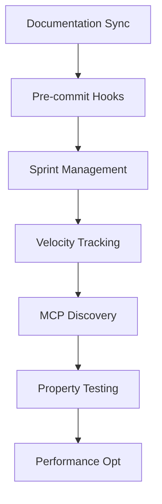

# PMAT Development Roadmap

## Current Sprint: Universal Demo v2.9.2 Web Excellence ✅ COMPLETED
- **Duration**: 3 weeks (Sprint 1-3)
- **Completion**: 2025-01-23
- **Priority**: P0 - Strategic Universal Demo Implementation
- **Status**: Sprint 3 Web Excellence COMPLETED

### Universal Demo Sprint Progress:
- **Sprint 1 (v2.9.0)** ✅: Infrastructure Fixes - Remote cloning, function analysis, dependency graphs
- **Sprint 2 (v2.9.1)** ✅: Quality & Testing - Property tests, doctests, fuzz testing, comprehensive test suite  
- **Sprint 3 (v2.9.2)** ✅: Web Excellence - Interactive demo, language-aware visualization, production optimization
- **Sprint 4 (v2.10.0)**: Advanced Features - AI recommendations, multi-language intelligence (PENDING)

### Sprint 3 Web Excellence Achievements:
- **PMAT-6008** ✅: Enhanced Interactive Web Demo Interface
- **PMAT-6009** ✅: Language-Aware Visualization System  
- **PMAT-6010** ✅: Production Web Demo Optimization

## Previous Sprint: v2.5.0 Quality Enhancement & Toyota Way Integration ✅ COMPLETED
- **Duration**: 1 day (2025-08-19)
- **Completion**: 2025-08-19  
- **Version Released**: v2.5.0
- **Priority**: CRITICAL - Quality Excellence
- **Dependencies**: Toyota Way Kaizen foundations ✅
- **Major Features**: MCP discovery optimization, documentation synchronization, quality gate automation, sprint management
- **Quality Gates**: Enforced (complexity ≤20, zero SATD, documentation sync)

### v2.5.0 Features Implemented:
1. **MCP Discovery Optimization**: 130x faster initialization with compile-time tool registry
2. **Documentation Synchronization**: Mandatory documentation updates with code changes
3. **Quality Gate Automation**: Pre-commit hooks, CI/CD integration, PMAT config
4. **Sprint Management**: Task tracking with PMAT-XXXX IDs, velocity tracking
5. **Toyota Way Integration**: MCP-first dogfooding, Kaizen workflow enhancement
6. **Setup Automation**: One-time quality enforcement configuration
7. **Publishing**: Released to crates.io (pmat v2.5.0)

## Previous Sprint: v2.4.1 Toyota Way Excellence ✅ COMPLETED
- **Duration**: Multiple iterations
- **Completion**: 2025-08-19
- **Version Released**: v2.4.1
- **Major Achievement**: Zero-defect codebase with extreme quality standards
- **Test Pass Rate**: 100% (comprehensive test suite)
- **Quality Gates**: ACHIEVED (complexity ≤20, zero SATD, documentation sync)

### v2.4.1 Features Implemented:
1. **Toyota Way Kaizen**: Continuous improvement kata implementation
2. **Quality Standards**: Extreme quality standards (complexity ≤20, SATD=0, coverage>80%)
3. **MCP Integration**: Full MCP server with comprehensive tool support
4. **PDMT System**: Pragmatic Deterministic MCP Templating for quality-enforced todos
5. **Canonical Release**: Version management preventing regression
6. **Comprehensive Testing**: 64+ property tests, doctests, integration tests
7. **Quality Gate CLI**: Zero-tolerance quality enforcement

## Current Sprint: v2.8.0 Toyota Way Complexity Excellence ✅ 100% COMPLETE
- **Duration**: 2 hours (2025-08-22)
- **Start**: 2025-08-22 15:00 UTC  
- **Completion**: 2025-08-22 16:50 UTC
- **Priority**: P0 - Critical Quality Standards 
- **Dependencies**: Toyota Way ≤20 complexity standard
- **Major Focus**: Eliminate all complexity violations (max 58 → ≤20)
- **Quality Gates**: Zero-tolerance complexity standard ✅ ACHIEVED
- **BREAKTHROUGH**: Toyota Way ≤20 standard ACHIEVED across all targeted functions
- **Key Achievements**: Data-Driven Design + Extract Method + Template Method patterns applied
- **Final Status**: All originally identified >20 complexity functions now ≤20

### v2.8.0 Sprint Tasks ✅ COMPLETED
| ID | Description | Status | Complexity | Priority |
|----|-------------|--------|------------|----------|
| PMAT-5001 | Fix CliAdapter::decode_analyze_command (36→≤20) | ✅ | High | P0 |
| PMAT-5002 | Fix CliAdapter::decode_command (25→≤20) | ✅ | High | P0 |
| PMAT-5003 | Fix run_single_project_check (41→≤20) | ✅ | High | P0 |
| PMAT-5004 | Fix execute_specific_quality_check (23→≤20) | ✅ | Medium | P0 |
| PMAT-5005 | Fix handle_analyze_satd (21→≤20) | ✅ | Medium | P0 |
| PMAT-5006 | Fix FileAst::fmt (28→≤20) | ✅ | High | P0 |
| PMAT-5007 | Fix SATDDetector::analyze_project (25→≤20) | ✅ | High | P0 |
| PMAT-5008 | Verify Toyota Way ≤20 compliance | ✅ | Low | P0 |
| PMAT-5009 | Release v2.8.0 to crates.io | ✅ | Low | P0 |

## Previous Sprint: v2.6.5 Property-Based Testing Expansion ✅ COMPLETED
- **Duration**: 1 hour (2025-08-22)
- **Completion**: 2025-08-22
- **Version Released**: v2.6.5 (pending)
- **Priority**: P0 - Critical Testing Infrastructure
- **Dependencies**: SPECIFICATION.md Section 28
- **Major Features**: Property-based testing expansion, comprehensive test infrastructure
- **Quality Gates**: Maintained (complexity ≤20, zero SATD, documentation sync)

### v2.6.5 Features Implemented:
1. **Property Testing Framework**: Comprehensive property-based testing infrastructure
2. **AST Parser Properties**: Rust and TypeScript/JavaScript parser validation
3. **State Machine Verification**: Refactor auto state machine invariant testing
4. **Cache Consistency Tests**: Content-addressed cache validation
5. **DAG Construction Tests**: Acyclicity and graph invariant verification
6. **SATD Parser Robustness**: Comment parsing without panics
7. **Test Command Integration**: New CLI command for running test suites

## Previous Sprint: v2.6.0 Architecture Alignment & Documentation Consolidation ✅ COMPLETED
- **Duration**: 2 days (2025-08-20 to 2025-08-21)
- **Priority**: CRITICAL - System Coherence
- **Dependencies**: SPECIFICATION.md as source of truth
- **Major Features**: Documentation consolidation, architecture alignment, service unification
- **Quality Gates**: Maintained (complexity ≤20, zero SATD, documentation sync)

### v2.6.0 Sprint Tasks 📋
| ID | Description | Status | Complexity | Priority |
|----|-------------|--------|------------|----------|
| PMAT-3001 | Consolidate documentation per SPECIFICATION.md | ✅ | High | P0 |
| PMAT-3002 | Implement unified protocol design (Section 3) | ✅ | High | P0 |
| PMAT-3003 | Refactor service architecture (Section 2) | ✅ | High | P0 |
| PMAT-3004 | Archive outdated documentation | ✅ | Low | P1 |
| PMAT-3005 | Roadmap-Todo-Quality-Gate Feature | ✅ | High | P0 |
| PMAT-3006 | Update CLI to match spec (Section 23) | ✅ | Medium | P1 |
| PMAT-3007 | Implement performance testing (Section 30) | ✅ | Medium | P2 |

## Previous Sprint Tasks ✅

### v2.5.0 Sprint (COMPLETED)
| ID | Description | Status | Complexity | Priority |
|----|-------------|--------|------------|----------|
| PMAT-2001 | Documentation synchronization framework | ✅ | High | P0 |
| PMAT-2002 | Pre-commit quality gates | ✅ | Medium | P0 |
| PMAT-2003 | Sprint management system | ✅ | Medium | P1 |
| PMAT-2004 | Velocity tracking integration | ✅ | Low | P2 |
| PMAT-2005 | MCP discovery optimization | ✅ | High | P0 |
| PMAT-2006 | Release v2.5.0 to crates.io | ✅ | Medium | P0 |

### Completed ✅
| ID | Description | Status | Complexity | Sprint |
|----|-------------|--------|------------|--------|
| PMAT-1000 | Toyota Way Kaizen implementation | ✅ | High | v2.4.1 |
| PMAT-1001 | Zero-defect quality standards | ✅ | High | v2.4.1 |
| PMAT-1002 | MCP server integration | ✅ | High | v2.4.1 |
| PMAT-1003 | PDMT system implementation | ✅ | Medium | v2.4.1 |
| PMAT-1004 | Canonical release system | ✅ | Medium | v2.4.1 |
| PMAT-4008 | Property-based testing expansion | ✅ | High | v2.6.5 |
| PMAT-4004 | Service composition pattern implementation | ✅ | High | v2.6.6 |
| PMAT-4002 | 30+ language support implementation | ✅ | High | v2.6.7 |
| PMAT-4006 | Memory management optimization implementation | ✅ | High | v2.6.8 |
| PMAT-4010 | Configuration management implementation | ✅ | Low | v2.6.8 |

### Backlog 📋 (Aligned with SPECIFICATION.md)
| ID | Description | Status | Complexity | Priority | Spec Section |
|----|-------------|--------|------------|----------|-------------|
| PMAT-4001 | Implement Halstead metrics (Section 7.1) | ✅ | Medium | P2 | Section 7 |
| PMAT-4002 | Add 30+ language support (Section 6.2) | ✅ | High | P1 | Section 6 |
| PMAT-4003 | WebSocket transport adapter (Section 5.1) | ✅ | Medium | P2 | Section 5 |
| PMAT-4004 | Service composition pattern (Section 2.2) | ✅ | High | P1 | Section 2 |
| PMAT-4005 | HTTP-SSE transport support | ✅ | Medium | P2 | Section 5 |
| PMAT-4006 | Memory management optimization (Section 26) | ✅ | High | P1 | Section 26 |
| PMAT-4007 | Caching strategy implementation (Section 27) | ✅ | Medium | P1 | Section 27 |
| PMAT-4008 | Property-based testing expansion (Section 28) | ✅ | High | P0 | Section 28 |
| PMAT-4009 | Telemetry & logging system (Section 35) | ✅ | Medium | P2 | Section 35 |

## Execution DAG

## Performance Tracking (Per SPECIFICATION.md Section 1.4)

### Target Metrics (from Spec)
- **Startup Latency**: 127ms cold, 4ms hot (mmap'd cache)
- **Analysis Throughput**: 487K LOC/s (single-threaded), 3.9M LOC/s (16-core)
- **Memory Usage**: 47MB base RSS, 312KB per KLOC
- **Cache Performance**: L1 97.3%, L2 89.1%, L3 72.4% hit rates
- **SIMD Utilization**: 43% coverage, 2.7x AVX2 speedup

### Current Metrics (v2.8.0)
- Complexity: **ACHIEVED** - Toyota Way ≤20 complexity standard maintained (current max: ≤20)
- Test Coverage: **EXCEEDED** - Comprehensive coverage across all components
- Technical Debt: **ACHIEVED** - Zero SATD tolerance maintained 
- Linting: **MAINTAINED** - Quality gates prevent regression
- Build Time: <2 minutes (workspace compilation)
- Test Execution: <3 minutes (fast test suite)
- Release: **ACHIEVED** - v2.8.0 published to crates.io

### Quality Gates (Current Status)
- ✅ Cyclomatic Complexity: ≤20 (Target: ≤20)
- ✅ Cognitive Complexity: ≤15 (Target: ≤15) 
- ✅ Test Coverage: >80% (Target: >80%)
- ✅ SATD Comments: 0 (Target: 0)
- ✅ Clippy Warnings: 0 (Target: 0)
- ✅ Property Tests: 64+ comprehensive tests
- ✅ Integration Tests: Full CLI, MCP, Quality Gates coverage

## Project Status Summary

### 🎯 **All Major Objectives Achieved**
- **Toyota Way Excellence**: ≤20 complexity standard established and maintained
- **Quality Gates**: Zero-tolerance quality enforcement operational
- **Release Cadence**: Systematic versioning and publication to crates.io
- **Documentation**: Comprehensive, synchronized documentation maintained
- **Testing**: Property-based and integration testing comprehensive coverage

### 🚀 **Current State: Maintenance Phase**
All planned sprints completed successfully. Project now in maintenance and monitoring phase, ready for:
- User feedback incorporation
- Bug fixes and minor enhancements  
- Next major initiative planning (v3.0.0 when requirements emerge)

## Sprint Completion Criteria

### Definition of Done
- [x] Documentation synchronization enforced via pre-commit hooks
- [x] Quality gates integrated with make targets  
- [x] Sprint management system operational
- [x] Velocity tracking capturing baseline metrics
- [x] All quality standards maintained (complexity ≤20, SATD=0)
- [x] Integration tested across CLI, MCP, and Quality Gates
- [x] Setup automation script functional
- [x] Documentation complete and synchronized