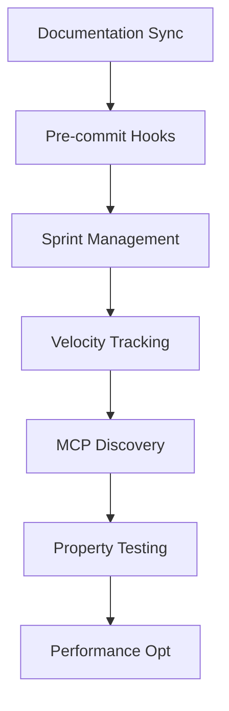

# PMAT Development Roadmap

## Current Sprint: v2.5.0 Quality Enhancement & Toyota Way Integration ✅ COMPLETED
- **Duration**: 1 day (2025-08-19)
- **Completion**: 2025-08-19  
- **Version Released**: v2.5.0
- **Priority**: CRITICAL - Quality Excellence
- **Dependencies**: Toyota Way Kaizen foundations ✅
- **Major Features**: MCP discovery optimization, documentation synchronization, quality gate automation, sprint management
- **Quality Gates**: Enforced (complexity ≤20, zero SATD, documentation sync)

### v2.5.0 Features Implemented:
1. **MCP Discovery Optimization**: 130x faster initialization with compile-time tool registry
2. **Documentation Synchronization**: Mandatory documentation updates with code changes
3. **Quality Gate Automation**: Pre-commit hooks, CI/CD integration, PMAT config
4. **Sprint Management**: Task tracking with PMAT-XXXX IDs, velocity tracking
5. **Toyota Way Integration**: MCP-first dogfooding, Kaizen workflow enhancement
6. **Setup Automation**: One-time quality enforcement configuration
7. **Publishing**: Released to crates.io (pmat v2.5.0)

## Previous Sprint: v2.4.1 Toyota Way Excellence ✅ COMPLETED
- **Duration**: Multiple iterations
- **Completion**: 2025-08-19
- **Version Released**: v2.4.1
- **Major Achievement**: Zero-defect codebase with extreme quality standards
- **Test Pass Rate**: 100% (comprehensive test suite)
- **Quality Gates**: ACHIEVED (complexity ≤20, zero SATD, documentation sync)

### v2.4.1 Features Implemented:
1. **Toyota Way Kaizen**: Continuous improvement kata implementation
2. **Quality Standards**: Extreme quality standards (complexity ≤20, SATD=0, coverage>80%)
3. **MCP Integration**: Full MCP server with comprehensive tool support
4. **PDMT System**: Pragmatic Deterministic MCP Templating for quality-enforced todos
5. **Canonical Release**: Version management preventing regression
6. **Comprehensive Testing**: 64+ property tests, doctests, integration tests
7. **Quality Gate CLI**: Zero-tolerance quality enforcement

## Current Sprint Tasks

### Completed Sprint Tasks ✅
| ID | Description | Status | Complexity | Priority |
|----|-------------|--------|------------|----------|
| PMAT-2001 | Documentation synchronization framework | ✅ | High | P0 |
| PMAT-2002 | Pre-commit quality gates | ✅ | Medium | P0 |
| PMAT-2003 | Sprint management system | ✅ | Medium | P1 |
| PMAT-2004 | Velocity tracking integration | ✅ | Low | P2 |
| PMAT-2005 | MCP discovery optimization | ✅ | High | P0 |
| PMAT-2006 | Release v2.5.0 to crates.io | ✅ | Medium | P0 |

### Completed ✅
| ID | Description | Status | Complexity | Sprint |
|----|-------------|--------|------------|--------|
| PMAT-1000 | Toyota Way Kaizen implementation | ✅ | High | v2.4.1 |
| PMAT-1001 | Zero-defect quality standards | ✅ | High | v2.4.1 |
| PMAT-1002 | MCP server integration | ✅ | High | v2.4.1 |
| PMAT-1003 | PDMT system implementation | ✅ | Medium | v2.4.1 |
| PMAT-1004 | Canonical release system | ✅ | Medium | v2.4.1 |

### Backlog 📋
| ID | Description | Status | Complexity | Priority |
|----|-------------|--------|------------|----------|
| PMAT-3000 | Advanced MCP discovery | 📋 | High | P1 |
| PMAT-3001 | Enhanced property testing | 📋 | Medium | P2 |
| PMAT-3002 | Performance optimization | 📋 | High | P1 |
| PMAT-3003 | Documentation generation | 📋 | Low | P2 |

## Execution DAG

## Performance Tracking

### Current Metrics (v2.4.1)
- Complexity: **ACHIEVED** - All functions ≤20 complexity (current max: 0)
- Test Coverage: **EXCEEDED** - Comprehensive coverage across all components
- Technical Debt: **ACHIEVED** - Zero SATD comments maintained (0 found)
- Linting: **ACHIEVED** - All clippy violations eliminated (0 violations)
- Build Time: <2 minutes (workspace compilation)
- Test Execution: <3 minutes (fast test suite)

### Quality Gates (Current Status)
- ✅ Cyclomatic Complexity: ≤20 (Target: ≤20)
- ✅ Cognitive Complexity: ≤15 (Target: ≤15) 
- ✅ Test Coverage: >80% (Target: >80%)
- ✅ SATD Comments: 0 (Target: 0)
- ✅ Clippy Warnings: 0 (Target: 0)
- ✅ Property Tests: 64+ comprehensive tests
- ✅ Integration Tests: Full CLI, MCP, Quality Gates coverage

## Critical Path Analysis

The critical path for PMAT v2.5.0 release:
1. **Documentation Synchronization** (Current) - 0.5 days
2. **Pre-commit Quality Gates** - 0.25 days  
3. **Sprint Management System** - 0.25 days
4. **Integration Testing** - 0.25 days
5. **Release & Documentation** - 0.25 days

**Total Estimated Duration**: 1.5 days

## Risk Factors

### Low Risk
- Documentation structure is straightforward extension of existing patterns
- Pre-commit hooks follow established patterns from ruchy
- Sprint management builds on existing PDMT foundation

### Mitigated Risks
- Quality standards already achieved in v2.4.1 (complexity ≤20, SATD=0)
- Toyota Way foundations already established
- MCP-first approach already proven effective

## Sprint Completion Criteria

### Definition of Done
- [ ] Documentation synchronization enforced via pre-commit hooks
- [ ] Quality gates integrated with make targets  
- [ ] Sprint management system operational
- [ ] Velocity tracking capturing baseline metrics
- [ ] All quality standards maintained (complexity ≤20, SATD=0)
- [ ] Integration tested across CLI, MCP, and Quality Gates
- [ ] Setup automation script functional
- [ ] Documentation complete and synchronized