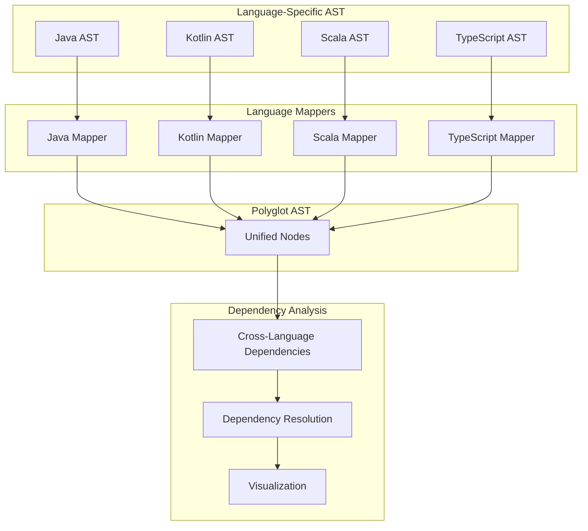
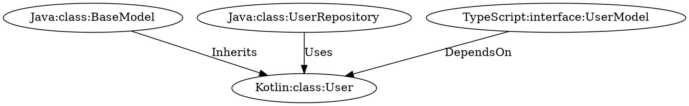

# Polyglot Analysis Features

**Sprint 52 - Cross-Language Analysis**

## Overview

The Polyglot Analysis feature enables the PMAT toolkit to analyze relationships between code written in different programming languages. This capability is essential for modern software development where applications increasingly span multiple languages and frameworks.

## Core Features

### 1. Cross-Language Dependency Detection

The system can detect dependencies between nodes in different programming languages:

- **Inheritance Relationships**: Java classes extended by Kotlin classes, TypeScript interfaces implemented by JavaScript classes, etc.
- **Implementation Relationships**: Java interfaces implemented by Kotlin classes, etc.
- **Usage Relationships**: Classes from one language using classes from another language
- **API Boundaries**: REST API boundaries, GraphQL interfaces, etc.

### 2. Language Boundary Identification

Identifies interoperability points between different languages:

- **JVM Interoperability**: Java ↔ Kotlin ↔ Scala
- **Frontend-Backend Boundaries**: TypeScript ↔ Java/Kotlin
- **Data Transfer Boundaries**: Where data crosses language boundaries
- **Shared Schema Boundaries**: OpenAPI, GraphQL, Protocol Buffers, etc.

### 3. Polyglot Recommendations

Provides best practices for managing cross-language boundaries:

- **Language-specific annotations**: `@JvmName`, `@JsName`, etc.
- **Interoperability guidance**: Extension functions, nullable types, etc.
- **API design recommendations**: Type-safe contracts, schema sharing, etc.
- **Type conversion strategies**: Safe marshaling and unmarshaling

## Technical Architecture

### Unified AST Framework

The foundation of polyglot analysis is a unified AST (Abstract Syntax Tree) framework:

1. **UnifiedNode**: Language-agnostic representation of code elements
2. **LanguageMapper**: Translates language-specific ASTs to unified nodes
3. **CrossLanguageDependencies**: Detects relationships between nodes in different languages



### MCP Tools for Polyglot Analysis

The system provides MCP (Model Context Protocol) tools that expose these capabilities:

1. **analyze_polyglot**: Analyzes cross-language relationships in a project
2. **detect_language_boundaries**: Identifies interoperability points between languages

## Supported Language Pairs

The system currently supports the following language pairs:

| Source Language | Target Language | Relationship Types                     | Confidence |
|-----------------|----------------|----------------------------------------|------------|
| Java            | Kotlin         | Inherits, Implements, Uses             | High       |
| Kotlin          | Java           | Inherits, Implements, Uses             | High       |
| Java            | Scala          | Inherits, Implements, Uses             | High       |
| Scala           | Java           | Inherits, Implements, Uses             | High       |
| TypeScript      | Java/Kotlin    | DependsOn (via API boundaries)         | Medium     |
| JavaScript      | Java/Kotlin    | DependsOn (via API boundaries)         | Medium     |

## Usage Examples

### Finding Cross-Language Dependencies

```rust
// Create language mappers
let java_mapper = JavaMapper::new();
let kotlin_mapper = KotlinMapper::new();
let typescript_mapper = TypeScriptMapper::new();

// Map files to unified nodes
let java_nodes = java_mapper.map_directory("/path/to/java/src", true).await?;
let kotlin_nodes = kotlin_mapper.map_directory("/path/to/kotlin/src", true).await?;
let ts_nodes = typescript_mapper.map_directory("/path/to/typescript/src", true).await?;

// Combine all nodes
let all_nodes = [java_nodes, kotlin_nodes, ts_nodes].concat();

// Analyze dependencies
let deps = CrossLanguageDependencies::detect_all(&all_nodes);

// Find Kotlin classes extending Java classes
let kotlin_extends_java = deps.iter().filter(|d| 
    d.source_language == Language::Kotlin && 
    d.target_language == Language::Java &&
    d.kind == ReferenceKind::Inherits
).collect::<Vec<_>>();

println!("Found {} Kotlin classes extending Java classes", kotlin_extends_java.len());
```

### Via MCP Tools

```javascript
// Using the MCP analyze_polyglot tool
const result = await mcpClient.callTool("analyze_polyglot", {
  path: "/path/to/project",
  languages: ["java", "kotlin", "typescript"],
  include_graph: true
});

console.log(`Found ${result.summary.total_cross_language_dependencies} cross-language dependencies`);

// Export the dependency graph
fs.writeFileSync('cross_language_dependencies.dot', result.graph_dot);

// Using the language boundary tool
const boundaries = await mcpClient.callTool("detect_language_boundaries", {
  path: "/path/to/project",
  source_language: "java",
  target_language: "kotlin"
});

console.log("Recommendations for Java-Kotlin boundaries:");
for (const pattern of boundaries.patterns) {
  if (pattern.language_pair === "Java-Kotlin") {
    pattern.recommendations.forEach(rec => {
      console.log(` - ${rec}`);
    });
  }
}
```

## Visualizations

Cross-language dependencies can be visualized using the DOT format output:



When rendered, this provides a clear visualization of the cross-language relationships:


## Benefits

1. **Improved Interoperability**: Better understanding of language boundaries helps improve interoperability
2. **Reduced Bugs**: Early detection of cross-language issues prevents hard-to-debug problems
3. **Better Architecture**: Visualizing cross-language dependencies aids in architectural decisions
4. **Documentation**: Automatically document language boundaries for team knowledge sharing

## Future Work

- Support for more language pairs (C++/Rust, Python/C, etc.)
- Cross-language refactoring tools
- Schema validation across language boundaries
- Automatic boundary test generation
- Integration with property-based testing

## References

- [PMAT Polyglot AST Documentation](../architecture/polyglot-ast-architecture.md)
- [JVM Interoperability Guide](https://kotlinlang.org/docs/java-interop.html)
- [Cross-Language Boundary Patterns](https://martinfowler.com/articles/language-boundaries.html)