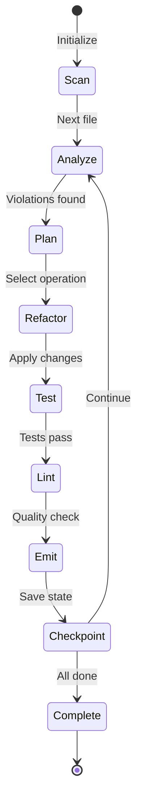

# Emit-Refactor Engine

## Overview

The Emit-Refactor Engine is a dual-mode system that combines real-time defect emission with interactive refactoring capabilities. It provides both high-performance monitoring for CI/CD pipelines and an agent-friendly interface for AI-assisted refactoring.

## Architecture

### Dual-Mode Design

```
┌─────────────────────────────────────────────────────────┐
│                   UnifiedEngine                         │
├─────────────────────────────────────────────────────────┤
│  ┌─────────────────┐         ┌────────────────────┐    │
│  │  Server Mode    │         │  Interactive Mode  │    │
│  ├─────────────────┤         ├────────────────────┤    │
│  │ • Real-time     │         │ • JSON protocol    │    │
│  │ • <5ms latency  │         │ • State machine    │    │
│  │ • Ring buffer   │         │ • Checkpointing    │    │
│  │ • Auto-emit     │         │ • Agent-friendly   │    │
│  └─────────────────┘         └────────────────────┘    │
└─────────────────────────────────────────────────────────┘
```

### State Machine

The refactoring process follows a deterministic state machine:



## Usage

### Server Mode (Real-time Monitoring)

```bash
# Start server with default config
pmat refactor serve

# Custom configuration
pmat refactor serve \
  --emit-threshold 15 \
  --latency-target 3ms \
  --buffer-size 1000

# With specific config file
pmat refactor serve --config refactor-config.json
```

**Example Configuration:**
```json
{
  "target_complexity": 20,
  "remove_satd": true,
  "max_function_lines": 50,
  "thresholds": {
    "cyclomatic_warn": 10,
    "cyclomatic_error": 20,
    "cognitive_warn": 15,
    "cognitive_error": 30,
    "tdg_warn": 1.5,
    "tdg_error": 2.0
  },
  "strategies": {
    "prefer_functional": true,
    "use_early_returns": true,
    "extract_helpers": true
  }
}
```

### Interactive Mode (Agent Integration)

```bash
# Start interactive session
pmat refactor interactive \
  --project-path . \
  --target-complexity 20 \
  --explain verbose

# Resume from checkpoint
pmat refactor resume --checkpoint refactor_state.json

# Check current status
pmat refactor status
```

## API Reference

### State Types

```rust
pub enum State {
    Scan { targets: Vec<PathBuf> },
    Analyze { current: FileId },
    Plan { violations: Vec<Violation> },
    Refactor { operation: RefactorOp },
    Test { command: String },
    Lint { strict: bool },
    Emit { payload: DefectPayload },
    Checkpoint { reason: String },
    Complete { summary: Summary },
}
```

### Refactoring Operations

```rust
pub enum RefactorOp {
    ExtractFunction {
        name: String,
        start: BytePos,
        end: BytePos,
        params: Vec<String>,
    },
    FlattenNesting {
        function: String,
        strategy: NestingStrategy,
    },
    ReplaceHashMap {
        imports: Vec<String>,
        replacements: Vec<(String, String)>,
    },
    RemoveSatd {
        location: Location,
        fix: SatdFix,
    },
    SimplifyExpression {
        expr: String,
        simplified: String,
    },
}
```

### Interactive Protocol

The interactive mode communicates via JSON messages:

**State Output:**
```json
{
  "state": {
    "state_type": "Analyze",
    "current_file": "./src/main.rs",
    "current_function": "process_data",
    "line_range": [45, 120]
  },
  "metrics": {
    "before": {
      "complexity": [25, 35],
      "tdg": 2.1,
      "satd": 3
    },
    "projected": {
      "complexity": [12, 18],
      "tdg": 1.2,
      "satd": 0
    }
  },
  "suggestion": {
    "suggestion_type": "ExtractFunction",
    "description": "Extract validation logic into separate function",
    "operations": [{
      "name": "validate_input",
      "lines": [50, 75],
      "complexity_reduction": 8
    }]
  },
  "commands": ["continue", "skip", "rollback", "checkpoint", "explain", "exit"]
}
```

**Commands:**
- `continue`: Apply the suggested refactoring
- `skip`: Skip current file/operation
- `rollback`: Undo last change
- `checkpoint`: Save current state
- `explain`: Get detailed explanation
- `exit`: End session

## Metrics

### Complexity Metrics

| Metric | Description | Threshold |
|--------|-------------|-----------|
| Cyclomatic | Number of linearly independent paths | 10 (warn), 20 (error) |
| Cognitive | Mental effort to understand code | 15 (warn), 30 (error) |
| TDG | Technical Debt Gradient | 1.5 (warn), 2.0 (error) |
| SATD | Self-Admitted Technical Debt comments | 0 (ideal) |

### Performance Metrics

- **Server Mode**: <5ms latency for defect emission
- **Interactive Mode**: <100ms for state transitions
- **Memory Usage**: O(1) with ring buffer
- **Throughput**: 10k+ files/second scan rate

## Integration Examples

### CI/CD Pipeline Integration

```yaml
# .github/workflows/refactor-monitor.yml
name: Refactor Monitoring
on: [push]

jobs:
  monitor:
    runs-on: ubuntu-latest
    steps:
      - uses: actions/checkout@v3
      
      - name: Start Refactor Server
        run: |
          pmat refactor serve \
            --emit-threshold 15 \
            --output refactor-report.json &
          REFACTOR_PID=$!
          
      - name: Run Tests
        run: make test
        
      - name: Collect Refactor Report
        run: |
          kill $REFACTOR_PID
          cat refactor-report.json
          
      - name: Upload Report
        uses: actions/upload-artifact@v3
        with:
          name: refactor-report
          path: refactor-report.json
```

### AI Agent Integration

```python
import json
import subprocess
import sys

class RefactorAgent:
    def __init__(self):
        self.process = subprocess.Popen(
            ['pmat', 'refactor', 'interactive', '--explain', 'verbose'],
            stdin=subprocess.PIPE,
            stdout=subprocess.PIPE,
            stderr=subprocess.PIPE,
            text=True
        )
    
    def get_state(self):
        line = self.process.stdout.readline()
        return json.loads(line)
    
    def send_command(self, command):
        self.process.stdin.write(f"{command}\n")
        self.process.stdin.flush()
    
    def refactor_codebase(self):
        while True:
            state = self.get_state()
            
            if state.get('state', {}).get('state_type') == 'Complete':
                break
            
            # AI decision logic
            if self.should_refactor(state):
                self.send_command('continue')
            else:
                self.send_command('skip')
    
    def should_refactor(self, state):
        metrics = state.get('metrics', {})
        before = metrics.get('before', {})
        projected = metrics.get('projected', {})
        
        # Refactor if complexity reduction > 30%
        if before and projected:
            reduction = 1 - (projected['complexity'][0] / before['complexity'][0])
            return reduction > 0.3
        
        return False
```

## Refactoring Strategies

### 1. Extract Function
Identifies cohesive code blocks that can be extracted into separate functions.

**Before:**
```rust
fn process_data(input: &str) -> Result<Data, Error> {
    // Validation logic (20 lines)
    if input.is_empty() {
        return Err(Error::Empty);
    }
    // ... more validation ...
    
    // Parsing logic (30 lines)
    let mut parser = Parser::new();
    // ... parsing ...
    
    // Transformation logic (25 lines)
    let result = transform(parsed);
    // ... more transformation ...
    
    Ok(result)
}
```

**After:**
```rust
fn process_data(input: &str) -> Result<Data, Error> {
    validate_input(input)?;
    let parsed = parse_input(input)?;
    transform_data(parsed)
}

fn validate_input(input: &str) -> Result<(), Error> {
    if input.is_empty() {
        return Err(Error::Empty);
    }
    // ... more validation ...
    Ok(())
}
```

### 2. Flatten Nesting
Reduces deep nesting using early returns and guard clauses.

**Before:**
```rust
fn calculate(x: Option<i32>) -> i32 {
    if let Some(val) = x {
        if val > 0 {
            if val < 100 {
                val * 2
            } else {
                100
            }
        } else {
            0
        }
    } else {
        -1
    }
}
```

**After:**
```rust
fn calculate(x: Option<i32>) -> i32 {
    let val = match x {
        None => return -1,
        Some(v) => v,
    };
    
    if val <= 0 {
        return 0;
    }
    
    if val >= 100 {
        return 100;
    }
    
    val * 2
}
```

### 3. Replace HashMap
Optimizes HashMap usage with more efficient alternatives.

**Before:**
```rust
use std::collections::HashMap;

let mut map = HashMap::new();
map.insert("key", value);
```

**After:**
```rust
use rustc_hash::FxHashMap;

let mut map = FxHashMap::default();
map.insert("key", value);
```

## Best Practices

1. **Start with High-Complexity Files**: Focus on files with complexity > 30
2. **Review Before Applying**: Always review suggested refactorings
3. **Test After Each Change**: Ensure tests pass after refactoring
4. **Use Checkpoints**: Save state regularly for large refactoring sessions
5. **Monitor Performance**: Track complexity reduction over time

## Troubleshooting

### Common Issues

**Q: Server mode isn't emitting defects**
A: Check emit threshold configuration. Default is 15 for cyclomatic complexity.

**Q: Interactive mode is slow**
A: Reduce the number of target files or increase the complexity threshold.

**Q: Checkpoint restore fails**
A: Ensure the codebase hasn't changed significantly since the checkpoint was created.

## Performance Tuning

### Server Mode Optimization

```toml
# High-performance configuration
[server]
latency_target = "3ms"
buffer_size = 10000
emit_threshold = 20
batch_size = 100

[analysis]
incremental = true
cache_size = "1GB"
parallel_workers = 8
```

### Interactive Mode Optimization

```toml
# Agent-friendly configuration
[interactive]
explain_level = "brief"
checkpoint_interval = 10
max_suggestions = 3
timeout = "30s"
```

## Future Roadmap

- **Language Support**: TypeScript, Python, Go analyzers
- **ML-Powered Suggestions**: Learn from accepted/rejected refactorings
- **IDE Integration**: VSCode and IntelliJ plugins
- **Distributed Analysis**: Cluster support for large codebases
- **Automatic Refactoring**: Unattended refactoring with confidence scores