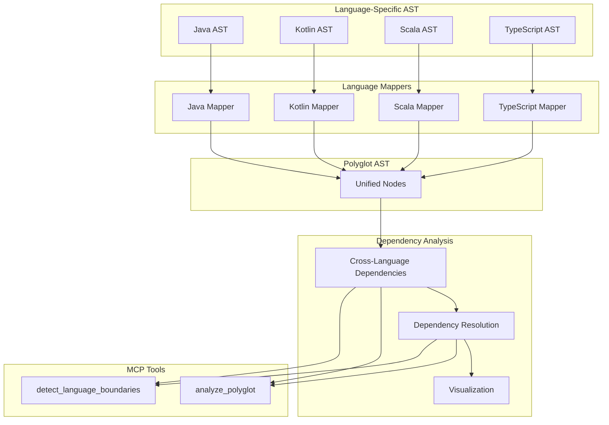

# Cross-Language Analysis Tools for MCP

**Protocol Version**: MCP v2024-11-05
**Last Updated**: October 25, 2025
**Sprint**: 52

## Table of Contents

1. [Overview](#overview)
2. [Polyglot Analysis Tools](#polyglot-analysis-tools)
3. [Language Boundary Tools](#language-boundary-tools)
4. [Common Use Cases](#common-use-cases)
5. [Cross-Language Recommendations](#cross-language-recommendations)
6. [Technical Architecture](#technical-architecture)

---

## Overview

The Cross-Language Analysis Tools extend PMAT's MCP (Model Context Protocol) capabilities to analyze relationships between different programming languages in a project. These tools enable AI agents to detect dependencies, understand interoperability points, and provide recommendations for managing cross-language boundaries in polyglot projects.

**Key Features:**

- Detection of cross-language dependencies
- Identification of language boundaries and interoperability points
- Language-specific recommendations for boundary management
- Visualization of cross-language relationships
- Support for multiple language combinations (Java, Kotlin, Scala, TypeScript, JavaScript)

---

## Polyglot Analysis Tools

### 1. `analyze_polyglot`

**Category**: Cross-Language Analysis (Sprint 52)
**Source**: `server/src/mcp_integration/polyglot_tools.rs:18`

Analyzes cross-language relationships in a project, detecting dependencies between different programming languages and generating a comprehensive report of language interactions.

**Input Schema**:
```json
{
  "type": "object",
  "properties": {
    "path": {
      "type": "string",
      "description": "Path to directory to analyze"
    },
    "languages": {
      "type": "array",
      "items": {
        "type": "string",
        "enum": ["java", "kotlin", "scala", "typescript", "javascript"]
      },
      "description": "Languages to include (default: all supported)"
    },
    "max_depth": {
      "type": "number",
      "default": 3,
      "description": "Maximum directory recursion depth"
    },
    "include_graph": {
      "type": "boolean",
      "default": true,
      "description": "Include dependency graph in DOT format"
    }
  },
  "required": ["path"]
}
```

**Output Format**:
```json
{
  "status": "completed",
  "path": "/path/to/project",
  "languages": ["Java", "Kotlin", "Scala", "TypeScript", "JavaScript"],
  "summary": {
    "total_files": 120,
    "total_nodes": 850,
    "nodes_by_language": {
      "Java": 350,
      "Kotlin": 250,
      "TypeScript": 250
    },
    "total_cross_language_dependencies": 75
  },
  "node_counts": {
    "Java": {
      "class": 45,
      "interface": 20,
      "method": 285
    },
    "Kotlin": {
      "class": 30,
      "interface": 15,
      "method": 205
    },
    "TypeScript": {
      "class": 25,
      "interface": 30,
      "method": 195
    }
  },
  "dependency_counts": {
    "Java -> Kotlin": 35,
    "Kotlin -> Java": 30,
    "TypeScript -> Java": 10
  },
  "dependencies": [
    {
      "source": {
        "id": "Java:class:UserService",
        "name": "UserService",
        "fqn": "com.example.service.UserService",
        "kind": "class"
      },
      "target": {
        "id": "Kotlin:class:User",
        "name": "User",
        "fqn": "com.example.model.User",
        "kind": "class"
      },
      "kind": "Uses",
      "source_language": "Java",
      "target_language": "Kotlin",
      "confidence": 1.0
    }
  ],
  "graph_dot": "digraph CrossLanguageDependencies {\n  ... }"
}
```

#### Usage Example:

```javascript
// Analyze a polyglot project with default settings
const result = await mcpClient.callTool("analyze_polyglot", {
  path: "/path/to/project",
  include_graph: true
});

console.log(`Found ${result.summary.total_cross_language_dependencies} cross-language dependencies`);
console.log(`Languages: ${result.languages.join(', ')}`);

// Export DOT graph to file for visualization
const fs = require('fs');
fs.writeFileSync('cross_language_graph.dot', result.graph_dot);
```

---

## Language Boundary Tools

### 1. `detect_language_boundaries`

**Category**: Cross-Language Analysis (Sprint 52)
**Source**: `server/src/mcp_integration/polyglot_tools.rs:238`

Detects language boundaries and interoperability points in a project, with a focus on identifying where different languages interact and providing recommendations for managing these boundaries.

**Input Schema**:
```json
{
  "type": "object",
  "properties": {
    "path": {
      "type": "string",
      "description": "Path to directory to analyze"
    },
    "source_language": {
      "type": "string",
      "description": "Source language to analyze boundaries from (optional)"
    },
    "target_language": {
      "type": "string",
      "description": "Target language to analyze boundaries to (optional)"
    },
    "max_depth": {
      "type": "number",
      "default": 3,
      "description": "Maximum directory recursion depth"
    }
  },
  "required": ["path"]
}
```

**Output Format**:
```json
{
  "status": "completed",
  "path": "/path/to/project",
  "languages_analyzed": ["Java", "Kotlin", "Scala", "TypeScript", "JavaScript"],
  "summary": {
    "total_boundaries": 65,
    "source_language": "Java",
    "target_language": "Kotlin"
  },
  "boundaries": [
    {
      "boundary_type": "Inherits",
      "source": {
        "language": "Java",
        "node": {
          "id": "Java:class:JavaClass",
          "name": "JavaClass",
          "fqn": "com.example.JavaClass",
          "kind": "class",
          "file": "/path/to/project/src/main/java/com/example/JavaClass.java"
        }
      },
      "target": {
        "language": "Kotlin",
        "node": {
          "id": "Kotlin:class:KotlinBase",
          "name": "KotlinBase",
          "fqn": "com.example.KotlinBase",
          "kind": "class",
          "file": "/path/to/project/src/main/kotlin/com/example/KotlinBase.kt"
        }
      },
      "confidence": 1.0
    }
  ],
  "boundary_types": {
    "Inherits": {
      "count": 15,
      "languages": ["Java → Kotlin", "Kotlin → Java"]
    },
    "Implements": {
      "count": 25,
      "languages": ["Java → Kotlin", "Kotlin → Java", "TypeScript → Java"]
    },
    "Uses": {
      "count": 25,
      "languages": ["Java → Kotlin", "Kotlin → Java", "TypeScript → Java"]
    }
  },
  "patterns": [
    {
      "language_pair": "Java-Kotlin",
      "count": 40,
      "recommendations": [
        "Use Kotlin's @JvmName annotation to control Java-visible names",
        "Leverage Kotlin extension functions for Java interoperability",
        "Use Kotlin's nullable types consistently with Java's @Nullable",
        "Consider avoiding Kotlin-specific features at boundaries (coroutines, delegation)"
      ]
    }
  ]
}
```

#### Usage Example:

```javascript
// Detect all language boundaries in a project
const boundaries = await mcpClient.callTool("detect_language_boundaries", {
  path: "/path/to/project"
});

console.log(`Found ${boundaries.summary.total_boundaries} language boundaries`);

// Get specific boundaries between Java and Kotlin
const javaKotlinBoundaries = await mcpClient.callTool("detect_language_boundaries", {
  path: "/path/to/project",
  source_language: "java",
  target_language: "kotlin"
});

// Process recommendations
for (const pattern of javaKotlinBoundaries.patterns) {
  console.log(`Recommendations for ${pattern.language_pair}:`);
  pattern.recommendations.forEach(rec => console.log(` - ${rec}`));
}
```

---

## Common Use Cases

### 1. Polyglot Project Analysis

For analyzing the structure and relationships in a project that uses multiple languages:

```javascript
// Analyze an entire polyglot project
const result = await mcpClient.callTool("analyze_polyglot", {
  path: "/path/to/project",
  languages: ["java", "kotlin", "typescript"]
});

// Generate summary report
const summary = {
  project: path.basename(result.path),
  fileCount: result.summary.total_files,
  languageDistribution: Object.entries(result.summary.nodes_by_language)
    .map(([lang, count]) => `${lang}: ${count} nodes (${Math.round(count/result.summary.total_nodes*100)}%)`)
    .join('\n  '),
  crossLanguageDependencies: result.summary.total_cross_language_dependencies
};

console.log(`# Project Analysis: ${summary.project}`);
console.log(`Files analyzed: ${summary.fileCount}`);
console.log(`Languages:\n  ${summary.languageDistribution}`);
console.log(`Cross-language dependencies: ${summary.crossLanguageDependencies}`);
```

### 2. Language Boundary Assessment

For identifying and managing cross-language boundaries:

```javascript
// First, detect all language boundaries
const boundaries = await mcpClient.callTool("detect_language_boundaries", {
  path: "/path/to/project"
});

// Identify the most critical boundary types
const criticalBoundaries = Object.entries(boundaries.boundary_types)
  .sort((a, b) => b[1].count - a[1].count)
  .slice(0, 3);

console.log("Top 3 boundary types to focus on:");
criticalBoundaries.forEach(([type, data], index) => {
  console.log(`${index + 1}. ${type} (${data.count} occurrences)`);
  console.log(`   Affects: ${Array.from(data.languages).join(", ")}`);
});

// Get specific recommendations for the most common language pair
const mostCommonPair = boundaries.patterns
  .sort((a, b) => b.count - a.count)[0];

console.log(`\nRecommendations for ${mostCommonPair.language_pair} boundaries:`);
mostCommonPair.recommendations.forEach(rec => {
  console.log(` - ${rec}`);
});
```

### 3. Refactoring Planning

For planning refactoring across language boundaries:

```javascript
// First analyze the project
const analysis = await mcpClient.callTool("analyze_polyglot", {
  path: "/path/to/project"
});

// Identify the most complex cross-language dependencies
const complexDependencies = analysis.dependencies
  .filter(dep => 
    // Filter for inheritance or implementation relationships
    dep.kind === "Inherits" || dep.kind === "Implements"
  )
  .sort((a, b) => {
    // Sort by complexity (more nodes in the same files = more complex)
    const aFiles = new Set();
    const bFiles = new Set();
    
    analysis.dependencies.forEach(d => {
      if (d.source.id === a.source.id || d.target.id === a.target.id) {
        aFiles.add(d.source.file);
        aFiles.add(d.target.file);
      }
      if (d.source.id === b.source.id || d.target.id === b.target.id) {
        bFiles.add(d.source.file);
        bFiles.add(d.target.file);
      }
    });
    
    return bFiles.size - aFiles.size;
  })
  .slice(0, 5);

console.log("Top 5 complex cross-language dependencies to refactor:");
complexDependencies.forEach((dep, index) => {
  console.log(`${index + 1}. ${dep.source.name} (${dep.source_language}) ${dep.kind} ${dep.target.name} (${dep.target_language})`);
});
```

---

## Cross-Language Recommendations

The system provides language-specific recommendations based on the language boundaries detected. Here are the key recommendations for common language pairs:

### Java-Kotlin Interoperability

For Java and Kotlin interoperability:

1. **Use Kotlin's @JvmName annotation** to control Java-visible names
   ```kotlin
   // Kotlin
   @file:JvmName("StringUtils")
   package com.example
   
   fun String.toTitleCase(): String { ... }
   
   // Java
   import com.example.StringUtils;
   StringUtils.toTitleCase("hello");
   ```

2. **Leverage Kotlin extension functions** for Java interoperability
   ```kotlin
   // Kotlin
   fun User.toUserDto(): UserDto = UserDto(this.id, this.name)
   
   // Java
   import com.example.UserExtensionsKt;
   UserDto dto = UserExtensionsKt.toUserDto(user);
   ```

3. **Use Kotlin's nullable types consistently** with Java's @Nullable
   ```kotlin
   // Kotlin
   fun processName(name: String?): String { ... }
   
   // Java
   import org.jetbrains.annotations.Nullable;
   public void process(@Nullable String name) {
     String result = KotlinClass.processName(name);
   }
   ```

4. **Consider avoiding Kotlin-specific features** at boundaries (coroutines, delegation)

### Java-Scala Interoperability

For Java and Scala interoperability:

1. **Prefer Java interfaces at language boundaries**
   ```java
   // Java
   public interface UserService {
     User findById(long id);
   }
   
   // Scala
   class ScalaUserService extends UserService {
     override def findById(id: Long): User = ...
   }
   ```

2. **Be careful with Scala's implicit conversions** at Java boundaries
   ```scala
   // Scala - AVOID at boundaries
   implicit def stringToUser(name: String): User = User(0, name)
   
   // Scala - Better at boundaries
   def createUser(name: String): User = User(0, name)
   ```

3. **Avoid using Scala's case classes as Java API**
   ```scala
   // Scala - Internal
   case class User(id: Long, name: String)
   
   // Scala - Public API for Java
   class UserDTO(val id: Long, val name: String)
   ```

4. **Use Java collections when sharing data** between Java and Scala
   ```scala
   // Scala
   import java.util.{List => JList, ArrayList}
   
   def getUsers(): JList[User] = {
     val result = new ArrayList[User]()
     // Add users...
     result
   }
   ```

### TypeScript-Java Interoperability

For TypeScript and Java interoperability:

1. **Use consistent naming conventions** across both languages
   ```typescript
   // TypeScript
   interface UserDto {
     userId: number;
     userName: string;
   }
   
   // Java
   public class UserDto {
     private Long userId;
     private String userName;
     // getters/setters...
   }
   ```

2. **Define API contracts with OpenAPI/Swagger** for REST interfaces
   ```yaml
   # OpenAPI schema shared by both Java and TypeScript
   components:
     schemas:
       UserDto:
         type: object
         properties:
           userId:
             type: integer
             format: int64
           userName:
             type: string
   ```

3. **Consider type-safe approaches** like GraphQL or gRPC
   ```graphql
   # GraphQL schema shared by both Java and TypeScript
   type User {
     id: ID!
     name: String!
     email: String
   }
   ```

4. **Enforce model consistency with shared schemas**
   ```typescript
   // TypeScript
   // Generated from shared schema
   import { User } from './generated/models';
   
   // Java
   // Generated from same schema
   import com.example.model.User;
   ```

---

## Technical Architecture

### Polyglot AST Framework

The cross-language analysis tools are built on a polyglot Abstract Syntax Tree (AST) framework that provides a unified representation of code elements across different languages.

Key components:

1. **UnifiedNode**: A language-agnostic representation of code elements
   - Common metadata (name, type, etc.)
   - Language-specific details
   - Cross-language references

2. **LanguageMapper**: Translates language-specific ASTs to unified nodes
   - One mapper per supported language
   - Handles language-specific features
   - Maps to common node types

3. **CrossLanguageDependencies**: Detects relationships between nodes in different languages
   - Inheritance relationships
   - Implementation relationships
   - Usage relationships

### Architecture Diagram



### Implementation Details

The polyglot AST framework is implemented in the following modules:

- `server/src/ast/polyglot/mod.rs`: Core definitions and interfaces
- `server/src/ast/polyglot/unified_node.rs`: Unified node representation
- `server/src/ast/polyglot/language_mapper.rs`: Language-specific mappers
- `server/src/ast/polyglot/cross_language_dependencies.rs`: Dependency detection

The MCP tools are implemented in:

- `server/src/mcp_integration/polyglot_tools.rs`: MCP tool implementations

Each language mapper uses the appropriate language-specific AST visitor from:

- `server/src/services/languages/java.rs`: Java AST visitor
- `server/src/services/languages/kotlin.rs`: Kotlin AST visitor
- `server/src/services/languages/scala.rs`: Scala AST visitor
- `server/src/services/languages/typescript.rs`: TypeScript AST visitor

---

**Maintained by**: PMAT Development Team
**Last Updated**: Sprint 52 (October 25, 2025)