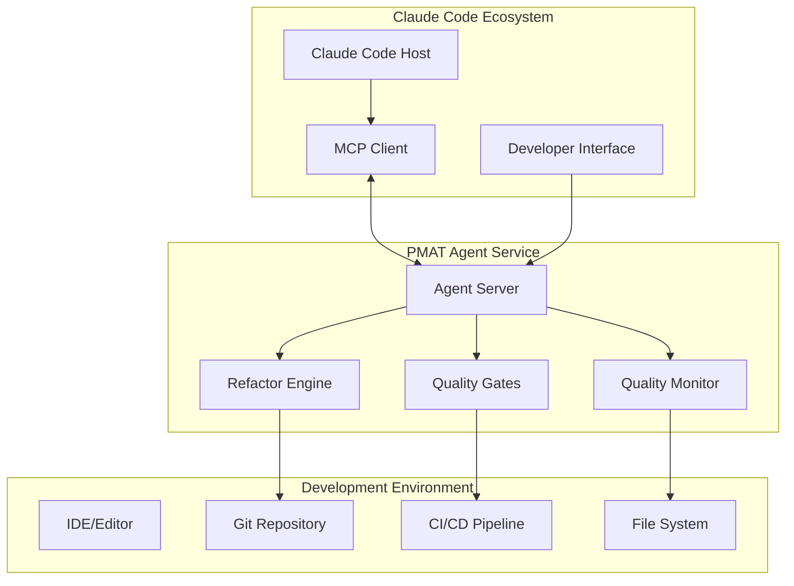

# Claude Code Agent Mode Integration Specification

**Version**: 1.0  
**Date**: 2025-01-23  
**Priority**: P1 - Strategic Integration  
**Target Version**: v2.10.0 "Agent Excellence"  

## Executive Summary

This specification defines how PMAT (Pragmatic Multi-language Analysis Toolkit) integrates natively with Claude Code as a background agent service, providing continuous code quality monitoring, automated refactoring suggestions, and proactive quality gate enforcement within developer workflows.

## Background and Motivation

### Current State Analysis

Claude Code has evolved into a sophisticated development automation platform with:
- **Agent Mode Capabilities**: Agentic development platform managing complex projects
- **MCP Integration**: Open-source standard connecting AI tools to external services  
- **Background Services**: Headless mode for CI, pre-commit hooks, build scripts
- **Sub-Agent Architecture**: Specialized AI assistants for specific task types

### Strategic Opportunity

PMAT's integration as a Claude Code agent represents a paradigm shift from reactive code analysis to **proactive quality engineering**:

1. **Continuous Monitoring**: Real-time complexity tracking across development sessions
2. **Intelligent Refactoring**: AI-driven suggestions based on Toyota Way principles
3. **Quality Gate Automation**: Transparent quality enforcement without disruption
4. **Developer Productivity**: Seamless integration into existing workflows

## Architecture Overview

### High-Level Architecture



### Agent Deployment Modes

#### 1. Background Daemon Mode
- **Purpose**: Continuous monitoring and proactive quality management
- **Operation**: Long-running background service
- **Scope**: Project-wide analysis with file system watching
- **Performance**: Lightweight, event-driven architecture

#### 2. Interactive Assistant Mode  
- **Purpose**: On-demand analysis and guided refactoring
- **Operation**: Request/response for specific quality tasks
- **Scope**: Targeted analysis for specific files or components
- **Performance**: Fast response for immediate feedback

#### 3. CI/CD Integration Mode
- **Purpose**: Quality gate enforcement in automated pipelines
- **Operation**: Headless execution with structured output
- **Scope**: Full repository analysis with pass/fail determination
- **Performance**: Optimized for batch processing

## Technical Implementation

### MCP Server Architecture

#### Core MCP Server Structure

```typescript
interface PmatMcpServer {
  name: "pmat-agent"
  version: "1.0.0"
  capabilities: {
    tools: PmatToolCapabilities
    resources: PmatResourceCapabilities  
    prompts: PmatPromptCapabilities
  }
  transport: StdioTransport | SseTransport | HttpTransport
}
```

#### Tool Capabilities

```typescript
interface PmatToolCapabilities {
  // Real-time Quality Monitoring
  start_quality_monitoring: {
    description: "Start continuous code quality monitoring"
    parameters: {
      project_path: string
      watch_patterns: string[]
      complexity_threshold: number
      update_interval: number
    }
  }
  
  // Intelligent Refactoring
  suggest_refactoring: {
    description: "AI-driven refactoring suggestions based on complexity analysis"
    parameters: {
      file_path: string
      target_complexity: number
      refactor_strategy: "toyota-way" | "minimal" | "aggressive"
    }
  }
  
  // Quality Gate Enforcement
  run_quality_gates: {
    description: "Execute Toyota Way quality gates with detailed reporting"
    parameters: {
      scope: "file" | "directory" | "repository"
      target: string
      output_format: "json" | "markdown" | "claude-friendly"
    }
  }
  
  // Proactive Analysis
  analyze_complexity_trends: {
    description: "Track complexity evolution and predict quality issues"
    parameters: {
      time_window: string
      include_predictions: boolean
      alert_threshold: number
    }
  }
  
  // Automated Code Health
  health_check: {
    description: "Comprehensive codebase health assessment"
    parameters: {
      include_satd: boolean
      include_dead_code: boolean
      include_duplicates: boolean
      generate_recommendations: boolean
    }
  }
}
```

#### Resource Capabilities

```typescript
interface PmatResourceCapabilities {
  // Live Quality Metrics
  "quality-metrics": {
    uri: "pmat://quality/metrics"
    description: "Real-time quality metrics and trends"
    mimeType: "application/json"
  }
  
  // Complexity Heatmaps
  "complexity-heatmap": {
    uri: "pmat://analysis/heatmap"
    description: "Visual complexity distribution across codebase"
    mimeType: "application/json"
  }
  
  // Refactoring Opportunities
  "refactor-suggestions": {
    uri: "pmat://refactor/suggestions"
    description: "AI-generated refactoring opportunities"
    mimeType: "application/json"
  }
  
  // Quality Gate Reports
  "quality-reports": {
    uri: "pmat://gates/reports"
    description: "Historical quality gate results and trends"
    mimeType: "application/json"
  }
}
```

#### Prompt Templates

```typescript
interface PmatPromptCapabilities {
  // Guided Refactoring
  "refactor-guidance": {
    description: "Step-by-step refactoring guidance following Toyota Way principles"
    arguments: [
      {name: "complexity_target", type: "number", description: "Target complexity score (≤20)"},
      {name: "refactor_scope", type: "string", description: "File or function to refactor"}
    ]
  }
  
  // Quality Review
  "quality-review": {
    description: "Comprehensive quality review with actionable recommendations"
    arguments: [
      {name: "review_depth", type: "string", description: "surface | deep | comprehensive"},
      {name: "focus_areas", type: "array", description: "Specific quality aspects to review"}
    ]
  }
  
  // Code Health Assessment  
  "health-assessment": {
    description: "Proactive code health evaluation with predictive insights"
    arguments: [
      {name: "prediction_horizon", type: "string", description: "Time horizon for predictions"},
      {name: "include_technical_debt", type: "boolean", description: "Include technical debt analysis"}
    ]
  }
}
```

### Agent Service Implementation

#### Background Daemon Architecture

```rust
pub struct PmatAgentDaemon {
    config: AgentConfig,
    file_watcher: RecommendedWatcher,
    quality_monitor: QualityMonitor,
    mcp_server: McpServer,
    event_loop: tokio::runtime::Runtime,
}

impl PmatAgentDaemon {
    pub async fn start(&mut self) -> Result<()> {
        // Initialize MCP server
        self.mcp_server.start().await?;
        
        // Setup file system watching
        self.setup_file_watching().await?;
        
        // Start quality monitoring loop
        self.start_quality_monitoring().await?;
        
        // Enter event loop
        self.run_event_loop().await
    }
    
    async fn handle_file_change(&self, event: FileChangeEvent) -> Result<()> {
        match event.event_type {
            EventType::Modify | EventType::Create => {
                self.analyze_file_change(event.path).await?;
                self.update_quality_metrics().await?;
                self.check_quality_thresholds().await?;
            }
            _ => {}
        }
        Ok(())
    }
}
```

#### Quality Monitoring Engine

```rust
pub struct QualityMonitor {
    complexity_tracker: ComplexityTracker,
    quality_gates: QualityGateEngine,
    notification_manager: NotificationManager,
    metrics_store: MetricsStore,
}

impl QualityMonitor {
    pub async fn analyze_continuous(&mut self, file_path: &Path) -> Result<QualityUpdate> {
        let complexity = self.complexity_tracker.analyze_file(file_path).await?;
        let quality_status = self.quality_gates.evaluate(&complexity).await?;
        
        let update = QualityUpdate {
            file_path: file_path.to_path_buf(),
            timestamp: Utc::now(),
            complexity_delta: complexity.delta_from_baseline(),
            quality_status,
            recommendations: self.generate_recommendations(&complexity).await?,
        };
        
        self.metrics_store.record_update(&update).await?;
        
        if update.requires_notification() {
            self.notification_manager.send_notification(&update).await?;
        }
        
        Ok(update)
    }
}
```

### Integration Patterns

#### Claude Code Configuration

##### Project-Scoped MCP Configuration (`.mcp.json`)

```json
{
  "mcpServers": {
    "pmat-agent": {
      "command": "pmat",
      "args": ["mcp", "serve", "--mode", "agent"],
      "transport": "stdio",
      "settings": {
        "quality_monitoring": {
          "enabled": true,
          "complexity_threshold": 20,
          "watch_patterns": ["**/*.rs", "**/*.py", "**/*.js", "**/*.ts"],
          "notify_on_violations": true
        },
        "toyota_way": {
          "enforce_complexity": true,
          "zero_satd_tolerance": true,
          "require_tests": true
        },
        "agent_behavior": {
          "proactive_suggestions": true,
          "auto_refactor_threshold": 30,
          "continuous_monitoring": true
        }
      }
    }
  }
}
```

##### User-Scoped Configuration

```json
{
  "pmat_agent_preferences": {
    "notification_level": "important_only",
    "refactor_suggestions": "toyota_way",
    "quality_gates": "strict",
    "background_monitoring": true,
    "integration_mode": "seamless"
  }
}
```

#### Slash Command Integration

PMAT agent integrates with Claude Code's slash command system:

```markdown
# .claude/commands/quality-check.md

Check code quality using PMAT Toyota Way standards.

Analyze the current file or directory for:
- Complexity violations (>20 cyclomatic/cognitive)
- Self-admitted technical debt (SATD) 
- Dead code detection
- Duplicate code analysis

Use the PMAT agent to perform comprehensive quality analysis and provide actionable recommendations.
```

#### Sub-Agent Integration

```markdown
# .claude/subagents/pmat-refactor-assistant.md

You are a specialized refactoring assistant using PMAT's Toyota Way principles.

Your capabilities:
- Complexity reduction strategies (target: ≤20)
- Function extraction and decomposition
- Dead code elimination
- SATD resolution planning

Always use PMAT agent tools for analysis and verification.
```

## Capabilities and Features

### 1. Continuous Quality Monitoring

#### Real-Time Complexity Tracking
- **File System Watching**: Monitors code changes in real-time
- **Incremental Analysis**: Analyzes only changed files for performance
- **Trend Detection**: Identifies quality degradation patterns
- **Threshold Alerts**: Notifies when complexity exceeds Toyota Way standards

#### Proactive Quality Management
- **Predictive Analysis**: Forecasts quality issues before they become critical
- **Automated Suggestions**: AI-generated refactoring recommendations
- **Quality Heat Maps**: Visual representation of codebase health
- **Historical Tracking**: Long-term quality trend analysis

### 2. Intelligent Refactoring Assistant

#### Toyota Way Compliance
- **Complexity Reduction**: Automated strategies to achieve ≤20 complexity
- **Function Decomposition**: Intelligent function extraction suggestions  
- **Dead Code Elimination**: Automated unused code detection and removal
- **SATD Resolution**: Systematic technical debt elimination

#### AI-Driven Suggestions
- **Context-Aware**: Understands codebase patterns and conventions
- **Incremental Improvement**: Small, verifiable changes following Kaizen
- **Quality Validation**: Ensures refactoring improves rather than degrades quality
- **Test Integration**: Maintains test coverage during refactoring

### 3. Quality Gate Automation

#### Transparent Enforcement
- **Pre-Commit Integration**: Quality gates as part of development workflow
- **CI/CD Pipeline**: Automated quality verification in build processes
- **Developer Feedback**: Clear, actionable quality violation explanations
- **Progressive Enhancement**: Gradual quality improvement guidance

#### Flexible Configuration
- **Team Standards**: Customizable quality thresholds per project
- **Language-Specific**: Tailored rules for different programming languages
- **Legacy Support**: Gradual quality improvement for existing codebases
- **Exception Management**: Documented quality exceptions when necessary

### 4. Developer Experience Integration

#### Seamless Workflow Integration
- **IDE Compatibility**: Works with any Claude Code supported editor
- **Background Operation**: Non-intrusive continuous monitoring
- **Context-Aware Assistance**: Quality insights when and where needed
- **Minimal Configuration**: Zero-config operation with sensible defaults

#### Intelligent Notifications
- **Smart Filtering**: Only alerts for actionable quality issues
- **Progressive Disclosure**: Detailed information available on request
- **Batch Notifications**: Consolidated reports to avoid interruption
- **Customizable Urgency**: User-configurable notification thresholds

## Implementation Roadmap

### Phase 1: Foundation (v2.10.0) - 4 weeks

#### PMAT-7001: MCP Server Core Implementation
- **Priority**: P0
- **Complexity**: High
- **Deliverables**:
  - Basic MCP server with stdio transport
  - Core tool implementations (quality monitoring, basic analysis)
  - Configuration system for Claude Code integration
  - Basic file system watching capabilities

#### PMAT-7002: Quality Monitoring Engine
- **Priority**: P0  
- **Complexity**: Medium
- **Deliverables**:
  - Real-time complexity tracking
  - File change event processing
  - Basic notification system
  - Metrics collection and storage

#### PMAT-7003: Claude Code Integration Testing
- **Priority**: High
- **Complexity**: Medium
- **Deliverables**:
  - MCP protocol compliance verification
  - Integration testing with Claude Code
  - Performance benchmarking
  - Documentation and examples

### Phase 2: Intelligence (v2.11.0) - 3 weeks

#### PMAT-7004: AI-Driven Refactoring Suggestions
- **Priority**: High
- **Complexity**: High
- **Deliverables**:
  - ML-based refactoring opportunity detection
  - Toyota Way compliance recommendations
  - Context-aware suggestion ranking
  - Automated refactoring preview generation

#### PMAT-7005: Predictive Quality Analysis
- **Priority**: Medium
- **Complexity**: High
- **Deliverables**:
  - Quality trend prediction models
  - Technical debt accumulation forecasting
  - Proactive intervention recommendations
  - Risk assessment and prioritization

#### PMAT-7006: Advanced Notification System
- **Priority**: Medium
- **Complexity**: Medium
- **Deliverables**:
  - Smart notification filtering
  - Multi-channel notification support
  - Customizable urgency levels
  - Batch notification management

### Phase 3: Automation (v2.12.0) - 2 weeks

#### PMAT-7007: Quality Gate Automation
- **Priority**: High
- **Complexity**: Medium
- **Deliverables**:
  - Automated quality gate execution
  - CI/CD pipeline integration
  - Pre-commit hook automation
  - Quality report generation

#### PMAT-7008: Background Agent Optimization
- **Priority**: High
- **Complexity**: Medium
- **Deliverables**:
  - Performance optimization for continuous monitoring
  - Memory usage optimization
  - Battery life considerations for mobile development
  - Scalability improvements for large codebases

### Phase 4: Enhancement (v2.13.0) - 2 weeks

#### PMAT-7009: Advanced Agent Capabilities
- **Priority**: Medium
- **Complexity**: Medium
- **Deliverables**:
  - Multi-project monitoring
  - Team collaboration features
  - Quality metrics dashboards
  - Historical analysis and reporting

#### PMAT-7010: Enterprise Features
- **Priority**: Low
- **Complexity**: Low
- **Deliverables**:
  - Team configuration management
  - Quality metrics aggregation
  - Compliance reporting
  - Integration with enterprise tools

## Technical Requirements

### Performance Requirements
- **Startup Time**: < 2 seconds for MCP server initialization
- **File Analysis**: < 500ms for typical file complexity analysis
- **Memory Usage**: < 100MB baseline, < 500MB with full monitoring
- **CPU Usage**: < 5% during idle monitoring, < 30% during active analysis
- **Disk I/O**: Minimal impact through incremental analysis and caching

### Reliability Requirements
- **Uptime**: 99.9% availability for background monitoring
- **Error Recovery**: Automatic recovery from transient failures
- **Graceful Degradation**: Reduced functionality rather than complete failure
- **Data Persistence**: Quality metrics survive agent restarts
- **Corruption Handling**: Robust handling of corrupted project states

### Security Requirements
- **File System Access**: Read-only access to monitored directories
- **Network Communication**: Localhost-only MCP communication
- **Data Privacy**: No external data transmission without explicit consent
- **Credential Management**: Secure handling of any required credentials
- **Audit Trail**: Logging of all agent actions for security review

### Compatibility Requirements
- **Claude Code Versions**: Support for Claude Code 1.0+
- **Operating Systems**: Windows, macOS, Linux
- **Programming Languages**: Rust, Python, JavaScript/TypeScript, Java, Go, C/C++
- **IDE Integration**: VS Code, Cursor, other Claude Code compatible editors
- **Version Control**: Git integration with branch-aware analysis

## Security Considerations

### Data Protection
- **Local Processing**: All analysis performed locally, no cloud dependencies
- **Minimal Data Collection**: Only collect essential quality metrics
- **Data Retention**: Configurable retention periods for historical data
- **Encryption**: Encrypt sensitive configuration data at rest
- **Access Control**: File system permissions respected and enforced

### User Consent and Control  
- **Explicit Permissions**: Clear consent for file system monitoring
- **Granular Control**: Fine-grained control over monitoring scope
- **Opt-Out Mechanisms**: Easy disabling of specific features
- **Transparency**: Clear reporting of all agent activities
- **User Override**: User can always override agent recommendations

### MCP Security Compliance
- **Transport Security**: Secure communication channels for MCP
- **Authentication**: Proper authentication between Claude Code and PMAT
- **Authorization**: Tool execution only with appropriate permissions
- **Input Validation**: Robust validation of all MCP requests
- **Error Handling**: Secure error messages without information leakage

## Success Metrics

### Quantitative Metrics
- **Adoption Rate**: 80% of PMAT users enable Claude Code agent mode within 3 months
- **Quality Improvement**: 25% reduction in average codebase complexity
- **Developer Productivity**: 15% reduction in time spent on manual quality checks  
- **Error Detection**: 90% of quality violations caught before commit
- **Response Time**: 95% of agent responses under 1 second

### Qualitative Metrics
- **Developer Satisfaction**: High satisfaction scores for seamless integration
- **Workflow Integration**: Minimal disruption to existing development practices
- **Learning Curve**: New users productive with agent mode within 1 hour
- **Quality Culture**: Increased awareness and adoption of Toyota Way principles
- **Community Engagement**: Active community contribution to agent capabilities

### Business Impact Metrics
- **Technical Debt Reduction**: Measurable decrease in technical debt accumulation
- **Code Review Efficiency**: Faster code reviews due to automated quality checks
- **Bug Prevention**: Reduction in production bugs related to code complexity
- **Team Velocity**: Increased team velocity through automated quality assurance
- **Maintenance Cost**: Reduced long-term maintenance costs through proactive quality management

## Risk Assessment and Mitigation

### High Risk Areas

#### 1. Performance Impact on Developer Workflow
- **Risk**: Background monitoring causing IDE slowdowns or battery drain
- **Probability**: Medium
- **Impact**: High  
- **Mitigation**: 
  - Extensive performance testing across platforms
  - Configurable monitoring intensity levels
  - Automatic performance degradation detection
  - Graceful degradation to minimal monitoring mode

#### 2. MCP Protocol Evolution
- **Risk**: Breaking changes in MCP specification affecting compatibility
- **Probability**: Medium
- **Impact**: High
- **Mitigation**:
  - Version compatibility matrix maintenance
  - Backward compatibility layers
  - Automated testing against multiple MCP versions
  - Early adoption of MCP specification updates

#### 3. Claude Code Integration Changes
- **Risk**: Claude Code architectural changes breaking agent integration
- **Probability**: Low
- **Impact**: High
- **Mitigation**:
  - Close collaboration with Anthropic Claude Code team
  - Modular architecture allowing adaptation to changes
  - Extensive integration testing
  - Multiple integration pathways (MCP, CLI, file-based)

### Medium Risk Areas

#### 4. File System Monitoring Reliability
- **Risk**: Missed file changes or false positives in monitoring
- **Probability**: Medium
- **Impact**: Medium
- **Mitigation**:
  - Multiple file watching strategies (polling + event-based)
  - Comprehensive testing across file systems
  - Fallback to periodic scanning
  - User-configurable monitoring sensitivity

#### 5. Quality Suggestion Accuracy
- **Risk**: AI-generated refactoring suggestions causing code quality degradation
- **Probability**: Low
- **Impact**: Medium
- **Mitigation**:
  - Extensive training data curation
  - Multi-stage suggestion validation
  - Conservative suggestion confidence thresholds
  - User feedback incorporation for continuous improvement

### Low Risk Areas

#### 6. Configuration Complexity
- **Risk**: Complex configuration deterring user adoption
- **Probability**: Low
- **Impact**: Low
- **Mitigation**:
  - Zero-config operation with sensible defaults
  - Guided setup wizards
  - Comprehensive documentation
  - Community configuration templates

## Testing Strategy

### Unit Testing
- **Coverage Target**: 90% code coverage for all agent components
- **Test Categories**: Core logic, MCP protocol handling, file system operations
- **Property Testing**: Extensive property-based testing for quality analysis algorithms
- **Performance Testing**: Unit-level performance benchmarks

### Integration Testing
- **MCP Compliance**: Full MCP protocol compliance verification
- **Claude Code Integration**: End-to-end testing with actual Claude Code instances
- **Cross-Platform**: Testing across Windows, macOS, and Linux
- **Language Coverage**: Testing with all supported programming languages

### Performance Testing
- **Scalability**: Testing with large codebases (10k+ files)
- **Memory Profiling**: Continuous memory usage monitoring
- **Battery Impact**: Mobile development battery usage measurement
- **Response Time**: Comprehensive response time distribution analysis

### User Acceptance Testing
- **Developer Workflow**: Testing integration into real development workflows
- **Usability**: User experience testing with various developer personas
- **Accessibility**: Ensuring agent features are accessible to all developers
- **Documentation**: Testing documentation completeness and clarity

## Documentation Plan

### Technical Documentation
- **API Reference**: Comprehensive MCP server API documentation
- **Architecture Guide**: Detailed system architecture and component interaction
- **Configuration Manual**: Complete configuration options and examples
- **Troubleshooting Guide**: Common issues and resolution procedures

### User Documentation
- **Getting Started**: Quick start guide for Claude Code integration
- **Feature Guide**: Comprehensive feature documentation with examples
- **Best Practices**: Recommended usage patterns and workflows
- **FAQ**: Frequently asked questions and common use cases

### Developer Documentation
- **Contributing Guide**: Guidelines for community contributions
- **Extension Points**: Documentation for extending agent capabilities
- **Testing Guide**: Instructions for testing agent functionality
- **Deployment Guide**: Production deployment recommendations

## Quality Gates for This Specification

### Definition of Done
- [ ] **Technical Review**: Architecture reviewed by senior engineers
- [ ] **Security Review**: Security architecture approved by security team
- [ ] **Performance Analysis**: Performance requirements validated through modeling
- [ ] **Compatibility Verification**: Integration approach validated with Claude Code team
- [ ] **Documentation Review**: Specification reviewed for completeness and clarity

### Success Criteria
- [ ] **Stakeholder Approval**: All key stakeholders approve specification approach
- [ ] **Technical Feasibility**: Technical approach validated through prototyping
- [ ] **Resource Allocation**: Development resources committed to implementation
- [ ] **Timeline Validation**: Implementation timeline agreed by development team
- [ ] **Quality Standards**: Specification meets all Toyota Way quality requirements

## Conclusion

This specification outlines PMAT's evolution from a reactive analysis tool to a proactive quality engineering agent within the Claude Code ecosystem. By integrating deeply with Claude Code's agent architecture, PMAT can provide continuous quality monitoring, intelligent refactoring assistance, and transparent quality gate enforcement.

The proposed implementation leverages the Model Context Protocol for seamless integration while maintaining the Toyota Way commitment to zero-compromise quality standards. Through careful attention to performance, security, and developer experience, this agent mode represents a significant advancement in automated code quality management.

The phased implementation approach ensures incremental delivery of value while managing technical risk. Success will be measured through both quantitative metrics (adoption, quality improvement, performance) and qualitative indicators (developer satisfaction, workflow integration).

This specification provides the foundation for transforming how developers interact with code quality tools, making quality assurance as seamless and intelligent as the coding process itself.

---

**Document Approval**:
- [ ] Technical Lead Approval
- [ ] Security Review Approval  
- [ ] Product Management Approval
- [ ] Community Feedback Incorporation
- [ ] Final Specification Approval

**Implementation Authorization**: Pending specification approval and resource allocation