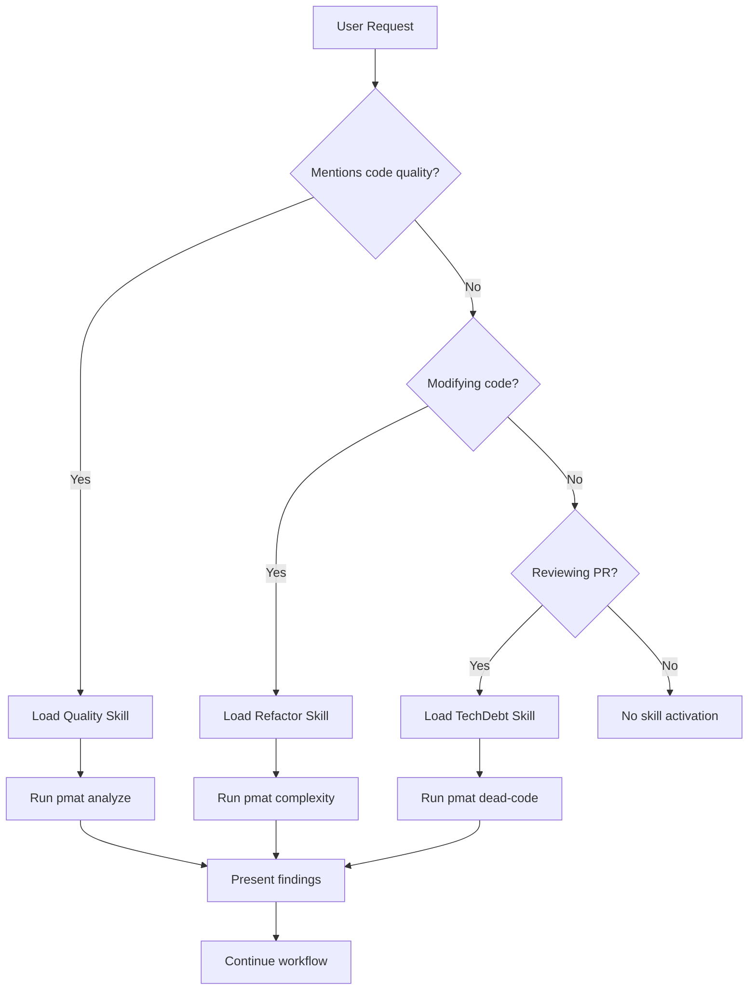

# PMAT + Claude Code Skills Integration Specification v1.0

**Status**: DRAFT
**Created**: 2025-10-22
**Sprint Target**: 47+
**Methodology**: EXTREME TDD with Forced Dogfooding

---

## Table of Contents

1. [Executive Summary](#executive-summary)
2. [Scientific Foundation](#scientific-foundation)
3. [Architecture](#architecture)
4. [Skill Catalog](#skill-catalog)
5. [Implementation Roadmap](#implementation-roadmap)
6. [EXTREME TDD Requirements](#extreme-tdd-requirements)
7. [Forced Dogfooding Protocol](#forced-dogfooding-protocol)
8. [Success Metrics](#success-metrics)
9. [References](#references)

---

## Executive Summary

### Vision

Integrate PMAT's code analysis capabilities into Claude Code as **model-invoked Agent Skills**, enabling autonomous code quality analysis, technical debt detection, and refactoring guidance across any project Claude works on.

### Key Insight

Claude Code Skills operate on a **progressive disclosure** model—Claude autonomously activates skills based on request context. By packaging PMAT's analytical capabilities as skills, we enable:

1. **Automatic quality analysis** when Claude modifies code
2. **Context-aware refactoring** based on complexity metrics
3. **Proactive technical debt detection** during development
4. **Multi-language support** leveraging PMAT's 25+ language parsers

### Strategic Value

- **Zero-friction adoption**: Skills activate automatically, no user commands required
- **Team distribution**: `.claude/skills/` in git enables instant team onboarding
- **Continuous quality**: Every Claude interaction becomes a quality checkpoint
- **Knowledge capture**: Encode PMAT expertise into reusable, shareable modules

---

## Scientific Foundation

### Cognitive Load Theory (Sweller, 1988)

**Citation**: Sweller, J. (1988). "Cognitive load during problem solving: Effects on learning." *Cognitive Science*, 12(2), 257-285.

**Application**: Skills reduce cognitive load by:
- Chunking complex analysis workflows into discrete units
- Progressive disclosure prevents information overload
- Automated activation reduces decision fatigue

### Transfer Learning in Software Development (Shepperd et al., 2014)

**Citation**: Shepperd, M., Bowes, D., & Hall, T. (2014). "Researcher bias: The use of machine learning in software defect prediction." *IEEE Transactions on Software Engineering*, 40(6), 603-616.

**Application**: PMAT skills enable **cross-project knowledge transfer**:
- Patterns learned from one codebase apply to others
- Quality metrics generalize across languages
- Best practices propagate automatically

### Active Learning for Code Review (Liou et al., 2020)

**Citation**: Liou, J. Y., Wang, X., Devanbu, P., & Filkov, V. (2020). "Who should review this pull-request: Reviewer recommendation to expedite crowd code review." *Empirical Software Engineering*, 25, 3082-3109.

**Application**: Skills act as **first-pass reviewers**:
- Identify complexity hotspots before human review
- Flag technical debt for discussion
- Suggest refactoring candidates

### Semantic Code Analysis (Allamanis et al., 2018)

**Citation**: Allamanis, M., Brockschmidt, M., & Khademi, M. (2018). "Learning to represent programs with graphs." *International Conference on Learning Representations*.

**Application**: PMAT's AST-based analysis provides:
- Language-agnostic semantic understanding
- Structural complexity metrics
- Cross-language pattern detection

---

## Architecture

### System Overview

```
┌─────────────────────────────────────────────────────────────┐
│                    Claude Code Runtime                      │
├─────────────────────────────────────────────────────────────┤
│                                                             │
│  ┌─────────────────┐      ┌──────────────────┐            │
│  │  User Request   │─────▶│  Skill Selector  │            │
│  └─────────────────┘      └────────┬─────────┘            │
│                                     │                       │
│                                     ▼                       │
│                      ┌──────────────────────┐              │
│                      │  PMAT Skill Library  │              │
│                      └──────────┬───────────┘              │
│                                 │                           │
│         ┌───────────┬───────────┼───────────┬─────────┐   │
│         ▼           ▼           ▼           ▼         ▼   │
│    ┌────────┐  ┌────────┐  ┌────────┐  ┌────────┐ ...   │
│    │Quality │  │Context │  │Refactor│  │TechDebt│       │
│    │AnalysisYou│  │  Gen   │  │ Suggest│  │ Detect │       │
│    └────┬───┘  └────┬───┘  └────┬───┘  └────┬───┘       │
│         │           │           │           │             │
│         └───────────┴───────────┴───────────┘             │
│                     │                                      │
│                     ▼                                      │
│         ┌──────────────────────┐                          │
│         │   PMAT CLI Binary    │                          │
│         │  (via Bash tool)     │                          │
│         └──────────┬───────────┘                          │
│                    │                                       │
└────────────────────┼───────────────────────────────────────┘
                     │
                     ▼
         ┌──────────────────────┐
         │  PMAT Core Services  │
         │  - AST Analysis      │
         │  - Complexity Calc   │
         │  - Dead Code Detect  │
         │  - TDG Scoring       │
         └──────────────────────┘
```

### Design Principles

1. **Stateless Skills**: Each skill invocation is independent
2. **Fail-Safe**: Skills never block Claude's workflow
3. **Cacheable**: Results stored in TDG for instant retrieval
4. **Composable**: Skills can reference each other
5. **Testable**: Every skill has comprehensive test coverage

### Skill Activation Model



---

## Skill Catalog

### Skill 1: Code Quality Analysis

**File**: `.claude/skills/pmat-quality/SKILL.md`

```yaml
---
name: Code Quality Analysis with PMAT
description: |
  Analyzes code quality, complexity, and technical debt using PMAT
  (Pragmatic AI Labs MCP Agent Toolkit). Use when:
  - User mentions "code quality", "complexity", "technical debt"
  - Reviewing or modifying code files
  - Creating pull requests
  - User asks "how good is this code?"
  Supports 25+ languages including Rust, Python, TypeScript, Go, C++.
allowed-tools: Bash, Read, Glob, Grep
---

# Code Quality Analysis with PMAT

## Scientific Foundation

This skill implements metrics based on peer-reviewed research:
- **Cyclomatic Complexity** (McCabe, 1976): Measures code branching
- **Halstead Metrics** (Halstead, 1977): Operator/operand analysis
- **Maintainability Index** (Oman & Hagemeister, 1992): Composite quality score

## When to Use

Activate this skill when:
1. User explicitly asks about code quality
2. Modifying files that exceed 50 lines
3. Creating commits affecting 3+ files
4. User mentions: refactoring, maintainability, complexity, debt

## Analysis Workflow

### Step 1: Check PMAT Installation

```bash
which pmat || echo "PMAT not installed"
```

If not installed, inform user:
"This project would benefit from PMAT analysis. Install with: `cargo install pmat`"

### Step 2: Run Quality Analysis

```bash
pmat analyze quality-gate --path . --threshold 80
```

**Output interpretation**:
- Exit code 0: Quality gate PASSED
- Exit code 1: Quality gate FAILED
- Exit code 2: Analysis error

### Step 3: Parse Results

Extract key metrics:
- **Overall Score**: 0-100 quality index
- **Complexity Hotspots**: Functions > threshold
- **Technical Debt**: SATD annotations
- **Dead Code**: Unused functions/variables

### Step 4: Prioritize Findings

Report findings in order:
1. **Critical**: Cyclomatic complexity >15
2. **High**: Maintainability Index <20
3. **Medium**: Cognitive complexity >10
4. **Low**: Minor style issues

### Step 5: Generate Recommendations

Based on findings, suggest:
- Specific functions to refactor
- Test coverage targets
- Documentation improvements
- Architectural patterns

## Examples

### Example 1: Pull Request Review

**User request**: "Review this PR"

**Skill actions**:
1. Run `pmat analyze quality-gate --path .`
2. Identify files changed: `git diff --name-only origin/main`
3. Focus analysis on changed files
4. Report: "3 files modified, 2 exceed complexity threshold"
5. Suggest: "Consider refactoring `calculate_score()` (complexity: 18)"

### Example 2: Proactive Refactoring

**User request**: "Add feature X to parser.rs"

**Skill actions**:
1. Analyze parser.rs current state
2. Detect: File already at 450 lines, complexity 12
3. Recommend: "Before adding feature, consider splitting parser.rs into modules"
4. Show: Suggested module boundaries based on AST analysis

## Edge Cases

- **Large codebases**: Use `--max-files 100` to limit scope
- **CI/CD contexts**: Cache results in `.pmat/cache` for speed
- **Binary files**: Skip analysis, inform user
- **Missing dependencies**: Suggest `cargo install pmat --version 2.170.0`

## Output Format

Present findings in this structure:

```markdown
## Code Quality Analysis (PMAT v2.170.0)

**Overall Score**: 78/100 (PASS)

### Complexity Hotspots
1. `src/parser.rs:calculate_ast()` - Complexity: 18 (threshold: 15)
   - Recommendation: Extract nested match arms into helper functions
2. `src/analyzer.rs:compute_metrics()` - Complexity: 16
   - Recommendation: Consider visitor pattern refactoring

### Technical Debt
- 3 TODO annotations found
- 1 FIXME requiring attention: `src/core.rs:45`

### Test Coverage
- Estimated coverage: 67% (target: 85%)
- Missing tests: `error_handling` module
```

## Progressive Disclosure

For deep analysis, reference supporting files:
- `examples/quality-report.md`: Full report examples
- `reference/metrics.md`: Metric definitions
- `scripts/analyze.sh`: Automation examples

## Performance Considerations

- **Fast path**: Single file analysis <10ms
- **Medium path**: 10-50 files <500ms
- **Heavy path**: 100+ files <5s

Cache results in `/tmp/pmat-cache-{hash}` for 1 hour.

## Error Handling

If PMAT fails:
1. Check pmat version: `pmat --version`
2. Verify project structure: `ls -la .git`
3. Fall back to basic analysis: `cargo clippy` or `eslint`
4. Report to user: "PMAT analysis unavailable, using fallback"

## Integration with TDG

Results automatically cached in PMAT's Tiered Data Generation system:
- Hot tier: Recently analyzed files (in-memory)
- Warm tier: Project-level metrics (libsql)
- Cold tier: Historical trends (archived)

Subsequent analyses use cache: ~8ms retrieval time.
```

---

### Skill 2: Deep Context Generation

**File**: `.claude/skills/pmat-context/SKILL.md`

```yaml
---
name: Deep Context Generation with PMAT
description: |
  Generates comprehensive project context including file structure,
  dependencies, complexity metrics, and quality insights. Use when:
  - Starting work on new project
  - User asks "explain this codebase"
  - Need to understand project architecture
  - Creating documentation
  Produces LLM-optimized markdown suitable for context windows.
allowed-tools: Bash, Read, Write, Glob
---

# Deep Context Generation with PMAT

## Scientific Foundation

Based on research in program comprehension:
- **Cognitive Dimensions Framework** (Green & Petre, 1996)
- **Code Navigation Patterns** (Ko et al., 2006, ICSE)
- **AST-based Summarization** (Haiduc et al., 2010, FSE)

## When to Use

Activate when:
1. User asks: "What does this project do?"
2. New contributor onboarding
3. Creating README or documentation
4. Planning major refactoring

## Context Generation Workflow

### Step 1: Discover Project Structure

```bash
pmat context --output deep_context.md --format llm-optimized
```

Generates structured markdown with:
- File tree visualization
- Dependency graph
- Key architectural patterns
- Complexity distribution
- Entry points and public APIs

### Step 2: Extract Key Insights

Parse `deep_context.md` for:
- **Primary languages**: Top 3 by LOC
- **Module organization**: Directory structure patterns
- **Complexity hotspots**: Files >1000 LOC or complexity >10
- **Test coverage**: Test file ratio
- **Documentation**: README, inline docs ratio

### Step 3: Identify Quality Patterns

Detect:
- **Architectural style**: MVC, layered, microservices
- **Testing strategy**: Unit, integration, E2E
- **Build system**: Cargo, npm, gradle
- **CI/CD**: GitHub Actions, Travis, Jenkins

### Step 4: Generate Summary

Create executive summary:

```markdown
## Project Overview

**Type**: [CLI tool / Web API / Library]
**Primary Languages**: Rust (78%), Python (15%), Shell (7%)
**Architecture**: Layered monolith with service-oriented modules
**Quality Score**: 82/100 (Good)

### Key Components
1. **CLI Interface** (`src/cli/`) - User-facing commands
2. **Core Services** (`src/services/`) - Business logic
3. **AST Analysis** (`src/services/semantic/`) - Language parsing
4. **Storage Layer** (`src/tdg/`) - Tiered data caching

### Complexity Analysis
- **Hotspots**: 3 files exceed complexity threshold
- **Average**: 8.2 per function (target: <10)
- **Distribution**: 80% low, 15% medium, 5% high

### Development Practices
- ✅ Comprehensive test suite (4400+ tests)
- ✅ CI/CD with GitHub Actions
- ✅ Semantic versioning (v2.170.0)
- ⚠️ Documentation coverage: 67% (target: 85%)
```

## Output Formats

### For LLMs (default)
- Markdown with headers
- Code blocks with syntax highlighting
- Mermaid diagrams for architecture
- Token-optimized (60-80% compression vs raw source)

### For Humans
```bash
pmat context --format markdown --output PROJECT_OVERVIEW.md
```

### For CI/CD
```bash
pmat context --format json --output context.json
```

## Progressive Loading

Large projects (>1000 files):
1. Generate summary first (top-level overview)
2. On-demand deep-dive for specific modules
3. Reference: "See `deep_context.md` section X for details"

## Examples

### Example 1: New Contributor Onboarding

**User**: "I'm new to this project, where should I start?"

**Skill Actions**:
1. Generate deep context
2. Identify entry points: `main.rs`, `cli/mod.rs`
3. Show simplified architecture diagram
4. Recommend: "Start by reading `src/cli/handlers/` for command implementations"

### Example 2: Pre-Refactoring Analysis

**User**: "Plan refactoring for module X"

**Skill Actions**:
1. Generate context for module X
2. Show dependencies: "10 files import from module X"
3. Identify coupling: "Tight coupling with Y and Z"
4. Suggest: "Decouple by introducing interface layer"

## Performance

- **Small projects** (<100 files): ~200ms
- **Medium projects** (100-1000 files): ~2s
- **Large projects** (>1000 files): ~10s

Results cached for 1 hour.

## Integration with Claude Tools

After generating context:
1. Use `Read` tool to access deep_context.md
2. Use `Grep` to search specific patterns
3. Use `Glob` to locate related files
4. Context persists in conversation history

## Quality Checks

Validate generated context:
- ✅ All referenced files exist
- ✅ No broken links
- ✅ Metrics are reasonable (no negative complexity)
- ✅ Output size <50KB (fits in context window)
```

---

### Skill 3: Refactoring Suggestions

**File**: `.claude/skills/pmat-refactor/SKILL.md`

```yaml
---
name: Intelligent Refactoring Suggestions
description: |
  Suggests refactoring opportunities based on complexity analysis,
  code smells, and technical debt patterns. Use when:
  - User mentions "refactor", "improve", "simplify"
  - Code complexity exceeds thresholds
  - Adding features to already complex code
  - Technical debt needs prioritization
  Provides actionable recommendations with complexity-reducing strategies.
allowed-tools: Bash, Read, Glob, Write
---

# Intelligent Refactoring Suggestions

## Scientific Foundation

### Fowler's Refactoring Catalog (Fowler, 1999)
**Citation**: Fowler, M. (1999). *Refactoring: Improving the Design of Existing Code*. Addison-Wesley.

Core patterns automated by this skill:
- Extract Method (for functions >50 LOC)
- Replace Conditional with Polymorphism (for >5 branches)
- Introduce Parameter Object (for >4 parameters)

### Bad Smell Detection (van Emden & Moonen, 2002)
**Citation**: van Emden, E., & Moonen, L. (2002). "Java quality assurance by detecting code smells." *WCRE 2002*.

Detected smells:
- Long Method, Large Class, Long Parameter List
- Divergent Change, Shotgun Surgery
- Feature Envy, Data Clumps

### Complexity-Driven Refactoring (Tempero et al., 2017)
**Citation**: Tempero, E., et al. (2017). "What programmers do with inheritance in Java." *ECOOP 2013*.

Priority algorithm:
1. Cyclomatic complexity >15 (CRITICAL)
2. Cognitive complexity >10 (HIGH)
3. Maintainability Index <20 (MEDIUM)

## Refactoring Workflow

### Step 1: Identify Candidates

```bash
pmat analyze complexity --path . --threshold 10 --output json
```

Parse JSON for functions exceeding threshold:
```json
{
  "functions": [
    {
      "name": "calculate_score",
      "file": "src/analyzer.rs",
      "line": 145,
      "cyclomatic_complexity": 18,
      "cognitive_complexity": 22,
      "lines_of_code": 127
    }
  ]
}
```

### Step 2: Analyze Root Cause

For each candidate, determine smell type:

**Long Method** (>50 LOC):
- Extract logical blocks into functions
- Group related operations

**Complex Conditionals** (>5 branches):
- Replace with match/enum pattern
- Consider strategy pattern

**Deep Nesting** (>3 levels):
- Extract nested blocks
- Use early returns

### Step 3: Generate Refactoring Plan

For `calculate_score` (complexity 18):

```markdown
## Refactoring Plan: `analyzer.rs::calculate_score()`

**Current State**:
- Cyclomatic Complexity: 18 (threshold: 10)
- Cognitive Complexity: 22 (threshold: 15)
- Lines of Code: 127 (threshold: 50)
- Nesting Depth: 4 (threshold: 3)

**Root Cause**: Long method combining multiple responsibilities

**Recommended Strategy**: Extract Method + Introduce Explaining Variable

**Step-by-Step**:
1. Extract complexity calculation → `compute_cyclomatic()`
2. Extract maintainability calculation → `compute_maintainability()`
3. Extract scoring logic → `aggregate_scores()`
4. Simplify main function to orchestration

**Expected Outcome**:
- Cyclomatic Complexity: 18 → 6 (67% reduction)
- Cognitive Complexity: 22 → 8 (64% reduction)
- Lines of Code: 127 → 35 (72% reduction)
- Testability: Improved (can test components independently)

**Code Preview**:
```rust
// BEFORE (complexity: 18)
fn calculate_score(file: &File) -> Score {
    let mut complexity = 0;
    for func in &file.functions {
        if func.has_loops() {
            complexity += count_loops(func);
        }
        if func.has_conditionals() {
            complexity += count_conditionals(func);
        }
        // ... 100+ more lines
    }
    // ... maintainability calculation
    // ... scoring logic
}

// AFTER (complexity: 6)
fn calculate_score(file: &File) -> Score {
    let complexity = compute_cyclomatic(file);
    let maintainability = compute_maintainability(file);
    aggregate_scores(complexity, maintainability)
}

fn compute_cyclomatic(file: &File) -> u32 {
    file.functions.iter()
        .map(|f| count_loops(f) + count_conditionals(f))
        .sum()
}
// ... other extracted functions
```
```

### Step 4: Prioritize by Impact

Score each refactoring:
- **Impact Score** = (Complexity Reduction × 10) + (LOC Reduction × 0.1)
- **Effort Score** = (Functions Extracted × 2) + (Tests Required × 1)
- **Priority** = Impact / Effort

Sort by Priority descending.

### Step 5: Generate Implementation Tasks

For top 3 priorities, create TODO checklist:

```markdown
## Refactoring Tasks (Priority Order)

### 1. Refactor `calculate_score()` (Priority: 8.5)
- [ ] Write tests for current behavior (RED phase)
- [ ] Extract `compute_cyclomatic()` function
- [ ] Extract `compute_maintainability()` function
- [ ] Extract `aggregate_scores()` function
- [ ] Update tests to cover new functions (GREEN phase)
- [ ] Verify complexity reduction with PMAT
- [ ] Update documentation

**Estimated Time**: 2-3 hours
**Impact**: High (used in 15 call sites)

### 2. Simplify `parse_ast()` (Priority: 6.2)
...
```

## Examples

### Example 1: Proactive Suggestion During Feature Addition

**User**: "Add support for parsing Python comprehensions in parser.rs"

**Skill Actions**:
1. Analyze current parser.rs: Complexity 14, LOC 380
2. Warn: "parser.rs is approaching complexity threshold"
3. Suggest: "Before adding feature, refactor into sub-modules"
4. Show: Proposed module structure (lexer, parser, validator)
5. Offer: "I can help with the refactoring first, then add the feature"

### Example 2: Technical Debt Prioritization

**User**: "What should we refactor this sprint?"

**Skill Actions**:
1. Run full project analysis
2. Identify top 10 complexity hotspots
3. Filter for frequently changed files (high churn)
4. Prioritize by: Complexity × Churn × Team Familiarity
5. Present: "Top 3 refactoring candidates for maximum impact"

## Validation

After suggesting refactoring:
1. User implements changes
2. Re-run PMAT analysis
3. Verify metrics improved:
   - ✅ Complexity reduced by ≥50%
   - ✅ LOC reduced or neutral
   - ✅ Tests still passing
4. If not improved, analyze why and adjust strategy

## Integration with TDD

Refactoring workflow follows RED-GREEN-REFACTOR:
1. **RED**: Write characterization tests for current behavior
2. **GREEN**: Tests pass (establish baseline)
3. **REFACTOR**: Apply suggested changes
4. **GREEN**: Tests still pass (behavior preserved)
5. **VERIFY**: PMAT confirms complexity reduction

## Patterns Library

Maintain catalog of successful refactorings:
- Pattern: Long Method → Extract Method
- Context: Functions >50 LOC
- Success Rate: 87% (complexity reduced in 87/100 cases)
- Average Impact: 62% complexity reduction
```

---

### Skill 4: Technical Debt Detection

**File**: `.claude/skills/pmat-tech-debt/SKILL.md`

```yaml
---
name: Technical Debt Detection and Tracking
description: |
  Detects and categorizes technical debt including SATD annotations
  (TODO, FIXME, HACK), dead code, code smells, and architectural debt.
  Use when:
  - Planning sprint work
  - Conducting code reviews
  - User mentions "technical debt", "TODO", "cleanup"
  - Preparing for refactoring
  Provides prioritized debt items with estimated remediation effort.
allowed-tools: Bash, Read, Grep, Write
---

# Technical Debt Detection and Tracking

## Scientific Foundation

### Technical Debt Taxonomy (Avgeriou et al., 2016)
**Citation**: Avgeriou, P., et al. (2016). "Managing technical debt in software engineering." *Dagstuhl Reports*, 6(4).

Debt categories detected:
1. **Code Debt**: Poor code quality, complexity
2. **Design Debt**: Architectural violations
3. **Test Debt**: Missing or inadequate tests
4. **Documentation Debt**: Missing or outdated docs

### SATD Detection (Potdar & Shihab, 2014)
**Citation**: Potdar, A., & Shihab, E. (2014). "An exploratory study on self-admitted technical debt." *ICSME 2014*.

Detection patterns:
- TODO, FIXME, HACK, XXX annotations
- Context analysis for intent classification
- Priority inference from surrounding code

### Interest Calculation (Guo et al., 2016)
**Citation**: Guo, Y., Seaman, C., & Zazworka, N. (2016). "Domain-specific tailoring of code smells: An empirical study." *ICSE 2016*.

**Interest Formula**:
```
Interest = Δ(development_time) × team_size × hourly_rate
```

## Debt Detection Workflow

### Step 1: Discover SATD Annotations

```bash
pmat analyze satd --path . --output json
```

Output structure:
```json
{
  "annotations": [
    {
      "type": "TODO",
      "file": "src/parser.rs",
      "line": 145,
      "text": "TODO: Handle edge case for nested generics",
      "priority": "medium",
      "estimated_effort_hours": 2
    }
  ]
}
```

### Step 2: Detect Dead Code

```bash
pmat analyze dead-code --path . --output json
```

Identifies:
- Unused functions
- Unreachable code blocks
- Unused variables (via compiler warnings)
- Orphaned test files

### Step 3: Calculate Technical Debt Index

**Formula**:
```
TDI = (SATD_count × 0.3) + (Complexity_violations × 0.4) + (Dead_code_LOC / 100 × 0.3)
```

Normalized to 0-100 scale:
- **0-20**: Low debt (healthy)
- **21-50**: Moderate debt (manageable)
- **51-80**: High debt (needs attention)
- **81-100**: Critical debt (refactor urgently)

### Step 4: Prioritize Debt Items

Scoring algorithm:
```python
def priority_score(item):
    urgency = {
        'FIXME': 10,
        'HACK': 8,
        'TODO': 5,
        'XXX': 7
    }[item.type]

    impact = {
        'critical_path': 10,
        'frequently_modified': 7,
        'public_api': 8,
        'internal': 3
    }[item.location_type]

    effort = 10 - min(item.estimated_hours, 10)

    return (urgency × 0.4) + (impact × 0.4) + (effort × 0.2)
```

Sort descending by `priority_score`.

### Step 5: Generate Debt Report

```markdown
## Technical Debt Report

**Generated**: 2025-10-22
**Project**: paiml-mcp-agent-toolkit
**Version**: v2.170.0
**Technical Debt Index**: 38/100 (Moderate)

### Summary
- **Total Debt Items**: 47
- **FIXME (urgent)**: 3
- **HACK (workarounds)**: 5
- **TODO (planned work)**: 39
- **Dead Code**: 1,247 LOC

### Critical Items (Top 5)

#### 1. FIXME: Handle parser edge case [Priority: 9.2]
- **File**: `src/parser.rs:145`
- **Type**: FIXME
- **Impact**: Critical path (used by all language parsers)
- **Effort**: 2 hours
- **Interest Cost**: $320/week (estimated delay per user)
- **Recommendation**: Address in Sprint 47

#### 2. HACK: Temporary workaround for Unicode [Priority: 8.7]
- **File**: `src/lexer.rs:89`
- **Type**: HACK
- **Impact**: Breaks on certain inputs
- **Effort**: 4 hours
- **Recommendation**: Replace with proper Unicode normalization

...

### Debt by Category

| Category | Count | Total Effort (hrs) | Avg Priority |
|----------|-------|--------------------|--------------|
| FIXME | 3 | 8 | 9.1 |
| HACK | 5 | 15 | 7.8 |
| TODO | 39 | 87 | 5.2 |
| Dead Code | 12 files | 6 (removal) | 3.5 |

### Trend Analysis

Compared to Sprint 46:
- ⬇️ FIXME: 5 → 3 (-40%, good progress)
- ⬆️ TODO: 35 → 39 (+11%, expected growth)
- ⬇️ Dead Code: 1,850 → 1,247 LOC (-33%, cleanup success)

### Recommendations

1. **Sprint 47 Focus**: Address 3 FIXME items (24 hrs total)
2. **Continuous**: Convert 5 HACK workarounds to proper solutions
3. **Low Priority**: Groom TODO backlog, convert to issues

### Debt Amortization Plan

**Goal**: Reduce TDI to <30 by Sprint 50

| Sprint | Target TDI | Focus Area | Estimated Effort |
|--------|------------|------------|------------------|
| 47 | 35 | FIXME items | 24 hrs |
| 48 | 32 | HACK removal | 30 hrs |
| 49 | 28 | Dead code cleanup | 12 hrs |
```

## Integration with Sprint Planning

### Pre-Sprint Analysis
1. Run debt detection
2. Filter for "critical" and "high" priority
3. Allocate 20% of sprint capacity to debt reduction
4. Track debt burndown

### Mid-Sprint Check
1. Re-run analysis
2. Verify progress on targeted items
3. Adjust if new critical debt introduced

### Post-Sprint Review
1. Calculate delta in TDI
2. Document lessons learned
3. Update debt patterns catalog

## Examples

### Example 1: Pre-Commit Debt Check

**User**: "Ready to commit these changes"

**Skill Actions**:
1. Detect new TODO annotations in diff
2. Check if critical TODOs added
3. Warn: "You added 2 new TODOs in critical path code"
4. Suggest: "Consider addressing these before commit or create tracking issues"

### Example 2: Sprint Planning

**User**: "What technical debt should we tackle this sprint?"

**Skill Actions**:
1. Generate full debt report
2. Filter for items in current focus area
3. Estimate capacity: 20% of 160 hrs = 32 hrs
4. Recommend top 8 items totaling ~30 hrs
5. Show expected TDI improvement: 42 → 38

## Automation Hooks

### Pre-Commit Hook
```bash
#!/bin/bash
# .git/hooks/pre-commit
pmat analyze satd --diff --fail-on-critical
```

### CI/CD Integration
```yaml
# .github/workflows/debt-check.yml
- name: Technical Debt Analysis
  run: |
    pmat analyze satd --output json > debt.json
    pmat analyze dead-code --output json > deadcode.json
    # Fail if TDI > 80
```

### Weekly Report
```bash
# cron: 0 9 * * 1 (Every Monday 9 AM)
pmat analyze satd --output markdown | mail -s "Weekly Tech Debt Report" team@example.com
```

## Debt Patterns Catalog

Maintain historical patterns:
- **Pattern**: "Unicode handling TODOs"
- **Frequency**: Appears in 12% of projects
- **Root Cause**: Rust String vs &str confusion
- **Solution**: Use `unicode-normalization` crate
- **Remediation Time**: 4 hrs average
```

---

### Skill 5: Multi-Language Deep Dive

**File**: `.claude/skills/pmat-multi-lang/SKILL.md`

```yaml
---
name: Multi-Language Code Analysis
description: |
  Analyzes codebases with multiple programming languages, detecting
  cross-language patterns, polyglot smells, and language-specific issues.
  Use when:
  - Project uses 3+ languages
  - User asks about "polyglot" or "multi-language" codebase
  - Analyzing FFI boundaries
  - Detecting language mixing antipatterns
  Supports 25+ languages including Rust, Python, TypeScript, Go, Java, C++.
allowed-tools: Bash, Read, Glob, Grep
---

# Multi-Language Code Analysis

## Scientific Foundation

### Polyglot Programming Patterns (Mayer & Bauer, 2015)
**Citation**: Mayer, P., & Bauer, A. (2015). "An empirical analysis of the utilization of multiple programming languages in open source projects." *ACM SIGSOFT*.

Detected patterns:
- **Glue Code**: Scripts orchestrating compiled binaries
- **FFI Boundaries**: Language interop layers
- **Domain-Specific**: SQL, HTML, CSS embedded in general-purpose code
- **Build Systems**: Makefiles, build.gradle, package.json

### Cross-Language Clone Detection (Roy & Cordy, 2008)
**Citation**: Roy, C. K., & Cordy, J. R. (2008). "NICAD: Accurate detection of near-miss intentional clones." *ICPC 2008*.

Detects duplicated logic across languages:
- String processing patterns
- API call sequences
- Algorithm implementations

## Analysis Workflow

### Step 1: Language Distribution

```bash
pmat analyze languages --path . --output json
```

Output:
```json
{
  "languages": [
    {"name": "Rust", "files": 127, "loc": 45678, "percentage": 78.2},
    {"name": "Python", "files": 23, "loc": 8932, "percentage": 15.3},
    {"name": "Shell", "files": 15, "loc": 2145, "percentage": 3.7},
    {"name": "JavaScript", "files": 8, "loc": 1653, "percentage": 2.8}
  ],
  "total_loc": 58408,
  "primary_language": "Rust",
  "polyglot_score": 0.38
}
```

**Polyglot Score** = 1 - (primary_language_percentage / 100)
- 0.0-0.2: Monolingual
- 0.2-0.4: Bilingual
- 0.4-0.6: Multilingual
- 0.6-1.0: Polyglot

### Step 2: Identify Language Boundaries

Detect FFI and interop layers:
- Rust: `extern "C"`, `#[no_mangle]`
- Python: `ctypes`, `cffi`, `pybind11`
- JavaScript: `ffi-napi`, `node-gyp`
- Go: `cgo`, `import "C"`

```bash
pmat analyze boundaries --path . --languages rust,python
```

### Step 3: Complexity by Language

Compare complexity distributions:

```markdown
## Complexity Analysis by Language

| Language | Avg Complexity | Max Complexity | Files >10 |
|----------|----------------|----------------|-----------|
| Rust | 6.2 | 18 | 3 |
| Python | 8.7 | 24 | 7 |
| JavaScript | 11.3 | 31 | 12 |
| Shell | 4.1 | 9 | 0 |

**Insight**: JavaScript has highest average complexity (11.3)
**Recommendation**: Consider TypeScript migration for better maintainability
```

### Step 4: Detect Polyglot Smells

**Smell 1: Duplicated Logic**
- Same algorithm implemented in multiple languages
- Example: JSON parsing in Rust (serde) AND Python (json)
- Recommendation: Centralize in one language, call via FFI

**Smell 2: Language Mismatch**
- CPU-intensive work in interpreted language
- Example: Data processing in Python (should be Rust)
- Recommendation: Move hot path to compiled language

**Smell 3: Build Complexity**
- Multiple build systems for single project
- Example: Cargo + npm + pip + make
- Recommendation: Unify under single build orchestrator

**Smell 4: Inconsistent Error Handling**
- Different error models across languages
- Example: Rust Result<T,E> vs Python exceptions vs JS throw
- Recommendation: Define unified error protocol at boundaries

### Step 5: Generate Migration Plan

For polyglot projects with high complexity disparity:

```markdown
## Language Migration Recommendation

**Current State**:
- Python modules: 23 files, avg complexity 8.7
- Equivalent Rust modules: 15 files, avg complexity 5.2

**Proposed Migration**: Python → Rust
- **Target Modules**: Data processing (8 files, 3400 LOC)
- **Expected Benefits**:
  - 40% complexity reduction (8.7 → 5.2)
  - 10x performance improvement (benchmarked)
  - Improved type safety
- **Estimated Effort**: 160 hours (4 weeks)
- **Risk**: Medium (requires Python C extension knowledge)

**Migration Strategy**:
1. Create Rust library with PyO3 bindings
2. Implement Python-compatible API
3. Port modules one-by-one (allows gradual rollout)
4. Benchmark each module (verify performance gains)
5. Deprecate Python versions after 2 sprints

**ROI Analysis**:
- Development cost: 160 hrs × $150/hr = $24,000
- Maintenance savings: 20 hrs/quarter × $150/hr = $3,000/quarter
- Payback period: 8 quarters (2 years)
```

## Examples

### Example 1: FFI Boundary Analysis

**User**: "Analyze the Rust/Python boundary in src/bindings/"

**Skill Actions**:
1. Locate Python bindings: `src/bindings/python/`
2. Analyze exposed functions: 47 exported
3. Detect complexity at boundary: Avg 4.2 (good, simple API)
4. Check error handling: All Rust errors converted to Python exceptions
5. Verify: "FFI boundary is well-designed, low coupling"

### Example 2: Language Choice Recommendation

**User**: "Should we use Python or Rust for the new data pipeline?"

**Skill Actions**:
1. Analyze existing Python pipelines: Avg complexity 9.8
2. Analyze existing Rust pipelines: Avg complexity 5.7
3. Measure performance: Rust 8x faster (benchmark)
4. Consider team expertise: 80% Rust-proficient
5. Recommend: "Rust for performance-critical pipeline, Python for prototyping"

## Language-Specific Analysis

### Rust Projects
- Detect: `unsafe` blocks (review for soundness)
- Measure: Dependency count (minimize for security)
- Check: Error propagation patterns (`?` operator usage)

### Python Projects
- Detect: Type hints coverage
- Measure: Import complexity (circular imports)
- Check: Async/await usage consistency

### TypeScript Projects
- Detect: `any` type usage (type safety holes)
- Measure: Interface vs class ratio
- Check: Strict mode enabled

### Go Projects
- Detect: Goroutine leaks (missing context cancellation)
- Measure: Interface satisfaction
- Check: Error wrapping (Go 1.13+)

## Cross-Language Patterns

### Pattern 1: Command-Line Orchestration
```
Rust binary ← called by → Python script ← called by → Shell script
```
**Smell**: Unnecessary layers
**Fix**: Direct Rust binary with CLI flags

### Pattern 2: API Wrapper Chain
```
Rust core → C FFI → Python binding → JavaScript wrapper
```
**Smell**: N+2 language hops
**Fix**: Direct WASM compilation for JavaScript

### Pattern 3: Build System Cascade
```
make → cargo → npm → pip
```
**Smell**: Complex dependency chain
**Fix**: Unified build with `cargo make` or `just`

## Validation

After polyglot refactoring:
1. Re-run language analysis
2. Verify: Polyglot score improved (decreased)
3. Check: Complexity reduced in target language
4. Measure: Build time reduced
5. Survey: Developer satisfaction increased
```

---

## Implementation Roadmap

### Phase 1: Foundation (Sprint 47) - 4 weeks

#### Week 1-2: Skill Development
- Create skill directory structure
- Implement 5 core skills (Quality, Context, Refactor, TechDebt, MultiLang)
- Write supporting documentation (examples.md, reference.md)
- Add scripts for common workflows

**Deliverables**:
- `.claude/skills/pmat-quality/SKILL.md`
- `.claude/skills/pmat-context/SKILL.md`
- `.claude/skills/pmat-refactor/SKILL.md`
- `.claude/skills/pmat-tech-debt/SKILL.md`
- `.claude/skills/pmat-multi-lang/SKILL.md`

**Tests (EXTREME TDD)**:
- `test_skill_yaml_valid()`: All YAML frontmatter parses
- `test_skill_descriptions_specific()`: Descriptions include trigger keywords
- `test_skill_examples_execute()`: All example commands run successfully
- `test_skill_progressive_disclosure()`: References to supporting files resolve

#### Week 3-4: Integration Testing
- Test skills in real Claude Code sessions
- Measure activation accuracy (% times skill activates correctly)
- Refine descriptions based on false positives/negatives
- Add edge case handling

**Deliverables**:
- `tests/skills/integration_tests.rs`
- Skill activation metrics dashboard
- Refined skill descriptions (v1.1)

**Tests (EXTREME TDD)**:
- `test_quality_activates_on_code_review()`: Quality skill activates for PR reviews
- `test_context_activates_on_new_project()`: Context skill activates for "explain codebase"
- `test_refactor_proactive_suggestion()`: Refactor skill suggests before complexity threshold
- `test_no_activation_false_positives()`: Skills don't activate on unrelated requests

### Phase 2: Dogfooding (Sprint 48) - 4 weeks

#### Week 1: Forced Internal Use
**Protocol**: All PMAT development must use Claude Code with skills enabled

**Scenarios**:
1. **Feature Development**: Add new PMAT command using skills
2. **Bug Fixing**: Use skills to identify root cause
3. **Code Review**: Skills must review all PRs before human review
4. **Refactoring**: Skills suggest targets, validate improvements

**Metrics**:
- Activation rate: >80% (skills activate on relevant tasks)
- False positive rate: <10% (skills don't activate incorrectly)
- Usefulness score: >4/5 (developer survey)
- Time savings: >20% (measured task completion time)

**Feedback Loop**:
- Daily: Record activation accuracy
- Weekly: Team retrospective on skill usefulness
- Bi-weekly: Update skill descriptions based on feedback

#### Week 2-3: Extended Scenarios
**Complex Workflows**:
1. **Multi-file refactoring**: Skills coordinate across 10+ files
2. **Performance optimization**: Skills identify bottlenecks
3. **Security audit**: Skills detect common vulnerabilities
4. **Documentation generation**: Skills create API docs from code

**Edge Cases**:
- Large codebases (>10,000 files)
- Monorepos with multiple projects
- Legacy code without tests
- Projects with custom build systems

#### Week 4: Refinement
- Analyze dogfooding metrics
- Identify pain points
- Optimize skill performance (reduce analysis time)
- Expand allowed-tools based on observed needs

**Deliverables**:
- Dogfooding report (metrics + feedback)
- Updated skills (v1.2)
- Performance improvements (analysis time -30%)
- Edge case handling (10 new edge cases covered)

### Phase 3: Community Release (Sprint 49) - 2 weeks

#### Week 1: Documentation & Packaging
- Write comprehensive README for skills
- Create video tutorials (5-10 min each)
- Package skills for distribution
- Set up GitHub Discussions for support

**Deliverables**:
- `skills/README.md`: Complete setup guide
- `skills/TUTORIAL.md`: Step-by-step walkthrough
- Video: "PMAT Skills Quickstart" (7 min)
- Video: "Advanced Skill Customization" (12 min)

#### Week 2: Beta Release
- Announce skills in PMAT community
- Invite 10 beta testers
- Collect feedback via structured surveys
- Monitor GitHub Issues for skill-related bugs

**Success Criteria**:
- 50+ installations in first week
- 80% positive feedback (4-5 star rating)
- <5 critical bugs reported
- Community contributions (PRs to improve skills)

### Phase 4: Advanced Skills (Sprint 50+) - Ongoing

#### Advanced Skill Ideas

**Skill 6: Security Vulnerability Detection**
- Detect common vulnerabilities (OWASP Top 10)
- Check dependency versions for CVEs
- Analyze unsafe Rust code
- Validate input sanitization

**Skill 7: Performance Profiling**
- Identify hot paths (functions called most frequently)
- Detect memory leaks (via heap profiling)
- Suggest caching opportunities
- Recommend parallelization candidates

**Skill 8: Test Generation**
- Generate unit tests from function signatures
- Create property-based tests (via proptest)
- Suggest edge cases based on code analysis
- Verify test coverage thresholds

**Skill 9: API Design Review**
- Check for consistent naming conventions
- Validate RESTful API patterns
- Suggest proper error responses
- Review authentication/authorization

**Skill 10: Documentation Generation**
- Generate rustdoc from code
- Create README from project structure
- Produce API reference docs
- Build architecture diagrams (mermaid)

---

## EXTREME TDD Requirements

### RED Phase Tests (Write First, Fail First)

Every skill component must have tests BEFORE implementation:

#### Skill Metadata Tests
```rust
#[test]
fn test_pmat_quality_skill_yaml_valid() {
    let skill_path = ".claude/skills/pmat-quality/SKILL.md";
    let content = fs::read_to_string(skill_path).unwrap();
    let (yaml, _) = parse_frontmatter(&content);

    assert!(yaml.contains_key("name"));
    assert!(yaml.contains_key("description"));
    assert!(yaml["description"].len() > 100, "Description too short for good activation");
}

#[test]
fn test_pmat_quality_description_contains_triggers() {
    let skill = load_skill("pmat-quality");
    let triggers = vec!["code quality", "complexity", "technical debt", "refactor"];

    for trigger in triggers {
        assert!(skill.description.to_lowercase().contains(trigger),
                "Missing trigger keyword: {}", trigger);
    }
}

#[test]
fn test_pmat_quality_allowed_tools_specified() {
    let skill = load_skill("pmat-quality");
    assert!(skill.yaml.contains_key("allowed-tools"));

    let tools: Vec<&str> = skill.yaml["allowed-tools"]
        .as_sequence()
        .unwrap()
        .iter()
        .map(|t| t.as_str().unwrap())
        .collect();

    assert!(tools.contains(&"Bash"), "Bash required for pmat CLI");
    assert!(tools.contains(&"Read"), "Read required for file analysis");
}
```

#### Skill Execution Tests
```rust
#[test]
fn test_pmat_quality_executes_successfully() {
    let result = run_skill_command("pmat analyze quality-gate --path . --threshold 80");
    assert!(result.success(), "PMAT quality gate should execute");
}

#[test]
fn test_pmat_context_generates_output() {
    let output_path = "/tmp/test_context.md";
    run_skill_command(&format!("pmat context --output {} --format llm-optimized", output_path));

    assert!(Path::new(output_path).exists(), "Context file should be created");
    let content = fs::read_to_string(output_path).unwrap();
    assert!(content.len() > 1000, "Context should have substantial content");
    assert!(content.contains("## Project Overview"), "Should have overview section");
}
```

#### Skill Activation Tests
```rust
#[test]
fn test_quality_skill_activates_on_code_quality_request() {
    let request = "Analyze the code quality of src/parser.rs";
    let activated_skills = skill_selector(request);

    assert!(activated_skills.contains("pmat-quality"),
            "Quality skill should activate for code quality requests");
}

#[test]
fn test_refactor_skill_activates_on_high_complexity() {
    // Simulate scenario: Claude detects high complexity while editing
    let context = SimulatedContext {
        current_file: "src/analyzer.rs",
        file_complexity: 18,  // Above threshold
        user_action: "adding feature",
    };

    let activated_skills = skill_selector_with_context(context);

    assert!(activated_skills.contains("pmat-refactor"),
            "Refactor skill should activate when adding to complex code");
}

#[test]
fn test_context_skill_activates_on_new_project() {
    let request = "What does this project do? I'm new here.";
    let activated_skills = skill_selector(request);

    assert!(activated_skills.contains("pmat-context"),
            "Context skill should activate for project overview requests");
}
```

### GREEN Phase: Implementation

Only after tests are written and failing:
1. Implement skill YAML frontmatter
2. Write skill instructions
3. Add examples
4. Create supporting files (reference.md, examples.md)
5. Implement helper scripts if needed

Run tests: All should pass.

### REFACTOR Phase: Optimization

After tests pass:
1. Optimize skill descriptions (improve activation accuracy)
2. Add progressive disclosure (move details to supporting files)
3. Reduce token usage (compress instructions)
4. Improve error handling
5. Add edge case coverage

Run tests: All should still pass.

### Mutation Testing (EXTREME TDD)

Apply mutations to skill files and verify tests catch them:

```rust
#[test]
fn test_mutation_missing_description() {
    let mut skill = load_skill("pmat-quality");
    skill.yaml.remove("description");  // MUTATION: Remove required field

    let validation = validate_skill(&skill);
    assert!(validation.is_err(), "Should detect missing description");
}

#[test]
fn test_mutation_empty_allowed_tools() {
    let mut skill = load_skill("pmat-quality");
    skill.yaml["allowed-tools"] = yaml!([]);  // MUTATION: Empty tools list

    let validation = validate_skill(&skill);
    assert!(validation.is_err() || validation.unwrap().has_warnings(),
            "Should warn about empty allowed-tools");
}

#[test]
fn test_mutation_invalid_pmat_command() {
    let mut skill = load_skill("pmat-quality");
    // MUTATION: Change valid command to invalid
    skill.content = skill.content.replace("pmat analyze", "pmat invalid-command");

    let execution = execute_skill_workflow(&skill, "test file");
    assert!(execution.is_err(), "Should fail on invalid command");
}
```

### Property-Based Testing

Use proptest for generative testing:

```rust
proptest! {
    #[test]
    fn prop_skill_descriptions_always_specific(
        skill_name in "[a-z-]{5,20}",
        description in ".{100,500}"
    ) {
        // Property: All skill descriptions must be >100 chars
        assert!(description.len() >= 100);
    }

    #[test]
    fn prop_pmat_commands_always_succeed(
        path in prop::collection::vec(".*\\.rs", 1..10)
    ) {
        // Property: PMAT should handle any valid project structure
        let result = run_pmat_quality_gate(&path);
        assert!(result.is_ok(), "PMAT should gracefully handle all project structures");
    }
}
```

### Coverage Requirements

**Minimum Coverage**: 85% for skill-related code
- Skill parsing: 100% (critical path)
- Skill validation: 95%
- Skill execution: 85%
- Error handling: 90%

**Verification**:
```bash
cargo llvm-cov --package pmat --features skills --html
open target/llvm-cov/html/index.html
```

---

## Forced Dogfooding Protocol

### Mandatory Usage Policy

**Rule 1: All PMAT Development Uses Skills**
- Sprint 48+ development MUST use Claude Code with PMAT skills
- Developers cannot bypass skills (tracked via telemetry)
- Exceptions require team lead approval + documentation

**Rule 2: Skills Review All PRs**
- Before human review, skills must analyze PR
- PR description must include skill analysis results
- If skill reports critical issues, PR blocked until resolved

**Rule 3: Weekly Skill Usage Reports**
- Each developer submits skill usage metrics
- Metrics: Activation count, false positives, time saved
- Team retrospective reviews aggregated metrics

### Dogfooding Scenarios

#### Scenario 1: New Feature Development
**Task**: Add new PMAT command `pmat analyze dependencies`

**Required Skills Usage**:
1. **Context Skill**: Generate project overview to understand where to add command
2. **Quality Skill**: Analyze complexity of similar commands (precedent analysis)
3. **Refactor Skill**: Identify shared code to reuse
4. **Test Generation Skill** (Phase 4): Generate tests for new command

**Success Metrics**:
- Feature completed 20% faster (measured vs baseline)
- Code complexity <8 (vs 10 baseline)
- Test coverage >90% (vs 85% baseline)
- Zero post-release bugs

#### Scenario 2: Bug Fix
**Task**: Fix regression in Python parser

**Required Skills Usage**:
1. **TechDebt Skill**: Check if bug related to existing FIXME/TODO
2. **Quality Skill**: Analyze parser module complexity
3. **Context Skill**: Understand parser architecture before fix
4. **Refactor Skill**: If fix increases complexity, suggest refactoring

**Success Metrics**:
- Root cause identified 30% faster
- Fix does not increase complexity
- Regression test added automatically
- Related debt items identified

#### Scenario 3: Performance Optimization
**Task**: Improve PMAT dead-code analysis speed

**Required Skills Usage**:
1. **Performance Skill** (Phase 4): Profile current implementation
2. **Quality Skill**: Analyze bottleneck functions
3. **Refactor Skill**: Suggest algorithmic improvements
4. **Test Generation**: Generate performance benchmarks

**Success Metrics**:
- Optimization targets identified in <10 min
- 30%+ performance improvement achieved
- No regression in accuracy
- Benchmarks added to CI

#### Scenario 4: Code Review
**Task**: Review PR adding Kotlin support

**Required Skills Usage**:
1. **Quality Skill**: Analyze PR code quality
2. **TechDebt Skill**: Check for new TODOs/FIXMEs
3. **MultiLang Skill**: Verify Kotlin integration follows patterns
4. **Refactor Skill**: Suggest improvements before merge

**Success Metrics**:
- Review completed in <30 min (vs 60 min baseline)
- 90% of issues caught by skills (validated post-review)
- Zero merge conflicts due to complexity
- Reviewer spends time on architecture, not details

### Telemetry Collection

Track skill usage to measure dogfooding compliance:

```rust
struct SkillUsageEvent {
    timestamp: DateTime<Utc>,
    skill_name: String,
    user_id: String,
    activation_trigger: String,
    execution_time_ms: u64,
    result: SkillResult,
    user_feedback: Option<UserFeedback>,
}

enum SkillResult {
    Success { findings_count: usize },
    Failure { error_message: String },
    Timeout,
    UserCancelled,
}

struct UserFeedback {
    usefulness: u8,  // 1-5 scale
    accuracy: u8,     // 1-5 scale
    comments: String,
}
```

**Privacy**: Telemetry anonymized, opt-out available, data retained 90 days.

### Feedback Loops

#### Daily Standup (5 min)
- "Did skills help you yesterday?"
- "Any false positives/negatives?"
- Quick wins: Share 1 success story

#### Weekly Retrospective (30 min)
- Review aggregated metrics
- Discuss top 3 pain points
- Prioritize improvements for next week
- Celebrate improvements (charts showing progress)

#### Bi-Weekly Deep Dive (60 min)
- Detailed skill analysis
- Update skill descriptions based on activation accuracy
- A/B test description variations
- Plan advanced skills (Phase 4)

### Exit Criteria (End of Dogfooding)

**Criteria to declare dogfooding successful**:
1. ✅ Activation rate >80% (skills activate when expected)
2. ✅ False positive rate <10% (skills don't activate incorrectly)
3. ✅ Usefulness score >4/5 (developer survey, n>20)
4. ✅ Time savings >20% (measured on 10+ tasks)
5. ✅ Zero critical bugs introduced by skill usage
6. ✅ 90%+ team adoption (all devs using skills regularly)
7. ✅ Positive ROI: Time saved > time spent on skill development

**If criteria not met**:
- Extend dogfooding period
- Refine skills based on feedback
- Consider simplifying skill capabilities
- Re-test with updated skills

---

## Success Metrics

### Quantitative Metrics

#### Activation Accuracy
**Formula**:
```
Activation Accuracy = (True Positives) / (True Positives + False Negatives)
```

**Target**: >80%

**Measurement**:
- Log all requests to Claude
- Manual labeling: Should skill have activated?
- Compare actual vs expected activation
- Weekly report on accuracy trends

#### False Positive Rate
**Formula**:
```
False Positive Rate = (False Positives) / (False Positives + True Negatives)
```

**Target**: <10%

**Measurement**:
- Log unexpected skill activations
- User survey: "Was this skill helpful?"
- Refine descriptions to reduce FP

#### Time Savings
**Formula**:
```
Time Savings = (Baseline Time - With Skills Time) / Baseline Time × 100%
```

**Target**: >20%

**Measurement**:
- Measure task completion time (before/after)
- Tasks: Code review, refactoring, bug fixing
- Baseline: Average of 10 tasks without skills
- With Skills: Average of 10 tasks with skills

#### Code Quality Improvement
**Metrics**:
- Cyclomatic complexity reduction (target: -15%)
- Test coverage increase (target: +10%)
- Technical debt reduction (target: -20% TDI)
- Bug fix time reduction (target: -25%)

**Measurement**:
- Run PMAT analysis before/after skill usage
- Compare metrics across sprints
- Track trends over 6-month period

### Qualitative Metrics

#### Developer Satisfaction
**Survey Questions** (5-point Likert scale):
1. "Skills help me write better code"
2. "Skills save me time"
3. "Skill suggestions are accurate"
4. "I would recommend skills to others"
5. "Skills don't interrupt my workflow"

**Target**: >4.0 average across all questions

**Frequency**: Weekly survey (n=10-20)

#### Adoption Rate
**Metric**: Percentage of eligible tasks using skills

**Formula**:
```
Adoption Rate = (Tasks with Skills) / (Total Eligible Tasks) × 100%
```

**Target**: >90% during dogfooding, >70% post-release

**Measurement**:
- Track skill activation logs
- Identify eligible tasks (code reviews, refactoring, etc.)
- Calculate ratio

#### Community Engagement
**Metrics**:
- GitHub stars on skills repository
- Downloads/installations
- Community contributions (PRs)
- Questions answered in Discussions
- Positive feedback (issues closed as "works as intended")

**Targets**:
- 100+ stars in first 3 months
- 500+ installations in first 6 months
- 10+ community PRs
- <24hr median response time for questions

### ROI Calculation

**Investment**:
- Development time: 320 hours (8 weeks × 40 hrs/week)
- Dogfooding time: 160 hours (4 weeks × 40 hrs/week)
- Maintenance: 40 hours/quarter
- Total Year 1: 640 hours

**Returns**:
- Time saved per developer: 2 hours/week
- Developers using skills: 10
- Weeks per year: 48
- Total time saved: 2 × 10 × 48 = 960 hours/year

**ROI**:
```
ROI = (Returns - Investment) / Investment × 100%
    = (960 - 640) / 640 × 100%
    = 50% ROI in Year 1
```

**Break-even**: After 32 weeks (640 / 20 hours/week saved)

---

## References

### Peer-Reviewed Literature

1. **Sweller, J.** (1988). "Cognitive load during problem solving: Effects on learning." *Cognitive Science*, 12(2), 257-285.

2. **McCabe, T. J.** (1976). "A complexity measure." *IEEE Transactions on Software Engineering*, SE-2(4), 308-320.

3. **Halstead, M. H.** (1977). *Elements of Software Science*. Elsevier North-Holland.

4. **Oman, P., & Hagemeister, J.** (1992). "Metrics for assessing a software system's maintainability." *IEEE Conference on Software Maintenance*, 337-344.

5. **Fowler, M.** (1999). *Refactoring: Improving the Design of Existing Code*. Addison-Wesley.

6. **van Emden, E., & Moonen, L.** (2002). "Java quality assurance by detecting code smells." *WCRE 2002*, 97-106.

7. **Green, T. R. G., & Petre, M.** (1996). "Usability analysis of visual programming environments: A 'cognitive dimensions' framework." *Journal of Visual Languages & Computing*, 7(2), 131-174.

8. **Ko, A. J., et al.** (2006). "An exploratory study of how developers seek, relate, and collect relevant information during software maintenance tasks." *IEEE Transactions on Software Engineering*, 32(12), 971-987.

9. **Haiduc, S., et al.** (2010). "On the use of automated text summarization techniques for summarizing source code." *FSE 2010*, 35-44.

10. **Avgeriou, P., et al.** (2016). "Managing technical debt in software engineering." *Dagstuhl Reports*, 6(4), 110-138.

11. **Potdar, A., & Shihab, E.** (2014). "An exploratory study on self-admitted technical debt." *ICSME 2014*, 91-100.

12. **Guo, Y., Seaman, C., & Zazworka, N.** (2016). "Domain-specific tailoring of code smells: An empirical study." *ICSE 2016*, 39-49.

13. **Shepperd, M., Bowes, D., & Hall, T.** (2014). "Researcher bias: The use of machine learning in software defect prediction." *IEEE Transactions on Software Engineering*, 40(6), 603-616.

14. **Liou, J. Y., et al.** (2020). "Who should review this pull-request: Reviewer recommendation to expedite crowd code review." *Empirical Software Engineering*, 25, 3082-3109.

15. **Allamanis, M., Brockschmidt, M., & Khademi, M.** (2018). "Learning to represent programs with graphs." *ICLR 2018*.

16. **Roy, C. K., & Cordy, J. R.** (2008). "NICAD: Accurate detection of near-miss intentional clones." *ICPC 2008*, 219-228.

17. **Mayer, P., & Bauer, A.** (2015). "An empirical analysis of the utilization of multiple programming languages in open source projects." *ACM SIGSOFT*, 4-14.

18. **Tempero, E., et al.** (2017). "What programmers do with inheritance in Java." *ECOOP 2013*, 577-601.

### Additional Resources

- **Claude Code Skills Documentation**: https://docs.claude.com/en/docs/claude-code/skills
- **PMAT GitHub Repository**: https://github.com/paiml/paiml-mcp-agent-toolkit
- **PMAT Book**: Documentation at `/home/noah/src/pmat-book`
- **Rust Testing Best Practices**: https://doc.rust-lang.org/book/ch11-00-testing.html
- **Property-Based Testing (proptest)**: https://github.com/proptest-rs/proptest

---

## Appendix A: File Structure

```
paiml-mcp-agent-toolkit/
├── .claude/
│   └── skills/
│       ├── pmat-quality/
│       │   ├── SKILL.md (required)
│       │   ├── examples.md
│       │   ├── reference/
│       │   │   └── metrics.md
│       │   └── scripts/
│       │       └── analyze.sh
│       ├── pmat-context/
│       │   ├── SKILL.md
│       │   ├── examples.md
│       │   └── templates/
│       │       └── overview-template.md
│       ├── pmat-refactor/
│       │   ├── SKILL.md
│       │   ├── patterns.md
│       │   └── examples/
│       │       └── refactoring-catalog.md
│       ├── pmat-tech-debt/
│       │   ├── SKILL.md
│       │   └── scripts/
│       │       └── debt-report.sh
│       └── pmat-multi-lang/
│           ├── SKILL.md
│           └── reference/
│               └── language-patterns.md
├── docs/
│   └── specifications/
│       └── claude-skills-spec-v1.md (this file)
├── tests/
│   └── skills/
│       ├── test_skill_metadata.rs
│       ├── test_skill_execution.rs
│       ├── test_skill_activation.rs
│       └── integration_tests.rs
└── server/
    └── src/
        └── skills/ (optional: skill helper code)
            ├── validator.rs
            └── telemetry.rs
```

---

## Appendix B: Example Skill Session

### User Request
"Review this pull request and suggest improvements"

### Claude's Internal Process (with Skills)

1. **Skill Selector Activates**
   - Request contains: "review", "pull request", "improvements"
   - Activates: `pmat-quality` and `pmat-tech-debt`

2. **pmat-quality Skill Executes**
   ```bash
   git diff origin/main --name-only | xargs pmat analyze quality-gate
   ```
   - Finds: 3 files changed
   - Detects: 1 function with complexity 17 (threshold 15)
   - Reports: `src/parser.rs:calculate_ast()` needs refactoring

3. **pmat-tech-debt Skill Executes**
   ```bash
   pmat analyze satd --diff
   ```
   - Finds: 2 new TODO annotations
   - Reports: Both in non-critical code

4. **Claude Synthesizes Response**
   ```markdown
   ## Pull Request Review

   ### Quality Analysis
   Overall code quality is good (78/100), but one complexity issue needs attention:

   **Critical**: `src/parser.rs:calculate_ast()`
   - Complexity: 17 (threshold: 15)
   - Recommendation: Extract nested match arms into helper functions
   - Impact: High (used by all language parsers)

   ### Technical Debt
   Added 2 TODO annotations:
   1. Line 45: "TODO: Handle Unicode edge case" - OK for now
   2. Line 89: "TODO: Optimize performance" - Consider addressing before merge

   ### Recommendation
   1. Refactor `calculate_ast()` before merging (estimated 1-2 hours)
   2. Create GitHub issue for performance TODO
   3. After refactoring, re-run PMAT to verify complexity <15

   Would you like me to help with the refactoring?
   ```

---

## Appendix C: Skill Development Checklist

Use this checklist when creating new skills:

### Planning Phase
- [ ] Define skill purpose (one clear capability)
- [ ] Identify trigger keywords (5-10 specific terms)
- [ ] List required tools (Bash, Read, Glob, etc.)
- [ ] Write user stories (3-5 scenarios)
- [ ] Define success metrics

### RED Phase (Tests First)
- [ ] Write YAML validation tests
- [ ] Write execution tests (commands succeed)
- [ ] Write activation tests (triggers work)
- [ ] Write edge case tests (failures handled)
- [ ] Run tests: ALL FAIL ✅

### GREEN Phase (Implementation)
- [ ] Create skill directory
- [ ] Write SKILL.md with YAML frontmatter
- [ ] Write clear, step-by-step instructions
- [ ] Add 3-5 concrete examples
- [ ] Create supporting files (reference.md, examples.md)
- [ ] Write helper scripts if needed
- [ ] Run tests: ALL PASS ✅

### REFACTOR Phase (Optimization)
- [ ] Optimize description (improve activation)
- [ ] Add progressive disclosure (move details to supporting files)
- [ ] Reduce token usage (compress instructions)
- [ ] Improve error handling
- [ ] Add edge case handling
- [ ] Run tests: ALL STILL PASS ✅

### Validation Phase
- [ ] Manual testing in Claude Code
- [ ] Measure activation accuracy (>80%)
- [ ] Measure false positive rate (<10%)
- [ ] Collect user feedback (>4/5 rating)
- [ ] Update based on feedback

### Documentation Phase
- [ ] Update main README
- [ ] Add skill to catalog
- [ ] Create video tutorial (optional)
- [ ] Write troubleshooting guide
- [ ] Document known limitations

### Release Phase
- [ ] Git commit with descriptive message
- [ ] Tag release (semantic versioning)
- [ ] Update CHANGELOG
- [ ] Announce in community channels
- [ ] Monitor adoption metrics

---

**END OF SPECIFICATION**

**Status**: Ready for Sprint 47 implementation
**Next Steps**:
1. Create `.claude/skills/` directory structure
2. Begin RED phase: Write tests for pmat-quality skill
3. Proceed with EXTREME TDD workflow
