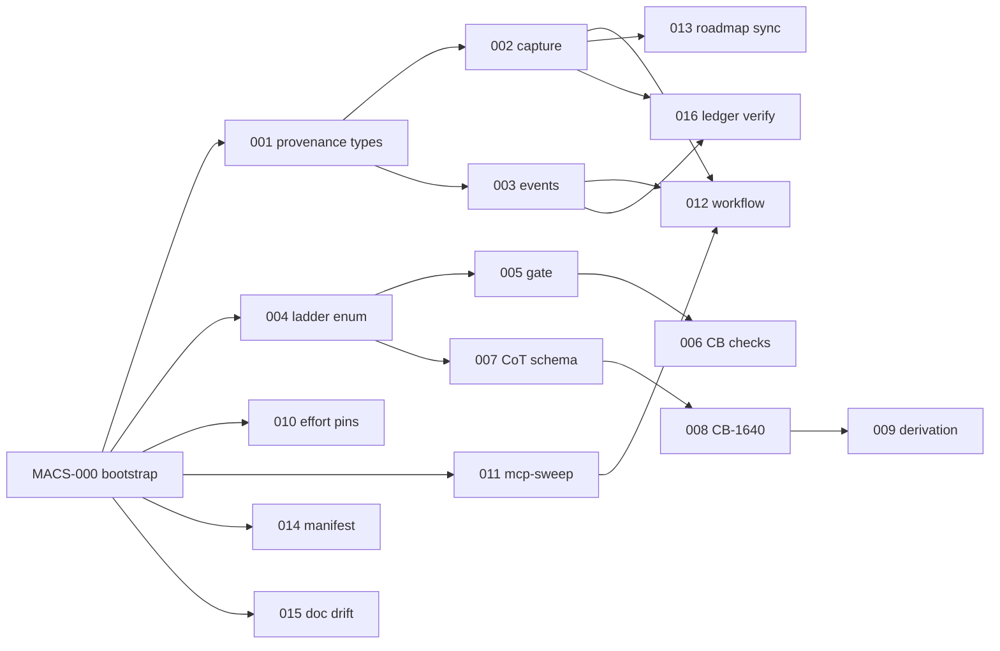

# Modern Agentic Coding Support (MACS)

> Sub-spec of [pmat-spec.md](../pmat-spec.md) | **Component 32 (proposed)**
> **Status**: DRAFT for review | **Version**: 1.0.0 | **Date**: 2026-07-02
> **Baseline commit**: `bab0f9a` (2026-06-25)
> **Ticket prefix**: `MACS-` | **CB range**: CB-1650–CB-1666 (verified unallocated at baseline; CB-1640 is implemented here per Component 31's reservation)
> **Audience**: autonomous coding agents (**Claude Fable 5 in autonomous mode**, model id `claude-fable-5`) and humans reviewing their work.
> **Normative internal refs**: [agent-integration.md](agent-integration.md) (C10), [pmat-work-verification-ladder.md](pmat-work-verification-ladder.md) (C28), [pmat-work-cot-proof-derivation.md](pmat-work-cot-proof-derivation.md) (C31), [autonomous-verify-loop.md](../../agent-instructions/autonomous-verify-loop.md), [provable-contract-first-agents.md](../../agent-instructions/provable-contract-first-agents.md).

---

## 0. Executive Summary

Claude Code's 2026 agentic surface — **ultracode** (xhigh reasoning + automatic
dynamic-workflow orchestration), **Fable 5**, per-skill **effort pinning**,
nested subagents, and saveable workflow scripts — changed the operating
environment PMAT's agent components were designed for. PMAT's architecture
(**agents propose, receipts dispose**) is the correct response to that
environment, but six load-bearing pieces are missing or decorative at baseline:

| # | Feature | One-line problem (evidence at baseline `bab0f9a`) |
|---|---------|-----------------------------------------------------|
| F1 | Agent provenance in the falsification ledger | `FalsificationReceipt` records *what* passed, never *which agent configuration* produced it (`src/cli/handlers/work_ledger_receipt.rs:3–22`) |
| F2 | Verification-ladder enforcement | `verification_level` is an unparsed `String`; a ticket can claim L5 with zero evidence (C28 spec, "the field is decorative") |
| F3 | CoT proof derivation | `chain_of_thought` is write-only prose; assumptions never become `require` clauses (C31 spec, "a hallucination magnet") |
| F4 | Effort pinning for skills/subagents | None of the six `.claude/skills/*` pin `effort:`; behavior and cost vary with whatever the session left set |
| F5 | Deterministic sweep harness + committed workflow | The release MCP sweep spends stochastic LLM tokens on schema-derivable work; the orchestration is an ephemeral session, not a versioned artifact |
| F6 | Canonical roadmap artifact + manifest/doc drift | `roadmap.yaml` frozen ("HISTORICAL — SUPERSEDED"); `mcp.json` declares 2 tools vs ~20 real; `docs/features/refactor-auto.md:422` ships `claude-3-opus` |

This spec delivers all six as a **totally ordered ticket sequence
MACS-000…MACS-016**, each ticket bound to a provable contract *before* any code
is written (CB-1400), gated by `pmat verify --format json`, and closed only by
a falsification receipt. §3 gives the extended reasoning (structured
chain-of-thought that dogfoods the C31 schema, plus a Five-Whys per feature).
§6 states the determinism guarantees that make the build reproducible even
though the builder is an LLM. §7 is the exact execution protocol for Fable 5.

**Non-goals** (v1): distributed agent state (C-actix spec Phase 2+), replacing
ultracode's orchestration with a pmat-native one, LSP/IDE surface, non-Rust
implementation targets, retro-fitting provenance onto pre-MACS ledger entries
(they remain valid under `schema_version: 1`).

---

## 1. Environment: Normative Facts (with citations)

Facts the design depends on. Each is dated and sourced; if a fact changes
upstream, re-derive the dependent tickets (they are marked).

- **E1 — ultracode is a harness setting, not a model effort level.** It sends
  `xhigh` to the model and additionally lets Claude Code orchestrate dynamic
  workflows automatically; it is session-only and cannot be set via
  `effortLevel`, `--effort`, or `CLAUDE_CODE_EFFORT_LEVEL` [1][4].
- **E2 — dynamic workflows fan out to 10s–100s of parallel subagents and run
  independent verification before results reach the user** [3]. Since
  v2.1.172, subagents may spawn their own subagents up to 5 levels deep [4].
- **E3 — xhigh (hence ultracode) is available on Fable 5**, alongside Mythos 5,
  Opus 4.8, Opus 4.7, and Sonnet 5; Fable 5's **default effort is `high`**, and
  Fable 5 uses always-on adaptive thinking [1][2].
- **E4 — skill and subagent frontmatter can pin `effort:`**, overriding the
  session level while that skill/subagent runs (env var still wins) [1].
- **E5 — flagged-request semantics on Fable 5**: Claude Code may auto-switch
  the session to an Opus model on a flagged request; in **non-interactive/SDK
  mode a flagged request ends the turn with a refusal** [1]. → F1/F3 must make
  such events *recorded states*, never silent gaps.
- **E6 — cost profile**: community reports include a full 5-hour Max
  allocation consumed in ~7 minutes by Fable + ultracode on a codebase-wide
  audit [6], and 62 Opus 4.8 subagents exhausting a 5-hour cap in 18 minutes
  [5]. → deterministic gates must run at zero LLM cost; ultracode is reserved
  for judgment.
- **E7 — workflow runs are session-bound (exit ⇒ restart fresh)** [7], but a
  run **can be saved as a versionable orchestration script** the whole team can
  re-run [4]. → durable state belongs in `.pmat-work/` checkpoints; the
  orchestration belongs in git.
- **E8 — the `ultracode` keyword in a prompt triggers a one-off workflow**
  (rename from `workflow` in v2.1.160) [4]. → §7 forbids the bare keyword in
  MACS build prompts to avoid accidental fan-out.
- **E9 — Claude Code exposes `CLAUDE_CODE_EFFORT_LEVEL`** for standard levels
  [5]; harness detection beyond that is best-effort. → F1 treats *declared*
  provenance (flags) as canonical and *detected* provenance (env) as advisory.

---

## 2. Design Principle: Agents Propose, Receipts Dispose

Ultracode's own verification design — a separate agent that never wrote the
answer it is judging [3] — is Popperian falsification [9] implemented in
harness form, i.e. PMAT's thesis restated by the vendor. MACS therefore does
**not** compete with orchestration. It hardens the boundary:

```
        stochastic side (may vary run-to-run)          deterministic side (must not)
  ┌────────────────────────────────────────────┐   ┌─────────────────────────────────┐
  │ Fable 5 sessions · ultracode workflows ·   │   │ pmat verify (CI-faithful gate)  │
  │ subagent fleets · skeptic re-verification  │──▶│ pmat work  (contracts, ladder)  │
  │ (discovery, judgment, adversarial review)  │   │ falsification receipts + ledger │
  └────────────────────────────────────────────┘   │ canonical artifacts (hashes)    │
        every crossing of this boundary  ──────────▶ is STAMPED with provenance (F1) │
                                                    └─────────────────────────────────┘
```

Design-by-contract [10] supplies the interface discipline (require/ensure/
invariant); Bruni et al. [8] extend it to multi-agent behavioral contracts,
which C10 already mandates (CB-1400). MACS closes the remaining gaps so the
right-hand side is *complete*: every acceptance is attributable (F1), every
claimed strength is enforced (F2), every reasoning step is dischargeable (F3),
every skill's cost/behavior is pinned (F4), every mechanical check is LLM-free
(F5), and every planning artifact is canonical (F6).

---

## 3. Extended Reasoning

### 3.1 Chain of Thought (structured; dogfoods the Component 31 schema)

Each step below uses the C31 v2 shape `{id, assumption, implication,
evidence_method}`. Chain integrity: step *N*'s assumption is discharged by step
*N−1*'s implication (or by a cited environment fact E*n* / repo evidence).
Once MACS-008 lands, this very section is CB-1640-checkable.

```yaml
chain_of_thought:
  - id: CoT-1
    assumption: "PMAT's goal is deterministic roadmap/PM/QC substrate for agentic AI (README, pmat-spec)."
    implication: "Any nondeterminism must live outside the acceptance boundary; anything crossing it must be attributable and replayable."
    evidence_method: "grep README.md for 'Determinism' section; pmat-spec component list."
  - id: CoT-2
    assumption: "Crossings are attributable and replayable (CoT-1)."
    implication: "Receipts need agent provenance {model, effort, harness, workflow_id, parent}; absent today (work_ledger_receipt.rs:3-22)."
    evidence_method: "cargo test ledger::provenance_roundtrip after MACS-001; field-presence check CB-1651."
  - id: CoT-3
    assumption: "Provenance can be silently wrong if the harness swaps models mid-loop (E5)."
    implication: "Interruptions (refusal, model-switch, session-restart) must be first-class AgentEvents in the receipt, and a refusal-terminated turn must map to a paused ticket, never a completed one."
    evidence_method: "MACS-003 RED test event_refusal_blocks_complete; CB-1654."
  - id: CoT-4
    assumption: "Acceptance strength claims exist as free-form strings (C28 evidence)."
    implication: "Type the ladder (L0–L5) and gate `work complete` on evidence ≥ claim; strict parse rejects 'l4', 'L3 ', 'strong'."
    evidence_method: "proptest: FromStr total over generated corruptions; gate test claim_L4_without_kani_blocks."
  - id: CoT-5
    assumption: "Fable 5's marginal value is reasoning depth at high/xhigh (E3), currently discarded as prose (C31 evidence)."
    implication: "Structure CoT steps and auto-derive one proof_obligation + one FalsifiableClaim per step; unmatched assumptions are CB-1640 violations."
    evidence_method: "MACS-007..009 tests; `pmat comply check` shows CB-1640 firing on a seeded broken chain."
  - id: CoT-6
    assumption: "Per-skill effort is pinnable in frontmatter (E4) and cost blowups are real (E6)."
    implication: "Mechanical skills pin low/medium, adversarial skills pin xhigh; a lint (CB-1650) makes the pin mandatory, making per-skill behavior reproducible across sessions."
    evidence_method: "CB-1650 fails on a skill missing `effort:`; passes on the six updated skills."
  - id: CoT-7
    assumption: "The MCP sweep layer is schema-derivable (tool defs in src/agent/mcp_server_tool_defs.rs) and hence needs no LLM (E6 corollary)."
    implication: "Build `pmat qa mcp-sweep` as a pure harness with byte-framing goldens and N-way concurrency; reserve ultracode for anomaly interpretation via a committed workflow script (E7)."
    evidence_method: "Two consecutive sweep runs byte-identical modulo timestamp fields; workflow file exists in git and stamps provenance."
  - id: CoT-8
    assumption: "Planning artifacts are scattered (roadmap.yaml frozen; live plan in CHANGELOG/gh/specs) and manifests drift (mcp.json=2 tools; refactor-auto.md=claude-3-opus)."
    implication: "Regenerate ROADMAP.yaml and mcp.json canonically from single sources of truth with content hashes; lint stale model strings; freshness/drift are CB checks so drift cannot recur silently."
    evidence_method: "CB-1655/1656/1657 red on seeded drift, green after regen."
```

### 3.2 Five-Whys (root cause per feature) [11]

**F1 — Why can't we attribute a green receipt to an agent config?**
Why 1: The receipt schema has no agent fields.
Why 2: It was designed when one human-supervised agent ran at a time.
Why 3: Ultracode made N concurrent, nested agents the normal case (E2) after the schema froze.
Why 4: There was no forcing function — no CB check requires provenance.
Why 5: Provenance was nobody's contract obligation.
**Root cause**: schema predates multi-agent reality and nothing enforces catching up. **Fix**: MACS-001/002 + CB-1651/1652.

**F2 — Why can a ticket claim L5 unearned?**
Why 1: `verification_level` is a `String` no code path parses.
Why 2: The ladder was specified (C28) before the storage type existed.
Why 3: Implementation stored the display value, deferring semantics.
Why 4: Completion gating reads receipts, not the contract's level field.
Why 5: No type forces the two to meet.
**Root cause**: spec/implementation type gap. **Fix**: MACS-004/005/006 (typed enum + gate).

**F3 — Why do agent assumptions inflate without discharge?**
Why 1: CoT steps are `{summary, rationale, timestamp}` prose.
Why 2: No consumer parses them (C31: "only writers exist").
Why 3: The formal side (proof_obligations, claims) has no inbound edge from CoT.
Why 4: The schema lacks the fields an edge would need (assumption/implication/evidence_method).
Why 5: CoT was built as an audit *log*, not an audit *ledger*.
**Root cause**: missing schema fields ⇒ missing derivation path. **Fix**: MACS-007/008/009 (+CB-1640/1658).

**F4 — Why does skill behavior vary run-to-run?**
Why 1: Skills inherit session effort.
Why 2: Session effort is whatever the operator last set (or ultracode).
Why 3: Frontmatter pinning (E4) postdates the skills' authoring.
Why 4: No lint requires the pin.
Why 5: Effort was treated as a human preference, not a reproducibility parameter.
**Root cause**: unpinned execution parameter. **Fix**: MACS-010 + CB-1650.

**F5 — Why do releases spend stochastic tokens on deterministic checks?**
Why 1: The whole sweep runs through agent fleets.
Why 2: The harness capable of schema-driven calls doesn't exist as a CLI.
Why 3: Tool schemas live in Rust, and the fleet was the fastest path to "exercised".
Why 4: "Exercised" conflated two layers: mechanical conformance and judgment.
Why 5: No spec separated them.
**Root cause**: layer conflation. **Fix**: MACS-011 (harness) + MACS-012 (committed judgment workflow).

**F6 — Why did the roadmap stop being an artifact?**
Why 1: `roadmap.yaml` froze at v2.180.x and was marked historical.
Why 2: Live status moved to CHANGELOG + `gh issue list` + specs.
Why 3: `pmat work` arrived with its own store, and nothing rendered it back out.
Why 4: GitHub is mutable/remote, so no committed snapshot exists to hash.
Why 5: No freshness check makes staleness visible.
**Root cause**: source-of-truth migration without a renderer. **Fix**: MACS-013 (+1655), MACS-014 (+1656), MACS-015 (+1657).

---

## 4. Features

Each feature ships a provable contract in the repo's real YAML format
(`metadata` / `equations{formula, domain, codomain, invariants, preconditions,
lean_theorem}` / `falsification{condition, severity, action}` — cf.
`contracts/benchmarking-v1.yaml`), plus `contracts/binding.yaml` entries
(Appendix B) and comply checks.

### F1 — Agent Provenance in the Falsification Ledger

**Problem.** `FalsificationReceipt { id, git_sha, timestamp, trigger,
work_item_id, verdicts, overrides, summary, content_hash }` — no agent
dimension; `LedgerEntry` likewise. Under E2/E5 a green receipt is
unattributable and model-switches are invisible.

**Schema (Rust).**

```rust
// src/cli/handlers/work_ledger_types.rs (extend)

/// Which kind of runner produced the work
#[derive(Debug, Clone, Serialize, Deserialize, PartialEq, Eq)]
#[serde(rename_all = "snake_case")]
pub enum AgentHarness {
    ClaudeCode,        // interactive or -p
    ClaudeAgentSdk,
    UltracodeWorkflow, // dynamic-workflow subagent [1][3]
    CiPipeline,
    Human,
    Other(String),
}

/// Declared-first provenance; detection is advisory (E9)
#[derive(Debug, Clone, Serialize, Deserialize, PartialEq, Eq)]
pub struct AgentProvenance {
    /// e.g. "claude-fable-5" — API model id, verbatim
    pub model: String,
    /// "low"|"medium"|"high"|"xhigh"|"max" — as sent to the model [2]
    pub effort: String,
    pub harness: AgentHarness,
    /// ultracode workflow id, if any (E2)
    pub workflow_id: Option<String>,
    /// parent agent/session id for nested subagents (E2)
    pub parent: Option<String>,
    /// "declared" (flags) | "detected" (env) | "mixed"
    pub source: ProvenanceSource,
}

/// Interruptions that must never be silent (E5)
#[derive(Debug, Clone, Serialize, Deserialize, PartialEq, Eq)]
#[serde(tag = "type", rename_all = "snake_case")]
pub enum AgentEvent {
    Refusal      { at: String, note: Option<String> },
    ModelSwitch  { at: String, from: String, to: String },
    SessionRestart { at: String },
    WorkflowSpawn { at: String, workflow_id: String, subagents: u32 },
}
```

```rust
// src/cli/handlers/work_ledger_receipt.rs (extend — additive, hash-versioned)
pub struct FalsificationReceipt {
    /// 1 = pre-MACS (fields below absent from hash), 2 = MACS
    #[serde(default = "one")] pub schema_version: u32,
    // ... existing nine fields unchanged ...
    #[serde(default)] pub agent: Option<AgentProvenance>,
    #[serde(default)] pub agent_events: Vec<AgentEvent>,
    // content_hash: SHA-256 over canonical JSON of all fields above,
    // canonical = serde_json with sorted maps (BTreeMap) + no floats.
}
```

**Capture.** `pmat work start|checkpoint|complete` gain
`--agent-model/--agent-effort/--agent-harness/--agent-workflow-id/--agent-parent`
(declared, canonical) with env fallback `PMAT_AGENT_*`; advisory detection:
`CLAUDE_CODE_EFFORT_LEVEL` [5] and, if present, harness markers — recorded
with `source: detected`. New `pmat work event --type refusal|model-switch|...`
appends an `AgentEvent` (E5): a `Refusal` on the active ticket **blocks
`complete` until acknowledged** via `--ack-event <id>`.

**Contract** — `contracts/macs-provenance-v1.yaml`:

```yaml
metadata:
  version: "1.0.0"
  created: "2026-07-02"
  author: PAIML Engineering
  registry: true
  description: >
    Agent provenance and interruption events on falsification receipts.
    Declared-first; detection advisory; hash-versioned for old receipts.
  contract: macs-provenance
  status: draft

equations:
  provenance_roundtrip:
    formula: deserialize(serialize(r)) = r
    domain: r in FalsificationReceipt{schema_version=2}
    codomain: bool
    invariants:
      - serialization uses canonical JSON (sorted keys, no NaN/Inf)
      - unknown future fields are rejected (deny_unknown_fields)
    preconditions:
      - proptest deterministic mode enabled (MACS-000)
    lean_theorem: Theorems.Macs.Provenance_Roundtrip
  hash_stability:
    formula: content_hash(r) = golden(r)
    domain: r in fixtures/receipts/v2/*.json
    codomain: hex64
    invariants:
      - byte-identical across OS/arch (CI matrix)
      - v1 receipts verify under v1 rules keyed by schema_version
    preconditions:
      - fixtures committed at MACS-001
  refusal_gates_completion:
    formula: has_unacked(Refusal) -> complete(ticket) = Err(Blocked)
    domain: ticket in .pmat-work/*
    codomain: Result
    invariants:
      - Refusal never auto-acks; ack requires --ack-event with reason
    preconditions:
      - MACS-003 landed

falsification:
  - condition: "A receipt with schema_version=2 lacks `agent` yet CB-1651 passes"
    severity: P0
    action: reject_push
  - condition: "Two serializations of the same receipt differ in bytes"
    severity: P0
    action: reject_push
  - condition: "`pmat work complete` succeeds while an unacked Refusal event exists"
    severity: P0
    action: reject_push
  - condition: "A v1 (pre-MACS) receipt fails ledger verify after upgrade"
    severity: P1
    action: block_release
```

**Checks**: **CB-1651** provenance present on v2 receipts; **CB-1652** ledger
hash re-verification (`pmat work ledger verify`, MACS-016); **CB-1654**
refusal events acked before completion.

### F2 — Verification-Ladder Enforcement (implements C28)

**Problem.** Opaque `String`; misspellings silently downgrade; completion
never consults it (C28 evidence list).

**Schema + gate.**

```rust
// src/cli/handlers/work_contract_core.rs (replace String)
#[derive(Debug, Clone, Copy, PartialEq, Eq, PartialOrd, Ord,
         Serialize, Deserialize)]
pub enum VerificationLevel { L0, L1, L2, L3, L4, L5 }

impl FromStr for VerificationLevel {
    type Err = LadderError;
    /// STRICT: exactly "L0".."L5". "l4", "L3 ", "strong" => Err (C28).
    fn from_str(s: &str) -> Result<Self, LadderError> { /* MACS-004 */ }
}

/// Evidence actually achieved, computed—never trusted (C28 §Goal):
/// L1 debug_assert contracts ran; L2 #[contract] bound (binding.yaml);
/// L3 falsification_tests[] pass in tree; L4 kani_harnesses[] exit 0;
/// L5 lean_theorem status=proved, zero `sorry`.
pub fn achieved_level(t: &Ticket) -> VerificationLevel { /* MACS-005 */ }

// gate in core_handlers/resolution.rs:
if achieved_level(t) < t.contract.verification_level {
    return Err(WorkError::LadderShortfall {
        claimed: t.contract.verification_level,
        achieved: achieved_level(t),
    }); // ticket cannot close (C28: "Completion gates are hard")
}
```

**Contract** — `contracts/macs-ladder-v1.yaml` (equations
`parse_total_strict` — parse is total and strict over a corruption corpus;
`gate_monotone` — `complete ⇒ achieved ≥ claimed`; `no_silent_downgrade` —
storing a level requires parse-success):

```yaml
metadata: {version: "1.0.0", created: "2026-07-02", author: PAIML Engineering,
           registry: true, contract: macs-ladder, status: draft,
           description: "Typed L0–L5 with evidence-gated completion (C28)."}
equations:
  parse_total_strict:
    formula: parse(s) = Ok(l) <-> s in {"L0".."L5"}
    domain: s in String (proptest-generated incl. corruptions)
    codomain: Result<VerificationLevel>
    invariants: ["Ord matches numeric order", "Display∘parse = id on valid set"]
    preconditions: []
    lean_theorem: Theorems.Macs.Ladder_Parse_Total
  gate_monotone:
    formula: complete(t)=Ok -> achieved_level(t) >= t.claimed_level
    domain: t in .pmat-work/*
    codomain: bool
    invariants: ["achieved_level is computed from evidence, never stored"]
    preconditions: ["binding.yaml well-formed (CB-1250 family)"]
falsification:
  - {condition: "\"l4\" or \"L3 \" parses successfully", severity: P0, action: reject_push}
  - {condition: "A ticket claiming L4 closes while a kani harness fails",   severity: P0, action: reject_push}
  - {condition: "A ticket claiming L5 closes with any `sorry` in its Lean proof", severity: P0, action: reject_push}
```

**Checks**: **CB-1653** claimed-vs-achieved drift surfaces in
`pmat comply check`; migration tool `pmat work ticket migrate --levels`
rewrites legacy strings interactively (invalid ⇒ L0 + audit note).

### F3 — CoT Proof Derivation (implements C31)

**Problem.** `ChainOfThoughtStep { summary, rationale, timestamp }` prose;
no derivation edge to proof obligations/claims; unmatched assumptions never
surface (C31).

**Schema + derivation.**

```rust
// C31 v2 shape — src/models/work_cot.rs (new)
#[derive(Debug, Clone, Serialize, Deserialize)]
pub struct ChainOfThoughtStep {
    pub id: String,                     // "CoT-1"
    pub assumption: String,             // input to the reasoning
    pub implication: String,            // output of the reasoning
    pub evidence_method: String,        // how to falsify the implication
    pub timestamp: DateTime<Utc>,
    /// which prior implication (or bound equation) discharges `assumption`
    pub discharged_by: Option<DischargeRef>,   // CoT id | contract#equation | "E<n>"
}

/// CB-1640 (reserved by C31): every assumption must be discharged.
/// Discharge graph must be a DAG rooted in evidence/equations.
pub fn check_chain(steps: &[ChainOfThoughtStep]) -> Vec<Cb1640Violation> { /* MACS-008 */ }

/// Per C31 §Goal — one derivation per step:
///   step -> proof_obligation (ticket YAML, C25 Phase 1)
///   step -> FalsifiableClaim { hypothesis: implication,
///                              method: evidence_method } (C29 roster)
///   step -> optional require/ensure clause (C30 codegen)
pub fn derive(step: &ChainOfThoughtStep) -> Derived { /* MACS-009 */ }
```

For Fable 5 specifically: at `high` (its default [1]) and above, the model's
reasoning is exactly the raw material this schema structures — E3 is what
makes F3 the *Fable integration*, not the harness plumbing.

**Contract** — `contracts/macs-cot-v1.yaml`:

```yaml
metadata: {version: "1.0.0", created: "2026-07-02", author: PAIML Engineering,
           registry: true, contract: macs-cot, status: draft,
           description: "Structured CoT with mandatory discharge + auto-derivation (C31)."}
equations:
  chain_integrity:
    formula: forall s in steps: discharged(s.assumption)
    domain: steps in Vec<ChainOfThoughtStep>
    codomain: bool
    invariants: ["discharge graph is acyclic", "roots are equations or E-facts only"]
    preconditions: ["ticket has >=1 CoT step when kind in {feature,bugfix,refactor}"]
    lean_theorem: Theorems.Macs.CoT_Discharge_DAG
  derivation_complete:
    formula: |claims_from(steps)| = |steps| and |obligations_from(steps)| = |steps|
    domain: steps as above
    codomain: bool
    invariants: ["claim.hypothesis = step.implication verbatim",
                 "claim.method    = step.evidence_method verbatim"]
    preconditions: ["MACS-007 schema active"]
falsification:
  - {condition: "A step's assumption has no discharge and CB-1640 stays green", severity: P0, action: reject_push}
  - {condition: "A ticket closes with fewer FalsifiableClaims than CoT steps",  severity: P0, action: reject_push}
  - {condition: "Legacy prose steps crash the parser instead of migrating to v2-with-L0 annotation", severity: P1, action: block_release}
```

**Checks**: **CB-1640** (implemented), **CB-1658** derivation completeness.

### F4 — Effort Pinning + Skill Lint

**Problem.** E4 exists; none of `.claude/skills/{dogfood, pmat-context,
pmat-multi-lang, pmat-quality, pmat-refactor, pmat-tech-debt}` use it; the
dogfood skill fans out via `Agent` at inherited effort — under an ultracode
session that is xhigh × N on mechanical work (E6).

**Change.** Add frontmatter to each skill; policy table becomes normative:

```yaml
# .claude/skills/dogfood/SKILL.md (frontmatter delta)
---
effort: medium        # mechanical sweep; judgment lives in F5's workflow
...
# .claude/skills/pmat-quality/skill.md
---
effort: xhigh         # adversarial/skeptic review earns depth [2][3]
```

| Skill | Pinned effort | Rationale |
|---|---|---|
| dogfood | medium | command exercising is mechanical (E6) |
| pmat-context | low | I/O-bound generation |
| pmat-multi-lang | medium | breadth over depth |
| pmat-quality | **xhigh** | adversarial verification (E3) |
| pmat-refactor | high | design judgment, single-agent |
| pmat-tech-debt | high | prioritization judgment |

**Lint**: **CB-1650** — every file under `.claude/skills/**/{SKILL,skill}.md`
has frontmatter `effort ∈ {low, medium, high, xhigh}` (session-only values
`max`/`ultracode` are rejected here by design [1][4]).

**Contract** — `contracts/macs-skill-effort-v1.yaml` (equation
`skill_effort_pinned: forall f in skills: effort(f) ∈ {low,medium,high,xhigh}`;
falsification: missing/invalid pin with CB-1650 green ⇒ P0 reject_push).

### F5 — Deterministic Sweep Harness + Committed Judgment Workflow

**Problem.** The mechanical MCP layer (per-tool calls with schema-derived
args, byte-level framing, N-way concurrency) needs no model; running it via
fleets spends stochastic tokens (E6) and its orchestration evaporates with the
session (E7).

**Part A — `pmat qa mcp-sweep` (LLM-free).**

```rust
// src/cli/handlers/qa_mcp_sweep.rs (new)
/// For every tool in src/agent/mcp_server_tool_defs.rs:
///   1. derive a minimal valid argument set from its inputSchema
///   2. call over stdio JSON-RPC; assert schema-valid response
///   3. byte-framing golden: stdout is exclusively JSON-RPC (no stray bytes)
///   4. repeat under --concurrency N (default 8) against ONE working tree:
///      zero lock errors, zero scratch leftovers (advisory-lock invariants,
///      cf. src/services/metric_trends_core.rs)
/// Output: --format json|junit ; exit non-zero on any red.
pub async fn handle_mcp_sweep(opts: SweepOpts) -> Result<SweepReport> { /* MACS-011 */ }
```

**Part B — committed workflow for the judgment layer** (E7: saved scripts are
versionable [4]). `contracts/workflows/release-sweep.ultracode.mjs` fans out
only over *anomalies* emitted by Part A and by the CLI sweep, runs skeptic
re-verification, and stamps every finding through F1:

```js
// contracts/workflows/release-sweep.ultracode.mjs  (judgment layer ONLY)
// Deterministic inputs: sweep JSON artifacts; nondeterministic judgment is
// stamped via `pmat work event` + PMAT_AGENT_* before any receipt is touched.
const anomalies = JSON.parse(read('artifacts/qa/mcp-sweep.json')).anomalies;
for (const batch of chunk(anomalies, 8)) {
  await Promise.all(batch.map(a =>
    spawnSubagent({
      prompt: `Skeptically re-verify anomaly ${a.id}; falsify before believing`,
      env: { PMAT_AGENT_HARNESS: 'ultracode-workflow',
             PMAT_AGENT_WORKFLOW_ID: WORKFLOW_ID },
    })));
}
```

**Contract** — `contracts/macs-sweep-v1.yaml` (equations:
`sweep_deterministic: run1 = run2 modulo {timestamp, duration} fields`;
`framing_pure: stdout_bytes ⊂ JSONRPC_frames`; `concurrency_safe: lock_errors
= 0 ∧ scratch_leftovers = 0 for N ≤ 8`; falsification incl. "any LLM call in
Part A code path" ⇒ P0 reject_push).

### F6 — Canonical Roadmap Artifact + Manifest/Doc Drift

**Problem.** `roadmap.yaml` header: "HISTORICAL — SUPERSEDED… live
roadmap/status lives in CHANGELOG.md, `gh issue list`, and specs." `mcp.json`
declares 2 tools; README claims 20. `docs/features/refactor-auto.md:422`:
`"primary": "claude-3-opus", "fallback": "gpt-4-turbo"` — 2.5 generations
stale in docs that double as agent instructions.

**Change.**
`pmat roadmap sync` renders **ROADMAP.yaml** deterministically from
`.pmat-work/` (tickets, ledger states) plus an optional pinned GitHub snapshot
(`--gh-snapshot <sha-of-export>`): BTreeMap ordering, ids sorted, generation
timestamp **excluded** from the content hash, source snapshot ids **included**.
`pmat mcp manifest --write` regenerates `mcp.json` from
`mcp_server_tool_defs.rs` (byte-equal or CB-1656 red). A model-registry doc
`docs/agent-models.md` becomes the single place model ids appear;
**CB-1657** lints the deny-list `{claude-3-*, gpt-4-turbo, claude-2*}` across
`docs/` (allow-listed only inside `agent-models.md` history table).

**Contract** — `contracts/macs-artifacts-v1.yaml` (equations:
`roadmap_canonical: render(state) byte-stable ∧ hash covers sources not
wall-clock`; `manifest_faithful: tools(mcp.json) = tools(tool_defs)`;
`docs_current: deny-list hits = 0 outside allow-list`; falsification rows for
each, P0/P1 as in Appendix A of `pmat-query-search-modes-v1.yaml` style).

---

## 5. Deterministic Ticket Sequence

### 5.1 Order, dependencies, and the total-order rule



**Rule R1 (total order).** Execute strictly in ascending ID. The DAG above
proves ascending-ID is a valid topological order; independence between some
tickets is *not* license to parallelize — sequential execution keeps the
ledger single-writer and the receipt chain reproducible (§6-D7). Rule R1 is
itself a falsification condition: two receipts with out-of-order
`work_item_id`s in `ledger.jsonl` ⇒ P0.

**Per-ticket invariants (all tickets).** Contract before code (CB-1400);
design budget cyclomatic ≤ 10 / cognitive ≤ 7 (roadmap meta), hard gate at the
`pmat verify` incremental thresholds (cyclomatic ≤ 30 / cognitive ≤ 25 on
changed files); zero SATD; atomic commit `feat(macs): MACS-0NN <title>`;
completion only via `pmat work falsify && pmat work complete`.

### 5.2 Ticket cards

Each card: **Depends / Files / Contract (`.pmat-work/MACS-0NN/contract.json`)
/ RED tests / Level / Notes.** The canonical execution loop is defined once in
§7 — do not restate it per ticket.

---

**MACS-000 — Bootstrap: tickets, spec registration, deterministic proptest**
Depends: — | Level: **L1** | Files: `proptest.toml`, `docs/specifications/components/modern-agentic-coding-support.md`, `contracts/macs-*.yaml` (6 stubs), `contracts/binding.yaml`
Notes: run the Appendix C command block to create MACS-001…016 via `pmat work add`; flip `deterministic = false` → `true` in `proptest.toml` (found at baseline; a nondeterministic property-RNG contradicts "green here ⇒ green in CI"); commit the six contract YAML stubs with `status: draft`.

```json
{ "ticket": "MACS-000", "kind": "chore", "verification_level": "L1",
  "require": [
    {"claim": "baseline is bab0f9a or descendant", "evidence": "git merge-base --is-ancestor bab0f9a HEAD"},
    {"claim": "CB-1650..1666 unallocated", "evidence": "grep -rhoE 'CB-16(5[0-9]|6[0-6])' docs/ src/ | sort -u | wc -l  # == 0 pre-ticket"}],
  "ensure": [
    {"claim": "17 MACS tickets exist", "evidence": "pmat work status --all | grep -c 'MACS-0' # == 17"},
    {"claim": "proptest RNG deterministic", "evidence": "grep -q '^deterministic = true' proptest.toml"},
    {"claim": "spec + 6 contract stubs committed", "evidence": "ls contracts/macs-*.yaml | wc -l # == 6"}],
  "invariant": [
    {"claim": "no production code changed", "evidence": "git diff --stat HEAD~1 -- src/ | wc -l # == 0"}],
  "chain_of_thought": [
    {"id": "CoT-1", "assumption": "build must be replayable (spec §6)",
     "implication": "ticket set + RNG must be fixed before code",
     "evidence_method": "re-run Appendix C on a clean clone; identical ticket ids"}]}
```

---

**MACS-001 — `AgentProvenance` / `AgentEvent` types + canonical serialization + `schema_version`**
Depends: 000 | Level: **L4** | Files: `src/cli/handlers/work_ledger_types.rs`, `work_ledger_receipt.rs`, `fixtures/receipts/v2/*.json`, `src/cli/handlers/work_ledger_tests.rs`
RED tests: `ledger::provenance_roundtrip_prop` (proptest), `ledger::hash_stability_golden_v2`, `ledger::v1_receipts_still_verify`, `ledger::canonical_json_sorted_keys`.

```json
{ "ticket": "MACS-001", "kind": "feature", "verification_level": "L4",
  "contract_yaml": "contracts/macs-provenance-v1.yaml#provenance_roundtrip,hash_stability",
  "require": [
    {"claim": "receipt struct at baseline has 9 fields ending content_hash", "evidence": "grep -A22 'pub struct FalsificationReceipt' src/cli/handlers/work_ledger_receipt.rs"}],
  "ensure": [
    {"claim": "roundtrip property holds", "evidence": "cargo test ledger::provenance_roundtrip_prop"},
    {"claim": "golden hashes byte-stable", "evidence": "cargo test ledger::hash_stability_golden_v2"},
    {"claim": "v1 receipts verify under v1 rules", "evidence": "cargo test ledger::v1_receipts_still_verify"},
    {"claim": "proptest for roundtrip", "evidence": "grep -q 'proptest!' src/cli/handlers/work_ledger_tests.rs"}],
  "invariant": [
    {"claim": "existing ledger.jsonl parses unchanged", "evidence": "cargo test ledger::legacy_jsonl_parse"},
    {"claim": "no field removed/renamed on receipt", "evidence": "git diff HEAD~1 -- src/cli/handlers/work_ledger_receipt.rs | grep -c '^-.*pub ' # == 0"}],
  "chain_of_thought": [
    {"id": "CoT-1", "assumption": "old receipts hashed without new fields (F1 §Schema)",
     "implication": "hash must be versioned by schema_version, not recomputed retroactively",
     "evidence_method": "v1_receipts_still_verify red-then-green"}]}
```

---

**MACS-002 — Provenance capture: flags + env, wired into receipts and `LedgerEntry`**
Depends: 001 | Level: **L3** | Files: `src/cli/commands/work_commands_work.rs`, `src/cli/command_dispatcher/command_dispatcher_work.rs`, `src/cli/handlers/work_handlers/core_handlers/{handlers,resolution}.rs`
RED tests: `work::declared_flags_win_over_env`, `work::env_detected_marked_advisory`, `work::ledger_entry_carries_agent`, `work::missing_provenance_yields_none_v2`.

```json
{ "ticket": "MACS-002", "kind": "feature", "verification_level": "L3",
  "contract_yaml": "contracts/macs-provenance-v1.yaml#provenance_roundtrip",
  "require": [
    {"claim": "MACS-001 types exported", "evidence": "cargo build 2>&1 | grep -c error # == 0 after use in handlers"}],
  "ensure": [
    {"claim": "--agent-model/--agent-effort/... accepted on start|checkpoint|complete", "evidence": "pmat work start --help | grep -c 'agent-' # >= 5"},
    {"claim": "PMAT_AGENT_* env honored, CLAUDE_CODE_EFFORT_LEVEL detected as advisory", "evidence": "cargo test work::env_detected_marked_advisory"},
    {"claim": "declared beats detected (source=declared)", "evidence": "cargo test work::declared_flags_win_over_env"},
    {"claim": "LedgerEntry gains agent summary {model,effort,harness}", "evidence": "cargo test work::ledger_entry_carries_agent"}],
  "invariant": [
    {"claim": "invocation without any agent info still works (agent=None, v2)", "evidence": "cargo test work::missing_provenance_yields_none_v2"}],
  "chain_of_thought": [
    {"id": "CoT-1", "assumption": "detection is best-effort (E9)",
     "implication": "declared flags are canonical; env is advisory and labeled",
     "evidence_method": "declared_flags_win_over_env"}]}
```

---

**MACS-003 — `pmat work event` + refusal blocking (E5)**
Depends: 001 | Level: **L3** | Files: `src/cli/commands/work_commands_work.rs`, new `src/cli/handlers/work_event.rs`, `core_handlers/resolution.rs`
RED tests: `work::event_appends_to_active_ticket`, `work::event_refusal_blocks_complete`, `work::ack_event_unblocks_with_reason`, `work::model_switch_recorded_from_to`.

```json
{ "ticket": "MACS-003", "kind": "feature", "verification_level": "L3",
  "contract_yaml": "contracts/macs-provenance-v1.yaml#refusal_gates_completion",
  "require": [
    {"claim": "AgentEvent enum from MACS-001 compiled", "evidence": "pmat query \"AgentEvent\" --limit 1 --files-with-matches"}],
  "ensure": [
    {"claim": "refusal blocks complete until --ack-event", "evidence": "cargo test work::event_refusal_blocks_complete"},
    {"claim": "ack requires non-empty reason, recorded in receipt", "evidence": "cargo test work::ack_event_unblocks_with_reason"},
    {"claim": "model-switch stores {from,to} verbatim", "evidence": "cargo test work::model_switch_recorded_from_to"}],
  "invariant": [
    {"claim": "events are append-only within a ticket", "evidence": "cargo test work::events_append_only"}],
  "chain_of_thought": [
    {"id": "CoT-1", "assumption": "non-interactive flagged turns end in refusal (E5)",
     "implication": "a refusal must be a recorded, blocking state — never a silent gap",
     "evidence_method": "event_refusal_blocks_complete"}]}
```

---

**MACS-004 — `VerificationLevel` typed enum + strict parse + migration**
Depends: 000 | Level: **L4** | Files: `src/cli/handlers/work_contract_core.rs`, `src/cli/handlers/work_handlers/ticket_validate_migrate.rs`
RED tests: `ladder::parse_total_strict_prop` (proptest over corruptions: case, whitespace, words), `ladder::ord_matches_numeric`, `ladder::display_parse_id`, `migrate::legacy_strings_interactive_to_typed`.

```json
{ "ticket": "MACS-004", "kind": "feature", "verification_level": "L4",
  "contract_yaml": "contracts/macs-ladder-v1.yaml#parse_total_strict",
  "require": [
    {"claim": "verification_level is String at baseline", "evidence": "pmat query --literal 'verification_level: String' --limit 1"}],
  "ensure": [
    {"claim": "strict parse: only \"L0\"..\"L5\"", "evidence": "cargo test ladder::parse_total_strict_prop"},
    {"claim": "Ord matches numeric order", "evidence": "cargo test ladder::ord_matches_numeric"},
    {"claim": "migration rewrites legacy tickets; invalid=>L0+audit note", "evidence": "cargo test migrate::legacy_strings_interactive_to_typed"}],
  "invariant": [
    {"claim": "serde representation stays the display string (no wire break)", "evidence": "cargo test ladder::serde_string_repr"}],
  "chain_of_thought": [
    {"id": "CoT-1", "assumption": "misspellings silently downgrade today (C28)",
     "implication": "parse must be strict and total; storage must go through it",
     "evidence_method": "parse_total_strict_prop with corruption corpus"}]}
```

---

**MACS-005 — Ladder completion gate (`achieved ≥ claimed`)**
Depends: 004 | Level: **L3** | Files: `core_handlers/resolution.rs`, new `src/quality/ladder_evidence.rs`
RED tests: `gate::claim_L4_without_kani_blocks`, `gate::claim_L5_with_sorry_blocks`, `gate::claim_L3_with_passing_falsification_closes`, `gate::achieved_never_stored`.

```json
{ "ticket": "MACS-005", "kind": "feature", "verification_level": "L3",
  "contract_yaml": "contracts/macs-ladder-v1.yaml#gate_monotone",
  "require": [
    {"claim": "typed enum landed (MACS-004)", "evidence": "cargo test ladder::parse_total_strict_prop"}],
  "ensure": [
    {"claim": "L4 claim + failing kani harness => LadderShortfall", "evidence": "cargo test gate::claim_L4_without_kani_blocks"},
    {"claim": "L5 claim + any `sorry` => blocked", "evidence": "cargo test gate::claim_L5_with_sorry_blocks"},
    {"claim": "L3 with green falsification_tests[] closes", "evidence": "cargo test gate::claim_L3_with_passing_falsification_closes"}],
  "invariant": [
    {"claim": "achieved_level computed each call, never persisted", "evidence": "cargo test gate::achieved_never_stored"}],
  "chain_of_thought": [
    {"id": "CoT-1", "assumption": "evidence sources exist per level (C28 L1..L5 defs)",
     "implication": "achieved_level maps evidence->level; gate compares Ord",
     "evidence_method": "the three gate tests, one per boundary"}]}
```

---

**MACS-006 — Comply checks CB-1653 (+ ladder wiring into receipts)**
Depends: 005 | Level: **L3** | Files: `src/cli/handlers/comply_handlers/...`, `work_ledger_receipt.rs` (receipt gains `claimed_level`, `achieved_level` under v2)
RED tests: `comply::cb1653_red_on_drift`, `comply::cb1653_green_after_fix`, `ledger::receipt_records_both_levels`.

```json
{ "ticket": "MACS-006", "kind": "feature", "verification_level": "L3",
  "contract_yaml": "contracts/macs-ladder-v1.yaml#gate_monotone",
  "require": [{"claim": "gate active (MACS-005)", "evidence": "cargo test gate::claim_L4_without_kani_blocks"}],
  "ensure": [
    {"claim": "CB-1653 fires on seeded claim/evidence drift", "evidence": "cargo test comply::cb1653_red_on_drift"},
    {"claim": "receipts carry {claimed,achieved}", "evidence": "cargo test ledger::receipt_records_both_levels"}],
  "invariant": [{"claim": "existing comply checks unaffected", "evidence": "pmat comply check --format json | jq '.regressions|length' # == 0"}],
  "chain_of_thought": [
    {"id": "CoT-1", "assumption": "gates without visibility rot",
     "implication": "drift must be a comply check, not only a completion error",
     "evidence_method": "cb1653_red_on_drift"}]}
```

---

**MACS-007 — `ChainOfThoughtStep` v2 schema + parser + migration**
Depends: 004 | Level: **L4** | Files: new `src/models/work_cot.rs`, `work_contract_core.rs`, `ticket_validate_migrate.rs`
RED tests: `cot::v2_roundtrip_prop`, `cot::legacy_prose_migrates_annotated_L0`, `cot::discharge_ref_parses_cot_equation_efact`.

```json
{ "ticket": "MACS-007", "kind": "feature", "verification_level": "L4",
  "contract_yaml": "contracts/macs-cot-v1.yaml#chain_integrity",
  "require": [{"claim": "baseline step is {summary,rationale,timestamp}", "evidence": "pmat query --literal 'ChainOfThoughtStep' --include-source --limit 1"}],
  "ensure": [
    {"claim": "v2 fields {id,assumption,implication,evidence_method,discharged_by}", "evidence": "cargo test cot::v2_roundtrip_prop"},
    {"claim": "legacy prose steps migrate (annotated, not dropped)", "evidence": "cargo test cot::legacy_prose_migrates_annotated_L0"},
    {"claim": "DischargeRef parses CoT-id | contract#equation | E<n>", "evidence": "cargo test cot::discharge_ref_parses_cot_equation_efact"}],
  "invariant": [{"claim": "`pmat work status` still renders steps", "evidence": "cargo test cot::status_renders_v2"}],
  "chain_of_thought": [
    {"id": "CoT-1", "assumption": "prose has no derivable edge (C31)",
     "implication": "schema must carry the edge fields before any checker exists",
     "evidence_method": "v2_roundtrip_prop"}]}
```

---

**MACS-008 — Chain-integrity checker (implements CB-1640)**
Depends: 007 | Level: **L4** | Files: `src/models/work_cot.rs` (`check_chain`), comply wiring
RED tests: `cot::undischarged_assumption_violates_1640`, `cot::cycle_detected_violates_1640`, `cot::dag_property_prop` (proptest: random discharge graphs — checker accepts iff DAG rooted in E-facts/equations), `cot::spec_section_3_1_passes` (this document's §3.1 as fixture).

```json
{ "ticket": "MACS-008", "kind": "feature", "verification_level": "L4",
  "contract_yaml": "contracts/macs-cot-v1.yaml#chain_integrity",
  "require": [{"claim": "v2 schema live (MACS-007)", "evidence": "cargo test cot::v2_roundtrip_prop"}],
  "ensure": [
    {"claim": "unmatched assumption => CB-1640 violation", "evidence": "cargo test cot::undischarged_assumption_violates_1640"},
    {"claim": "cycles rejected", "evidence": "cargo test cot::cycle_detected_violates_1640"},
    {"claim": "acceptance iff DAG rooted in evidence (property)", "evidence": "cargo test cot::dag_property_prop"},
    {"claim": "spec §3.1 chain is itself green", "evidence": "cargo test cot::spec_section_3_1_passes"}],
  "invariant": [{"claim": "checker is pure (no I/O)", "evidence": "grep -c 'std::fs\\|tokio' src/models/work_cot.rs # == 0 in check_chain path"}],
  "chain_of_thought": [
    {"id": "CoT-1", "assumption": "the spec dogfoods the schema (§3.1)",
     "implication": "the spec's own chain is the first fixture; self-enforcement",
     "evidence_method": "spec_section_3_1_passes"}]}
```

---

**MACS-009 — Auto-derivation: step → proof_obligation + FalsifiableClaim (+ optional require/ensure)**
Depends: 008 | Level: **L3** | Files: `src/models/work_cot.rs` (`derive`), C25/C29/C30 touchpoints, comply check **CB-1658**
RED tests: `derive::one_claim_per_step_verbatim_fields`, `derive::one_obligation_per_step_in_ticket_yaml`, `derive::optional_clause_codegen_gated_by_flag`, `comply::cb1658_red_when_counts_mismatch`.

```json
{ "ticket": "MACS-009", "kind": "feature", "verification_level": "L3",
  "contract_yaml": "contracts/macs-cot-v1.yaml#derivation_complete",
  "require": [{"claim": "CB-1640 checker green on fixtures", "evidence": "cargo test cot::spec_section_3_1_passes"}],
  "ensure": [
    {"claim": "|claims| == |steps|, hypothesis/method verbatim", "evidence": "cargo test derive::one_claim_per_step_verbatim_fields"},
    {"claim": "|obligations| == |steps| in generated ticket YAML", "evidence": "cargo test derive::one_obligation_per_step_in_ticket_yaml"},
    {"claim": "CB-1658 enforces completeness", "evidence": "cargo test comply::cb1658_red_when_counts_mismatch"}],
  "invariant": [{"claim": "derivation is deterministic (stable ordering by step id)", "evidence": "cargo test derive::stable_output_two_runs"}],
  "chain_of_thought": [
    {"id": "CoT-1", "assumption": "claims must be falsifiable to be worth deriving [9]",
     "implication": "claim.method is copied from evidence_method verbatim — no paraphrase drift",
     "evidence_method": "one_claim_per_step_verbatim_fields"}]}
```

---

**MACS-010 — Effort pinning across skills + CB-1650 lint**
Depends: 000 | Level: **L1→L3** | Files: `.claude/skills/**` (6 files), lint in comply handlers
RED tests: `comply::cb1650_red_on_missing_effort`, `comply::cb1650_red_on_session_only_values`, `comply::cb1650_green_on_repo_skills`.

```json
{ "ticket": "MACS-010", "kind": "feature", "verification_level": "L3",
  "contract_yaml": "contracts/macs-skill-effort-v1.yaml#skill_effort_pinned",
  "require": [{"claim": "frontmatter effort is honored by harness (E4)", "evidence": "citation [1] pinned in spec §1"}],
  "ensure": [
    {"claim": "all six skills pinned per F4 table", "evidence": "grep -l '^effort:' .claude/skills/*/*.md | wc -l # == 6"},
    {"claim": "lint rejects max/ultracode in frontmatter", "evidence": "cargo test comply::cb1650_red_on_session_only_values"}],
  "invariant": [{"claim": "skill bodies unchanged (frontmatter-only diff)", "evidence": "git diff HEAD~1 -- .claude/skills | grep -c '^[+-][^+-]' # == frontmatter lines only, reviewed"}],
  "chain_of_thought": [
    {"id": "CoT-1", "assumption": "unpinned effort => run-to-run variance + E6 cost risk",
     "implication": "pin per skill; adversarial skills earn xhigh, mechanical do not",
     "evidence_method": "CB-1650 on repo; F4 table as normative mapping"}]}
```

---

**MACS-011 — `pmat qa mcp-sweep`: LLM-free deterministic harness**
Depends: 000 | Level: **L3** | Files: new `src/cli/handlers/qa_mcp_sweep.rs`, `src/agent/mcp_server_tool_defs.rs` (read-only), goldens under `fixtures/mcp-sweep/`
RED tests: `sweep::args_derived_from_every_tool_schema`, `sweep::framing_stdout_pure_jsonrpc_golden`, `sweep::concurrency8_zero_lock_errors_zero_scratch`, `sweep::two_runs_byte_identical_modulo_time`, `sweep::no_llm_symbols_linked`.

```json
{ "ticket": "MACS-011", "kind": "feature", "verification_level": "L3",
  "contract_yaml": "contracts/macs-sweep-v1.yaml#sweep_deterministic,framing_pure,concurrency_safe",
  "require": [
    {"claim": "tool defs enumerate full MCP surface", "evidence": "pmat query --literal 'tool_defs' --files-with-matches"}],
  "ensure": [
    {"claim": "every tool called once with schema-derived args", "evidence": "cargo test sweep::args_derived_from_every_tool_schema"},
    {"claim": "stdout is exclusively JSON-RPC frames (byte golden)", "evidence": "cargo test sweep::framing_stdout_pure_jsonrpc_golden"},
    {"claim": "8-way concurrency: 0 lock errors, 0 scratch leftovers", "evidence": "cargo test sweep::concurrency8_zero_lock_errors_zero_scratch"},
    {"claim": "replay determinism", "evidence": "cargo test sweep::two_runs_byte_identical_modulo_time"}],
  "invariant": [
    {"claim": "no model/API client linked in this path", "evidence": "cargo test sweep::no_llm_symbols_linked"}],
  "chain_of_thought": [
    {"id": "CoT-1", "assumption": "schema-derivable => model-free (CoT-7, §3.1)",
     "implication": "the sweep must be pure Rust with goldens; fleets add only variance and cost (E6)",
     "evidence_method": "no_llm_symbols_linked + byte-identical replays"}]}
```

---

**MACS-012 — Committed judgment workflow (`release-sweep.ultracode.mjs`) with provenance stamping**
Depends: 002, 003, 011 | Level: **L1→L3** | Files: `contracts/workflows/release-sweep.ultracode.mjs`, `Makefile` target `release-sweep`, book case-study stub
RED tests (harness-side, scripted): `workflow::file_committed_and_lint_clean`, `workflow::reads_only_sweep_artifacts`, `workflow::stamps_PMAT_AGENT_env_on_every_subagent`, `workflow::refusal_path_emits_work_event`.

```json
{ "ticket": "MACS-012", "kind": "feature", "verification_level": "L3",
  "contract_yaml": "contracts/macs-sweep-v1.yaml#sweep_deterministic",
  "require": [
    {"claim": "workflow scripts are saveable/versionable (E7)", "evidence": "citation [4] pinned in spec §1"},
    {"claim": "anomaly artifact format frozen by MACS-011", "evidence": "jq -e '.anomalies' artifacts/qa/mcp-sweep.json"}],
  "ensure": [
    {"claim": "script committed; judgment layer only (consumes anomalies, never raw sweep)", "evidence": "node --check contracts/workflows/release-sweep.ultracode.mjs && grep -c 'mcp-sweep.json' contracts/workflows/release-sweep.ultracode.mjs # >= 1"},
    {"claim": "every subagent spawn sets PMAT_AGENT_HARNESS/WORKFLOW_ID", "evidence": "grep -c 'PMAT_AGENT_' contracts/workflows/release-sweep.ultracode.mjs # >= 2"},
    {"claim": "refusal handling calls `pmat work event --type refusal`", "evidence": "grep -c \"work event --type refusal\" contracts/workflows/release-sweep.ultracode.mjs # >= 1"}],
  "invariant": [
    {"claim": "session-bound resume never relied on: durable state = .pmat-work checkpoints (E7)", "evidence": "grep -c 'resume' contracts/workflows/release-sweep.ultracode.mjs # == 0"}],
  "chain_of_thought": [
    {"id": "CoT-1", "assumption": "orchestration evaporates with the session (E7)",
     "implication": "the committed script is the deterministic artifact; receipts are the durable state",
     "evidence_method": "file_committed_and_lint_clean + checkpoint greps"}]}
```

---

**MACS-013 — `pmat roadmap sync`: canonical ROADMAP.yaml**
Depends: 002 | Level: **L3** | Files: `src/roadmap/{generator,commands}/...`, root `ROADMAP.yaml`, comply **CB-1655** (freshness)
RED tests: `roadmap::render_byte_stable_two_runs`, `roadmap::hash_covers_sources_not_wallclock`, `roadmap::gh_snapshot_pinned_by_id`, `comply::cb1655_red_when_ledger_newer_than_artifact`.

```json
{ "ticket": "MACS-013", "kind": "feature", "verification_level": "L3",
  "contract_yaml": "contracts/macs-artifacts-v1.yaml#roadmap_canonical",
  "require": [
    {"claim": "roadmap.yaml is marked HISTORICAL at baseline", "evidence": "head -12 roadmap.yaml | grep -c SUPERSEDED # == 1"},
    {"claim": "work store is readable source of truth", "evidence": "pmat work status --all --format json | jq -e 'length >= 1'"}],
  "ensure": [
    {"claim": "two renders byte-identical", "evidence": "cargo test roadmap::render_byte_stable_two_runs"},
    {"claim": "content hash excludes wall-clock, includes source snapshot ids", "evidence": "cargo test roadmap::hash_covers_sources_not_wallclock"},
    {"claim": "CB-1655 red when ledger newer than ROADMAP.yaml", "evidence": "cargo test comply::cb1655_red_when_ledger_newer_than_artifact"}],
  "invariant": [
    {"claim": "historical roadmap.yaml untouched (new artifact is ROADMAP.yaml)", "evidence": "git diff --name-only HEAD~1 | grep -cx roadmap.yaml # == 0"}],
  "chain_of_thought": [
    {"id": "CoT-1", "assumption": "GitHub is a mutable remote (F6 five-whys Why4)",
     "implication": "renders may only consume a pinned snapshot id, never live queries",
     "evidence_method": "gh_snapshot_pinned_by_id"}]}
```

---

**MACS-014 — `pmat mcp manifest --write` + CB-1656 drift check**
Depends: 000 | Level: **L3** | Files: new `src/cli/handlers/mcp_manifest.rs`, `mcp.json`, comply wiring
RED tests: `manifest::generated_equals_tool_defs`, `manifest::byte_equal_or_cb1656_red`, `manifest::readme_tool_count_matches`.

```json
{ "ticket": "MACS-014", "kind": "feature", "verification_level": "L3",
  "contract_yaml": "contracts/macs-artifacts-v1.yaml#manifest_faithful",
  "require": [{"claim": "mcp.json declares 2 tools at baseline", "evidence": "python3 -c \"import json;print(len(json.load(open('mcp.json'))['mcp']['tools']))\" # == 2"}],
  "ensure": [
    {"claim": "regenerated manifest enumerates all tool defs", "evidence": "cargo test manifest::generated_equals_tool_defs"},
    {"claim": "CB-1656 red on any byte drift", "evidence": "cargo test manifest::byte_equal_or_cb1656_red"},
    {"claim": "README tool count sourced from manifest", "evidence": "cargo test manifest::readme_tool_count_matches"}],
  "invariant": [{"claim": "manifest generation is pure (defs -> bytes)", "evidence": "cargo test manifest::two_runs_identical"}],
  "chain_of_thought": [
    {"id": "CoT-1", "assumption": "agents read manifests as ground truth",
     "implication": "manifest must be generated, never hand-edited; drift is a comply failure",
     "evidence_method": "byte_equal_or_cb1656_red"}]}
```

---

**MACS-015 — Doc drift purge + model registry + CB-1657**
Depends: 000 | Level: **L1→L3** | Files: `docs/features/refactor-auto.md`, new `docs/agent-models.md`, comply lint
RED tests: `comply::cb1657_red_on_denylist_hit`, `comply::cb1657_allowlist_only_in_registry_history`, `docs::refactor_auto_references_registry`.

```json
{ "ticket": "MACS-015", "kind": "bugfix", "verification_level": "L3",
  "contract_yaml": "contracts/macs-artifacts-v1.yaml#docs_current",
  "require": [{"claim": "stale ids present at baseline", "evidence": "grep -n 'claude-3-opus' docs/features/refactor-auto.md # line ~422"}],
  "ensure": [
    {"claim": "deny-list {claude-3-*, claude-2*, gpt-4-turbo} clean outside registry", "evidence": "cargo test comply::cb1657_red_on_denylist_hit"},
    {"claim": "refactor-auto points at docs/agent-models.md", "evidence": "cargo test docs::refactor_auto_references_registry"}],
  "invariant": [{"claim": "registry history table preserves old ids for archaeology", "evidence": "grep -c 'claude-3-opus' docs/agent-models.md # >= 1"}],
  "chain_of_thought": [
    {"id": "CoT-1", "assumption": "pmat docs double as agent instructions (README positioning)",
     "implication": "stale model ids are executable misinformation; lint them like code",
     "evidence_method": "cb1657_red_on_denylist_hit"}]}
```

---

**MACS-016 — `pmat work ledger verify` (capstone) + provenance report**
Depends: 001, 002, 003 | Level: **L3** | Files: extend `work_ledger.rs` service, CLI subcommand
RED tests: `ledger::verify_recomputes_all_hashes_v1_and_v2`, `ledger::verify_red_on_tampered_entry`, `ledger::report_groups_by_model_effort_harness`, `ledger::rule_R1_order_violation_detected`.

```json
{ "ticket": "MACS-016", "kind": "feature", "verification_level": "L3",
  "contract_yaml": "contracts/macs-provenance-v1.yaml#hash_stability",
  "require": [{"claim": "F1 fields live end-to-end", "evidence": "cargo test work::ledger_entry_carries_agent"}],
  "ensure": [
    {"claim": "verify recomputes every hash under its schema_version", "evidence": "cargo test ledger::verify_recomputes_all_hashes_v1_and_v2"},
    {"claim": "tamper => non-zero exit + entry id", "evidence": "cargo test ledger::verify_red_on_tampered_entry"},
    {"claim": "report: receipts grouped by {model,effort,harness}", "evidence": "cargo test ledger::report_groups_by_model_effort_harness"},
    {"claim": "Rule R1 (ascending MACS order) checkable", "evidence": "cargo test ledger::rule_R1_order_violation_detected"}],
  "invariant": [{"claim": "verify is read-only on the ledger", "evidence": "cargo test ledger::verify_readonly"}],
  "chain_of_thought": [
    {"id": "CoT-1", "assumption": "an unverifiable ledger is a story, not evidence",
     "implication": "the capstone re-derives every receipt hash and the build's own ordering (R1)",
     "evidence_method": "verify_red_on_tampered_entry + rule_R1_order_violation_detected"}]}
```

---

## 6. Determinism Guarantees

- **D1 — Total order.** Rule R1 (§5.1): ascending-ID execution, machine-checked post-hoc by MACS-016. Independence never licenses reordering.
- **D2 — Contract precedes code.** CB-1400 (existing) + every card's `contract_yaml` binding; an implementation diff without a prior contract commit is a P0.
- **D3 — Single blocking gate.** `pmat verify --format json` is the only commit gate (format → complexity → satd → clippy → tests, fail-fast) — "green here ⇒ green in CI" per the verify spec.
- **D4 — Canonical bytes.** All new serialized artifacts (receipts v2, ROADMAP.yaml, mcp.json, sweep reports) use sorted-key canonical JSON/YAML; hashes are SHA-256 over those bytes; wall-clock is excluded from *build-artifact* hashes and versioned inside *record* hashes (receipts).
- **D5 — Deterministic tests.** MACS-000 flips `proptest.toml` `deterministic = true` (baseline ships `false` — a live nondeterminism bug for a project whose gate promises replayability); goldens pin framing and hashes; CI matrix asserts cross-OS byte-stability (F1 `hash_stability`).
- **D6 — Toolchain pinning.** Builds run under the repo's Nix flake / locked Cargo graph; MACS adds no floating-version dependency (Sovereign 80/20 policy per CLAUDE.md — zero new external deps in MACS).
- **D7 — Single-writer ledger.** Sequential execution + the existing advisory-lock discipline (`src/services/metric_trends_core.rs` pattern) keeps `ledger.jsonl` append-only with a reproducible order; MACS-011 extends the zero-lock-error invariant to 8-way MCP concurrency.
- **D8 — Model nondeterminism fenced.** The model never touches an acceptance decision: it *proposes* (edits, CoT steps, anomaly judgments) and every proposal is either discharged (F3), gated (F2), stamped (F1), or rejected. Effort is pinned per skill (F4) so even the proposal distribution is configuration-stable; interruptions are recorded states (F1/E5), so a Fable→Opus switch or refusal can never masquerade as a green path.
- **D9 — No accidental fan-out.** §7 forbids ultracode/the trigger keyword during the MACS build (E1/E8); the one sanctioned orchestration is the committed script of MACS-012, which stamps provenance by construction.

---

## 7. Agent Execution Protocol (Fable 5)

**Session setup** (once):

```bash
# In Claude Code, model claude-fable-5. Default effort `high` is correct [1];
# do NOT enable ultracode for this build: the sequence is intentionally
# serial (R1), so fan-out buys variance and token burn (E6), not speed.
# Avoid the bare trigger keyword in prompts (E8). Do not run /effort max.
export PMAT_AGENT_MODEL=claude-fable-5
export PMAT_AGENT_EFFORT=high            # keep equal to the session setting
export PMAT_AGENT_HARNESS=claude-code
pmat verify --format json                 # must be green before MACS-000
```

**Per-ticket canonical loop** (identical for MACS-000…016; referenced by every card):

```bash
T=MACS-0NN
pmat work start "$T" --agent-model "$PMAT_AGENT_MODEL" \
                     --agent-effort "$PMAT_AGENT_EFFORT" \
                     --agent-harness "$PMAT_AGENT_HARNESS"   # flags exist from MACS-002 on;
                                                             # for 000–001 env vars alone suffice
# 1. CONTRACT  — copy the card's contract.json into .pmat-work/$T/contract.json;
#                commit contract-only: "contract(macs): $T"
pmat comply check
# 2. RED       — write the card's named failing tests; run them; confirm red.
# 3. GREEN     — minimal implementation. Debugging ONLY via `pmat five-whys` [11].
# 4. GATE      — loop until green:
pmat verify --format json   # fix exactly the file:line:rule violations reported
# 5. FALSIFY + CLOSE
pmat work falsify "$T"
pmat work complete "$T"     # blocked if: ladder shortfall (F2), unacked
                            # Refusal (F3/E5), or stale receipt
git commit -am "feat(macs): $T <card title>"   # atomic, one ticket per commit
pmat work checkpoint "$T"   # durable state lives here, never in the session (E7)
```

**Interruption handling** (E5): if a turn ends in a refusal or the harness
switches models, first command of the next turn:

```bash
pmat work event --type refusal --note "turn ended flagged"     # or model-switch --from ... --to ...
# investigate via five-whys; then either rephrase and continue, or
pmat work event --ack-event <id> --reason "<root cause + disposition>"
```

**Prohibited during the build**: skipping Step 1 (CB-1400 red); `grep`/`glob`
for code search (use `pmat query`, per CLAUDE.md); iterating on git hooks
(muda — one edit max, per project memory); enabling ultracode or typing its
trigger keyword; parallel ticket execution; hand-editing `mcp.json`,
`ROADMAP.yaml`, or any receipt.

---

## 8. Component-Level Acceptance (Given/When/Then + falsification)

- **Given** a fresh clone at the MACS merge commit, **when** `pmat comply
  check` runs, **then** CB-1640, CB-1650–1658 all report and all pass.
- **Given** the ledger after the build, **when** `pmat work ledger verify
  --report` runs, **then** every hash re-derives, every MACS receipt carries
  `agent.model = "claude-fable-5"`, and R1 ordering holds.
- **Given** a ticket claiming L4 with a failing Kani harness, **when**
  `pmat work complete` runs, **then** it exits with `LadderShortfall`.
- **Given** two runs of `pmat qa mcp-sweep --concurrency 8`, **when** their
  JSON outputs are diffed modulo time fields, **then** the diff is empty.
- **Given** an edit that reintroduces `claude-3-opus` outside the registry,
  **when** `pmat comply check` runs, **then** CB-1657 is red.

```yaml
falsification:   # component roll-up (contracts/macs-v1.yaml appendix)
  - {condition: "Any MACS receipt lacks agent provenance",             severity: P0, action: reject_push}
  - {condition: "Any ticket closes above its achieved ladder level",   severity: P0, action: reject_push}
  - {condition: "Any CoT step ships undischarged (CB-1640 bypass)",    severity: P0, action: reject_push}
  - {condition: "Any skill lacks a pinned effort (CB-1650 bypass)",    severity: P1, action: block_release}
  - {condition: "mcp-sweep replay differs beyond time fields",         severity: P0, action: reject_push}
  - {condition: "ROADMAP.yaml/mcp.json drift with green comply",       severity: P0, action: reject_push}
  - {condition: "Ledger shows MACS receipts out of ascending order",   severity: P1, action: block_release}
```

---

## 9. References

**External (accessed 2026-07-02):**
[1] Anthropic. *Model configuration.* Claude Code Docs. https://code.claude.com/docs/en/model-config — ultracode definition (xhigh + orchestration; session-only), effort frontmatter for skills/subagents, Fable 5 default `high`, flagged-request fallback/refusal semantics.
[2] Anthropic. *Effort.* Claude Platform Docs. https://platform.claude.com/docs/en/build-with-claude/effort — effort levels and model support (xhigh on Fable 5, Mythos 5, Opus 4.8/4.7, Sonnet 5); Fable 5 adaptive thinking; ultracode as harness permission, not API level.
[3] Anthropic. *Introducing dynamic workflows.* https://claude.com/blog/introducing-dynamic-workflows-in-claude-code — 10s–100s parallel subagents; independent verification before results surface; availability.
[4] Developers Digest. *Ultracode: Claude Code Multi-Agent Orchestration Mode Explained.* 2026-06. https://www.developersdigest.tech/blog/ultracode-effort-level-explained — v2.1.160 trigger rename; v2.1.172 subagent nesting (5 levels); saveable, versionable workflow scripts; xhigh model list per config docs.
[5] claudefa.st. *Ultracode in Claude Code: Effort Setting Explained.* 2026-07. https://claudefa.st/blog/guide/development/ultracode — session-only semantics; `CLAUDE_CODE_EFFORT_LEVEL`; practitioner cost reports (62 subagents / 18 min).
[6] AI Weekly (summarizing r/ClaudeAI). *Fable + Ultracode consumed full 5-hour usage limit in ~7 minutes via codebase-wide audit prompt.* 2026-06. https://aiweekly.co/node/2750.
[7] BitsMinds. *What is "ultracode" mode in Claude Code?* 2026-07. https://www.bitsminds.com/news/claude-code-ultra-code-mode-ultracode-explained-2026 — session-bound resume for workflow runs.
[8] Bruni, R., et al. (2026). *Agent Behavioral Contracts.* arXiv:2602.22302 — DbC extended to multi-agent systems (already normative via C10).
[9] Popper, K. (1959). *The Logic of Scientific Discovery.* Hutchinson — falsifiability as demarcation; basis of the receipt model.
[10] Meyer, B. (1997). *Object-Oriented Software Construction*, 2nd ed. Prentice Hall — Design by Contract (require/ensure/invariant).
[11] Ohno, T. (1988). *Toyota Production System: Beyond Large-Scale Production.* Productivity Press — Five-Whys root-cause method; Jidoka.

**Internal (repo, baseline `bab0f9a`):** `docs/specifications/components/agent-integration.md` (C10, CB-1400 family), `pmat-work-verification-ladder.md` (C28), `pmat-work-cot-proof-derivation.md` (C31, CB-1640 reservation), `docs/agent-instructions/autonomous-verify-loop.md`, `docs/agent-instructions/provable-contract-first-agents.md`, `contracts/benchmarking-v1.yaml` (contract schema exemplar), `contracts/binding.yaml`, `src/cli/handlers/work_ledger_receipt.rs`, `src/services/metric_trends_core.rs` (advisory-lock exemplar).

---

## Appendix A — `.pmat-work/<TICKET>/contract.json` schema (MACS profile)

```json
{ "$schema": "https://paiml.dev/schemas/pmat-work-contract-macs-1.json",
  "ticket": "MACS-0NN",
  "kind": "feature|bugfix|refactor|chore",
  "verification_level": "L0|L1|L2|L3|L4|L5",
  "contract_yaml": "contracts/<file>.yaml#<equation>[,<equation>...]",
  "require":  [{"claim": "…", "evidence": "<shell command>"}],
  "ensure":   [{"claim": "…", "evidence": "<shell command>"}],
  "invariant":[{"claim": "…", "evidence": "<shell command>"}],
  "chain_of_thought": [
    {"id": "CoT-1", "assumption": "…", "implication": "…",
     "evidence_method": "…", "discharged_by": "CoT-0|contract#eq|E<n>|null"}]}
```

Every `evidence` value is executable verbatim from the repo root; `pmat work
falsify` runs them and writes verdicts into the receipt.

## Appendix B — `contracts/binding.yaml` additions (land with each ticket)

```yaml
- {contract: macs-provenance-v1.yaml, equation: provenance_roundtrip,
   source_file: src/cli/handlers/work_ledger_types.rs,   function: AgentProvenance,        status: planned}
- {contract: macs-provenance-v1.yaml, equation: refusal_gates_completion,
   source_file: src/cli/handlers/work_event.rs,          function: handle_work_event,      status: planned}
- {contract: macs-ladder-v1.yaml,     equation: parse_total_strict,
   source_file: src/cli/handlers/work_contract_core.rs,  function: VerificationLevel::from_str, status: planned}
- {contract: macs-ladder-v1.yaml,     equation: gate_monotone,
   source_file: src/cli/handlers/work_handlers/core_handlers/resolution.rs, function: achieved_level, status: planned}
- {contract: macs-cot-v1.yaml,        equation: chain_integrity,
   source_file: src/models/work_cot.rs,                  function: check_chain,            status: planned}
- {contract: macs-cot-v1.yaml,        equation: derivation_complete,
   source_file: src/models/work_cot.rs,                  function: derive,                 status: planned}
- {contract: macs-skill-effort-v1.yaml, equation: skill_effort_pinned,
   source_file: src/cli/handlers/comply_handlers/check_handlers/check_skill_effort.rs, function: check_cb1650, status: planned}
- {contract: macs-sweep-v1.yaml,      equation: sweep_deterministic,
   source_file: src/cli/handlers/qa_mcp_sweep.rs,        function: handle_mcp_sweep,       status: planned}
- {contract: macs-artifacts-v1.yaml,  equation: roadmap_canonical,
   source_file: src/roadmap/generator.rs,                function: render_canonical,       status: planned}
- {contract: macs-artifacts-v1.yaml,  equation: manifest_faithful,
   source_file: src/cli/handlers/mcp_manifest.rs,        function: handle_manifest_write,  status: planned}
```

## Appendix C — Bootstrap block (run inside MACS-000; ids must come out ascending)

```bash
set -euo pipefail
add() { pmat work add "$1"; }   # visible aliases: new|create|a
add "MACS-000 Bootstrap: tickets, spec, contracts, deterministic proptest"
add "MACS-001 AgentProvenance/AgentEvent types + canonical serialization + schema_version"
add "MACS-002 Provenance capture: --agent-* flags + PMAT_AGENT_* env into receipts/ledger"
add "MACS-003 pmat work event: refusal/model-switch/session-restart + completion blocking"
add "MACS-004 VerificationLevel typed enum + strict parse + ticket migration"
add "MACS-005 Ladder completion gate: achieved_level >= claimed"
add "MACS-006 CB-1653 ladder drift check + receipts record claimed/achieved"
add "MACS-007 ChainOfThoughtStep v2 schema + parser + legacy migration"
add "MACS-008 Chain-integrity checker implementing CB-1640"
add "MACS-009 CoT auto-derivation: obligations + falsifiable claims + CB-1658"
add "MACS-010 Effort frontmatter pinning across skills + CB-1650 lint"
add "MACS-011 pmat qa mcp-sweep: LLM-free deterministic MCP harness"
add "MACS-012 Committed ultracode judgment workflow with provenance stamping"
add "MACS-013 pmat roadmap sync: canonical ROADMAP.yaml + CB-1655 freshness"
add "MACS-014 pmat mcp manifest --write + CB-1656 drift check"
add "MACS-015 Doc drift purge + docs/agent-models.md registry + CB-1657"
add "MACS-016 pmat work ledger verify: hashes, provenance report, R1 order"
pmat work status --all | grep -c 'MACS-0'   # expect 17
```

---

*Self-enforcement note: once MACS-008 lands, §3.1 of this document is parsed
as a CoT fixture (`cot::spec_section_3_1_passes`) — the spec is subject to the
check it specifies.*
