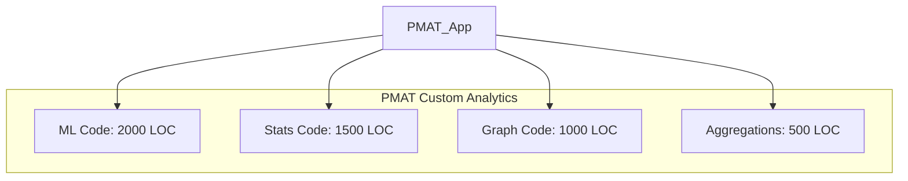

# A3 Summary: Integrate `aprender` and `trueno-db` for Analytics

**Document ID**: SPEC-ML-ANALYTICS-002-A3
**Version**: 1.0.0
**Status**: DRAFT
**Date**: 2025-11-21
**Author**: PMAT Team

---

### 1. Background & Problem Statement

PMAT's analytics engine relies on ~5,000 lines of custom, ad-hoc code for ML, statistics, and graph analysis. This has resulted in significant challenges:

- **High Maintenance Overhead**: The large, bespoke codebase is complex and slow to change.
- **Inconsistent Quality**: Test coverage averages a modest ~65% and varies widely between components.
- **Performance Bottlenecks**: Current implementations are not optimized for large datasets (scalar or basic parallelism).
- **Correctness Concerns**: Algorithms are not peer-reviewed, increasing the risk of subtle bugs.

The goal is to replace this custom code with standardized, high-performance, and well-tested libraries.

---

### 2. Current State Analysis

The current analytics landscape is fragmented and difficult to maintain.

| Category | LOC | Test Coverage | Issues |
| :--- | :-- | :--- | :--- |
| **ML Algorithms** | ~2,000 | ~60% | Ad-hoc, limited implementations |
| **Statistics** | ~1,500 | ~70% | Redundant scalar/SIMD code |
| **Graph Algorithms**| ~1,000 | ~40% | Mostly placeholder stubs |
| **Aggregations** | ~500 | ~80% | Basic, slow loops |
| **TOTAL** | **~5,000** | **~65%** | **High technical debt**|



---

### 3. Proposed Solution & Target Condition

We will replace the custom analytics engine by integrating two production-ready libraries: **`aprender v0.4.1`** (ML & Stats) and **`trueno-db v0.2.0`** (High-Performance OLAP).

#### Proposed Architecture
```mermaid
graph TD
    subgraph PMAT Application
        Z[Domain Logic: TDG, SATD]
    end

    subgraph Standardized Libraries
        Y[aprender v0.4.1 <br/>(ML, Graph, Stats)]
        X[trueno-db v0.2.0 <br/>(GPU/SIMD Aggregations, SQL)]
    end

    Z --> Y
    Z --> X
```

#### Target Condition
| Metric | Current (Custom) | Target (aprender + trueno-db) | Improvement |
| :--- | :--- | :--- | :--- |
| **Code Size** | ~5,000 LOC | ~500 LOC (integration) | **-90%** |
| **Test Coverage** | ~65% (avg) | **~94%** (library average) | **+29%** |
| **Top-K Speed** | 2.3s (1M rows) | 80ms (GPU) / 450ms (SIMD) | **5x to 28x** |
| **SUM Speed** | 1.0s (10M vals) | 45ms (GPU) / 360ms (SIMD) | **2.7x to 22x** |
| **Correctness** | Ad-hoc | Peer-reviewed, 800+ tests | **High Confidence** |
| **Binary Size** | Baseline | +0.8 MB (SIMD default) | **Acceptable** |

---

### 4. Implementation Plan (PDCA)

A phased, 8-week rollout to mitigate risk and validate benefits at each step.

| Phase | Duration | Key Actions (Plan & Do) | Verification (Check & Act) |
| :--- | :--- | :--- | :--- |
| **1. Foundation** | 1 Week | Update `trueno` and `trueno-db` dependencies to latest versions. | All 1000+ tests pass. No regressions. |
| **2. ML Migration** | 2 Weeks | Replace custom ML predictors & clustering with `aprender` equivalents. | Accuracy improves by ≥5%. Test coverage up. |
| **3. Statistics** | 1 Week | Replace custom stat functions (variance, gini) with `aprender`/`trueno`. | SIMD speedup ≥1.5x. Pass property tests. |
| **4. Graph Algos** | 1 Week | Implement placeholder graph algorithms (PageRank, etc.) using `aprender`. | Algorithms produce correct results vs. known graphs. |
| **5. OLAP Analytics**| 2 Weeks | Replace slow Top-K/aggregations with `trueno-db` SQL engine. | Queries are 5x-28x faster. Pass benchmarks. |
| **6. Integration** | 1 Week | Conduct full pipeline E2E tests and finalize documentation. | All success metrics met. Ready for production. |

---

### 5. Follow-Up & Verification

Success will be measured against clear quantitative and qualitative goals.

#### Key Success Metrics
| Metric | Target | How to Measure |
| :--- | :--- | :--- |
| **Code Reduction** | -90% LOC | `tokei` analysis of `src/` |
| **Test Coverage** | ≥85% | `cargo llvm-cov` report |
| **Top-K Performance** | ≤500ms (SIMD, 1M rows) | `cargo bench` |
| **Binary Size** | ≤ +1.0 MB (SIMD) | `ls -lh target/release/pmat` |
| **Maintainability** | Higher | Qualitative developer feedback |

#### Risk Mitigation
- **Phased Rollout**: Each phase is independently verifiable and reversible.
- **Feature Flags**: `analytics-simd` and `analytics-gpu` flags allow disabling the new engine if critical issues arise.
- **Comprehensive Testing**: A suite of unit, integration, performance, and property tests will validate correctness and speed.
- **Binary Size Management**: GPU dependencies are opt-in to keep the default binary small.

---

### 6. Conclusion & Recommendation

The integration of `aprender` and `trueno-db` presents a clear path to significantly improve the performance, quality, and maintainability of PMAT's analytics capabilities. The plan is sound and low-risk.

**Recommendation**: **Approve** the 8-week implementation plan.
