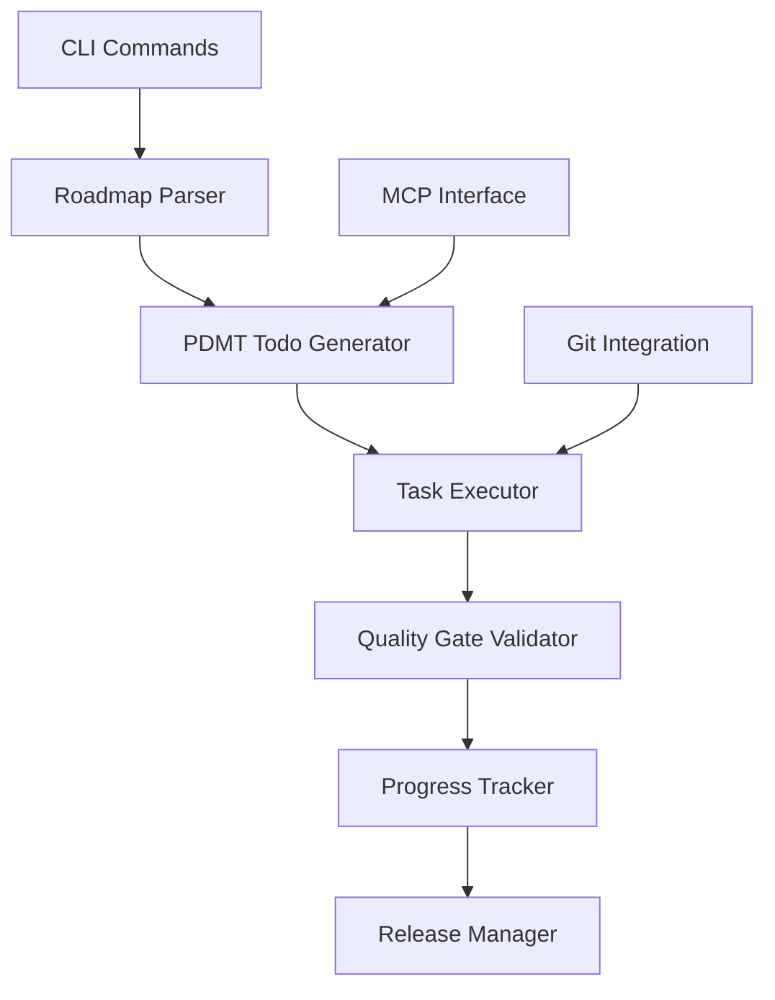

# Roadmap Todo Quality Gate Specification

*Version 1.0 - Institutionalizing Development Workflow through PMAT*

## Executive Summary

This specification defines a comprehensive system that integrates roadmap management, PDMT-based todo generation, and quality gate enforcement into a single cohesive feature within PMAT. This ensures that all development follows a structured, quality-enforced workflow with automatic tracking and validation.

## 1. System Overview

### 1.1 Core Components



### 1.2 Design Principles

- **Deterministic**: All todo generation uses fixed seeds for reproducibility
- **Quality-First**: Every task has associated quality gates
- **Traceable**: Full audit trail from roadmap to release
- **Automated**: Minimal manual intervention required
- **Dogfooding**: PMAT uses its own features for development

## 2. Roadmap Structure

### 2.1 Roadmap File Format

Location: `docs/execution/roadmap.md`

```markdown
## Sprint: v{VERSION} {TITLE}
- **Duration**: {START} to {END}
- **Priority**: {P0|P1|P2}
- **Quality Gates**: {GATES}

### Tasks
| ID | Description | Status | Complexity | Priority |
|----|-------------|--------|------------|----------|
| PMAT-XXXX | Task description | 📋/🚧/✅ | Low/Medium/High | P0/P1/P2 |

### Definition of Done
- [ ] Quality gate criteria
- [ ] Documentation updated
- [ ] Tests passing
```

### 2.2 Task States

```rust
#[derive(Debug, Clone, Serialize, Deserialize)]
pub enum TaskStatus {
    Planned,     // 📋 - Not started
    InProgress,  // 🚧 - Currently working
    Completed,   // ✅ - Done
    Blocked,     // 🚫 - Cannot proceed
    Deferred,    // ⏸️ - Postponed
}
```

## 3. PDMT Todo Integration

### 3.1 Automatic Todo Generation

```rust
pub struct RoadmapTodoGenerator {
    roadmap_path: PathBuf,
    pdmt_engine: PdmtEngine,
    quality_config: QualityConfig,
}

impl RoadmapTodoGenerator {
    pub async fn generate_sprint_todos(&self, sprint_id: &str) -> Result<Vec<PdmtTodo>> {
        let roadmap = self.parse_roadmap()?;
        let sprint = roadmap.get_sprint(sprint_id)?;
        
        let mut todos = Vec::new();
        for task in sprint.tasks {
            let task_todos = self.pdmt_engine.generate(
                &task.description,
                Granularity::from_complexity(&task.complexity),
                Some(task.id.parse::<u64>().unwrap_or(42)), // Deterministic seed from task ID
            ).await?;
            
            // Add quality gates to each todo
            for mut todo in task_todos {
                todo.validation_commands.push(format!(
                    "pmat quality-gate --task-id {}",
                    task.id
                ));
                todo.success_criteria.push(
                    "All quality gates pass".to_string()
                );
                todos.push(todo);
            }
        }
        
        Ok(todos)
    }
}
```

### 3.2 Todo Structure with Quality Gates

```rust
#[derive(Debug, Clone, Serialize, Deserialize)]
pub struct QualityEnforcedTodo {
    pub id: String,
    pub task_id: String,  // PMAT-XXXX
    pub description: String,
    pub implementation_spec: String,
    pub quality_requirements: QualityRequirements,
    pub validation_commands: Vec<String>,
    pub success_criteria: Vec<String>,
    pub estimated_time: Duration,
    pub dependencies: Vec<String>,
}

#[derive(Debug, Clone, Serialize, Deserialize)]
pub struct QualityRequirements {
    pub max_complexity: u32,
    pub min_test_coverage: u8,
    pub required_docs: bool,
    pub satd_allowed: u32,  // Always 0
    pub lint_compliance: bool,
}
```

## 4. Quality Gate Enforcement

### 4.1 Task-Level Quality Gates

```rust
pub struct TaskQualityGate {
    task_id: String,
    checks: Vec<QualityCheck>,
}

impl TaskQualityGate {
    pub async fn validate(&self) -> Result<QualityReport> {
        let mut report = QualityReport::new(&self.task_id);
        
        for check in &self.checks {
            let result = match check {
                QualityCheck::Complexity(max) => {
                    self.check_complexity(*max).await?
                }
                QualityCheck::TestCoverage(min) => {
                    self.check_coverage(*min).await?
                }
                QualityCheck::Documentation => {
                    self.check_documentation().await?
                }
                QualityCheck::NoSatd => {
                    self.check_satd().await?
                }
                QualityCheck::LintCompliance => {
                    self.check_lint().await?
                }
                QualityCheck::RoadmapUpdated => {
                    self.check_roadmap_status().await?
                }
            };
            
            report.add_check_result(check, result);
        }
        
        Ok(report)
    }
}
```

### 4.2 Sprint-Level Quality Gates

```rust
pub struct SprintQualityGate {
    sprint_id: String,
    tasks: Vec<TaskQualityGate>,
}

impl SprintQualityGate {
    pub async fn validate_sprint(&self) -> Result<SprintReport> {
        let mut report = SprintReport::new(&self.sprint_id);
        
        // Check all tasks
        for task_gate in &self.tasks {
            let task_report = task_gate.validate().await?;
            report.add_task_report(task_report);
        }
        
        // Sprint-level checks
        report.all_tasks_complete = self.check_all_tasks_complete().await?;
        report.documentation_synced = self.check_documentation_sync().await?;
        report.changelog_updated = self.check_changelog().await?;
        report.version_bumped = self.check_version_bump().await?;
        
        Ok(report)
    }
}
```

## 5. CLI Commands

### 5.1 Roadmap Management Commands

```bash
# Initialize roadmap for new sprint
pmat roadmap init --version 2.6.0 --title "Architecture Refactor"

# Generate todos from roadmap
pmat roadmap todos --sprint v2.6.0 --output todos.md

# Start working on a task
pmat roadmap start PMAT-3003

# Complete a task (runs quality gates)
pmat roadmap complete PMAT-3003

# Check sprint status
pmat roadmap status --sprint v2.6.0

# Validate sprint for release
pmat roadmap validate --sprint v2.6.0
```

### 5.2 Implementation

```rust
#[derive(Debug, Parser)]
pub enum RoadmapCommand {
    /// Initialize a new sprint in the roadmap
    Init {
        #[arg(long)]
        version: String,
        #[arg(long)]
        title: String,
        #[arg(long, default_value = "2 weeks")]
        duration: String,
    },
    
    /// Generate PDMT todos from roadmap tasks
    Todos {
        #[arg(long)]
        sprint: String,
        #[arg(long, default_value = "todos.md")]
        output: PathBuf,
        #[arg(long)]
        include_quality_gates: bool,
    },
    
    /// Start working on a task
    Start {
        task_id: String,
        #[arg(long)]
        create_branch: bool,
    },
    
    /// Complete a task (with quality validation)
    Complete {
        task_id: String,
        #[arg(long)]
        skip_quality_check: bool,
    },
    
    /// Check sprint status
    Status {
        #[arg(long)]
        sprint: Option<String>,
        #[arg(long)]
        format: Option<OutputFormat>,
    },
    
    /// Validate sprint readiness for release
    Validate {
        #[arg(long)]
        sprint: String,
        #[arg(long)]
        strict: bool,
    },
}
```

## 6. MCP Tool Integration

### 6.1 MCP Tools for Roadmap Management

```rust
pub struct RoadmapMcpTools;

impl RoadmapMcpTools {
    pub fn register_tools() -> Vec<Tool> {
        vec![
            Tool {
                name: "roadmap_init_sprint",
                description: "Initialize a new sprint in the roadmap",
                input_schema: json!({
                    "type": "object",
                    "properties": {
                        "version": {"type": "string"},
                        "title": {"type": "string"},
                        "duration": {"type": "string"}
                    },
                    "required": ["version", "title"]
                }),
            },
            Tool {
                name: "roadmap_generate_todos",
                description: "Generate PDMT todos from roadmap tasks",
                input_schema: json!({
                    "type": "object",
                    "properties": {
                        "sprint": {"type": "string"},
                        "include_quality_gates": {"type": "boolean"}
                    },
                    "required": ["sprint"]
                }),
            },
            Tool {
                name: "roadmap_task_status",
                description: "Update task status in roadmap",
                input_schema: json!({
                    "type": "object",
                    "properties": {
                        "task_id": {"type": "string"},
                        "status": {"type": "string", "enum": ["planned", "in_progress", "completed"]}
                    },
                    "required": ["task_id", "status"]
                }),
            },
            Tool {
                name: "roadmap_quality_check",
                description: "Run quality gates for a task",
                input_schema: json!({
                    "type": "object",
                    "properties": {
                        "task_id": {"type": "string"}
                    },
                    "required": ["task_id"]
                }),
            },
        ]
    }
}
```

## 7. Git Integration

### 7.1 Automatic Branch Management

```rust
pub struct GitIntegration {
    repo: Repository,
}

impl GitIntegration {
    pub async fn start_task(&self, task_id: &str) -> Result<()> {
        // Create feature branch
        let branch_name = format!("feature/{}", task_id.to_lowercase());
        self.repo.create_branch(&branch_name)?;
        
        // Update roadmap status
        self.update_roadmap_status(task_id, TaskStatus::InProgress)?;
        
        // Commit the status change
        self.repo.commit(&format!("{}: Start implementation", task_id))?;
        
        Ok(())
    }
    
    pub async fn complete_task(&self, task_id: &str) -> Result<()> {
        // Run quality gates
        let quality_report = TaskQualityGate::new(task_id).validate().await?;
        
        if !quality_report.passed() {
            return Err(anyhow!("Quality gates failed: {:?}", quality_report));
        }
        
        // Update roadmap status
        self.update_roadmap_status(task_id, TaskStatus::Completed)?;
        
        // Create completion commit
        self.repo.commit(&format!("{}: Complete implementation

Quality gates passed:
- Complexity: ✅
- Test coverage: ✅
- Documentation: ✅
- SATD: ✅
- Lint: ✅

🤖 Generated with Claude Code

Co-Authored-By: Claude <noreply@anthropic.com>", task_id))?;
        
        Ok(())
    }
}
```

## 8. Progress Tracking

### 8.1 Velocity Metrics

```rust
#[derive(Debug, Serialize, Deserialize)]
pub struct VelocityTracker {
    pub sprint_id: String,
    pub started_at: DateTime<Utc>,
    pub tasks_completed: Vec<CompletedTask>,
    pub quality_scores: Vec<QualityScore>,
    pub average_cycle_time: Duration,
    pub burndown_data: Vec<BurndownPoint>,
}

#[derive(Debug, Serialize, Deserialize)]
pub struct CompletedTask {
    pub task_id: String,
    pub started_at: DateTime<Utc>,
    pub completed_at: DateTime<Utc>,
    pub complexity: Complexity,
    pub quality_score: f64,
    pub rework_count: u32,
}
```

### 8.2 Dashboard Generation

```rust
pub struct RoadmapDashboard;

impl RoadmapDashboard {
    pub async fn generate(&self, sprint_id: &str) -> Result<String> {
        let tracker = VelocityTracker::load(sprint_id)?;
        
        let mut output = String::new();
        
        // Sprint overview
        writeln!(output, "# Sprint {} Dashboard", sprint_id)?;
        writeln!(output, "\n## Progress")?;
        writeln!(output, "- Tasks Completed: {}/{}", 
            tracker.tasks_completed.len(),
            self.total_tasks(sprint_id)?
        )?;
        
        // Quality metrics
        writeln!(output, "\n## Quality Metrics")?;
        writeln!(output, "- Average Quality Score: {:.1}%", 
            tracker.quality_scores.iter().map(|s| s.score).sum::<f64>() 
            / tracker.quality_scores.len() as f64 * 100.0
        )?;
        
        // Burndown chart
        writeln!(output, "\n## Burndown Chart")?;
        writeln!(output, "```mermaid")?;
        writeln!(output, "graph LR")?;
        for point in &tracker.burndown_data {
            writeln!(output, "  {} --> {}", point.day, point.remaining_tasks)?;
        }
        writeln!(output, "```")?;
        
        Ok(output)
    }
}
```

## 9. Release Integration

### 9.1 Release Validation

```rust
pub struct ReleaseValidator {
    sprint_id: String,
    quality_gate: SprintQualityGate,
}

impl ReleaseValidator {
    pub async fn validate_for_release(&self) -> Result<ReleaseReadiness> {
        let mut readiness = ReleaseReadiness::default();
        
        // Check sprint quality gates
        let sprint_report = self.quality_gate.validate_sprint().await?;
        readiness.quality_gates_passed = sprint_report.all_passed();
        
        // Check documentation
        readiness.changelog_updated = self.check_changelog().await?;
        readiness.roadmap_updated = self.check_roadmap_completion().await?;
        
        // Check version
        readiness.version_bumped = self.check_version_bump().await?;
        
        // Check tests
        readiness.all_tests_passing = self.run_test_suite().await?;
        
        // Check for uncommitted changes
        readiness.working_tree_clean = self.check_working_tree().await?;
        
        Ok(readiness)
    }
}
```

## 10. Configuration

### 10.1 pmat.toml Configuration

```toml
[roadmap]
enabled = true
path = "docs/execution/roadmap.md"
auto_generate_todos = true
enforce_quality_gates = true
require_task_ids = true
task_id_pattern = "PMAT-[0-9]{4}"

[roadmap.quality_gates]
complexity_max = 20
coverage_min = 80
documentation_required = true
satd_tolerance = 0
lint_compliance = true

[roadmap.git]
create_branches = true
branch_pattern = "feature/{task_id}"
commit_pattern = "{task_id}: {message}"
require_quality_check = true

[roadmap.tracking]
velocity_tracking = true
burndown_charts = true
quality_metrics = true
export_format = "markdown"
```

## 11. Implementation Plan

### Phase 1: Core Infrastructure (PMAT-4100)
1. Create roadmap parser module
2. Integrate with PDMT engine
3. Add quality gate hooks

### Phase 2: CLI Commands (PMAT-4101)
1. Implement roadmap subcommands
2. Add interactive mode
3. Create status dashboard

### Phase 3: MCP Integration (PMAT-4102)
1. Add MCP tools for roadmap
2. Enable remote management
3. Add webhook support

### Phase 4: Git Integration (PMAT-4103)
1. Automatic branch creation
2. Commit message formatting
3. PR template generation

### Phase 5: Release Automation (PMAT-4104)
1. Sprint validation
2. Version management
3. Changelog generation

## 12. Success Criteria

1. **Zero Manual Tracking**: All task status updates automated
2. **100% Quality Compliance**: No tasks complete without passing gates
3. **Full Traceability**: Every change linked to roadmap task
4. **Deterministic Todos**: Same inputs always generate same todos
5. **Self-Dogfooding**: PMAT development uses this system

## 13. Example Workflow

```bash
# 1. Start new sprint
pmat roadmap init --version 2.7.0 --title "Performance Optimization"

# 2. Generate todos for sprint
pmat roadmap todos --sprint v2.7.0 > sprint-todos.md

# 3. Start working on task
pmat roadmap start PMAT-4100
# Creates branch: feature/pmat-4100
# Updates roadmap.md: PMAT-4100 status -> 🚧

# 4. Work on implementation
# ... make changes ...

# 5. Complete task (runs quality gates)
pmat roadmap complete PMAT-4100
# Runs: complexity check, SATD check, lint, tests
# Updates roadmap.md: PMAT-4100 status -> ✅
# Creates commit with quality report

# 6. Check sprint progress
pmat roadmap status --sprint v2.7.0
# Shows: 1/5 tasks complete, quality score 98%

# 7. Validate for release
pmat roadmap validate --sprint v2.7.0
# Checks all tasks complete, quality gates passed, docs updated

# 8. Create release
pmat release --sprint v2.7.0
# Bumps version, updates changelog, creates tag, publishes
```

## 14. Testing Strategy

### 14.1 Unit Tests
- Roadmap parser correctness
- Todo generation determinism
- Quality gate validation logic

### 14.2 Integration Tests
- Full workflow execution
- Git integration
- MCP tool functionality

### 14.3 Property Tests
- Todo generation properties
- Quality gate invariants
- State machine transitions

### 14.4 Dogfooding
- Use system for its own development
- Track metrics and improvements
- Continuous refinement

## 15. Conclusion

This specification defines a comprehensive system that institutionalizes development workflow through PMAT itself. By integrating roadmap management, PDMT todo generation, and quality gate enforcement, we ensure that all development follows a structured, quality-first approach with full automation and traceability.