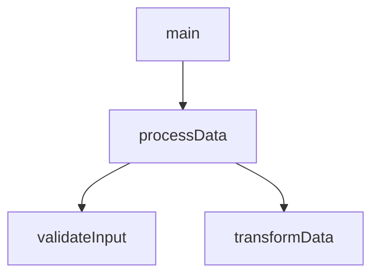
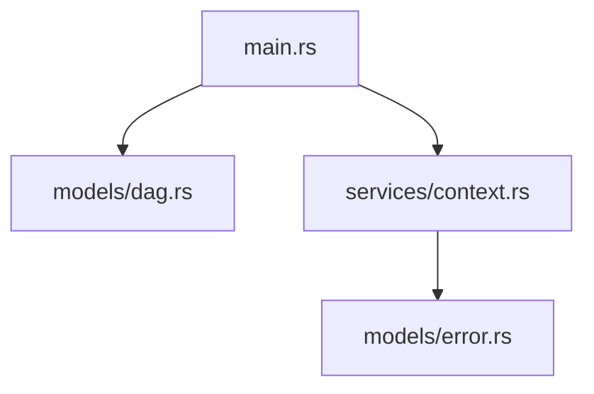
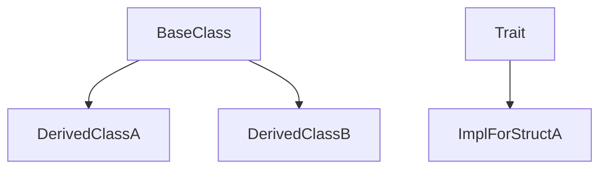
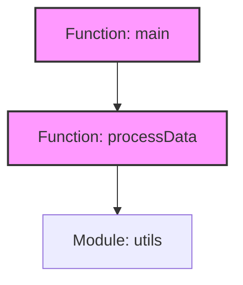
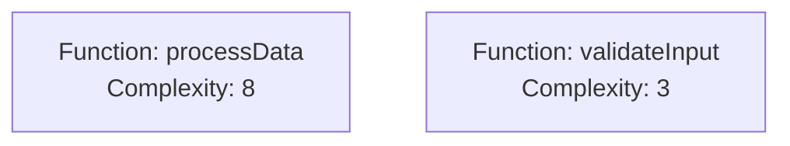

# Mermaid Graph Generation Specification

## 1. Overview

The PAIML MCP Agent Toolkit provides integrated Mermaid diagram generation for visualizing code structure through dependency analysis. The implementation leverages Abstract Syntax Tree (AST) parsing to construct directed acyclic graphs (DAGs) representing various code relationships, which are then rendered as Mermaid diagrams.

## 2. Architecture

### 2.1 Core Components

```
┌─────────────────────┐     ┌──────────────────┐     ┌───────────────────┐
│  AST Parser         │────▶│  DAG Builder     │────▶│ Mermaid Generator │
│ (Rust/TS/Python)   │     │                  │     │                   │
└─────────────────────┘     └──────────────────┘     └───────────────────┘
         │                           │                         │
         ▼                           ▼                         ▼
   FileContext               DependencyGraph            .mmd output
```

### 2.2 Module Structure

- **`services/dag_builder.rs`**: Constructs dependency graphs from AST analysis
- **`services/mermaid_generator.rs`**: Converts dependency graphs to Mermaid syntax
- **`models/dag.rs`**: Core data structures for graph representation
- **`handlers/tools.rs`**: CLI and MCP tool interface

## 3. Graph Types

### 3.1 Call Graph (default)
Function/method call relationships within the codebase.



### 3.2 Import Graph
Module import dependencies showing file relationships.



### 3.3 Inheritance Graph
Class/trait inheritance hierarchies.



### 3.4 Full Dependency Graph
Comprehensive view combining all relationship types.

## 4. Data Model

### 4.1 Node Types

```rust
pub enum NodeType {
    Function,
    Module,
    Struct,
    Enum,
    Trait,
    Class,
    Interface,
    File,
}
```

### 4.2 Edge Types

```rust
pub enum EdgeType {
    Call,       // Function calls
    Import,     // Module imports
    Implements, // Trait/interface implementation
    Extends,    // Inheritance
    Uses,       // Generic usage relationship
}
```

### 4.3 Node Information

```rust
pub struct NodeInfo {
    pub name: String,
    pub node_type: NodeType,
    pub file_path: String,
    pub line_number: usize,
    pub complexity: Option<u32>,  // Cyclomatic complexity
    pub metadata: HashMap<String, String>,
}
```

## 5. CLI Interface

### 5.1 Command Syntax

```bash
paiml-mcp-agent-toolkit analyze dag [OPTIONS]
```

### 5.2 Options

| Option | Type | Default | Description |
|--------|------|---------|-------------|
| `--project-path` | Path | `.` | Project directory to analyze |
| `--dag-type` | Enum | `call-graph` | Type of graph to generate |
| `--output`, `-o` | Path | stdout | Output file path (.mmd) |
| `--max-depth` | u32 | unlimited | Maximum traversal depth |
| `--filter-external` | bool | false | Exclude external dependencies |
| `--show-complexity` | bool | false | Include complexity metrics |
| `--include` | Vec<String> | all | File patterns to include |

### 5.3 DAG Type Values

- `call-graph`: Function call relationships
- `import-graph`: Module import dependencies
- `inheritance`: Class/trait inheritance
- `full-dependency`: All relationships combined

## 6. MCP Tool Interface

### 6.1 Tool Definition

```json
{
  "name": "analyze_dag",
  "description": "Generate dependency graphs in Mermaid format",
  "inputSchema": {
    "type": "object",
    "properties": {
      "project_path": { "type": "string" },
      "dag_type": { 
        "type": "string",
        "enum": ["call-graph", "import-graph", "inheritance", "full-dependency"]
      },
      "output": { "type": "string" },
      "max_depth": { "type": "integer" },
      "filter_external": { "type": "boolean" },
      "show_complexity": { "type": "boolean" }
    }
  }
}
```

### 6.2 Request Example

```json
{
  "jsonrpc": "2.0",
  "id": 1,
  "method": "tools/call",
  "params": {
    "name": "analyze_dag",
    "arguments": {
      "project_path": "/path/to/project",
      "dag_type": "call-graph",
      "show_complexity": true,
      "filter_external": true,
      "max_depth": 3
    }
  }
}
```

## 7. Mermaid Output Format

### 7.1 Basic Structure



### 7.2 Node Naming Convention

```
{sanitized_id}[{type}: {display_name}]
```

Where:
- `sanitized_id`: Alphanumeric identifier (special chars replaced with '_')
- `type`: Node type (Function, Module, Struct, etc.)
- `display_name`: Original name with optional complexity

### 7.3 Complexity Annotation

When `--show-complexity` is enabled:



## 8. Implementation Details

### 8.1 MermaidGenerator Implementation

```rust
pub struct MermaidGenerator;

impl MermaidGenerator {
    pub fn generate(&self, graph: &DependencyGraph, options: MermaidOptions) -> String {
        let mut output = String::new();
        
        // Header
        writeln!(&mut output, "graph TD").unwrap();
        
        // Nodes
        for (id, node) in &graph.nodes {
            let sanitized_id = self.sanitize_id(id);
            let label = self.format_node_label(node, options.show_complexity);
            writeln!(&mut output, "    {}[{}]", sanitized_id, label).unwrap();
        }
        
        // Edges
        for edge in &graph.edges {
            let from = self.sanitize_id(&edge.from);
            let to = self.sanitize_id(&edge.to);
            let arrow = self.edge_type_to_arrow(&edge.edge_type);
            writeln!(&mut output, "    {} {} {}", from, arrow, to).unwrap();
        }
        
        output
    }
    
    fn sanitize_id(&self, id: &str) -> String {
        id.chars()
            .map(|c| if c.is_alphanumeric() || c == '_' { c } else { '_' })
            .collect()
    }
}
```

### 8.2 Edge Type Mapping

| EdgeType | Mermaid Arrow | Description |
|----------|--------------|-------------|
| Call | `-->` | Solid arrow for function calls |
| Import | `-.->` | Dotted arrow for imports |
| Implements | `-->>` | Open arrow for implementation |
| Extends | `--|>` | Inheritance arrow |
| Uses | `---` | Simple line for generic usage |

### 8.3 Filtering Algorithm

```rust
pub fn filter_by_edge_type(&self, edge_type: EdgeType) -> Self {
    let filtered_edges: Vec<Edge> = self.edges
        .iter()
        .filter(|e| e.edge_type == edge_type)
        .cloned()
        .collect();
    
    let connected_nodes: HashSet<String> = filtered_edges
        .iter()
        .flat_map(|e| vec![e.from.clone(), e.to.clone()])
        .collect();
    
    DependencyGraph {
        nodes: self.nodes
            .iter()
            .filter(|(id, _)| connected_nodes.contains(*id))
            .map(|(k, v)| (k.clone(), v.clone()))
            .collect(),
        edges: filtered_edges,
    }
}
```

## 9. Performance Characteristics

### 9.1 Time Complexity

- **AST Parsing**: O(n) where n = number of AST nodes
- **DAG Construction**: O(n + e) where e = number of edges
- **Mermaid Generation**: O(n + e) linear in graph size
- **Overall**: O(n + e) with typical e ≈ 2n for most codebases

### 9.2 Space Complexity

- **Graph Storage**: O(n + e)
- **Mermaid Output**: O(n + e) characters
- **Memory Usage**: ~100 bytes per node, ~50 bytes per edge

### 9.3 Optimization Strategies

1. **Caching**: AST analysis results cached for 5 minutes
2. **Lazy Loading**: Files parsed only when referenced
3. **Parallel Processing**: Multi-file analysis uses rayon for parallelism
4. **Incremental Updates**: Only changed files re-analyzed

## 10. Usage Examples

### 10.1 Basic Call Graph

```bash
# Generate call graph for current directory
paiml-mcp-agent-toolkit analyze dag

# Save to file
paiml-mcp-agent-toolkit analyze dag -o architecture.mmd
```

### 10.2 Filtered Import Graph

```bash
# Show only internal imports, max depth 3
paiml-mcp-agent-toolkit analyze dag \
  --dag-type import-graph \
  --filter-external \
  --max-depth 3 \
  -o imports.mmd
```

### 10.3 Complex Analysis with Metrics

```bash
# Full analysis with complexity metrics
paiml-mcp-agent-toolkit analyze dag \
  --dag-type full-dependency \
  --show-complexity \
  --include "**/*.rs" \
  --include "**/core/*.rs" \
  -o full-analysis.mmd
```

### 10.4 Integration with Documentation

```markdown
## Architecture

\```mermaid
$(paiml-mcp-agent-toolkit analyze dag --dag-type import-graph --filter-external)
\```
```

## 11. Rendering Mermaid Diagrams

### 11.1 Supported Platforms

- **GitHub**: Automatic rendering in markdown files
- **VS Code**: Mermaid extension preview
- **GitLab**: Native support in markdown
- **Confluence**: Via Mermaid macro
- **Web**: mermaid.live editor

### 11.2 CLI Rendering

```bash
# Using Mermaid CLI
mmdc -i architecture.mmd -o architecture.png

# Using online converter
curl -X POST https://mermaid.ink/img/svg \
  -H "Content-Type: text/plain" \
  --data-binary @architecture.mmd > architecture.svg
```

## 12. Limitations and Constraints

1. **Graph Size**: Practical limit ~1000 nodes for readability
2. **Cycle Detection**: DAGs only; cycles are broken at first detection
3. **Cross-Language**: Limited support for polyglot projects
4. **Dynamic Calls**: Cannot detect runtime-determined calls
5. **Macro Expansion**: Rust macros analyzed in unexpanded form

## 13. Future Enhancements

1. **Interactive Graphs**: D3.js export option
2. **Diff Visualization**: Show changes between versions
3. **Clustering**: Automatic module grouping
4. **Custom Themes**: User-defined Mermaid themes
5. **Real-time Updates**: Watch mode with live updates

## 14. Error Handling

### 14.1 Common Errors

| Error | Cause | Resolution |
|-------|-------|------------|
| `No git repository found` | Not in git repo | Initialize git or specify path |
| `Failed to parse file` | Syntax error | Fix syntax errors first |
| `Graph too large` | >5000 nodes | Use filters to reduce scope |
| `Unsupported file type` | Non-supported language | Check supported extensions |

### 14.2 Error Response Format

```json
{
  "error": {
    "code": -32603,
    "message": "Failed to generate DAG",
    "data": {
      "details": "Graph exceeds maximum size limit",
      "suggestion": "Use --filter-external or --max-depth to reduce graph size"
    }
  }
}
```