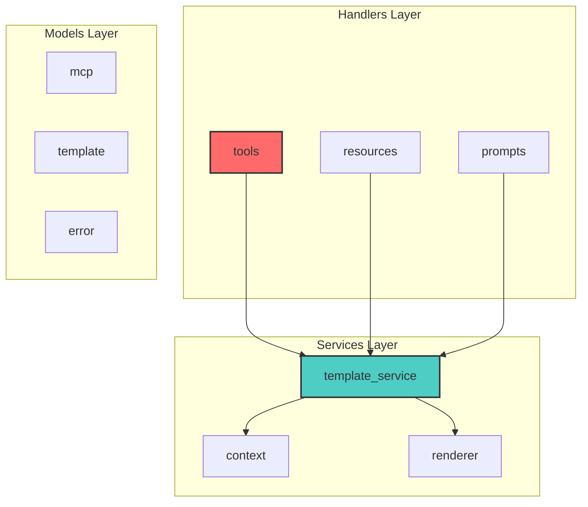

# PAIML MCP Agent Toolkit V2 Specification

## Overview

Version 2 of the PAIML MCP Agent Toolkit extends the existing template generation capabilities with comprehensive code analysis features. This specification outlines new tools for understanding code quality, architecture, and maintenance characteristics of projects.

## New Features

### 1. Code Churn Analysis

Analyze git history to identify frequently changed files and potential maintenance hotspots.

#### Data Model

```rust
pub struct CodeChurnAnalysis {
    pub generated_at: DateTime<Utc>,
    pub period_days: u32,
    pub repository_root: PathBuf,
    pub files: Vec<FileChurnMetrics>,
    pub summary: ChurnSummary,
}

pub struct FileChurnMetrics {
    pub path: PathBuf,
    pub relative_path: String,
    pub commit_count: usize,
    pub unique_authors: Vec<String>,
    pub additions: usize,
    pub deletions: usize,
    pub churn_score: f32,  // 0.0 to 1.0
    pub last_modified: DateTime<Utc>,
    pub first_seen: DateTime<Utc>,
}

pub struct ChurnSummary {
    pub total_commits: usize,
    pub total_files_changed: usize,
    pub hotspot_files: Vec<PathBuf>,  // Top 10 by churn
    pub stable_files: Vec<PathBuf>,   // Least changed
    pub author_contributions: HashMap<String, usize>,
}
```

#### CLI Commands

```bash
# Analyze churn for last 30 days
paiml-mcp-agent-toolkit analyze churn

# Analyze with custom period
paiml-mcp-agent-toolkit analyze churn --days 90

# Output formats
paiml-mcp-agent-toolkit analyze churn --format json
paiml-mcp-agent-toolkit analyze churn --format markdown
paiml-mcp-agent-toolkit analyze churn --format csv
```

#### MCP Tool

```json
{
  "name": "analyze_code_churn",
  "description": "Analyze code change frequency and patterns",
  "inputSchema": {
    "type": "object",
    "properties": {
      "project_path": {
        "type": "string",
        "description": "Path to analyze (defaults to current directory)"
      },
      "period_days": {
        "type": "integer",
        "description": "Number of days to analyze (default: 30)"
      },
      "format": {
        "type": "string",
        "enum": ["json", "markdown", "summary"],
        "description": "Output format"
      }
    }
  }
}
```

### 2. Dependency Graph Generation

Generate Mermaid diagrams showing module dependencies and architectural relationships.

#### Data Model

```rust
pub struct DependencyGraph {
    pub generated_at: DateTime<Utc>,
    pub root_module: String,
    pub nodes: Vec<DependencyNode>,
    pub edges: Vec<DependencyEdge>,
    pub layers: Vec<ArchitecturalLayer>,
}

pub struct DependencyNode {
    pub id: String,
    pub name: String,
    pub node_type: NodeType,
    pub file_path: PathBuf,
    pub metrics: NodeMetrics,
}

pub enum NodeType {
    Module,
    Trait,
    Struct,
    Function,
    Service,
    Handler,
}

pub struct DependencyEdge {
    pub from: String,
    pub to: String,
    pub edge_type: EdgeType,
    pub weight: f32,  // Coupling strength
}

pub enum EdgeType {
    Uses,
    Implements,
    Extends,
    Calls,
    Depends,
}

pub struct NodeMetrics {
    pub complexity: f32,
    pub size: usize,
    pub coupling: f32,
    pub cohesion: f32,
}
```

#### Output Formats



#### CLI Commands

```bash
# Generate dependency graph
paiml-mcp-agent-toolkit analyze deps

# With custom visualization options
paiml-mcp-agent-toolkit analyze deps --layout hierarchical
paiml-mcp-agent-toolkit analyze deps --group-by layer
paiml-mcp-agent-toolkit analyze deps --max-depth 3

# Output to file
paiml-mcp-agent-toolkit analyze deps -o architecture.mmd
```

### 3. Complexity Analysis

Identify complex code that may need refactoring.

#### Data Model

```rust
pub struct ComplexityReport {
    pub generated_at: DateTime<Utc>,
    pub thresholds: ComplexityThresholds,
    pub files: Vec<FileComplexity>,
    pub violations: Vec<ComplexityViolation>,
    pub summary: ComplexitySummary,
}

pub struct ComplexityThresholds {
    pub cyclomatic: u32,      // Default: 10
    pub cognitive: u32,       // Default: 15
    pub lines_per_function: u32,  // Default: 50
    pub parameters: u32,      // Default: 5
    pub nesting_depth: u32,   // Default: 4
}

pub struct FileComplexity {
    pub path: PathBuf,
    pub language: Language,
    pub functions: Vec<FunctionComplexity>,
    pub average_complexity: f32,
    pub max_complexity: u32,
}

pub struct FunctionComplexity {
    pub name: String,
    pub line_start: usize,
    pub line_end: usize,
    pub cyclomatic: u32,
    pub cognitive: u32,
    pub lines: usize,
    pub parameters: usize,
    pub nesting_depth: u32,
    pub is_test: bool,
}

pub struct ComplexityViolation {
    pub severity: Severity,
    pub file: PathBuf,
    pub function: String,
    pub line: usize,
    pub violation_type: ViolationType,
    pub message: String,
    pub suggestion: String,
}

pub enum ViolationType {
    HighCyclomaticComplexity,
    HighCognitiveComplexity,
    TooManyLines,
    TooManyParameters,
    DeepNesting,
}
```

#### CLI Commands

```bash
# Analyze complexity with defaults
paiml-mcp-agent-toolkit analyze complexity

# Custom thresholds
paiml-mcp-agent-toolkit analyze complexity --cyclomatic 15 --lines 100

# Specific language
paiml-mcp-agent-toolkit analyze complexity --language rust

# Include/exclude patterns
paiml-mcp-agent-toolkit analyze complexity --include "src/**/*.rs" --exclude "tests/**"
```

### 4. Enhanced File Tree

Generate detailed file trees with metadata and analysis indicators.

#### Data Model

```rust
pub struct ProjectTree {
    pub generated_at: DateTime<Utc>,
    pub root: TreeNode,
    pub statistics: TreeStatistics,
}

pub struct TreeNode {
    pub name: String,
    pub path: PathBuf,
    pub node_type: TreeNodeType,
    pub size: u64,
    pub modified: SystemTime,
    pub metadata: NodeMetadata,
    pub children: Vec<TreeNode>,
}

pub enum TreeNodeType {
    Directory,
    File(FileType),
}

pub struct NodeMetadata {
    pub language: Option<Language>,
    pub complexity_score: Option<f32>,
    pub churn_score: Option<f32>,
    pub test_coverage: Option<f32>,
    pub todos: usize,
    pub is_generated: bool,
}

pub struct TreeStatistics {
    pub total_files: usize,
    pub total_directories: usize,
    pub total_size: u64,
    pub languages: HashMap<Language, LanguageStats>,
    pub largest_files: Vec<(PathBuf, u64)>,
}
```

#### Output Format

```
paiml-mcp-agent-toolkit/
├── 📁 server/ (1.2M)
│   ├── 📁 src/ (850K)
│   │   ├── 📄 main.rs (12K) [complexity: 3.2] 🔥
│   │   ├── 📁 handlers/ (125K)
│   │   │   ├── 📄 tools.rs (45K) [complexity: 8.9] ⚠️
│   │   │   └── 📄 resources.rs (32K) [complexity: 4.1]
│   │   └── 📁 services/ (280K)
│   │       ├── 📄 context.rs (89K) [complexity: 12.3] 🚨
│   │       └── 📄 renderer.rs (23K) ✅
│   └── 📄 Cargo.toml (2.1K)
└── 📄 README.md (28K) 📚

Legend: 🔥 Hot (high churn) | ⚠️ Warning | 🚨 Complex | ✅ Stable | 📚 Docs
```

### 5. Enhanced AST Context

Extend existing AST analysis with quality metrics.

#### Data Model Extensions

```rust
// Extend existing AstItem
pub enum AstItem {
    // ... existing variants ...
    
    // New quality metrics for each item
    Function {
        name: String,
        line: usize,
        visibility: String,
        metrics: FunctionMetrics,
    },
}

pub struct FunctionMetrics {
    pub complexity: u32,
    pub lines: usize,
    pub parameters: usize,
    pub calls_count: usize,
    pub called_by: Vec<String>,
    pub test_coverage: Option<f32>,
}

// Extend ProjectContext
pub struct ProjectContext {
    // ... existing fields ...
    
    pub quality_summary: QualitySummary,
    pub architectural_layers: Vec<Layer>,
}

pub struct QualitySummary {
    pub average_complexity: f32,
    pub test_ratio: f32,
    pub documentation_ratio: f32,
    pub todo_count: usize,
    pub deprecated_count: usize,
}
```

## Integration Features

### 1. Combined Analysis Command

```bash
# Run all analyses at once
paiml-mcp-agent-toolkit analyze all

# With specific analyses
paiml-mcp-agent-toolkit analyze --churn --complexity --deps

# Save to directory
paiml-mcp-agent-toolkit analyze all -o ./analysis-reports/
```

### 2. Watch Mode

```bash
# Watch for changes and update analysis
paiml-mcp-agent-toolkit analyze --watch

# With specific interval
paiml-mcp-agent-toolkit analyze --watch --interval 300
```

### 3. CI/CD Integration

```yaml
# GitHub Actions example
- name: Code Quality Analysis
  run: |
    paiml-mcp-agent-toolkit analyze all --format json -o analysis.json
    
- name: Upload Analysis
  uses: actions/upload-artifact@v3
  with:
    name: code-analysis
    path: analysis.json
```

## Output Formats

All analysis commands support multiple output formats:

1. **JSON** - Machine-readable, complete data
2. **Markdown** - Human-readable reports
3. **CSV** - For spreadsheet analysis
4. **HTML** - Interactive reports (future)
5. **Summary** - Brief console output

## Error Handling

```rust
pub enum AnalysisError {
    GitNotFound(PathBuf),
    NoGitHistory,
    ParseError { file: PathBuf, error: String },
    UnsupportedLanguage(String),
    ThresholdViolation(Vec<ComplexityViolation>),
}
```

## MCP Protocol Extensions

### New Tools

```json
{
  "tools": [
    {
      "name": "analyze_project",
      "description": "Run comprehensive project analysis",
      "inputSchema": {
        "type": "object",
        "properties": {
          "analyses": {
            "type": "array",
            "items": {
              "type": "string",
              "enum": ["churn", "complexity", "dependencies", "tree", "context"]
            }
          },
          "output_format": {
            "type": "string",
            "enum": ["json", "markdown", "summary"]
          }
        }
      }
    }
  ]
}
```

### Enhanced Prompts

```json
{
  "name": "analyze-code-quality",
  "description": "Analyze code quality and suggest improvements",
  "arguments": [
    {
      "name": "focus_area",
      "description": "What aspect to focus on",
      "required": false
    }
  ]
}
```

## Implementation Phases

### Phase 1: Core Analysis (Week 1-2)
- [ ] Code churn analysis with git integration
- [ ] Basic complexity metrics (cyclomatic)
- [ ] Simple dependency extraction

### Phase 2: Visualization (Week 3)
- [ ] Mermaid diagram generation
- [ ] Enhanced tree output with indicators
- [ ] Markdown report generation

### Phase 3: Advanced Metrics (Week 4)
- [ ] Cognitive complexity
- [ ] Architectural layer detection
- [ ] Cross-file dependency analysis

### Phase 4: Integration (Week 5)
- [ ] Combined analysis command
- [ ] Watch mode
- [ ] CI/CD templates

### Phase 5: Caching (Future)
- [ ] Implement caching layer
- [ ] Incremental updates
- [ ] Cache management commands

## Success Metrics

1. **Performance**: Analysis completes in < 10s for 10K LOC project
2. **Accuracy**: Complexity scores correlate with manual review
3. **Usability**: Single command for full analysis
4. **Integration**: Works seamlessly with existing MCP tools

## Future Considerations

1. **Language Support**: Extend beyond Rust/TS/Python
2. **Custom Rules**: User-defined complexity thresholds
3. **Trending**: Track metrics over time
4. **Suggestions**: AI-powered refactoring suggestions
5. **IDE Integration**: VSCode extension using analysis data

---

This specification provides a roadmap for implementing comprehensive code analysis features in the PAIML MCP Agent Toolkit, setting the foundation for the caching system to be added later.