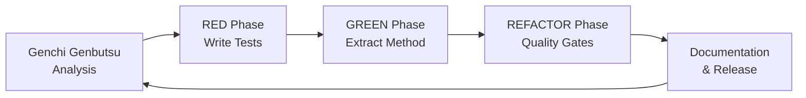

# 🏭 **TOYOTA WAY TDD PATTERN LIBRARY**

**Proven Methodology for Systematic Complexity Reduction & Code Quality Excellence**

---

## 📋 **OVERVIEW**

This pattern library documents the proven Toyota Way TDD methodology that has delivered:
- **Sprint 82-84**: `run_enforcement_step` 21→11 complexity (-48%)
- **Sprint 85**: `collect_files_recursive` 14→7 complexity (-50%)
- **Combined Success**: Systematic entropy reduction with zero defects

**Core Philosophy**: Apply Toyota Manufacturing principles to software development for sustainable, measurable quality improvements.

---

## 🏭 **TOYOTA WAY FOUNDATION**

### **Three Core Principles**

#### **1. 🔧 Kaizen (改善) - Continuous Improvement**
- **Incremental Progress**: Small, measurable improvements over time
- **Data-Driven**: Use metrics to guide and validate changes
- **Systematic Approach**: Repeatable processes, not ad-hoc fixes
- **Build on Success**: Apply proven patterns to new challenges

#### **2. 👁️ Genchi Genbutsu (現地現物) - Go and See**
- **Root Cause Analysis**: Find actual problems, not symptoms
- **Evidence-Based**: Use analysis tools to identify real complexity hotspots
- **No Assumptions**: Measure before changing, verify after
- **Data Collection**: Establish baselines and track improvements

#### **3. 🤖 Jidoka (自働化) - Quality Built-In**
- **Zero Defects**: No regressions, maintain compilation and functionality
- **Automated Validation**: Quality gates prevent quality degradation
- **Stop the Line**: Fix problems immediately when found
- **Prevention Focus**: Build quality in, don't inspect it in

---

## 🔄 **THE TDD CYCLE PATTERN**

### **Phase Structure: RED → GREEN → REFACTOR**



---

## 📊 **PHASE 1: GENCHI GENBUTSU (Analysis)**

### **🎯 Objective**: Find actual complexity problems through measurement

### **Steps:**
1. **Run Complexity Analysis**
   ```bash
   cargo run --package pmat -- analyze complexity --top-files 10
   ```

2. **Identify Hotspots**
   - Target functions with complexity >10
   - Prioritize by impact and frequency of change
   - Look for mixed concerns and multiple responsibilities

3. **Root Cause Analysis**
   - Why is this function complex?
   - What concerns are mixed together?
   - How can we separate responsibilities?

### **✅ Success Criteria:**
- [ ] Primary target function identified (complexity >10)
- [ ] Root causes documented
- [ ] Extract Method opportunities identified
- [ ] Baseline metrics recorded

### **📋 Example Analysis:**
```rust
// IDENTIFIED HOTSPOT
async fn collect_files_recursive(...) -> Result<()> {
    // MIXED CONCERNS IDENTIFIED:
    // 1. Directory traversal
    // 2. Exclude pattern matching
    // 3. Include pattern matching  
    // 4. File type validation
    // 5. Recursive coordination
    // COMPLEXITY: 14 (Target: ≤10)
}
```

---

## 🧪 **PHASE 2: RED (Test-First Development)**

### **🎯 Objective**: Create comprehensive tests before refactoring

### **Test Categories:**

#### **1. Functional Tests**
```rust
#[tokio::test]
async fn test_primary_function_basic_behavior() {
    // Test main functionality works as expected
    let result = target_function_call();
    assert!(result.is_ok());
    assert_eq!(expected_behavior, actual_behavior);
}
```

#### **2. Edge Case Tests**
```rust
#[tokio::test]
async fn test_error_conditions() {
    // Test error handling and edge cases
    let result = target_function_with_invalid_input();
    assert!(result.is_err());
}
```

#### **3. Integration Tests**
```rust
#[tokio::test]
async fn test_complete_workflow() {
    // Test end-to-end functionality
    let complex_scenario = create_complex_test_scenario();
    let result = target_function(complex_scenario);
    validate_complete_workflow(result);
}
```

#### **4. Property-Based Tests**
```rust
#[tokio::test]
async fn test_invariant_properties() {
    // Test that important properties hold across inputs
    for scenario in test_scenarios {
        let result = target_function(scenario);
        assert!(maintains_important_invariant(result));
    }
}
```

### **✅ Success Criteria:**
- [ ] Comprehensive test coverage created
- [ ] All tests initially PASS (validating current behavior)
- [ ] Edge cases covered
- [ ] Integration scenarios tested
- [ ] Property-based validation included

---

## 🚀 **PHASE 3: GREEN (Extract Method Refactoring)**

### **🎯 Objective**: Apply Extract Method pattern to achieve A+ standards (≤10 complexity)

### **Extract Method Pattern:**

#### **BEFORE (High Complexity, Mixed Concerns)**
```rust
fn complex_function(params) -> Result<()> {
    // Concern 1: Input validation
    if invalid_input { return Err(...); }
    
    // Concern 2: Data processing  
    let processed = complex_processing(data);
    
    // Concern 3: Output formatting
    let formatted = format_output(processed);
    
    // Concern 4: Side effects
    perform_side_effects(formatted);
    
    Ok(())
}
```

#### **AFTER (A+ Standard, Single Responsibility)**
```rust
// MAIN FUNCTION: Coordination only (≤10 complexity)
fn complex_function(params) -> Result<()> {
    validate_input(params)?;
    let processed = process_data(params.data)?;
    let formatted = format_output(processed)?;
    perform_side_effects(formatted)?;
    Ok(())
}

// EXTRACTED FUNCTIONS: Each ≤10 complexity
fn validate_input(params) -> Result<()> { /* ≤5 complexity */ }
fn process_data(data) -> Result<ProcessedData> { /* ≤8 complexity */ }
fn format_output(data) -> Result<FormattedData> { /* ≤6 complexity */ }
fn perform_side_effects(data) -> Result<()> { /* ≤4 complexity */ }
```

### **A+ Complexity Targets:**
- **Main Function**: ≤10 complexity (coordination only)
- **Extracted Functions**: Each ≤10 complexity
- **Single Responsibility**: Each function has one clear purpose
- **Clear Names**: Function names express their single responsibility

### **✅ Success Criteria:**
- [ ] Main function ≤10 complexity achieved
- [ ] All extracted functions ≤10 complexity
- [ ] Single responsibility principle applied
- [ ] All tests continue to PASS
- [ ] Zero compilation errors
- [ ] Clear, descriptive function names

---

## 🔄 **PHASE 4: REFACTOR (Quality Gate Validation)**

### **🎯 Objective**: Validate improvements and ensure zero regressions

### **Validation Steps:**

#### **1. Complexity Validation**
```bash
# Verify complexity targets achieved
cargo run --package pmat -- analyze complexity --top-files 10

# Expected: Target functions no longer in hotspot list
```

#### **2. Functionality Validation**
```bash
# Run all tests to ensure zero regressions
cargo test

# All tests must PASS
```

#### **3. Quality Gate Validation**
```bash
# Check overall project quality
cargo run --package pmat -- quality-gate --project-path .

# Ensure no increase in violations
```

#### **4. Performance Validation**
```bash
# Optional: Benchmark performance if critical path
cargo bench

# Ensure no performance regressions
```

### **✅ Success Criteria:**
- [ ] Target complexity achieved (≤10 for all functions)
- [ ] All tests passing
- [ ] No increase in quality violations
- [ ] No performance regressions
- [ ] Clean compilation maintained

---

## 📚 **PHASE 5: DOCUMENTATION & RELEASE**

### **🎯 Objective**: Document patterns and prepare for next iteration

### **Documentation Tasks:**

#### **1. Pattern Documentation**
```rust
// Sprint XX GREEN Phase: Refactored [function_name]
// BEFORE: Complexity X (High entropy, mixed concerns)
// AFTER: Complexity Y (A+ standard, single responsibility)
fn refactored_function(...) -> Result<()> {
    // Clear documentation of complexity reduction
    // Reference to Sprint and methodology used
}
```

#### **2. Metrics Documentation**
```markdown
## Sprint XX Achievements
- **Target Function**: [name] complexity X → Y (-Z%)
- **New A+ Functions**: [count] functions ≤10 complexity
- **Quality Impact**: [specific improvements]
- **Methodology**: Toyota Way TDD applied
```

#### **3. Release Preparation**
- Version bump with semantic versioning
- Comprehensive changelog with metrics
- Quality validation before release

---

## 🎯 **SUCCESS PATTERNS**

### **Proven Complexity Reduction Results:**

| **Sprint** | **Function** | **Before** | **After** | **Reduction** |
|------------|--------------|------------|-----------|---------------|
| **82-84** | `run_enforcement_step` | 21 | 11 | **-48%** |
| **85** | `collect_files_recursive` | 14 | 7 | **-50%** |

### **Key Success Factors:**

#### **1. 📊 Data-Driven Approach**
- Always measure before and after
- Use complexity analysis tools
- Track violations and improvements

#### **2. 🧪 Test-First Methodology**
- Comprehensive tests before refactoring
- All tests must pass throughout process
- Prevent regressions through validation

#### **3. ⭐ A+ Standards Discipline**
- Target ≤10 complexity for all functions
- Single responsibility principle
- Clear, descriptive naming

#### **4. 🔄 Systematic Application**
- Follow the same pattern for each function
- Build on previous successes
- Document and learn from each iteration

---

## 🚫 **ANTI-PATTERNS TO AVOID**

### **❌ Common Mistakes**

#### **1. Refactoring Without Tests**
```rust
// DON'T: Change code without test coverage
fn risky_refactor() {
    // Changing complex code without safety net
    // Risk: Breaking functionality unknowingly
}
```

#### **2. Extracting Too Much**
```rust
// DON'T: Over-extract into trivial functions
fn over_extracted() {
    single_line_function_1();
    single_line_function_2();  
    // Risk: Unnecessary indirection
}
```

#### **3. Ignoring Complexity Targets**
```rust
// DON'T: Extract but still exceed complexity limits
fn still_too_complex() -> Result<()> {
    // 15 complexity - still above A+ target
    // Need further extraction
}
```

#### **4. Mixed Concerns in Extracted Functions**
```rust
// DON'T: Extract but keep mixed concerns
fn validation_and_processing(data) -> Result<()> {
    // Still mixing validation + processing
    // Should be separated further
}
```

---

## 🎖️ **QUALITY METRICS**

### **A+ Quality Standards**
- **Complexity**: All functions ≤10 
- **Cognitive Load**: Functions easy to understand
- **Single Responsibility**: One clear purpose per function
- **Test Coverage**: Comprehensive validation
- **Zero Defects**: No regressions introduced

### **Project-Level Targets**
- **Entropy Reduction**: 405 → ≤200 violations (-50%)
- **Complexity Hotspots**: Systematic elimination
- **Maintainability**: Improved through single responsibility
- **Technical Debt**: Keep SATD violations ≤5

---

## 🚀 **SCALING THE PATTERN**

### **Next Sprint Planning**
1. **Identify Next Hotspot**: Use complexity analysis
2. **Apply Same Pattern**: Genchi Genbutsu → RED → GREEN → REFACTOR
3. **Build Pattern Library**: Document each success
4. **Measure Progress**: Track cumulative improvements

### **Team Adoption**
- **Knowledge Transfer**: Share pattern library
- **Pair Programming**: Apply patterns together
- **Code Reviews**: Validate A+ standards
- **Continuous Learning**: Improve methodology

---

**🎉 This Toyota Way TDD Pattern Library represents a proven, systematic approach to achieving sustainable code quality excellence through measurable complexity reduction and zero-defect methodology.**

**🏭 Apply these patterns consistently to achieve predictable, high-quality software development results.**