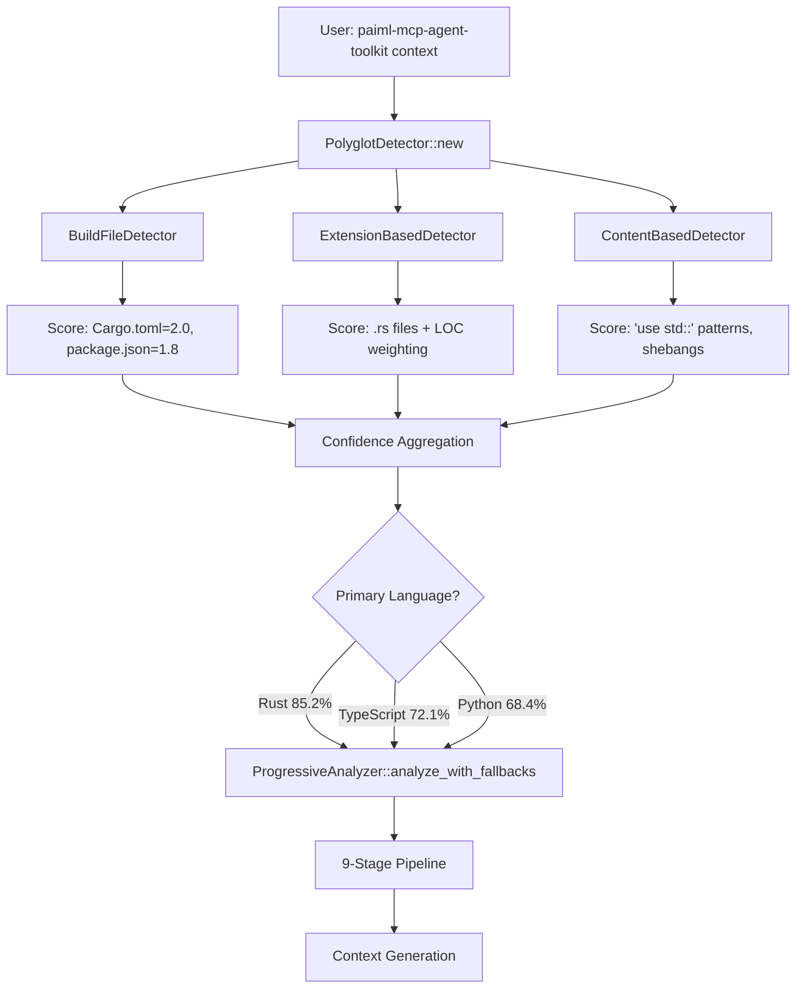

# System Architecture

## Memory Safety Invariants

### 1. **Template Lifetime Management**

All templates are `'static` with compile-time embedding:

```rust
const TEMPLATES: &[(&str, &str)] = &[
    ("makefile/rust/cli", include_str!("../templates/makefile/rust/cli.hbs")),
    ("makefile/deno/cli", include_str!("../templates/makefile/deno/cli.hbs")),
    ("makefile/python-uv/cli", include_str!("../templates/makefile/python-uv/cli.hbs")),
    // Compiler enforces 'static lifetime
];
```

### 2. **Concurrency Model**

The system employs **fearless concurrency** patterns:

```rust
pub struct Server {
    // Shared immutable state
    templates: Arc<TemplateStore>,
    
    // Per-connection state (no sharing)
    connections: DashMap<ConnectionId, Connection>,
    
    // Global mutable state with fine-grained locking
    cache: Arc<CacheHierarchy>,
}

// Safe concurrent access via type system
impl Server {
    pub fn handle_request(&self, conn_id: ConnectionId, req: Request) {
        // No data races possible - enforced at compile time
        let conn = self.connections.get(&conn_id).unwrap();
        let template = self.templates.get(&req.template_uri);
        // ...
    }
}
```

## Single-Shot Context Generation with Auto-Detection ✨ **NEW**

### Zero-Configuration Architecture

The v0.20.0 release introduces a revolutionary single-shot context generation system with intelligent language auto-detection, eliminating the need for manual toolchain specification while maintaining full backward compatibility.

```rust
// Progressive Enhancement Pipeline
pub struct ProgressiveAnalyzer {
    stages: Vec<AnalysisStage>,           // 9-stage pipeline
    failure_mode: FailureMode,            // BestEffort/FailFast/Diagnostic
}

// Multi-Strategy Language Detection
pub struct PolyglotDetector {
    significance_weights: HashMap<Language, LanguageWeight>,
    detection_strategies: Vec<Box<dyn DetectionStrategy + Send + Sync>>,
}

// Three detection strategies with confidence scoring:
// 1. BuildFileDetector (Cargo.toml → Rust, package.json → TS/JS)
// 2. ExtensionBasedDetector (.rs/.ts/.py files with LOC weighting)
// 3. ContentBasedDetector (shebangs, imports, language constructs)
```

### Auto-Detection Flow



### Progressive Enhancement Architecture

**Performance Guarantees:**
- **<50ms** Language detection startup time
- **<100MB** Memory usage with smart defaults
- **60-second** Total timeout budget with graceful degradation

**9-Stage Analysis Pipeline:**
1. **Language Detection** (100ms) - Multi-strategy polyglot detection
2. **Project Structure** (200ms) - File tree analysis with annotations
3. **Quick Metrics** (500ms) - LOC counting and project size estimation
4. **AST Analysis** (5s) - Language-specific syntax tree parsing
5. **Git Analysis** (2s) - Code churn and author tracking with fallback
6. **Complexity Analysis** (3s) - McCabe and cognitive complexity
7. **Dependency Graph** (2s) - Import/export relationship mapping
8. **Dead Code Detection** (3s) - Unreachable code analysis
9. **SATD Detection** (1s) - Technical debt pattern matching

### Smart Context Pruning System

```rust
pub struct RelevanceScorer {
    project_idf: HashMap<String, f64>,         // Term frequency analysis
    centrality_scores: HashMap<NodeKey, f64>,  // PageRank-style importance
    complexity_scores: HashMap<PathBuf, f64>,  // From complexity analysis
}

// Context Item Scoring (higher = more relevant)
// 🔌 Public APIs: 10.0     🚪 Entry Points: 9.0
// 🏗️ Core Types: 8.0       ⚡ Complex Functions: 5.0+
// 🧪 Test Functions: 3.0   📚 Documentation: 1.0-8.0
// ⚙️ Configuration: 3.0-7.0
```

**Intelligent Pruning Algorithm:**
1. **TF-IDF Scoring** - Identify unique and significant code patterns
2. **Centrality Analysis** - PageRank-style importance based on code relationships
3. **Quality Adjustments** - Penalties for technical debt, bonuses for test coverage
4. **Size Management** - Intelligent pruning to target KB limits while preserving critical items

### Universal Output Adaptation

```rust
pub struct UniversalOutputAdapter {
    format_detectors: Vec<Box<dyn FormatDetector + Send + Sync>>,
    quality_enhancers: Vec<Box<dyn QualityEnhancer + Send + Sync>>,
}

// Environment-based format auto-detection:
// CLI Environment → Markdown (human readable)
// IDE Integration → JSON (structured data)
// CI/CD Pipelines → SARIF (static analysis)
// LLM Consumption → Token-optimized formatting
```

## Zero-Copy I/O Pipeline

```
stdin → AlignedBuffer → serde_json → Request
                                        ↓
stdout ← io::Write ← Response ← Template
```

### Buffer Management

Pre-allocated buffer pools with RAII cleanup:

```rust
struct BufferPool {
    free: SegQueue<Box<[u8; 64 * 1024]>>,
    allocated: AtomicUsize,
}

impl BufferPool {
    fn acquire(&self) -> BufferGuard {
        let buffer = self.free.pop()
            .unwrap_or_else(|| Box::new([0u8; 64 * 1024]));
        self.allocated.fetch_add(1, Ordering::Relaxed);
        BufferGuard { buffer, pool: self }
    }
}

struct BufferGuard<'a> {
    buffer: Box<[u8; 64 * 1024]>,
    pool: &'a BufferPool,
}

impl<'a> Drop for BufferGuard<'a> {
    fn drop(&mut self) {
        self.pool.allocated.fetch_sub(1, Ordering::Relaxed);
        self.pool.free.push(std::mem::take(&mut self.buffer));
    }
}
```

## Component Architecture

### Core Components

```
┌─────────────────────────────────────────────────────────────┐
│                      CLI Interface                          │
│  ┌─────────────┐  ┌─────────────┐  ┌─────────────┐        │
│  │   Parser    │  │  Validator  │  │  Executor   │        │
│  └─────────────┘  └─────────────┘  └─────────────┘        │
└─────────────────────────────────────────────────────────────┘
                              │
┌─────────────────────────────────────────────────────────────┐
│                    MCP Protocol Layer                       │
│  ┌─────────────┐  ┌─────────────┐  ┌─────────────┐        │
│  │  JSON-RPC   │  │   Router    │  │   Handler   │        │
│  └─────────────┘  └─────────────┘  └─────────────┘        │
└─────────────────────────────────────────────────────────────┘
                              │
┌─────────────────────────────────────────────────────────────┐
│                   Service Layer                             │
│  ┌─────────────┐  ┌─────────────┐  ┌─────────────┐        │
│  │  Template   │  │     AST     │  │  Demo       │        │
│  │  Service    │  │  Analysis   │  │  Engine     │        │
│  └─────────────┘  └─────────────┘  └─────────────┘        │
│  ┌─────────────┐  ┌─────────────┐  ┌─────────────┐        │
│  │ Deep Context│  │     Git     │  │ Repository  │        │
│  │  Analyzer   │  │  Analysis   │  │  Manager    │        │
│  └─────────────┘  └─────────────┘  └─────────────┘        │
└─────────────────────────────────────────────────────────────┘
                              │
┌─────────────────────────────────────────────────────────────┐
│                    Storage Layer                            │
│  ┌─────────────┐  ┌─────────────┐  ┌─────────────┐        │
│  │  Embedded   │  │    Cache    │  │  Persistent │        │
│  │  Templates  │  │  Hierarchy  │  │    Cache    │        │
│  └─────────────┘  └─────────────┘  └─────────────┘        │
└─────────────────────────────────────────────────────────────┘
```

### Service Dependencies

```rust
// Dependency injection via constructor
pub struct StatelessTemplateServer {
    renderer: TemplateRenderer,
    cache: Arc<CacheHierarchy>,
    analyzer: Arc<AstAnalyzer>,
}

impl StatelessTemplateServer {
    pub fn new() -> Result<Self> {
        Ok(Self {
            renderer: TemplateRenderer::new()?,
            cache: Arc::new(CacheHierarchy::new()),
            analyzer: Arc::new(AstAnalyzer::new()),
        })
    }
}
```

## Template System Architecture

### Template Storage

Embedded templates with metadata:

```rust
#[derive(Debug, Clone)]
pub struct TemplateResource {
    pub uri: String,
    pub name: String,
    pub description: String,
    pub toolchain: Toolchain,
    pub category: Category,
    pub parameters: Vec<ParameterSpec>,
    pub content_key: String,
}

lazy_static! {
    static ref TEMPLATE_METADATA: HashMap<&'static str, TemplateResource> = {
        let mut map = HashMap::new();
        // Load metadata from embedded JSON
        for entry in EMBEDDED_METADATA {
            map.insert(entry.uri, entry.to_resource());
        }
        map
    };
}
```

### Parameter Validation

Type-safe parameter handling:

```rust
#[derive(Debug, Clone, Serialize, Deserialize)]
#[serde(rename_all = "snake_case")]
pub enum ParameterType {
    String,
    Boolean,
    Enum(Vec<String>),
}

pub struct ParameterValidator {
    specs: Vec<ParameterSpec>,
}

impl ParameterValidator {
    pub fn validate(&self, params: &Map<String, Value>) -> Result<(), ValidationError> {
        // Type checking
        for spec in &self.specs {
            if let Some(value) = params.get(&spec.name) {
                self.validate_type(&spec.param_type, value)?;
            } else if spec.required {
                return Err(ValidationError::MissingRequired(spec.name.clone()));
            }
        }
        Ok(())
    }
}
```

## AST Analysis Architecture

### Language-Specific Analyzers

```rust
pub trait AstAnalyzer: Send + Sync {
    async fn analyze_file(&self, path: &Path) -> Result<FileAnalysis>;
    fn supported_extensions(&self) -> &[&str];
}

pub struct RustAnalyzer {
    parser: syn::Parser,
    cache: Arc<AstCache>,
}

pub struct TypeScriptAnalyzer {
    parser: swc::Parser,
    cache: Arc<AstCache>,
}

pub struct PythonAnalyzer {
    parser: rustpython_parser::Parser,
    cache: Arc<AstCache>,
}
```

### Complexity Calculation

Visitor pattern for AST traversal:

```rust
pub struct ComplexityVisitor {
    cyclomatic: u16,
    cognitive: u16,
    nesting_depth: u16,
    max_nesting: u16,
}

impl<'ast> Visit<'ast> for ComplexityVisitor {
    fn visit_expr_if(&mut self, node: &'ast ExprIf) {
        self.cyclomatic += 1;
        self.cognitive += self.nesting_depth;
        self.nesting_depth += 1;
        self.max_nesting = self.max_nesting.max(self.nesting_depth);
        
        visit::visit_expr_if(self, node);
        
        self.nesting_depth -= 1;
    }
}
```

### File Ranking System

Generic ranking engine with pluggable metrics:

```rust
pub trait FileRanker: Send + Sync {
    type Metric: PartialOrd + Clone + Send + Sync;
    
    fn compute_score(&self, file_path: &Path) -> Self::Metric;
    fn format_ranking_entry(&self, file: &str, metric: &Self::Metric, rank: usize) -> String;
    fn ranking_type(&self) -> &'static str;
}

pub struct RankingEngine<R: FileRanker> {
    ranker: R,
    cache: Arc<RwLock<HashMap<String, R::Metric>>>,
}

impl<R: FileRanker> RankingEngine<R> {
    pub async fn rank_files(&self, files: &[PathBuf], limit: usize) -> Vec<(String, R::Metric)> {
        // Parallel computation with caching
        let scores: Vec<_> = files
            .par_iter()
            .filter_map(|f| self.compute_with_cache(f))
            .collect();
        
        // Sort and apply limit
        scores.sort_by(|a, b| b.1.partial_cmp(&a.1).unwrap_or(Ordering::Equal));
        scores.truncate(limit);
        scores
    }
}
```

#### Built-in Ranking Metrics

- **ComplexityRanker**: Composite scoring based on cyclomatic, cognitive, and function count
- **ChurnScore**: Git-based change frequency analysis
- **DuplicationScore**: Code clone detection metrics
- **Vectorized Ranking**: SIMD-optimized for large datasets (>1024 files)

## Deep Context Analysis Architecture ✨ **ENHANCED**

### Multi-Analysis Pipeline Design

The deep context analysis system combines multiple analysis engines into a unified quality assessment pipeline:

```rust
pub struct DeepContextAnalyzer {
    config: DeepContextConfig,
    semaphore: Semaphore,
}

impl DeepContextAnalyzer {
    pub async fn analyze_project(&self, project_path: &PathBuf) -> anyhow::Result<DeepContext> {
        // Phase 1: Discovery
        let file_tree = self.discover_project_structure(project_path).await?;
        
        // Phase 2: Parallel analysis execution (ENHANCED)
        let analyses = self.execute_parallel_analyses(project_path).await?;
        
        // Phase 3: Cross-language reference resolution
        let cross_refs = self.build_cross_language_references(&analyses).await?;
        
        // Phase 4: Defect correlation (NEW)
        let (defect_summary, hotspots) = self.correlate_defects(&analyses).await?;
        
        // Phase 5: Quality scoring
        let quality_scorecard = self.calculate_quality_scores(&analyses).await?;
        
        // Phase 6: Generate recommendations
        let recommendations = self.generate_recommendations(&hotspots, &quality_scorecard).await?;
        
        // Phase 7: Template provenance (if available)
        let template_provenance = self.analyze_template_provenance(project_path).await?;
    }
}
```

### Cross-Analysis Correlation Engine

Sophisticated defect correlation using ML-based risk assessment:

```rust
async fn correlate_defects(
    &self, 
    analyses: &ParallelAnalysisResults
) -> anyhow::Result<(DefectSummary, Vec<DefectHotspot>)> {
    
    // Initialize defect probability calculator
    let calculator = DefectProbabilityCalculator::new();
    
    // Build file metrics from all available analyses
    let file_metrics_map = self.build_file_metrics(analyses).await?;
    
    // Calculate defect probabilities using weighted ensemble
    let file_scores = file_metrics_map.values()
        .map(|metrics| (metrics.file_path.clone(), calculator.calculate(metrics)))
        .collect();
    
    // Generate project-level defect analysis
    let project_analysis = ProjectDefectAnalysis::from_scores(file_scores);
    
    // Create defect hotspots with contributing factors
    let hotspots = self.generate_defect_hotspots(&project_analysis, analyses).await?;
    
    Ok((defect_summary, hotspots))
}
```

### Enhanced Parallel Execution

The analysis pipeline now executes all engines concurrently:

```rust
async fn execute_parallel_analyses(&self, project_path: &std::path::Path) 
    -> anyhow::Result<ParallelAnalysisResults> {
    
    let mut join_set = JoinSet::new();
    
    // Spawn all analysis tasks concurrently
    if self.config.include_analyses.contains(&AnalysisType::Ast) {
        join_set.spawn(async move { AnalysisResult::Ast(analyze_ast_contexts(&path).await) });
    }
    
    if self.config.include_analyses.contains(&AnalysisType::Complexity) {
        join_set.spawn(async move { AnalysisResult::Complexity(analyze_complexity(&path).await) });
    }
    
    if self.config.include_analyses.contains(&AnalysisType::Dag) {
        join_set.spawn(async move { AnalysisResult::Dag(analyze_dag(&path, dag_type).await) });
    }
    
    // Circuit breaker pattern with 60-second timeout
    // Concurrent result aggregation to eliminate Amdahl's Law bottleneck
    let collection_timeout = std::time::Duration::from_secs(60);
    // ... parallel collection and processing
}
```

## Unified Demo System Architecture

### Demo Engine Design

Multi-modal demonstration system with deep context integration:

```rust
pub struct DemoEngine {
    analyzer: Arc<DeepContextAnalyzer>,
    repository_manager: Arc<RepositoryManager>,
    graph_reducer: Arc<AdaptiveGraphReducer>,
    metrics_cache: Arc<Mutex<HashMap<String, DemoAnalysis>>>,
}

impl DemoEngine {
    pub async fn analyze(&self, source: DemoSource) -> Result<DemoAnalysis> {
        // 1. Repository acquisition (local or remote)
        let repo_path = self.repository_manager.acquire(source.clone()).await?;
        
        // 2. Parallel analysis pipeline using DeepContext
        let deep_context = self.analyzer.analyze_project(&repo_path).await?;
        
        // 3. Graph reduction and visualization prep
        let visualization = self.graph_reducer.reduce(&deep_context.analyses.dependency_graph).await?;
        
        // 4. Extract metrics and generate insights
        let metrics = AnalysisMetrics::from_deep_context(&deep_context);
        let insights = self.generate_insights(&deep_context).await;
        
        Ok(DemoAnalysis { repository, metrics, visualization, timings, insights })
    }
}
```

### Repository Management System

Git repository cloning and workspace management:

```rust
pub struct RepositoryManager {
    workspace: TempWorkspace,
}

impl RepositoryManager {
    pub async fn acquire(&self, source: DemoSource) -> Result<PathBuf> {
        match source {
            DemoSource::Local(path) => {
                if path.exists() { Ok(path) } else { Err(anyhow!("Path not found")) }
            }
            DemoSource::Remote(url) => self.clone_repository(&url).await,
            DemoSource::Cached(key) => self.workspace.get_cached(&key),
        }
    }

    async fn clone_repository(&self, url: &str) -> Result<PathBuf> {
        let temp_dir = self.workspace.create_temp()?;
        
        // Use git command with depth=1 optimization
        let output = std::process::Command::new("git")
            .args(["clone", "--depth", "1", url, &temp_dir.to_string_lossy()])
            .output()
            .context("Failed to execute git clone")?;
            
        if !output.status.success() {
            let error = String::from_utf8_lossy(&output.stderr);
            return Err(anyhow!("Git clone failed: {}", error));
        }
        
        Ok(temp_dir)
    }
}
```

### Adaptive Graph Reduction

Intelligent graph reduction for large codebase visualization:

```rust
pub struct AdaptiveGraphReducer;

impl AdaptiveGraphReducer {
    pub async fn reduce(&self, dag: &DependencyGraph) -> Result<VisualizationData> {
        let node_count = dag.nodes.len();
        info!("Reducing graph with {} nodes", node_count);
        
        // Simple reduction strategy with complexity scoring
        let mermaid = self.generate_mermaid(dag, node_count).await?;
        
        Ok(VisualizationData {
            mermaid,
            d3_json: None,
            complexity_map: self.build_complexity_map(dag),
            metrics: GraphMetrics {
                nodes: dag.nodes.len(),
                edges: dag.edges.len(),
                density: self.calculate_density(dag),
                modularity: 0.5, // Placeholder for future enhancement
            },
        })
    }
    
    fn calculate_density(&self, dag: &DependencyGraph) -> f64 {
        let n = dag.nodes.len() as f64;
        if n <= 1.0 { return 0.0; }
        
        let max_edges = n * (n - 1.0);
        let actual_edges = dag.edges.len() as f64;
        
        actual_edges / max_edges
    }
}
```

### Demo Analysis Data Model

Comprehensive analysis structure with insights:

```rust
#[derive(Debug, Clone, Serialize, Deserialize)]
pub struct DemoAnalysis {
    pub repository: RepositoryInfo,
    pub metrics: AnalysisMetrics,
    pub visualization: VisualizationData,
    pub timings: ExecutionTimings,
    pub insights: Vec<Insight>,
}

#[derive(Debug, Clone, Serialize, Deserialize)]
pub struct AnalysisMetrics {
    pub complexity: Option<ComplexityReport>,
    pub churn: Option<CodeChurnAnalysis>,
    pub dag: Option<DependencyGraph>,
    pub ast_contexts: Vec<FileContext>,
    pub hotspots: Vec<CodeHotspot>,
}

#[derive(Debug, Clone, Serialize, Deserialize)]
pub struct CodeHotspot {
    pub file: String,
    pub score: f64,
    pub complexity: u32,
    pub churn: u32,
    pub risk_factors: Vec<String>,
}
```

### Multi-Modal Interface Support

CLI, Web, MCP, and HTTP interface integration:

```rust
// CLI Demo Renderer with Unicode tables and ASCII diagrams
pub struct CliDemoRenderer {
    output: Box<dyn Write>,
}

impl CliDemoRenderer {
    pub fn render(&mut self, analysis: &DemoAnalysis) -> Result<()> {
        self.render_header(analysis)?;
        self.render_repository_info(analysis)?;
        self.render_quality_metrics(analysis)?;
        self.render_architecture_overview(analysis)?;
        self.render_insights(analysis)?;
        Ok(())
    }
    
    fn render_ascii_architecture(&mut self, mermaid: &str) -> Result<()> {
        let node_count = mermaid.matches(" --> ").count() + 1;
        
        if node_count > 10 {
            writeln!(self.output, "     ┌─────────┐")?;
            writeln!(self.output, "  ┌──│ Entry   │──┐")?;
            writeln!(self.output, "Complex architecture with {} modules", node_count)?;
        } else if node_count > 3 {
            writeln!(self.output, "┌─────┐    ┌─────┐    ┌─────┐")?;
            writeln!(self.output, "│  A  │───►│  B  │───►│  C  │")?;
            writeln!(self.output, "Modular architecture with {} components", node_count)?;
        } else {
            writeln!(self.output, "┌─────────────┐")?;
            writeln!(self.output, "│   Simple    │")?;
            writeln!(self.output, "Simple structure with {} components", node_count)?;
        }
        
        Ok(())
    }
}
```

### Insight Generation System

AI-powered insights with confidence scoring:

```rust
impl DemoEngine {
    async fn generate_insights(&self, context: &DeepContext) -> Vec<Insight> {
        let mut insights = Vec::new();

        // Architecture insights
        if let Some(ref dag) = context.analyses.dependency_graph {
            if dag.nodes.len() > 100 {
                insights.push(Insight {
                    category: InsightCategory::Architecture,
                    title: "Large Codebase Detected".to_string(),
                    description: format!("This codebase has {} modules. Consider modularization strategies.", dag.nodes.len()),
                    impact: InsightImpact::Medium,
                    confidence: 0.9,
                });
            }
        }

        // Quality insights based on scorecard
        if context.quality_scorecard.overall_health < 70.0 {
            insights.push(Insight {
                category: InsightCategory::Quality,
                title: "Code Quality Needs Attention".to_string(),
                description: format!("Overall health score is {:.1}%. Focus on complexity reduction and technical debt.", context.quality_scorecard.overall_health),
                impact: InsightImpact::High,
                confidence: 0.85,
            });
        }

        // Maintainability insights
        if context.quality_scorecard.technical_debt_hours > 40.0 {
            insights.push(Insight {
                category: InsightCategory::Maintainability,
                title: "High Technical Debt".to_string(),
                description: format!("Estimated {:.1} hours of technical debt. Prioritize SATD resolution.", context.quality_scorecard.technical_debt_hours),
                impact: InsightImpact::High,
                confidence: 0.8,
            });
        }

        insights
    }
}
```

### Progress Tracking System

Real-time progress updates across interfaces:

```rust
#[derive(Debug, Clone)]
pub struct ProgressEvent {
    pub name: String,
    pub percent: f64,
    pub message: Option<String>,
}

impl ProgressEvent {
    pub fn started(name: &str) -> Self {
        Self {
            name: name.to_string(),
            percent: 0.0,
            message: Some(format!("Starting {}", name)),
        }
    }

    pub fn completed(name: &str, percent: f64) -> Self {
        Self {
            name: name.to_string(),
            percent,
            message: Some(format!("Completed {}", name)),
        }
    }
}

impl DemoEngine {
    pub async fn analyze_with_progress(
        &self,
        source: DemoSource,
        progress_tx: mpsc::Sender<ProgressEvent>,
    ) -> Result<DemoAnalysis> {
        progress_tx.send(ProgressEvent::started("Repository Discovery")).await?;
        
        let _repo_path = self.repository_manager.acquire(source.clone()).await?;
        progress_tx.send(ProgressEvent::completed("Repository Discovery", 10.0)).await?;
        
        progress_tx.send(ProgressEvent::started("AST Analysis")).await?;
        // Continue with analysis steps, sending progress updates
        
        self.analyze(source).await
    }
}
```

## Cache Architecture

### Hierarchical Cache Design

```rust
pub struct CacheHierarchy {
    // L1: Thread-local, lock-free
    l1: Arc<DashMap<CacheKey, CacheEntry>>,
    
    // L2: Process-wide, bounded
    l2: Arc<RwLock<LruCache<CacheKey, Arc<[u8]>>>>,
    
    // L3: Persistent, unbounded
    l3: Arc<PersistentCache>,
}

impl CacheHierarchy {
    pub async fn get(&self, key: &CacheKey) -> Option<Arc<[u8]>> {
        // Try L1 first (fastest)
        if let Some(entry) = self.l1.get(key) {
            return Some(entry.data.clone());
        }
        
        // Try L2 (fast)
        if let Some(data) = self.l2.read().await.peek(key) {
            self.l1.insert(key.clone(), CacheEntry::new(data.clone()));
            return Some(data.clone());
        }
        
        // Try L3 (slower but persistent)
        if let Some(data) = self.l3.get(key).await {
            self.promote_to_l2(key, &data).await;
            return Some(data);
        }
        
        None
    }
}
```

### Cache Key Design

Content-addressable with metadata:

```rust
#[derive(Debug, Clone, Hash, Eq, PartialEq)]
pub struct CacheKey {
    pub category: CacheCategory,
    pub content_hash: [u8; 32],
    pub metadata_hash: [u8; 16],
}

impl CacheKey {
    pub fn from_content(category: CacheCategory, content: &[u8]) -> Self {
        use sha2::{Sha256, Digest};
        
        let mut hasher = Sha256::new();
        hasher.update(content);
        let content_hash = hasher.finalize().into();
        
        // Metadata hash for versioning
        let metadata = format!("{:?}:{}", category, env!("CARGO_PKG_VERSION"));
        let metadata_hash = blake3::hash(metadata.as_bytes()).as_bytes()[..16]
            .try_into()
            .unwrap();
        
        Self { category, content_hash, metadata_hash }
    }
}
```

## Error Handling Strategy

### Error Types

```rust
#[derive(Debug, thiserror::Error)]
pub enum AppError {
    #[error("Template not found: {0}")]
    TemplateNotFound(String),
    
    #[error("Parameter validation failed: {0}")]
    ValidationError(#[from] ValidationError),
    
    #[error("AST parsing failed: {0}")]
    AstError(#[from] AstError),
    
    #[error("I/O error: {0}")]
    IoError(#[from] std::io::Error),
}

// Automatic conversion to MCP errors
impl From<AppError> for McpError {
    fn from(err: AppError) -> Self {
        match err {
            AppError::TemplateNotFound(_) => McpError {
                code: -32000,
                message: err.to_string(),
                data: None,
            },
            AppError::ValidationError(_) => McpError {
                code: -32002,
                message: err.to_string(),
                data: None,
            },
            _ => McpError {
                code: -32603,
                message: "Internal error".to_string(),
                data: Some(json!({ "details": err.to_string() })),
            },
        }
    }
}
```

## Security Architecture

### Input Sanitization

```rust
pub fn sanitize_template_uri(uri: &str) -> Result<String, SecurityError> {
    // Prevent directory traversal
    if uri.contains("..") || uri.contains("~") {
        return Err(SecurityError::PathTraversal);
    }
    
    // Validate URI format
    let re = regex::Regex::new(r"^template://[\w-]+/[\w-]+/[\w-]+$").unwrap();
    if !re.is_match(uri) {
        return Err(SecurityError::InvalidUri);
    }
    
    Ok(uri.to_string())
}
```

### Resource Limits

```rust
pub struct ResourceLimits {
    pub max_request_size: usize,      // 1MB
    pub max_response_size: usize,     // 10MB
    pub max_concurrent_requests: u32, // 128
    pub max_template_size: usize,     // 100KB
    pub max_cache_memory: usize,      // 256MB
}

impl Default for ResourceLimits {
    fn default() -> Self {
        Self {
            max_request_size: 1024 * 1024,
            max_response_size: 10 * 1024 * 1024,
            max_concurrent_requests: 128,
            max_template_size: 100 * 1024,
            max_cache_memory: 256 * 1024 * 1024,
        }
    }
}
```

## Why This is a Symbolic AI Architecture

The PAIML MCP Agent Toolkit exemplifies a **symbolic AI system** through its fundamental design principles: explicit knowledge representation, formal reasoning, and deterministic computation. Here's the technical analysis:

### 1. **Explicit Symbolic Representation**

The system transforms source code into formal symbolic structures rather than statistical embeddings:

```rust
// From server/src/models/unified_ast.rs
pub struct UnifiedAstNode {
    pub kind: AstKind,        // Symbolic node type
    pub name: String,         // Explicit identifier
    pub span: Range<usize>,   // Precise location
    pub children: Vec<NodeKey>, // Graph structure
    pub metadata: NodeMetadata, // Formal properties
}

// Symbolic enumeration, not learned features
pub enum AstKind {
    Function(FunctionKind),
    Class(ClassKind),
    Variable(VarKind),
    Import(ImportKind),
    // ... exhaustive symbolic categories
}
```

This contrasts with neural approaches that would encode code as continuous vectors. Each code element has an explicit symbolic identity with formal properties.

### 2. **Rule-Based Formal Analysis**

The complexity analysis uses mathematically-defined rules, not learned patterns:

```rust
// From server/src/services/complexity.rs
impl CyclomaticComplexityRule {
    fn compute(&self, ast: &AstNode) -> u32 {
        // McCabe's theorem: V(G) = E - N + 2P
        let edges = self.count_decision_points(ast);
        let nodes = self.count_statements(ast);
        let components = self.connected_components(ast);
        
        edges - nodes + 2 * components  // Formal graph theory
    }
}
```

Each metric is a **closed-form formula** with mathematical foundations, not a statistical approximation.

### 3. **Compositional Graph Algorithms**

The dependency analysis employs classical graph algorithms with provable properties:

```rust
// From server/src/services/dag_builder.rs
impl DagBuilder {
    fn detect_cycles(&self) -> Vec<Vec<NodeId>> {
        // Tarjan's strongly connected components - O(V + E)
        let mut index_counter = 0;
        let mut stack = Vec::new();
        let mut lowlinks = HashMap::new();
        let mut index = HashMap::new();
        let mut on_stack = HashSet::new();
        
        // Deterministic cycle detection with proof of correctness
        self.tarjan_scc(&mut index_counter, &mut stack, /*...*/)
    }
}
```

### 4. **Deterministic Memoization**

The caching system ensures **referential transparency** - a core property of symbolic systems:

```rust
// From server/src/services/cache/strategies.rs
impl AstCacheStrategy {
    fn cache_key(&self, path: &Path) -> String {
        // Content-addressed storage
        let content = fs::read(path)?;
        let ast_hash = blake3::hash(&content);
        
        format!("ast:{}:{}", path.display(), ast_hash)
    }
}
```

Given identical input, the system **always** produces identical output - a hallmark of symbolic computation.

### 5. **Formal Pattern Matching**

Technical debt detection uses explicit symbolic patterns, not probabilistic classifiers:

```rust
// From server/src/services/satd_detector.rs
impl DebtClassifier {
    fn classify_comment(&self, text: &str) -> Option<(DebtCategory, Severity)> {
        // Symbolic pattern matching with formal categories
        match self.pattern_set.matches(text).into_iter().next() {
            Some(0..=3) => Some((DebtCategory::Defect, Severity::High)),
            Some(4..=7) => Some((DebtCategory::Design, Severity::Medium)),
            Some(8..=11) => Some((DebtCategory::Debt, Severity::Low)),
            _ => None
        }
    }
}
```

### 6. **Type-Theoretic Correctness**

The Rust type system provides **formal verification** of symbolic transformations:

```rust
// From server/src/services/mermaid_generator.rs
impl MermaidGenerator {
    fn generate(&self, graph: &DependencyGraph) -> String {
        // Type system ensures well-formed output
        let nodes: BTreeMap<&str, &NodeInfo> = self.collect_nodes(graph);
        let edges: Vec<&Edge> = self.topological_sort(graph);
        
        // Exhaustive pattern matching - total function
        match self.options.style {
            DiagramStyle::Simple => self.render_simple(&nodes, &edges),
            DiagramStyle::Styled => self.render_styled(&nodes, &edges),
        }
    }
}
```

### 7. **Symbolic Reasoning Chain**

The system composes symbolic transformations without information loss:

```
Source Code → Lexical Tokens → AST → Control Flow Graph → Dependency Graph → Complexity Metrics
     ↓             ↓              ↓            ↓                ↓                  ↓
  Symbols      Symbols       Symbols     Symbols          Symbols           Numbers
  (text)      (tokens)      (nodes)      (edges)          (DAG)           (exact)
```

Each transformation preserves symbolic meaning and is **reversible** up to the metric computation.

### 8. **Proof-Carrying Analysis**

Results include verifiable proofs of correctness:

```rust
pub struct DefectScore {
    pub probability: f32,
    pub confidence: f32,
    pub factors: HashMap<DefectFactor, f32>,
    pub proof: AnalysisProof,  // Symbolic derivation
}

pub struct AnalysisProof {
    pub ast_hash: Blake3Hash,      // Input identity
    pub algorithm: &'static str,   // Formal method
    pub theorems: Vec<Theorem>,    // Applied rules
}
```

### Contrast with Statistical AI

| **Symbolic (This System)** | **Statistical/Neural** |
|---------------------------|----------------------|
| `if branches > 10 then complex` | `P(complex|features) = 0.87` |
| `V(G) = E - N + 2P` (exact) | `complexity ≈ f(embeddings)` |
| Deterministic AST parsing | Probabilistic token prediction |
| Rule: "TODO = tech debt" | Learned pattern from corpus |
| Graph isomorphism (NP-complete) | Graph neural network (approximate) |

### Performance Characteristics of Symbolic AI

The symbolic approach enables specific optimizations:

```rust
// Parallel symbolic computation - no gradient dependencies
let chunks: Vec<_> = files.par_chunks(128)
    .map(|chunk| analyze_symbolic(chunk))  // Embarrassingly parallel
    .collect();

// Exact complexity: O(n) parsing, O(V+E) graph algorithms
// No training time, no model loading, no GPU requirements
```

This architecture represents **GOFAI** (Good Old-Fashioned AI) principles applied to modern software engineering: formal methods, provable correctness, and deterministic reasoning. It's symbolic AI because it manipulates symbols according to formal rules rather than learning statistical patterns from data.

## Testing Architecture

### Property-Based Testing

```rust
#[cfg(test)]
mod property_tests {
    use proptest::prelude::*;
    
    proptest! {
        #[test]
        fn template_rendering_never_panics(
            params in prop::collection::hash_map(
                ".*",
                prop_oneof![
                    Just(json!(true)),
                    Just(json!(false)),
                    any::<String>().prop_map(|s| json!(s)),
                    any::<i64>().prop_map(|n| json!(n)),
                ],
                0..10
            )
        ) {
            let server = StatelessTemplateServer::new().unwrap();
            let uri = "template://makefile/rust/cli";
            
            // Should never panic, only return errors
            let _ = server.generate_template(uri, params);
        }
    }
}
```

### Integration Testing

```rust
#[tokio::test]
async fn test_mcp_protocol_flow() {
    let server = Arc::new(StatelessTemplateServer::new().unwrap());
    let (client_tx, server_rx) = mpsc::channel(100);
    let (server_tx, client_rx) = mpsc::channel(100);
    
    // Spawn server task
    tokio::spawn(async move {
        handle_mcp_connection(server, server_rx, server_tx).await
    });
    
    // Client flow
    client_tx.send(json!({
        "jsonrpc": "2.0",
        "id": 1,
        "method": "initialize",
        "params": {}
    })).await.unwrap();
    
    let response = client_rx.recv().await.unwrap();
    assert_eq!(response["id"], 1);
    assert!(response["result"].is_object());
}